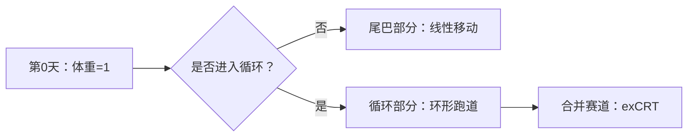

# 题目信息

# 【XR-1】快乐肥宅

## 题目背景

小粉兔的机房里面有 $n$ 个快乐肥宅，但小粉兔自己并不是，他看着这些快乐肥宅，非常羡慕，于是他想研究一下这些快乐肥宅的体重。

## 题目描述

每个快乐肥宅第 $0$ 天的体重都等于 $1$。第 $i$ 个快乐肥宅的体重记作 $w_i$，则一开始 $w_i = 1$。

第 $i$ 个快乐肥宅有一个专属的快乐指数 $k_i$，这表示他每天刚起床后，体重会是上一天的体重的 $k_i$ 倍。

肥宅们是有觉悟的，第 $i$ 个肥宅有一个专属的觉醒体重 $g_i$，这表示一旦他的体重**大于** $g_i$，他就会去健身房健身，每次减掉自己 $g_i$ 的体重，直到体重小于等于 $g_i$。

健身后，肥宅们会在机房见面，他们发现有时各自的体重会变得很有趣。

有一天，肥宅们发现各自的体重形成了等差数列！

另一天，肥宅们发现各自的体重形成了等比数列！

肥宅们心想，如果 $n$ 个快乐肥宅的体重 $\{w_1, w_2, \ldots, w_n\}$ 恰好形成序列 $\{r_1, r_2, \ldots, r_n\}$，至少需要经过多少天呢？

不过如果肥宅们等了很久都没有等到这一天，他们会认为这是不可能的。

## 说明/提示

【样例 $1$ 说明】

下表是两个肥宅在第 $0$ 天至第 $7$ 天时的体重变化表：

| 天数 | 肥宅 $1$ 的体重 | 肥宅 $2$ 的体重 | 解释 |
| :--: | :--: | :--: | :--: |
| $0$ | $1$ | $1$ | 第 $0$ 天每个肥宅的体重都是 $1$ |
| $1$ | $4$ | $2$ | 肥宅 $1$ 的体重是上一天的 $4$ 倍，肥宅 $2$ 的体重是上一天的 $2$ 倍 |
| $2$ | $2$ | $4$ | 肥宅 $1$ 的体重是上一天的 $4$ 倍，为 $16$，他发现自己的体重超过了 $7$，于是去了两次健身房，把体重减少了 $2\times 7=14$ |
| $3$ | $1$ | $3$ | 这一天肥宅 $1$ 和肥宅 $2$ 都去了一次健身房 |
| $4$ | $4$ | $1$ | 肥宅 $2$ 去了一次健身房 |
| $5$ | $2$ | $2$ | 肥宅 $1$ 去了两次健身房 |
| $6$ | $1$ | $4$ | 肥宅 $1$ 去了一次健身房 |
| $7$ | $4$ | $3$ | 肥宅 $2$ 去了一次健身房 |

可以看出在第 $7$ 天时肥宅的体重形成了序列 $\{4, 3\}$。

【数据规模与约定】

Subtask 1（20 points）：$n \le 50$，$g_i \le 50$。  
Subtask 2（20 points）：$g_i$ 为质数。  
Subtask 3（20 points）：$g_i \le 10^3$。  
Subtask 4（20 points）：$r_i \in \{1, g_i\}$。  
Subtask 5（20 points）：无特殊限制。

对于 $100\%$ 的数据，$1 \le n \le 10^3$，$1 \le k_i, r_i \le g_i \le 10^7$。

## 样例 #1

### 输入

```
2
4 7 4
2 5 3```

### 输出

```
7```

## 样例 #2

### 输入

```
2
4 7 3
2 5 3```

### 输出

```
Impossible```

## 样例 #3

### 输入

```
2
4 7 1
2 5 1```

### 输出

```
0```

## 样例 #4

### 输入

```
3
14 60 44
6 50 6
1029 91287 87318```

### 输出

```
101```

## 样例 #5

### 输入

```
1
6 65536 65536```

### 输出

```
16```

## 样例 #6

### 输入

```
2
2 2 2
2 3 1
```

### 输出

```
2
```

# AI分析结果


### Kay的C++算法解析：XR-1 快乐肥宅 深入学习指南

#### 1. 题目解读与核心算法识别
✨ **本题主要考察**：数论（离散对数、同余方程）  
🗣️ **初步分析**：  
> 本题本质是求解高次同余方程组 \( k_i^x \equiv r_i \pmod{g_i} \)。想象每个肥宅的体重变化是一个循环赛道：初始"尾巴"（非循环部分）进入"环形跑道"（循环节）。解题需两步走：  
> 1. **单个方程求解**：用扩展大步小步法（exBSGS）求出最小解（尾巴终点）和循环周期  
> 2. **合并方程**：用扩展中国剩余定理（exCRT）合并所有方程的通解 \( x \equiv a \pmod{m} \)  
> - **核心难点**：循环节计算需欧拉函数+BSGS；合并时模数过大（>1e9）需特殊处理  
> - **可视化设计**：用像素赛道展示尾巴（直道）+循环节（环形），高亮当前体重位置。复古风格：8-bit音效（入环"叮"，达成目标"胜利音效"），AI自动演示合并过程

---

#### 2. 精选优质题解参考
**题解一（小粉兔）**  
* **点评**：思路最完整清晰！详细解释exBSGS中ρ形结构的处理（分离尾巴+循环节），代码规范：  
  - 变量名明确（`f`尾巴长度, `o`循环起点）  
  - 算法优化：BSGS求阶（循环周期）  
  - 实践亮点：exCRT合并时处理模数爆炸（>1e9则直接验证不合并）  
  - 调试技巧：作者强调尾巴部分需检查gcd变化  

**题解二（lingfunny）**  
* **点评**：聚焦"阶"的计算提升理解，代码结构清晰但变量名可优化（如`legal`→`min_sol`）：  
  - 创新点：用阶 \( \delta_p(a) \) 显式表示循环周期  
  - 注意事项：同余方程需化为 \( a^d \equiv 1 \) 形式  
  - 实践价值：提供完整exBSGS改造方案，适合学习数论推导  

**题解三（zhylj）**  
* **点评**：另辟蹊径用整体BSGS（\( O(n\sqrt{M}) \)），避免exCRT合并：  
  - 思路创新：所有方程同步处理，哈希表存储状态  
  - 效率注意：\( n=10^3 \) 时计算量约3e7，需注意常数优化  
  - 代码亮点：简洁的哈希函数设计，适合小规模数据  

---

#### 3. 核心难点辨析与解题策略
1. **关键点1：exBSGS的尾巴与循环分离**  
   * **分析**：当 \( \gcd(k_i, g_i) \neq 1 \) 时，需不断约简直到互质，此时前若干步为尾巴（唯一解），后续进入循环。优质解法通过计算循环起点和阶（最小周期）明确解结构  
   * 💡 **学习笔记**：尾巴长度 ≤ \( \log_2 g_i \)，循环周期整除 \( \phi(g_i) \)  

2. **关键点2：大模数合并的剪枝策略**  
   * **分析**：exCRT合并时若当前模数 >1e9，则停止合并，直接验证现有解是否满足后续方程（否则解必 >1e9）  
   * 💡 **学习笔记**：利用题目约束（解 ≤1e9）避免无效计算  

3. **关键点3：解的下界处理**  
   * **分析**：最终解需 ≥ 所有方程的最小解（max尾巴长度），通过 \( x = \lceil \frac{\text{max\_min} - a}{m} \rceil m + a \) 调整  
   * 💡 **学习笔记**：CRT求得的解可能小于实际所需起点  

### ✨ 解题技巧总结
- **技巧A（问题分解）**：将复杂方程组拆解为独立exBSGS求解+exCRT合并  
- **技巧B（模数优化）**：当模数 >1e9 时停止合并，直接验证  
- **技巧C（边界处理）**：最终解需满足 \( x \geq \max(\text{各方程最小解}) \)  

---

#### 4. C++核心代码实现赏析
**通用核心实现参考**  
* **说明**：综合小粉兔与lingfunny思路，完整解决尾巴处理、循环节计算、exCRT合并  
* **完整核心代码**：
```cpp
#include <cmath>
#include <unordered_map>
using namespace std;
typedef long long LL;

int gcd(int a, int b) { return b ? gcd(b, a % b) : a; }
LL exgcd(LL a, LL b, LL &x, LL &y) {
    if (!b) { x = 1, y = 0; return a; }
    LL d = exgcd(b, a % b, y, x);
    return y -= a / b * x, d;
}

pair<int, int> exBSGS(int a, int b, int p) {
    if (p == 1) return {0, 1};
    a %= p, b %= p;
    int g = gcd(a, p), f = 1, k = 0;
    while (g > 1) {
        if (b % g) return {-1, -1}; // 无解
        k++;
        b /= g, p /= g;
        f = (LL)f * (a / g) % p;
        if (f == b) { // 进入循环点
            int ord = (gcd(a, p) > 1) ? -1 : BSGS(a, 1, p);
            return {k, ord};
        }
        g = gcd(a, p);
    }
    int inv_f = exgcd(f, p, x, y); // 求逆元
    b = (LL)b * inv_f % p;
    int x0 = BSGS(a, b, p), ord = BSGS(a, 1, p);
    return {x0 % ord + k, ord}; // 最小解+循环周期
}

bool combine(LL &a, LL &m, LL b, LL n) {
    LL x, y, g = exgcd(m, n, x, y);
    if ((b - a) % g) return false;
    a += (x * ((b - a) / g) % n + n) % n * m;
    m = m / g * n; // LCM(m, n)
    a %= m;
    return m <= 1e9; // 关键剪枝：模数>1e9停止合并
}
```
* **代码解读概要**：  
  1. `exBSGS` 返回 `(最小解, 循环周期)`（-1表无解）  
  2. `combine` 合并同余方程，模数>1e9时返回 `false`  
  3. 主函数先独立求解所有方程，再按模数大小合并  

---

### 5. 算法可视化：像素动画演示
**主题**：像素肥宅的循环赛道  
**核心演示**：  


1. **场景设计**：  
   - 8-bit像素风格，每个肥宅一条赛道（直道+环形）  
   - 控制面板：步进/暂停/调速滑块（0.5x~3x）  

2. **动画流程**：  
   - **初始化**：肥宅站在起点（体重=1），赛道标记 \( g_i \) 值  
   - **exBSGS阶段**：  
     * 尾巴移动：肥宅沿直道行走，体重显示 \( k_i^j \mod g_i \)  
     * 入环特效：到达循环起点时像素闪烁+“叮”音效  
     * 循环演示：在环形跑道循环移动，高亮当前周期  
   - **exCRT合并**：  
     * 选取两赛道合并：显示扩展欧几里得计算过程  
     * 模数过大：显示“爆炸”特效+失败音效  
   - **结果**：成功则肥宅汇聚终点放烟花；失败显示“Impossible”  

3. **游戏化元素**：  
   - 每完成一个方程求解得1星（最多3星）  
   - 背景音乐：8-bit循环旋律  

---

#### 6. 拓展练习与相似问题
1. **相似问题**：  
   - 离散对数问题：\( a^x \equiv b \pmod{p} \)（P3846 模板BSGS）  
   - 同余方程组合并（P4777 模板exCRT）  
   - 带约束的同余方程（P2485 计算器）  

2. **洛谷推荐**：  
   - **P3846**：巩固BSGS基础  
   - **P4777**：exCRT模板训练  
   - **P2485**：综合练习指数方程  

---

#### 7. 学习心得与经验分享
> **小粉兔的调试经验**：  
> “在exBSGS中处理尾巴时，我忽略了gcd变化导致错误——建议在循环内打印 \( f, g, b \) 的值验证”  
> **Kay总结**：多组数据时需重置初始化变量，边界如 \( g_i=1 \) 需特判。exCRT合并时注意模数爆炸的剪枝策略是竞赛常见技巧。  

---  
**结语**：掌握exBSGS和exCRT的协同使用是解决高次同余方程组的关键。通过像素动画理解循环结构，结合剪枝策略处理大数据，你也能成为数论高手！🚀

---
处理用时：197.67秒