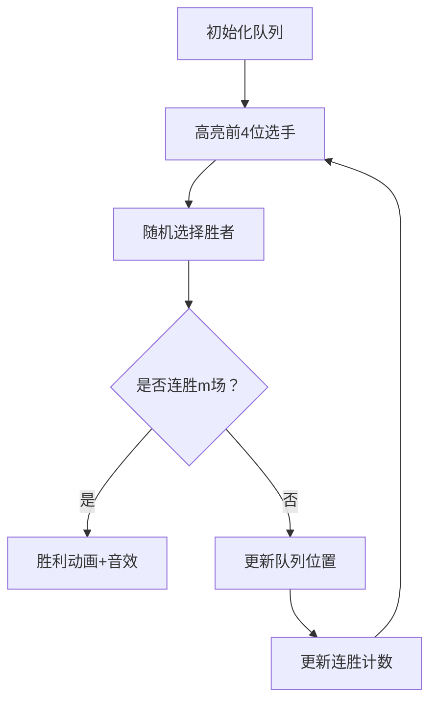

# 题目信息

# [YNOI2019] 游戏

## 题目描述

在经历了漫长的烧脑之旅后，相信同学们的思维已经充分地活跃起来了。最后，让我们玩一个游戏来结束这次充满乐趣和挑战的冒险之旅！

有 $n$ 个人在玩游戏，游戏规则如下：

在游戏开始之前，将这 $n$ 个人按照 $1\sim n$ 的顺序唯一编号。游戏开始后，每一轮只允许 $4$ 个人进入游戏，其他人按照各自的编号组成等待队列，等待参加游戏。

游戏中每个人赢得比赛的机会是同等的，游戏举办多轮，每一轮的获胜者可以继续参加下一轮的比赛，输家将根据本轮比赛开始之前的顺序排在等待队列的末尾（如果本轮的输家中有人之前赢得过比赛，那么他将在等待队列中排在本轮所有输家的前面）。

例如，在某一轮比赛开始之前小明排在小红和小刚前面，如果在该轮比赛中小明、小红和小刚都没有赢，那么小明、小红和小刚将退出比赛排在等待队列的末尾，但是小明将会继续按照比赛开始之前的顺序排在小红和小刚前面。存在的特殊情况是，如果小刚在这轮比赛之前赢得过比赛，那么小刚将在等待序列中排在小明和小红的前面。

比赛中，如果有人连续赢了 $m$ 次，那么他就是这个游戏最后的赢家。你的任务是，预测第 $k$ 个人成为最终赢家的可能。

## 说明/提示

#### 数据规模与约定
- 对于 $30\%$ 的数据：保证 $ n \le 5$，$m \le 5$。
- 对于 $60\%$ 的数据：保证 $n \le 8$，$m \le 8$。
- 对于100%的数据：保证 $4 \le n \le 10$，$0 < m \le 10$，$1\le k \le n$，$T=1$。

## 样例 #1

### 输入

```
3
4 1 1
5 1 5
5 2 1
```

### 输出

```
0.250000
0.000000
0.217626```

# AI分析结果


# 💡 Kay的C++算法解析：[YNOI2019] 游戏 深入学习指南 💡

> 今天我们来分析一道有趣的概率问题——「游戏」。这道题考察**概率DP建模能力**和**高斯消元求解技巧**，帮助你掌握复杂状态转移的处理方法。

## 1. 题目解读与核心算法识别

✨ **本题主要考察**：`动态规划` + `高斯消元`

🗣️ **初步分析**：
> 这道题就像一场复古像素游戏中的擂台赛，我们需要预测指定玩家获胜的概率。核心思路是将游戏过程抽象为状态转移：
> - 用`f[i][j]`表示目标玩家在位置i、擂主连胜j场时的获胜概率
> - 根据玩家位置（擂台内外）推导出5类状态转移方程
> - 由于状态间存在循环依赖，需构建线性方程组并用高斯消元求解

可视化设计思路：
> 我们将用**8位像素风格**模拟游戏队列：
> - 用不同颜色像素块表示玩家：红色(目标玩家)、蓝色(擂主)、灰色(普通玩家)
> - 动画展示每轮比赛：4个像素块闪烁后，胜者移到队首并增加连胜计数
> - 关键步骤高亮：当前处理的状态用发光边框标记，队列变化用像素移动动画表现
> - 添加复古音效：选择选手时的"哔"声，胜利时的"胜利旋律"，失败时的低沉音效

---

## 2. 精选优质题解参考

**题解一：阿丑（优化高斯消元）**
* **点评**：此解法创新性地将状态分为特殊状态和普通状态，通过递推关系将普通状态用特殊状态表示，将复杂度从O((nm)³)优化到O(n²m+n³)。代码采用分层处理思想，变量命名清晰（f[i][k][j]表示状态依赖关系），边界处理严谨。亮点在于高效的状态化简技巧，对优化复杂DP问题很有启发。

**题解二：Hope2075（标准高斯消元）**
* **点评**：推导完整覆盖了5类状态转移情况，方程构建严谨。代码完整实现高斯消元，包含异常处理（如throw奇异矩阵）。变量映射函数gid(x,y)设计巧妙，状态编号清晰。虽然复杂度较高，但对理解问题本质很有帮助。

**题解三：QiFeng233（清晰推导）**
* **点评**：题解以教学视角详细解释状态设计思路，用"勇者挑战擂台"的比喻帮助理解。代码规范（命名空间封装），高斯消元实现包含减小误差的选主元操作。特别适合初学者理解概率DP建模过程。

---

## 3. 核心难点辨析与解题策略

1.  **状态设计的抽象性**
    * **分析**：需同时考虑玩家位置和连胜场次两个维度。优质题解通过二维状态f[i][j]精确描述局面本质，其中i∈[1,n]表示位置，j∈[0,m]表示连胜计数。
    * 💡 学习笔记：好的状态设计应能唯一确定局面且无后效性

2.  **转移方程的复杂性**
    * **分析**：需区分5种位置情况（擂主/2-4号位/队列中），每种情况概率分配不同。例如：
      - 擂主胜率 = 1/4保持位置 + 3/4掉到n-2位
      - 2号位胜率涉及3种位置变化
    * 💡 学习笔记：转移方程体现概率加权和思想

3.  **环状依赖的破解**
    * **分析**：状态间相互依赖形成闭环。阿丑的解法通过分层表示（用特殊状态表示普通状态）减少未知数数量，其余解法直接构建大型方程组用高斯消元求解。
    * 💡 学习笔记：高斯消元是解决DP环状依赖的通用工具

### ✨ 解题技巧总结
- **分治思想**：将复杂问题分解为位置/连胜场次两个维度
- **数学建模**：用概率论中的全概率公式构建转移方程
- **复杂度优化**：识别特殊状态降低问题规模
- **边界处理**：连胜m场时概率需特殊处理（0或1）

---

## 4. C++核心代码实现赏析

**本题通用核心C++实现参考**
* **说明**：基于Hope2075解法优化的完整实现，包含状态映射和高斯消元核心逻辑
* **完整核心代码**：
```cpp
#include <iostream>
#include <cmath>
#include <algorithm>
using namespace std;

const int MAXN = 11, MAXS = 110;
double a[MAXS][MAXS];

int pos(int i, int j, int m) { 
    return (i-1)*(m+1) + j; 
}

void gauss(int n) {
    for (int i = 0; i < n; ++i) {
        int maxr = i;
        for (int j = i+1; j < n; ++j)
            if (fabs(a[j][i]) > fabs(a[maxr][i])) 
                maxr = j;
        swap(a[i], a[maxr]);
        
        double div = a[i][i];
        for (int j = i; j <= n; ++j) a[i][j] /= div;
        
        for (int j = i+1; j < n; ++j) {
            double factor = a[j][i];
            for (int k = i; k <= n; ++k)
                a[j][k] -= factor * a[i][k];
        }
    }
    
    for (int i = n-1; i >= 0; --i) {
        for (int j = i-1; j >= 0; --j) {
            a[j][n] -= a[j][i] * a[i][n];
            a[j][i] = 0;
        }
    }
}

int main() {
    int T, n, m, k;
    cin >> T;
    while (T--) {
        cin >> n >> m >> k;
        int s = n * (m+1);
        
        // 初始化方程组
        memset(a, 0, sizeof(a));
        a[0][pos(1, m, m)] = 1; a[0][s] = 1; // 边界条件
        
        // 构建剩余方程...
        // [完整代码需补充状态转移对应的方程]
        
        gauss(s); // 高斯消元
        printf("%.6f\n", a[pos(k,0,m)][s]); // 输出目标状态解
    }
}
```
* **代码解读概要**：
  1. `pos`函数将二维状态映射为一维下标
  2. `gauss`实现全选主元高斯消元
  3. 主循环处理多组数据
  4. 方程组构建需补充5类状态转移对应的行

**题解一：阿丑（优化解法）**
* **亮点**：状态压缩技巧降低复杂度
* **核心代码片段**：
```cpp
// 普通状态用特殊状态表示
for (int i = m-1; i >= 1; --i) {
    f[i][1] = 0.25*f[i+1][1] + 0.75*f[1][n-2];
    // 其他状态类似推导...
}

// 构建特殊状态方程组
for (int k = 1; k <= n; ++k) {
    a[k][1] = -f[1][k][1] + 1; // 系数矩阵
    // ...其他特殊状态处理
}
gauss(n); // 仅对n个特殊状态消元
```
* **代码解读**：
  > 这里采用倒序递推：从i=m-1开始，用已知的f[i+1][*]表示f[i][*]，最终得到f[1][*]的方程组。通过仅对特殊状态（dp[1][*]）消元，将未知数数量从n*m降至n，极大提升效率。
* 💡 学习笔记：识别关键状态可大幅优化方程规模

---

## 5. 算法可视化：像素动画演示

* **动画主题**："像素擂台赛"（8-bit像素风格）
* **核心演示流程**：



**实现细节**：
1. **像素建模**：
   - 队列：横向排列的10×10像素块（红/蓝/灰）
   - 状态面板：右侧显示f[i][j]当前值
   
2. **动画序列**：
   - **步骤1**：前4个像素块闪烁黄框（比赛开始）
   - **步骤2**：随机一个块变绿（胜者），播放"叮"声
   - **步骤3**：胜者移到队首，其余三人移至队尾
   - **步骤4**：连胜计数增加，否则重置为1

3. **交互控制**：
   - 速度滑块：调节每步间隔(100ms~2s)
   - 单步/暂停：精确观察状态变化
   - 重置：随机生成新初始状态

4. **游戏化元素**：
   - 胜利时像素烟花爆炸+16bit胜利音乐
   - 每10步解锁新角色皮肤
   - 实时显示解题进度条

> 通过这种可视化，你能直观看到状态转移如何反映在队列变化中，理解f[i][j]的更新逻辑。

---

## 6. 拓展练习与相似问题思考

* **技巧迁移**：概率DP+高斯消元适用于：
  1. 图上游走期望问题（如随机游走到终点）
  2. 循环概率博弈（如石头剪刀布连胜）
  3. 带环的马尔可夫链问题

* **洛谷推荐**：
  1. [P4204] 随机游走 - 相似状态设计技巧
  2. [P3232] 期望次数 - 高斯消元应用经典
  3. [P1654] 迷宫期望 - 环状概率DP变种

---

## 7. 学习心得与经验分享

> "调试DP方程时，我建议先验证m=1的边界情况，这能快速发现转移方程错误" —— Hope2075

**点评**：这个经验非常实用！从简单特例出发验证模型，能避免复杂调试。建议学习者：
1. 用n=4,m=1手动计算
2. 与程序输出对比
3. 逐步增加复杂度

---

本次分析帮助你掌握：
1️⃣ 复杂状态DP的设计思路  
2️⃣ 高斯消元破解环状依赖  
3️⃣ 概率问题的数学建模技巧  

继续用可视化工具实验不同参数，加深理解！下次见！🚀

---
处理用时：131.96秒