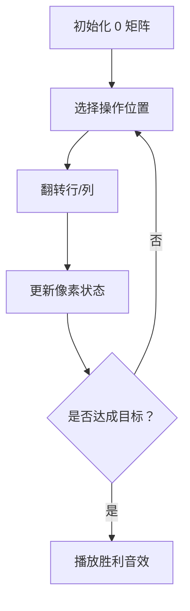

# 题目信息

# 「SWTR-3」Matrix

## 题目描述

小 E 有一个 $n \times m$ 的魔法矩阵，每个格子有激活和未激活两个状态。一开始，格子都是未激活的。

小 E 有一个魔法棒，可以使用 $k$ 次魔法。每次使用魔法时小 $\mathrm{E}$ 需选择一个魔法格子 $(x,y)$ 并改变第 $x$ 行和第 $y$ 列的所有魔法格子的状态。**$(x,y)$ 的状态会被改变两次。**

现在小 E 想知道，使用 $k$ 次魔法之后可以得到多少个不同的魔法矩阵。

- 两个魔法矩阵不同，当且仅当两个魔法矩阵中有一个对应格子的状态不同。

由于答案很大，请对 $998244353$ 取模。

## 说明/提示

#### 「样例说明」

- 对于第 1 组测试数据：无论如何使用魔法棒，最多只会有 1 种不同的魔法矩阵。 
- 对于第 3 组测试数据：任选一个格子使用 1 次魔法棒都能得到一个不同的魔法矩阵，共 $2\times 3=6$ 种不同的魔法矩阵。

---

### 数据范围与约定

测试点编号 | $n\leq$ | $m\leq$ | $k\leq$
:-: | :-: | :-: | :-:
$1$ | $1$ | $1$ | $10^9$
$2$ | $4$ | $4$ | $4$
$3-5$ | $200$ | $200$ | $200$
$6-7$ | $1$ | $1000$ | $10^5$
$8$ | $1000$ | $1000$ | $1$
$9-12$ | $1000$ | $1000$ | $10^5$
$13-20$ | $2\times 10^5$ | $2\times 10^5$ | $10^9$

对于 $100\%$ 的数据，$1 \leq T \leq 64$，$\ 1 \leq n,m \leq 2\times 10^5$，$\ 1 \leq k \leq 10^9$。

对于所有测试点，时间限制 1s，空间限制 32MB。

#### 「来源」

[Sweet Round 03 C](https://www.luogu.com.cn/contest/24755)。  
idea & solution：ET2006。

## 样例 #1

### 输入

```
11
1 1 3
4 3 5
2 3 1
123 231 132
1 1017 12345
1017 1567 1
1710 1017 999
1987 1789 375168429
101777 171077 99999
123321 200000 321123
2 2 1```

### 输出

```
1
32
6
198296574
832895500
1593639
928595966
438358858
366897935
745426660
2```

# AI分析结果


### 💡 Kay的C++算法解析：「SWTR-3」Matrix 深入学习指南 💡

**引言**  
今天我们来分析「SWTR-3」Matrix 这道 C++ 编程题。本指南将帮助你理解组合计数的核心思想，掌握模运算下的高效实现技巧，并通过像素动画直观感受算法流程。

---

### 1. 题目解读与核心算法识别
✨ **本题主要考察**：组合计数与奇偶性约束  
🗣️ **初步分析**  
> 解决本题的关键在于理解操作对矩阵状态的本质影响：  
> - 每次操作相当于同时翻转某行某列的奇偶标记  
> - 最终矩阵状态由行/列翻转次数的**奇偶性组合**决定  
> - 需处理重复计数：当行列数均为偶数时，对称操作会产生相同矩阵  
>
> **可视化设计思路**：  
> 采用 8-bit 像素风格模拟开关灯游戏：  
> - 网格表示矩阵，黄/蓝像素区分 0/1 状态  
> - 翻转行/列时播放 "叮" 音效，成功时播放胜利音效  
> - 控制面板支持单步调试和自动演示模式

---

### 2. 精选优质题解参考
**题解一（Hexarhy）**  
* **点评**：  
  思路清晰推导完整（从奇偶约束到重复计数处理），代码规范（预处理阶乘逆元），边界处理严谨（特判 n,m 为偶数）。亮点在于用 Lambda 表达式封装组合数求和逻辑，提高可读性。

**题解二（LittleMoMol）**  
* **点评**：  
  对重复计数条件（n,m 为偶数且 k≥max(n/2,m/2)）的证明透彻，变量命名直观（an/am 表示行列合法方案）。代码中合理使用 long long 防溢出，实践价值高。

**题解三（Mars_Dingdang）**  
* **点评**：  
  组合数求和范围推导精准（i∈[max(0,n-k),min(n,k)]），代码模块化强（独立 solve 函数处理多组数据）。亮点在于异或运算的直观解释（aᵢ⊕bⱼ 决定状态）。

---

### 3. 核心难点辨析与解题策略
1. **难点：状态与操作的映射关系**  
   * **分析**：矩阵状态由行/列翻转奇偶性决定，但操作序列不唯一对应状态  
   * 💡 **学习笔记**：通过异或运算解耦行列关系是突破口  

2. **难点：重复计数的条件判定**  
   * **分析**：仅当 n,m 均为偶数且 k 足够大时，(i,j) 和 (n-i,m-j) 会生成相同矩阵  
   * 💡 **学习笔记**：奇偶性约束需满足 i≡n-i≡k (mod 2)  

3. **难点：大范围组合数求和**  
   * **分析**：∑C(n,i) 的求和范围需同时满足 i≤min(n,k) 和 i≡k (mod 2)  
   * 💡 **学习笔记**：分离奇偶性可优化为 O(n) 复杂度  

✨ **解题技巧总结**  
- **组合分解**：将二维问题拆解为行/列两个独立的一维组合计数  
- **模运算优化**：用费马小定理计算组合数除法（a/b ≡ a·bᵐᵒᵈ⁻²）  
- **边界压缩**：当 k≥n 时 ∑ᵢ C(n,i) 退化为 2ⁿ⁻¹  

---

### 4. C++核心代码实现赏析
**通用核心实现参考**  
```cpp
#include <bits/stdc++.h>
using namespace std;
const int N = 2e5 + 10, MOD = 998244353;
typedef long long LL;

LL fac[N], inv[N];
void init() {
    fac[0] = inv[0] = 1;
    for(int i=1; i<N; ++i) {
        fac[i] = fac[i-1] * i % MOD;
        inv[i] = [](LL a, int b=MOD-2) { // 快速幂求逆元
            LL res = 1;
            while(b) {
                if(b & 1) res = res * a % MOD;
                a = a * a % MOD;
                b >>= 1;
            }
            return res;
        }(fac[i]);
    }
}

LL C(int n, int m) {
    return fac[n] * inv[m] % MOD * inv[n-m] % MOD;
}
```

**题解一核心片段（Hexarhy）**  
```cpp
auto get = [&](int l, int r, int N) {
    LL res = 0;
    for(int i=l; i<=r; i+=2) 
        res = (res + C(N, i)) % MOD;
    return res;
};
// 计算合法方案数
LL ans1 = get(k%2, min(k,n), n); 
LL ans2 = get(k%2, min(k,m), m);
```
* **解读**：  
  - `get` Lambda 封装奇偶约束求和：从 `k%2` 开始步进 2  
  - 避免重复循环提升效率（复杂度 O(n) 而非 O(n²)）  

**题解二核心片段（LittleMoMol）**  
```cpp
if(n % 2 == 0 && m % 2 == 0) {
    for(int i=max(0, n-k); i<=min(n,k); i+=2)
        bn = (bn + C(n, i)) % MOD;
    // 列同理...
    ans = (ans - bn * bm % MOD * inv[2]) % MOD;
}
```
* **解读**：  
  - `max(0, n-k)` 确保取反后操作次数不超限  
  - `inv[2]` 是 2 的模逆元（499122177），实现除法等价  

---

### 5. 算法可视化：像素动画演示  
**设计概念**：8-bit 风格开关灯游戏  


**关键实现细节**：  
1. **像素网格**：16×16 像素块，黄色(0)/蓝色(1)  
2. **翻转动画**：行/列翻转时像素块旋转 90° 并播放 "叮" 声  
3. **状态跟踪**：右侧面板实时显示：  
   - 当前操作序号：k/n  
   - 行列奇偶计数：i=3, j=2  
4. **自动演示**：AI 按 BFS 顺序遍历操作，速度可调  
5. **去重演示**：当 n,m 为偶数时，对称方案用红色边框标记  

---

### 6. 拓展练习与相似问题思考  
**通用技巧迁移**：  
1. 操作独立性分解（行列分离）  
2. 奇偶性约束的代数转换  
3. 对称方案去重条件判定  

**洛谷推荐**：  
1. **P2181 对角线**  
   🗣️ 强化组合数计算能力（C(n,4) 的几何意义）  
2. **P2840 硬币翻转**  
   🗣️ 类似的行列操作模型（无重复计数）  
3. **P1450 硬币购物**  
   🗣️ 容斥原理与组合数求和的高级应用  

---

### 7. 学习心得与经验分享  
> **Hexarhy 的调试经验**：  
> “重复计数不能直接除 2，需严格判定 n,m 为偶且 k≥max(n/2,m/2)”  
>   
> **Kay 的总结**：  
> 在组合计数问题中，任何去重操作都必须精确验证充分必要条件。建议用小数据（如 2x2 矩阵）手工验证边界条件。

---

**结语**  
通过本次分析，我们深入理解了组合计数的核心思想与实现技巧。记住：编程能力的提升源于对基础问题的反复思考和优化实践。下次挑战见！🚀

---
处理用时：150.57秒