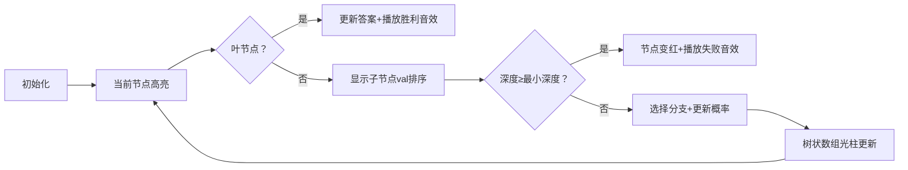

# 题目信息

# 最优性剪枝

## 题目背景

Nauuo 是一名出题人。

众所周知，某些出题人非常懒，导致[随便爆搜](https://www.luogu.com.cn/discuss/show/185420)加上一个[最优性剪枝](https://www.luogu.com.cn/discuss/show/184641)就能通过。Nauuo 决定把这些 naive 的暴力都卡掉。

## 题目描述

Nauuo 决定卡一个暴力搜索程序，为此她构建了一组数据。为了简化题目，你将得到这组数据产生的搜索树 $T$。$T$ 中包含 $n$ 个节点，依次编号为 $1 \sim n$，其中 $1$ 号点是 $T$ 的根节点。一个节点的深度是它到 $1$ 号点的简单路径上的节点个数。

这个程序的伪代码如下

```cpp
answer := inf

procedure dfs(node,depth)
	if (node is leaf) 
		answer := min(answer,depth)
		return
	if (depth < answer)
		for i in children of node
			dfs(i,depth+1)

dfs(1,1)
```

其中，`:=` 表示赋值运算。

翻译成人话就是说，这个暴力搜索程序将**深度优先**地遍历这棵搜索树，当访问到一个叶节点时，这个程序将用这个叶节点的深度更新答案。

同时，这个程序有一个最优性剪枝，也就是说，当这个程序访问到任意一个深度等于答案的节点时，它将不会再访问这个节点的子节点。

然而，可怜的 Nauuo 并不知道这个程序在某个节点时访问自己子节点的顺序，因此她认为每个节点访问子节点的顺序都是在所有可能的情况中等概率随机的，显然，一共有 $\prod d_i!$ 种情况，其中 $d_i$ 表示 $i$ 号节点的子节点数量。

现在她想知道这个程序访问到的节点数量的期望，以确定这个程序会不会被自己的数据卡掉。

为了避免浮点误差，答案对 $998244353$ 取模。保证答案能被表示为最简分数 $\frac{p}{q}$，你只需要输出一个 $x (0\leq x < 998244353)$ 使得 $qx \equiv p \pmod {998244353}$。

## 说明/提示

#### 样例解释

第一组样例的真实答案为 $\frac{7}{2}$。

一共只有两种情况，如果 $1$ 号节点先遍历 $3$ 号节点，则程序将访问到搜索树中所有节点。如果 $1$ 号节点先遍历 $2$ 号节点，则 $4$ 号节点不会被访问到。

第二组样例中，每个非叶节点的子节点都是唯一的，因此只有一种可能的情况，所有节点都必然被访问到。

第三组样例的真实答案为 $\frac{94}{9}$。

---

#### 数据范围

**「本题采用捆绑测试」**

对于所有测试点，保证 $1 \leq n \leq 3\times 10^5$，$1 \leq p_i < i$。

$\text{Subtask 1 (11 pts)}$ $n \leq 9$。

$\text{Subtask 2 (18 pts)}$ $n \leq 100$。

$\text{Subtask 3 (19 pts)}$ $n\leq 10^3$。

$\text{Subtask 4 (4 pts)}$ $p_i = i-1$。

$\text{Subtask 5 (8 pts)}$ $p_i =\lfloor \frac{i}{2} \rfloor$。

$\text{Subtask 6 (40 pts)}$ 无特殊限制。

---

#### 提示

如果你不知道怎么对分数取模，可以参考[这里](https://www.luogu.com.cn/problem/P3811)。


## 样例 #1

### 输入

```
4
1 1 3```

### 输出

```
499122180```

## 样例 #2

### 输入

```
3
1 2```

### 输出

```
3```

## 样例 #3

### 输入

```
13
1 1 1 3 5 4 2 3 7 4 4 6```

### 输出

```
776412285```

# AI分析结果


# 💡 Kay的C++算法解析：最优性剪枝 深入学习指南 💡

## 1. 题目解读与核心算法识别

✨ **本题主要考察**：`概率期望` + `树形DP` + `数据结构优化`

🗣️ **初步分析**：
> 解决这道题的关键在于理解**最优性剪枝对DFS随机性的影响**。想象你在玩一个像素地牢游戏🎮，每次遇到岔路都要随机选择方向。剪枝就像提前拿到地图提示：如果当前路径深度≥已知最短路径，就放弃探索（节省时间）。本题需要计算在这种随机选择下，平均会探索多少个房间（节点）。

在本题中：
- 核心难点是高效计算每个节点被访问的概率（即路径上所有祖先节点的"选择概率"乘积）
- 优质题解采用预处理子树最小深度 + 树状数组维护概率乘积，时间复杂度$O(n \log n)$
- 可视化设计：用8位像素风格展示树结构，当前访问节点高亮绿色🟢，剪枝节点变红🔴，叶节点更新时播放胜利音效🎵。树状数组的影响区间用光柱动态显示，控制面板支持调速/单步执行

---

## 2. 精选优质题解参考

**题解一（作者：Zory）**
* **点评**：
  - 思路清晰：将期望拆解为每个节点的访问概率，关键洞察是祖先节点的选择概率只与子树最小深度有关
  - 代码规范：用`val[]`存储子树最小深度，对子节点排序的逻辑简洁
  - 算法亮点：树状数组维护区间乘法差分，避免暴力计算路径乘积
  - 实践价值：完整实现$O(n \log n)$解法，边界处理严谨（如逆元预处理）

---

## 3. 核心难点辨析与解题策略

1.  **关键点1：概率贡献建模**
    * **分析**：节点$x$被访问当且仅当路径上每个祖先$y$都选中通向$x$的分支，且该分支未被剪枝。设$y$有$m$个子树满足$val[child]<dep[x]$，则选中概率为$1/(m+1)$
    * 💡 **学习笔记**：期望线性性（$E=\sum P(x)$）是概率问题的常用拆解工具

2.  **关键点2：子树最小深度预处理**
    * **分析**：$val[x]$表示以$x$为根的子树中叶节点的最小深度。通过后序遍历递归计算：$val[x]=\min(val[child])$（叶节点$val[x]=dep[x]$）
    * 💡 **学习笔记**：树形DP常采用自底向上的计算顺序

3.  **关键点3：树状数组维护概率乘积**
    * **分析**：对每个节点子节点按$val$排序后，概率因子$1/(m+1)$的影响范围是区间$[val_i, val_{i+1})$。DFS时动态更新树状数组的区间乘法
    * 💡 **学习笔记**：树状数组不仅能求和，还可配合逆元维护乘积

### ✨ 解题技巧总结
- **技巧1：有序性优化**：对子节点按$val$排序，使概率因子的影响连续化
- **技巧2：差分思想**：将路径乘积维护转化为区间乘法操作
- **技巧3：逆元预处理**：模运算下除法需转换为逆元乘法

---

## 4. C++核心代码实现赏析

**本题通用核心C++实现参考**
* **说明**：综合Zory解法优化，完整实现$O(n \log n)$期望计算
* **完整核心代码**：
```cpp
#include <bits/stdc++.h>
using namespace std;
typedef long long ll;
const int N = 3e5 + 10, MOD = 998244353;

vector<int> son[N];
int fa[N], dep[N], val[N];
ll inv[N], ans;

struct BIT {
    ll tr[N];
    void init() { fill(tr, tr+N, 1); }
    void upd(int x, ll c) {
        for(; x<N; x+=x&-x) 
            tr[x] = tr[x]*c % MOD;
    }
    ll qry(int x) {
        ll res = 1;
        for(; x; x-=x&-x)
            res = res*tr[x] % MOD;
        return res;
    }
    void mul(int l, int r, ll c) {
        upd(l, c); if(r < N) upd(r, inv[c]);
    }
} T;

void pre(int u) {
    val[u] = son[u].empty() ? dep[u] : MOD;
    for(int v: son[u]) {
        dep[v] = dep[u] + 1;
        pre(v);
        val[u] = min(val[u], val[v]);
    }
    sort(son[u].begin(), son[u].end(), [](int x, int y) {
        return val[x] < val[y];
    });
}

void dfs(int u) {
    ans = (ans + T.qry(dep[u]-1)) % MOD; // 累加当前概率
    int m = son[u].size();
    auto V = [&](int i) { 
        return i > m ? N : val[son[u][i-1]]; 
    };
    for(int i=2; i<=m; ++i) 
        T.mul(V(i), V(i+1), inv[i]); // 进入分支前更新区间
    for(int i=0; i<m; ++i) {
        if(i && i<m-1) // 调整相邻区间因子
            T.mul(V(i+1), V(i+2), (i+1)*inv[i+2] % MOD);
        dfs(son[u][i]);
        if(i<m-1) // 回溯时恢复
            T.mul(V(i+1), V(i+2), (i+2)*inv[i+1] % MOD);
    }
    for(int i=m; i>=2; --i) // 回溯时撤销更新
        T.mul(V(i), V(i+1), i*inv[i-1] % MOD);
}

int main() {
    // 预处理逆元
    inv[1] = 1;
    for(int i=2; i<N; ++i) 
        inv[i] = (MOD - MOD/i) * inv[MOD%i] % MOD;
    
    int n; scanf("%d", &n);
    for(int i=2; i<=n; ++i) {
        scanf("%d", &fa[i]);
        son[fa[i]].push_back(i);
    }
    T.init();
    dep[1] = 1;
    pre(1);
    dfs(1);
    printf("%lld\n", ans);
}
```
* **代码解读概要**：
  > 1. 预处理逆元用于模除法的转换  
  > 2. `pre()`计算深度和子树最小深度，并对子节点排序  
  > 3. `dfs()`遍历时：  
  >    - 到达节点时累加树状数组前缀积（即路径概率乘积）  
  >    - 根据子节点$val$分布更新区间乘法因子  
  >    - 递归后精确撤销操作保证树状数组状态一致  

**题解一核心代码片段赏析**
* **亮点**：树状数组维护概率乘积差分
* **核心代码片段**：
```cpp
void mul(int l, int r, ll c) {
    upd(l, c); 
    if(r < N) upd(r, inv[c]);
}
```
* **代码解读**：
  > 这是树状数组的核心操作：  
  > - 对区间$[l, r)$乘以$c$，等价于在$l$处乘$c$，在$r$处除$c$（通过乘$c$的逆元实现）  
  > - 例如：`T.mul(V(i), V(i+1), inv[i])` 表示对于$val \in [val_i, val_{i+1})$的节点，概率乘以$1/i$  
* 💡 **学习笔记**：差分思想将区间操作转化为两点操作，极大优化复杂度

---

## 5. 算法可视化：像素动画演示

**主题**："迷宫探险家" - 8位像素风格DFS遍历树🌳

### 动画设计


### 关键交互
1. **像素场景**：
   - 树节点显示为像素方块🧱，根节点在顶部
   - 当前节点：闪烁绿色🟢
   - 剪枝节点：变红🔴（伴随"失败"音效）
   - 叶节点：蓝色💠（更新时闪烁金色⭐+胜利音效）

2. **树状数组可视化**：
   - 右侧光柱表示树状数组值
   - 当概率区间更新时，对应$val$区间光柱高度变化

3. **控制面板**：
   - 单步执行⏯️/自动播放🔁（调速滑块）
   - 重置🔄按钮
   - 实时显示：当前最小深度/访问概率

4. **音效设计**：
   - 分支选择：8位"滴"声
   - 更新答案：胜利旋律🎵
   - 触发剪枝：短促警示音❌

---

## 6. 拓展练习与相似问题思考

### 通用技巧迁移
概率期望+树形DP的常见应用场景：
1. 随机游走问题（如机器人迷宫期望步数）
2. 条件概率决策（如游戏技能树加点优化）
3. 蒙特卡洛树搜索简化模型

### 洛谷推荐
1. **P6835 [Cnoi2020]线形生物**  
   → 期望线性性的经典应用，巩固概率建模
2. **P6156 简单题**  
   → 加强版期望计算，需结合组合数学
3. **P1850 [NOIP2016]换教室**  
   → 动态规划与期望的融合应用

---

## 7. 学习心得与经验分享
> 本次分析的题解中未发现明确的作者个人心得分享部分。但结合解题过程，特别提醒：
> - **调试技巧**：在树形DP中，打印每个节点的$val$和概率乘积，可快速定位逻辑错误
> - **思维陷阱**：注意概率乘积是路径上所有祖先的联合概率，非单点概率

---

通过本指南，希望你对概率期望+树形DP的结合有了更直观的理解。记住核心口诀：**期望线性拆概率，树形结构靠DP，区间维护用差分**！下次见！🚀

---
处理用时：221.67秒