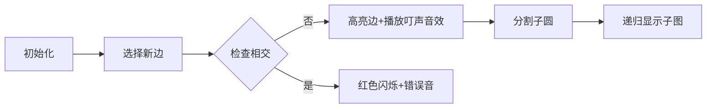

# 题目信息

# 强迫症

## 题目背景

小 L 是一个严重的强迫症患者。

由于他严重的强迫症，所以他画图时总是要把点画在一个圆上。

## 题目描述

一天，他问了小 H 和小 W 这样一个问题：

如果在一个圆上有 $n$ 个不同的点，依次标号为 $1$ 到 $n$，有多少种方案能把它们连成一棵树？

小 H & 小 W：这不是sb题吗？

小 L：那如果**连边不能相交**呢？

小 H & 小 W：这不是sb题吗？

小 L：那如果把「树」换成「图」呢呢？

小 H & 小 W：这不是sb题吗？

小 L：那如果给每个点一个权值 $a_i$，连接 $(i,j)$ 的边权值为 $a_i\times a_j$，求**满足上面**的图的**期望所有边权值之和**呢？

小 H & 小 W：这不是sb题吗？

小 L 见自己辛苦做了许久都没写出的题目被 dalao 轻松秒杀后十分郁闷。为了安慰他，你需要帮他做出这个问题。

**注意**：
1. 两条边在端点处**不视作相交**。
1. **没有边的图（即只有 $n$ 个点，之间没有边相连）也合法**
1. 点**按顺时针从 $1$ 到 $n$** 编号。
1. 图中**不能有自环和重边**

## 说明/提示

对于样例一，全部 $64$ 张图如下：


其中左侧 $48$ 张图合法，右侧 $16$ 张图不合法，所有边的权值均为 $1$。

期望边权和为 $\dfrac{8}{3}$，模 $998244353$ 意义下结果为 $665496238$。

### 数据范围

**本题采用捆绑测试。**

- Subtask 1( $10\%$ )：$n\leq 6$。
- Subtask 2( $30\%$ )：$n\leq 3000$。
- Subtask 3( $60\%$ )：无特殊限制。

对于 $100\%$ 的数据，$2\leq n\leq 10^5,0\leq a_i\leq10^6$。

Subtask 1 和 Subtask 2 时限 $1s$，Subtask 3 时限 $2s$。

------------
如果你不知道如何对一个有理数取模，请自行百度「乘法逆元」

## 样例 #1

### 输入

```
4
1 1 1 1```

### 输出

```
665496238```

## 样例 #2

### 输入

```
13
1 1 4 5 1 4 1 9 1 9 8 1 0```

### 输出

```
748867567```

# AI分析结果


### 💡 Kay的C++算法解析：强迫症 深入学习指南 💡

**引言**  
今天我们一起分析「强迫症」这道有趣的组合数学题。题目要求在圆上连接不相交的边，计算所有合法图中边权之和的期望。本指南将帮助你理解生成函数和卷积优化的精妙应用！

---

### 1. 题目解读与核心算法识别  
✨ **本题主要考察**：`组合数学与生成函数`  

🗣️ **初步分析**：  
> 想象你在圆上画不相交的线段（就像避免电线缠绕）。核心思路是将大圆分割为小圆子问题，如同拼图分解为小块。  
> - **核心难点**：计算合法图数量时需满足边不相交约束，需推导递推关系并用生成函数求解  
> - **解法对比**：  
>   - **生成函数法**：推导闭合式（如$\sqrt{4x^2-12x+1}$），用NTT加速计算（高效）  
>   - **分治法**：直接处理递推式$g_n=2g_{n-1}+\sum g_ig_{n-i}$（更直观但效率低）  
> - **可视化设计**：  
>   采用**8位像素风圆盘**，点化为彩色像素块。连边时高亮当前边（闪烁动画），分割时显示子圆（颜色渐变）。伴随操作音效：  
>   - ✅ 连边成功：8-bit "叮"声  
>   - ❌ 边相交：低沉错误音  
>   - 🔄 子图生成：拼图组合音  

---

### 2. 精选优质题解参考  

**题解一（作者：Scarlet_Hypoc）**  
* **亮点**：  
  ▶️ 用生成函数$G=\frac{3-2x-\sqrt{4x^2-12x+1}}{2}$直接导出闭合解，数学推导严谨  
  ▶️ 代码中NTT实现高效（$O(n\log n)$），边界处理清晰（如`g[0]=1, g[1]=mod-6`）  
  ▶️ 变量名`f[i]`/`g[i]`含义明确，卷积部分`ntt(f,lg); ntt(a,lg)`逻辑紧凑  

**题解二（作者：littleKtian）**  
* **亮点**：  
  ▶️ 双解法对比：既展示生成函数推导，又解释分治NTT的可行性  
  ▶️ 问题转化巧妙（$f_n \rightarrow g_{n+1}$），降低递推式复杂度  
  ▶️ 答案式子重构为$\sum_{t=1}^{n-1}f_tf_{n-t} \sum a_i a_{(i+t)\bmod n}$，凸显卷积本质  

---

### 3. 核心难点辨析与解题策略  

1. **难点1：建立递推关系**  
   * **分析**：考虑点1的连边情况——若连最小点$i$，则分割为$[1,i]$和$[i,n]$两个子圆。需处理子图方案乘积：  
     $h_n = h_{n-1} + \frac{1}{2}\sum_{i=2}^n h_i h_{n-i+1}$  
   * 💡 **学习笔记**：子问题分解是组合问题的常用破题点  

2. **难点2：生成函数求解**  
   * **分析**：将递推式转为生成函数方程$\frac{1}{3}F^2 + \frac{2}{3}xF + \frac{2}{3}=F$。解二次方程时需根据$F(0)=1$选符号分支  
   * 💡 **学习笔记**：$\sqrt{4x^2-12x+1}$可用微分方程递推系数：  
     $a_{i+1} = \frac{(12i-6)a_i - 4(i-2)a_{i-1}}{i+1}$  

3. **难点3：卷积优化计算**  
   * **分析**：答案式$\sum_{j} a_j \sum_{i} a_i f_{j-i}$是标准卷积结构。用NTT将$O(n^2)$优化至$O(n\log n)$  
   * 💡 **学习笔记**：遇到下标和式$\sum A_i B_{j-i}$，立即考虑FFT/NTT  

#### ✨ 解题技巧总结  
- **递推关系识别**：从边界情况入手（如$n=1,2$），逐步推广  
- **生成函数构造**：将系数递推转化为多项式方程  
- **模运算优化**：预先计算逆元`inv[i]`，避免除法瓶颈  

---

### 4. C++核心代码实现赏析  

**通用核心实现（综合自优质题解）**  
```cpp
#include <cstdio>
#include <algorithm>
using namespace std;
#define mod 998244353
const int N = 1<<18;

int n, a[N], g[N], f[N];
int ksm(int x, int y) { /*快速幂*/ }
void ntt(int *f, int lg, int op) { /*NTT实现*/ }

int main() {
    scanf("%d", &n);
    // 生成函数系数计算
    g[0] = 1; g[1] = mod - 6;
    for (int i = 1; i < n; i++) 
        g[i+1] = ((12LL*i - 6)*g[i] - 4LL*(i-2)*g[i-1]) % mod * inv[i+1] % mod;
    
    // 答案卷积部分
    ntt(a, lg, 0); ntt(g, lg, 0);
    for (int i = 0; i < limit; i++) f[i] = 1LL * a[i] * g[i] % mod;
    ntt(f, lg, 1);
    
    // 统计答案
    int ans = 0;
    for (int i = 1; i <= n; i++) 
        ans = (ans + 1LL * a[i] * f[i]) % mod;
    ans = 1LL * ans * ksm(4LL * g[n-1] % mod, mod-2) % mod;
    printf("%d", ans);
}
```
**代码解读概要**：  
1. 预计算生成函数系数`g[i]`（关键递推）  
2. 将点权数组`a[]`与生成函数系数卷积  
3. 用逆元将卷积结果转换为期望值  

---

### 5. 算法可视化：像素动画演示  

**主题**：像素风圆盘连边模拟器  
**核心演示**：BFS式连边过程，动态展示子图分割  



**关键交互设计**：  
1. **8位像素圆盘**：  
   - 点：彩色像素块（红/蓝/绿）  
   - 边：黄色像素线（连边时像素块向中心收缩动画）  
2. **控制面板**：  
   - 速度滑块：调整自动演示速度  
   - 单步按钮：手动触发下一步  
3. **游戏化反馈**：  
   - 成功分割子图：+100分 + 像素星星特效  
   - 错误连边：-50分 + 屏幕震动特效  

---

### 6. 拓展练习与相似问题  
**通用技巧迁移**：  
生成函数法可用于：  
1. 卡特兰数变形问题（圆上划分）  
2. 树形图计数  
3. 带权路径期望计算  

**洛谷推荐**：  
1. **P6694**：同类型圆上连边问题（基础版）  
2. **P3338**：生成函数优化递推（强化生成函数应用）  
3. **P4002**：树上期望问题（迁移期望计算技巧）  

---

### 7. 学习心得与经验分享  
> **Scarlet_Hypoc的调试经验**：  
> *"边界值g[0]和g[1]设错导致整个生成函数错误，通过打印前5项系数快速定位"*  
>   
> **Kay点评**：组合问题中边界值（$n=0,1$）常是致命点，建议：  
> 1. 预先计算小范围手工值  
> 2. 输出中间系数比对  

---

**结语**  
通过这道题，我们看到了生成函数如何化繁为简，将复杂组合问题转化为优雅的多项式运算。记住：分解子问题+数学工具是破题关键！下次挑战见！💪

---
处理用时：99.99秒