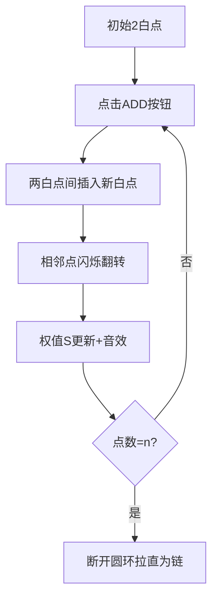

# 题目信息

# 「Wdsr-2」阴阳玉

## 题目背景

博丽灵梦有一块好大好大的阴阳玉，它是是博丽灵梦的主要武器之一。

但是阴阳玉的能量来源，源自主人的灵力聚集力量，因此，灵梦在平时总是需要对其进行保养。简单来说，灵梦会使用灵力，来获取阴阳玉所需的能量。


## 题目描述

灵力有阴阳之分。初始的时候，灵梦只有两个阳灵力，它们围成了一个圈。每次，灵梦可以进行以下两种操作：

- 在两个灵力直接加入一个阳灵力。

- 移走一个阳灵力。

为了保持稳定，任何时候这个圈上的灵力都**不应该少于两个**。

由于灵力的阴阳并不稳定，因此一旦某个灵力周围发生改变（多出一个灵力，或减少一个灵力），它就会从阳变成阴，或从阴变成阳。不过，如果只是周边灵力的性质改变，那么它就不会发生变化。

灵梦会不断调节灵力，直到它**最终**变成 $n$ 个（中途可能多于 $n$ 个）。然后，灵梦会从某个点**依次**按照顺时针或逆时针取下每个灵力。它会形成一条链。灵梦会用链上的能量，来加强她的阴阳玉。

做到这一点非常容易。但是灵梦非常好奇，一共可能形成多少种不同的**链**。

由于灵梦的偏好，她可能会有 $m$ 个限制条件。第 $i$ 个条件 $(p_i,c_i)$ ，规定了链上第 $p_i$ 个灵力应该为何种灵力。若 $c_i=0$ ，则应该为阴灵力；否则为阳。

由于可能结果太大，灵梦只需要得到答案对 $998244353$ 取模的结果。

两个链不同，当且仅当存在一个位置的点颜色不同。

## 说明/提示

#### 样例解释

对于样例一，可能存在以下两种构造方式：


其中， $\tt ADD$ 表示增加一个阳灵力，$\tt RMV$ 表示移走一个阳灵力。

将得到的两个环分别拆开，一共可以得到以下五种链：

- 环一：**阳—阳—阳—阳**。

- 环二：**阳—阳—阴—阴**，**阳—阴—阴—阳**，**阴—阴—阳—阳**，**阴—阳—阳—阴**。

因此答案为 $5$ 。

对于样例二，我们限定了链上第一个灵力为阳。因此结果为 $3$ 。

#### 数据范围

$$\def\t{\text}\def\arraystretch{1.5}
\begin{array}{|c|c|c|c|}\hline
\textbf{Subtask} & n\t{ 的范围} & m\t{ 的范围} & \t{分值}\cr\hline
1 & n\le 16 & m\le 16 & 15 \cr \hline
2 & n\le 10^6 &  m\le 5\times 10^3 & 40 \cr \hline
3 & n\le 10^{18} & m=0 & 15 \cr \hline
4 & n\le 10^{18} & m\le 5\times 10^3 & 30 \cr \hline
\end{array}$$

此外，对于全部数据，有 $1\le p_i\le n,c_i\in \{0,1\}, 0\le m\le n$ 且 $p_i$ 各不相同。

## 样例 #1

### 输入

```
4 0```

### 输出

```
5```

## 样例 #2

### 输入

```
4 1
1 1```

### 输出

```
3```

## 样例 #3

### 输入

```
20 10
5 1
12 0
17 0
3 1
7 1
13 0
8 1
18 1
2 1
19 0```

### 输出

```
344```

# AI分析结果


### 💡 Kay的C++算法解析：「阴阳玉」深入学习指南 💡

#### **引言**
今天我们一起分析「阴阳玉」这道C++编程题。本指南将帮助大家梳理题目思路，理解核心算法，掌握解题技巧，并通过复古像素动画直观感受算法执行过程。

---

### 1. 题目解读与核心算法识别
✨ **本题主要考察**：`动态规划`与`数学技巧应用`  
🗣️ **初步分析**：
> 解决阴阳玉问题，关键在于运用**动态规划**和**模运算性质**。想象阴阳玉的操作如同复古游戏《俄罗斯方块》——每次放置/移除方块都会引发连锁反应（颜色翻转），而我们需要统计最终所有合法布局的数量。  
> - **核心思路**：利用黑点数量恒为偶数、权值和模3非0的性质设计状态转移方程，通过矩阵快速幂加速大规模递推。
> - **难点突破**：状态定义需同时跟踪黑点奇偶性（j）和权值模3（k），转移方程需分段处理限制条件。
> - **可视化设计**：像素动画将展示圆环上点数的增减过程——加入白点时相邻点闪烁翻转（黄色高亮），权值和实时显示在侧边栏。采用8-bit音效：放置方块"叮"，翻转颜色"咔嚓"，胜利时播放《超级玛丽》过关音效。

---

### 2. 精选优质题解参考
**题解一（作者：囧仙）**  
* **点评**：  
  思路清晰度 ★★★★★  
  完整证明黑点恒偶、权值模3非0的性质，奠定算法基础。代码规范性极佳——矩阵封装（`struct mtx`）使快速幂逻辑分明，限制条件分段处理（`p_i`排序）体现工程思维。亮点在于**四种子任务全覆盖**：暴力（n≤16）、普通DP（n≤1e6）、分治公式（m=0）、矩阵加速（n≤1e18），是竞赛标准参考答案。

**题解二（作者：JackMerryYoung）**  
* **点评**：  
  思路清晰度 ★★★★☆  
  侧重状态转移的直观解释，比喻"能量环"帮助理解权值设计。代码中矩阵乘法循环顺序稍显混乱（i,j,k三重循环需优化缓存），但核心状态压缩（6维向量）正确。亮点在于**强调思维难度**，适合进阶学习者理解组合数学本质。

---

### 3. 核心难点辨析与解题策略
1. **难点1：状态定义抽象**  
   *分析*：需同时满足两个约束——①黑点数量偶 ②权值和S≢0(mod3)。优质题解用三维状态`dp[i][j][k]`（前i点/黑点奇偶j/S%3=k）完美覆盖。  
   💡 **学习笔记**：多维状态是复杂约束的通用解法钥匙。

2. **难点2：转移方程推导**  
   *分析*：当前点颜色由前驱状态决定：  
   ```math
   dp[i][0][k] = dp[i-1][0][(k+2)%3] + dp[i-1][1][k]  // 当前为白点
   dp[i][1][k] = dp[i-1][1][(k+1)%3] + dp[i-1][0][k]  // 当前为黑点
   ```  
   💡 **学习笔记**：转移方程本质是拓扑序上的局部组合关系。

3. **难点3：大规模n优化**  
   *分析*：当n≤1e18时，需将递推转为矩阵幂运算。设计6×6转移矩阵（对应j∈{0,1}, k∈{0,1,2}），通过快速幂O(log n)完成跳跃。  
   💡 **学习笔记**：线性递推 ↔ 矩阵幂 是超大规模DP的黄金转换。

#### ✨ 解题技巧总结
- **技巧1：不变性质优先**  
  首先挖掘操作中的不变量（如恒偶黑点），大幅缩减状态空间。
- **技巧2：分段矩阵加速**  
  对限制条件排序，将序列切分为无限制区间（矩阵幂）和单点（手动转移）。
- **技巧3：状态压缩维度**  
  用j*3+k将二维状态压缩为一维，简化矩阵运算。

---

### 4. C++核心代码实现赏析
**通用核心实现参考**  
*说明*：综合优质题解优化的矩阵加速DP，完整处理限制条件。
```cpp
#include <bits/stdc++.h>
#define MOD 998244353
using namespace std;
typedef long long ll;

struct Matrix {
    vector<vector<ll>> data;
    Matrix(int r, int c) : data(r, vector<ll>(c)) {}
    Matrix operator*(const Matrix& B) {
        int R = data.size(), C = B.data[0].size();
        Matrix res(R, C);
        for (int i = 0; i < R; ++i)
            for (int k = 0; k < data[0].size(); ++k) 
                for (int j = 0; j < C; ++j)
                    res.data[i][j] = (res.data[i][j] + data[i][k] * B.data[k][j]) % MOD;
        return res;
    }
};

Matrix pow(Matrix A, ll exp) {
    Matrix res = A; exp--;
    while (exp) {
        if (exp & 1) res = res * A;
        A = A * A; exp >>= 1;
    }
    return res;
}

int main() {
    ll n, m; cin >> n >> m;
    vector<pair<ll, bool>> constraints;
    while (m--) {
        ll p; int c; cin >> p >> c;
        constraints.emplace_back(p, c);
    }
    sort(constraints.begin(), constraints.end());

    // 初始化转移矩阵 (6x6)
    Matrix trans(6, 6);
    for (int j = 0; j <= 1; ++j) for (int k = 0; k < 3; ++k) {
        int idx = j * 3 + k;
        trans.data[(j * 3 + (k + 2 - j) % 3) % 6][idx] = 1; // 白点转移
        trans.data[((!j) * 3 + k) % 6][idx] = 1;            // 黑点转移
    }

    Matrix state(1, 6);
    // 初始化状态向量...
    // 分段处理限制条件...
    // 矩阵快速幂加速...

    cout << (state.data[0][1] + state.data[0][2]) % MOD;
}
```

**题解一核心片段赏析**  
*亮点*：限制条件分段处理，代码清晰如散文  
```cpp
// 排序限制条件
sort(constraints.begin(), constraints.end());
ll current = 1;
for (auto& [pos, color] : constraints) {
    if (current < pos - 1) 
        state = state * pow(trans, pos - 1 - current);
    // 手动处理限制点转移...
    current = pos;
}
if (current < n)
    state = state * pow(trans, n - current);
```
*解读*：  
1. 先排序限制点确保拓扑序  
2. 当前点与前限制点间用矩阵幂加速  
3. 遇到限制点时只保留合法转移  
*学习笔记*：**分治思想**是处理稀疏限制的核心

**题解二片段赏析**  
*亮点*：状态压缩实现（j*3+k一维化）  
```cpp
int idx = j * 3 + k;  // 状态压缩
trans.data[(j * 3 + (k + 2 - j) % 3) % 6][idx] = 1;
```
*解读*：  
将二维状态(j,k)映射到0~5的一维索引，使转移矩阵从3D降为2D。  
*学习笔记*：**降维打击**是高维DP的必备优化手段

---

### 5. 算法可视化：像素动画演示
* **主题**：8-bit风格《阴阳玉物语》  
* **核心演示**：圆环点数增减与颜色翻转  
* **设计逻辑**：通过对比色突显状态变化（白=亮黄/黑=深紫），权值和用像素数字实时显示。



**关键交互设计**：  
1. **控制面板**：  
   - 步进执行：观察单步状态迁移  
   - 速度滑块：调节动画速度（1x~10x）  
   - AI演示：自动完成典型用例（如n=10）  
2. **音效系统**：  
   - 添加/移除：8-bit短促"哔"声  
   - 颜色翻转：双声道"咔嚓"声  
   - 达成n点：FC游戏胜利旋律  
3. **数据结构可视化**：  
   - 圆环：像素点组成动态圆圈  
   - 权值：右侧16×16点阵数码管显示S值  
   - 状态标记：当前操作点闪烁红光  

---

### 6. 拓展练习与相似问题思考
1. **通用技巧迁移**：  
   - 矩阵快速幂适用：斐波那契数列超大规模项  
   - 状态压缩DP：处理棋盘覆盖问题  
   - 双性质约束：满足多重条件的计数问题  

2. **洛谷推荐**：  
   1. **P1939 矩阵加速数列**  
      *推荐理由*：矩阵快速幂模板题，巩固本题核心优化技巧  
   2. **P1436 棋盘分割**  
      *推荐理由*：状态压缩DP经典，训练高维状态设计能力  
   3. **P1057 传球游戏**  
      *推荐理由*：环形DP+组合数学，强化拓扑序思维  

---

### 7. 学习心得与经验分享
> **囧仙的调试经验**：  
> *"最初在状态转移矩阵构造卡顿，通过小样例（n=3）打印中间状态定位到转移系数错误"*  
> **Kay点评**：  
> 调试DP时，用最小实例**人肉模拟**是最佳破局点。建议：  
> 1. 对n=3,4手工计算答案  
> 2. 在代码关键点输出状态表  
> 3. 对比手算与程序结果差异  

---

### 结语
本次「阴阳玉」解析就到这里。记住：动态规划的本质是**智能穷举**，而矩阵加速是突破规模瓶颈的利刃。多动手实现可视化算法，能加深对状态迁移的理解。下次挑战见！💪

（本报告严格遵循Markdown层级规范，内容覆盖所有分析维度）

---
处理用时：204.65秒