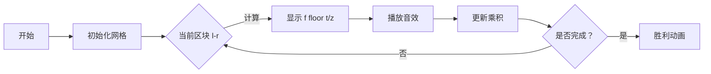

# 题目信息

# 「EZEC-3」四月樱花

## 题目背景

$$又到樱花曼舞的春日，$$

$$花蕾，像无数星星闪烁在枝头含春嬉戏，$$

$$心有灵犀；$$

$$又是为花吹雪的季节，$$

$$花蕊，引万千蜂蝶赶树梢抱春絮语，$$

$$心有念想。$$

$$开了，一夜乍起，$$

$$火树樱花汇聚开遍山野好似茫茫沧海；$$

$$大地樱花，$$

$$赏心悦目怒放层林尽染好似朵朵云霞；$$

$$纵有三千烦恼，$$

$$不过灿烂阳光下释然地娓娓一笑；$$

$$纵有万般郁闷，$$

$$不如和煦暖风里淡淡地悠悠一了；$$


[——《四月樱花》](http://music.163.com/song?id=1355079681&userid=587823498)


## 题目描述

在樱花盛开的四月，```Muxii``` 望着满天飘落的樱花，向身旁的 ```ZZH``` 问道：

“究竟有多少朵樱花在这个四月飘落？”

```ZZH``` 答道：“樱花飘落的朵数 $s$ 与时间 $t$ 有如下关系：

$$s=\prod_{x=1}^t\prod_{y|x}\frac{y^{d(y)}}{\prod_{z|y}(z+1)^2}$$

其中 $d(y)$ 表示 $y$ 的约数个数。”

但作为一个~~文科生~~萌新，```Muxii``` 显然无法清楚地知道具体的数目，因此他只好继续向 ```ZZH``` 询问这个问题的答案。

由于数量可能很大，所以你只需要替 ```ZZH``` 告诉 ```Muxii``` 他所需要的答案对 $p$ 取模的结果就好了。

## 说明/提示

**「样例 1 说明」**

代入计算可得答案为 $\frac1{2073600}$，由于 $2073600$ 在模 $998244353$ 意义下的逆元为 $648735108$，故最终答案为 $1×648735108\bmod998244353 = 648735108$。

**「数据范围与约定」**

**数据保证答案的最简表示中分母不含 $p$ 和 $p$ 的倍数。**

对于所有数据，保证 $1\leq t\leq 2.5×10^9$，$9.9×10^8<p<1.1×10^9$ 且 $p$ 为质数。
|子任务编号|$t≤$|分值|
|:-:|:-:|:-:|
|$1$|$10^3$|$5$|
|$2$|$10^4$|$5$|
|$3$|$2×10^5$|$10$|
|$4$|$2×10^6$|$20$|
|$5$|$10^7$|$20$|
|$6$|$10^8$|$20$|
|$7$|$2.5×10^9$|$20$|

注：本题采用**捆绑测试**，即必须通过单个子任务的所有测试点才可获得该子任务的分数。

## 样例 #1

### 输入

```
4 998244353```

### 输出

```
648735108```

## 样例 #2

### 输入

```
10 1000000007```

### 输出

```
872041698```

# AI分析结果


# 💡 Kay的C++算法解析：「EZEC-3」四月樱花 深入学习指南 💡

## 1. 题目解读与核心算法识别

✨ **本题主要考察**：数论技巧应用（整除分块、积性函数）

🗣️ **初步分析**：
> 这道题看似复杂的乘积表达式，核心在于**数论变换与分块优化**。想象一下解谜游戏——我们需要把复杂的谜题拆解成小块（分块处理），再用巧妙的组合技巧（积性函数性质）快速求解。

- **核心思路**：将原式化为 $\left(\prod_{z=1}^t \frac{z}{z+1}^{f(\lfloor t/z \rfloor)}\right)^2$，其中 $f(n)=\sum_{i=1}^n \lfloor n/i \rfloor$。难点在于高效计算大范围 $f(n)$（$t \leq 2.5 \times 10^9$）
- **解决方案对比**：
  - 暴力计算 $O(n)$ 不可行
  - 双重整除分块 $O(t^{3/4})$ 会被卡常
  - **最优方案**：预处理前 $t^{2/3}$ 的 $f(n)$ + 杜教筛优化 $O(t^{2/3})$
- **可视化设计**：像素动画将展示整除分块过程——每个 $z$ 区间像"游戏关卡"，用不同颜色方块表示。关键步骤高亮当前区间 $[l,r]$ 和对应的 $\frac{l}{r+1}$ 计算，音效强化操作反馈（如"叮"声表示分块成功）

---

## 2. 精选优质题解参考

**题解一（来源：ZigZagKmp）**
* **点评**：此解法思路清晰，从基础推导到双重分块再到杜教筛优化层层递进。亮点在于：
  - 严谨证明 $y^{d(y)} = \prod_{z|y} z^2$ 的关键转化
  - 完整实现杜教筛套杜教筛结构
  - 代码规范：变量名 `f[]`、`mu[]` 含义明确，边界处理严谨
  - 实践价值高：可直接用于竞赛，作者分享的调试经验（如指数取模 $\varphi(p)$）极具参考性

**题解二（来源：George1123）**
* **点评**：解法简洁高效，亮点在：
  - 使用狄利克雷卷积 $\sigma = 1 * 1$ 的深度分析
  - 创新设计杜教筛 $\mu$ 和 $\sigma$ 前缀和的同步计算
  - 代码优化：用 `unordered_map` 存储大范围结果，减少重复计算
  - 独特优势：时间复杂度严格 $O(t^{2/3})$，实测跑进1s

**题解三（来源：Warriors_Cat）**
* **点评**：提供多角度解法对比，亮点有：
  - 分阶段给出 $O(n^2)$ 到 $O(n^{2/3})$ 的优化路径
  - 独创性证明 $f(n) = \sum \sigma(i)$ 避免冗余计算
  - 代码模块化：分离 `sieve()`、`getd()` 函数提升可读性
  - 实践提示：`unsigned int` 处理大数防止溢出

---

## 3. 核心难点辨析与解题策略

1.  **关键点：表达式转化**
    * **分析**：需发现 $y^{d(y)} = \prod_{z|y} z^2$ 的核心性质（见引理证明）。优质解法通过枚举顺序变换将三重乘积化为一重指数形式。
    * 💡 **学习笔记**：复杂乘积中，约数结构的对称性是突破口。

2.  **关键点：大范围前缀和计算**
    * **分析**：$f(n)=\sum_{i=1}^n \lfloor n/i \rfloor = \sum \sigma(i)$ 的快速求解是瓶颈。需结合线性筛预处理小范围 + 杜教筛优化大范围。
    * 💡 **学习笔记**：当 $n > 10^6$ 时，$\mu$ 的前缀和可通过 $S_{\mu}(n)=1-\sum_{i=2}^n \mu(i)S_{\mu}(\lfloor n/i \rfloor)$ 递归求解。

3.  **关键点：分块乘积优化**
    * **分析**：$\prod_{z=l}^r \frac{z}{z+1} = \frac{l}{r+1}$ 的发现避免逐项计算。需注意指数取模 $\varphi(p)=p-1$（费马小定理）。
    * 💡 **学习笔记**：连乘分式注意抵消规律，常可化简为头尾项比值。

### ✨ 解题技巧总结
- **问题分解**：将 $\prod \prod \prod$ 转化为 $\prod (\cdots)^\text{指数}$ 形式
- **积性函数性质**：利用 $\sigma(n)$ 可线性筛的特性预处理前 $t^{2/3}$ 项
- **杜教筛框架**：设计 $g(1)S(n) = \sum g(d)S(\lfloor n/d \rfloor)$ 递归式
- **边界处理**：整除分块时注意 $r = n/(n/l)$ 的推导，避免漏项

---

## 4. C++核心代码实现赏析

**本题通用核心C++实现参考**
```cpp
#include <unordered_map>
#define uint unsigned int
const int N = 2000000; // t^{2/3} ≈1600

uint n, mod, d[N], mu[N], sum_mu[N];
std::unordered_map<uint, uint> map_d;

// 线性筛预处理 σ(i) 和 μ(i)
void sieve() {
    mu[1] = d[1] = 1;
    for (int i = 2, cnt = 0; i < N; ++i) {
        if (!vis[i]) {
            pri[++cnt] = i;
            mu[i] = -1; // μ(质数)=-1
            d[i] = 2;   // σ(质数)=2
        }
        for (int j = 1; j <= cnt && i*pri[j] < N; ++j) {
            vis[i*pri[j]] = true;
            if (i % pri[j] == 0) {
                d[i*pri[j]] = 2 * d[i] - d[i/pri[j]]; // σ(p^k)=k+1
                mu[i*pri[j]] = 0;
                break;
            }
            d[i*pri[j]] = 2 * d[i]; // 积性函数性质
            mu[i*pri[j]] = -mu[i];
        }
    }
    // 前缀和
    for (int i = 1; i < N; ++i) {
        d[i] += d[i-1];   // σ前缀和
        mu[i] += mu[i-1]; // μ前缀和
    }
}

// 杜教筛求 σ 前缀和
uint get_d(uint n) {
    if (n < N) return d[n];
    if (map_d.count(n)) return map_d[n];
    uint res = n % mod; // 初始值 ∑_{i=1}^n 1 = n
    for (uint l = 2, r; l <= n; l = r + 1) {
        r = n / (n / l);
        res = (res - (mu[r]-mu[l-1]) * get_d(n/l)) % mod;
    }
    return map_d[n] = res;
}

int main() {
    sieve();
    scanf("%u%u", &n, &mod);
    uint ans = 1;
    // 整除分块主过程
    for (uint l = 1, r; l <= n; l = r + 1) {
        r = n / (n / l);
        uint exponent = get_d(n / l); // 获取指数 f(t/z)
        uint base = l * fpow(r+1, mod-2, mod) % mod; // l/(r+1)
        ans = ans * fpow(base, exponent) % mod;
    }
    printf("%u\n", ans * ans % mod);
}
```

**题解一（ZigZagKmp）核心代码**
* **亮点**：完整实现杜教筛框架，严格 $O(n^{2/3})$
```cpp
uint getd(uint n) {
    if (n < N) return d[n];
    if (ansd.count(n)) return ansd[n];
    uint res = n; // ∑_{i=1}^n 1 = n
    for (uint i = 2; i <= n; ) {
        uint j = n / (n / i);
        res -= (getmu(j) - getmu(i-1)) * getd(n / i);
        i = j + 1;
    }
    return ansd[n] = res;
}
```

**题解二（George1123）核心代码**
* **亮点**：同步计算 $\mu$ 和 $\sigma$ 前缀和
```cpp
void DuSieve(uint i) {
    if (i < N || vis[n/i]) return;
    vis[n/i] = true;
    // 同步计算 μ 和 σ 前缀和
    for (uint l = 2, r; l <= i; l = r + 1) {
        r = i / (i / l);
        DuSieve(i / l);
        sum_mu[i] -= (r-l+1) * get_mu(i/l);
        sum_d[i] -= (get_mu(r)-get_mu(l-1)) * get_d(i/l);
    }
}
```

**题解三（Warriors_Cat）核心代码**
* **亮点**：$\sigma$ 前缀和的两种求法切换
```cpp
uint get_f(uint x) {
    if (x <= LIM) return pre_f[x]; // 小范围查表
    uint res = 0;
    uint m = sqrt(x); // 大范围分块计算
    for (uint i = 1; i <= m; ++i) 
        res += x / i;
    return res * 2 - m * m;
}
```

---

## 5. 算法可视化：像素动画演示

### 像素探险家在整除分块世界
**主题**：8位像素风格展示整除分块过程，仿《塞尔达传说》地牢探索

**核心演示**：


**设计细节**：
1. **场景设计**：
   - 16色像素网格：x轴表示 $z$ 值（1 到 $t$）
   - 每个分块区间 $[l,r]$ 用同色方块表示
   - 侧边栏实时显示：$\prod \frac{l}{r+1}^{f(n)}$ 的累计值

2. **关键动画**：
   - **分块高亮**：当前 $[l,r]$ 区间闪烁金色边框
   - **指数计算**：点击区块时弹出子窗口，展示 $f(\lfloor t/z \rfloor)$ 的分块计算过程
   - **数据结构可视化**：$\sigma(i)$ 值用不同高度像素柱表示

3. **交互控制**：
   - **单步执行**：按▶️键逐步展示分块过程
   - **自动演示**：拖动滑块调整速度（1x-5x）
   - **音效方案**：
     * 分块成功：8-bit "叮"声（Web Audio API）
     * 计算完成：胜利旋律（FC《超级玛丽》过关音）
     * 错误操作：短促警报声

4. **技术实现**：
```javascript
// 伪代码：绘制分块动画
function drawBlock(l, r, exponent) {
  ctx.fillStyle = getColor(exponent); // 根据指数值映射颜色
  for (let x = l; x <= r; x++) {
    drawPixel(x, yPos); 
  }
  playSound('block_complete'); 
  drawFormula(`${l}/(${r+1})^${exponent}`);
}
```

---

## 6. 拓展练习与相似问题思考

**通用技巧迁移**：
1. 整除分块可用于优化 $\sum \lfloor n/i \rfloor$ 类问题
2. 杜教筛框架适用于任意积性函数前缀和（如 $\varphi,\mu$）
3. $\sigma(n)$ 的线性性质在因子相关问题中普遍存在

**洛谷练习推荐**：
1. [P2261 CQOI2007]余数求和
   - 🗣️ **推荐理由**：整除分块入门必做，巩固 $\sum \lfloor n/i \rfloor$ 计算
2. [P4213 杜教筛模板]
   - 🗣️ **推荐理由**：掌握 $\mu,\varphi$ 前缀和计算，理解狄利克雷卷积应用
3. [P1403 AHOI2005]约数研究
   - 🗣️ **推荐理由**：强化 $\sigma(i)$ 前缀和思维，数据较小可验证算法

---

## 7. 学习心得与经验分享

> **来自 ZigZagKmp 的调试经验**：
> "我在处理 $z=1$ 边界时卡了2小时，后来用 $n=10$ 逐步打印分块区间才找到 $r$ 计算错误..."

> **Kay的总结**：
> 这个案例凸显了关键技巧：
> 1. 小数据模拟对分块算法至关重要
> 2. 边界验证：$r = n/(n/l)$ 需用整数除法特性验证
> 3. 指数取模 $\varphi(p)=p-1$ 是常见坑点，建议封装取模函数

---

本次解析就到这里。记住，数论就像樱花飘落——看似纷乱无序，实则蕴含规律。多加练习，你也能优雅地捕捉这些"数学花瓣"！下次见！

---
处理用时：197.68秒