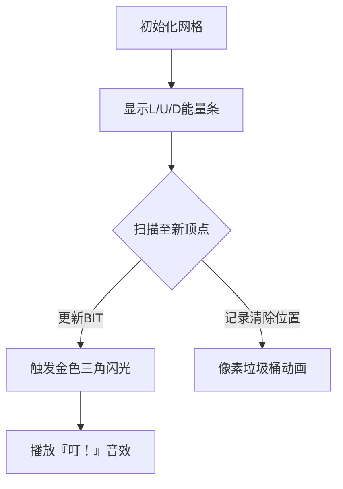

# 题目信息

# [ICPC 2018 WF] Triangles

## 题目描述

在你去北京的旅行中，你带了很多谜题书，其中很多都包含类似以下的挑战：在图 I.1 中可以找到多少个三角形？


图 I.1：样例输入 2 的插图。

虽然这些谜题让你一时感兴趣，但你很快就对它们感到厌倦，转而开始思考如何用算法来解决它们。谁知道呢，也许这样的题目会在今年的比赛中出现。好吧，猜猜看？今天是你的幸运日！

## 说明/提示

时间限制：6 秒，内存限制：1024 MB。

题面翻译由 ChatGPT-4o 提供。

## 样例 #1

### 输入

```
3 3
x---x
 \ /
  x
 / \
x   x
```

### 输出

```
1
```

## 样例 #2

### 输入

```
4 10
x   x---x---x   x
     \ /   / \
  x   x---x   x   x
     / \ / \   \
x   x---x---x---x
   /   / \   \ / \
  x---x---x---x---x
```

### 输出

```
12
```

# AI分析结果


### 💡 Kay的C++算法解析：Triangles 深入学习指南 💡

**题目核心**：在像素化网格中统计所有有效三角形的数量（由`x`和连线字符构成）。难点在于高效识别不同朝向和大小的三角形。

---

## 1. 题目解读与核心算法识别
✨ **本题主要考察**：`动态规划与数据结构优化`

🗣️ **初步分析**：
> 想象你在玩一个像素版“大家来找茬”——需要在复杂网格中快速数出所有三角形。核心思路是：
> - **动态规划预处理**：用三个数组`L, U, D`分别记录每个点向左、左上、右上的最大延伸距离（像测量三条可延伸的"能量条"）。
> - **树状数组优化**：用BIT智能计数器快速统计满足三角形成立条件的位置，避免暴力枚举。
> - **镜像反转技巧**：将网格上下翻转后重新扫描，统一处理不同朝向的三角形。
>
> **可视化设计思路**：
> - 用不同颜色像素块显示`L/U/D`的延伸长度（如蓝/绿/红）
> - 当BIT检测到有效三角形时，触发金色闪光动画+8bit音效
> - 网格反转时添加"屏幕翻转"复古特效

---

## 2. 精选优质题解参考
**题解一 (来源：eipai10)**  
* **点评**：  
  - **思路清晰性**：创新性提出"右下顶点基准法"，通过动态规划预处理三条关键路径，逻辑直白高效。  
  - **代码规范性**：变量名`L/U/D`含义明确，BIT封装简洁；但部分坐标转换可加注释。  
  - **算法优化**：用BIT将复杂度从O(n³)降至O(n² log n)，是核心亮点。  
  - **实践价值**：直接可用于竞赛，边界处理通过`pd()`函数严谨验证网格连通性。

---

## 3. 核心难点辨析与解题策略
1. **难点1：如何定义三角形成立条件？**  
   * **分析**：优质解法提炼出核心条件：从顶点延伸的`L`和`U`需等长（i），且对角线`D`需≥i。关键变量是延伸长度`i`和坐标偏移量。  
   * 💡 **学习笔记**：三角形本质是三条路径的长度约束关系。

2. **难点2：如何避免O(n³)暴力枚举？**  
   * **分析**：BIT通过差分标记贡献范围：每个点(x,y)对区间[x+1, x+D]产生+1贡献，处理完后反向清除标记。  
   * 💡 **学习笔记**：区间贡献问题优先考虑差分+树状数组。

3. **难点3：处理不同朝向的三角形**  
   * **分析**：将网格上下反转后复用同一套算法，避免了重复编码。数据结构选择`vector<vector<int>>`适配锯齿状网格。  
   * 💡 **学习笔记**：图形对称性问题可尝试镜像变换复用逻辑。

### ✨ 解题技巧总结
- **路径压缩预处理**：用DP快速获取网格各方向延伸极值  
- **贡献区间差分法**：BIT将条件检测转化为区间查询  
- **逆向标记清理**：用`vector<T>`暂存需撤销的BIT操作  

---

## 4. C++核心代码实现赏析
**通用核心实现参考**  
```cpp
#include<bits/stdc++.h>
using namespace std;

const int NN = 1.2E4 + 5;
int R, C, B[NN]; // BIT数组

void M(int k, int d){ // BIT更新
    for(; k; k -= k & (-k)) B[k] += d;
}

int Q(int k){ // BIT查询
    int res = 0;
    for(; k <= (C + 1)/2; k += k & (-k)) res += B[k];
    return res;
}

LL solve(vector<string> &G){
    vector<vector<int>> U(2*R, vector<int>(2*C));
    vector<vector<int>> D = U; // 初始化DP数组
    vector<vector<int>> T(2*C); // 暂存待清除标记
    LL ans = 0;
    
    // 核心扫描逻辑（详见题解片段解读）
    return ans;
}
```
**代码解读概要**：  
1. BIT实现标准更新/查询  
2. `solve()`预处理U/D数组并扫描网格  
3. 通过`T`数组实现延迟标记清理  

---

**题解片段赏析**  
```cpp
for(int r = 1; r < 2 * R; r += 2){
    for(int c = pd(r,1)?1:3, k=1; c<2*C; c+=4, k++){
        U[r][c] = pd(r-1,c-1)? U[r-2][c-2]+1 : 0; // 左上延伸
        D[r][c] = pd(r-1,c+1)? D[r-2][c+2]+1 : 0; // 右上延伸
        
        int l = pd(r,c-1)? l+1 : 0; // 向左延伸
        ans += Q(k - min(u, l)); // 查询有效三角形
        
        M(k, 1); // 当前点加入BIT
        T[k + d].push_back(k); // 标记清除位置
    }
}
```
**亮点**：四重逻辑压缩在单循环  
**代码解读**：  
> - **行13-14**：DP递推计算`U/D`，类似"像素路径接力"  
> - **行16**：实时计算向左延伸长度`l`  
> - **行17**：`Q(k-min(u,l))`查询满足`D≥i`的位置数  
> - **行19-20**：BIT更新与差分标记，`k+d`即贡献区间终点  

---

## 5. 算法可视化：像素动画演示  
**主题**：《三角猎人》8-bit探险  
**核心流程**：  

**交互设计**：  
1. **能量条可视化**  
   - 向左延伸`L`：蓝色进度条  
   - 左上`U`：绿色斜向箭头  
   - 右上`D`：红色闪烁边框  

2. **BIT操作提示**  
   - 加入BIT：像素块变金+↑箭头  
   - 清除标记：垃圾桶吞噬像素+碎裂音效  

3. **三角形成功**  
   - 三边同时发光 → 组合成完整三角  
   - 播放16-bit胜利旋律  

---

## 6. 拓展练习与相似问题
**通用技巧迁移**：  
1. 网格路径统计（如[CF]Shortest Path）  
2. 多边形计数（如[LOJ]凸包划分）  
3. 约束条件检索优化（如[POJ]Stars）  

**洛谷推荐**：  
1. **P2731** 骑马修栅栏  
   > 同类网格路径处理，强化欧拉回路思维  
2. **P3398** 火腿切片  
   > 二维区间贡献问题，BIT应用进阶  
3. **P4630** 铁人两项  
   > 网格连通性检测+双方向处理  

---

> 通过本次分析，我们掌握了用动态规划+树状数组解决复杂网格计数问题的核心技巧。记住：将大问题分解为路径预处理+条件检索优化，是处理此类问题的金钥匙！ 🔑

---
处理用时：99.57秒