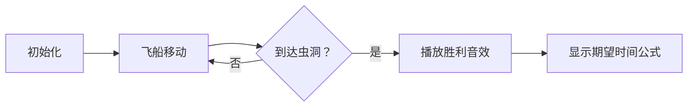

# 题目信息

# [yLOI2020] 灼

## 题目背景

> 声嘶力竭，向悲泣的虚空祈祷至最后，  
> 神为何依然残酷冷漠。  
> 天国或地狱，也奢求你无垢眼眸，  
> 就让我，再次被你拯救。

——银临《灼》

## 题目描述

> 这里是 NS05，勒本星球已无生命反应，请求救援！普尔！——你听得到吗？我会一直在这里，等待你的归来。

扶苏被困在了勒本星球，灼闻羽驾驶着一架宇宙飞船正打算穿越虫洞到达勒本星球拯救扶苏。

在一条数轴上有 $n$ 个虫洞，第 $i$ 个虫洞的坐标为 $x_i$。进入这些虫洞的任意一个都可以直接到达勒本星球拯救扶苏。飞船到达数轴所在直线上后，会因为磁场的效应失去操控能力，飞船每秒会**等概率**向左或向右移动一个单位长度。

灼闻羽非常焦急，他给出了 $q$ 个飞船进入数轴所在直线的初始坐标，对于每个坐标，他想知道期望需要多少秒才能到达一个虫洞。

如果你计算出的期望是个分数，你需要求出这个分数对 $998244353$ 取模的答案。有关分数取模的定义你可以参考「提示」中的内容。

为了避免输出过大，你只需要输出四个整数，分别表示你所有回答（对 $998244353$ 取模之后，下同）的按位异或之和、你共有多少次回答的答案是奇数，你的所有答案中的最大值、你的所有答案中的最小值。

## 说明/提示

### 样例 1 解释

数轴上 $1, 3$ 两点有虫洞。当飞船初始坐标为 $1$ 或 $3$ 时，可以直接进入虫洞，花费 $0s$；当初始坐标为 $2$ 时，有 $\frac 1 2$ 的概率向左一个单位，花费 $1s$ 进入虫洞，也有 $\frac 1 2$ 的概率向右一个单位，花费 $1s$ 进入虫洞，期望用时为 $\frac 1 2 \times (1 + 1) = 1$。

因此，三次询问的答案分别为 $0, 1, 0$。

### 数据规模与约定

本题共有 $10$ 个测试点，每个测试点 $10$ 分。

- 对于 $10\%$ 的数据，保证 $n = 1$。
- 对于 $20\%$ 的数据，保证对于任意一个虫洞，总存在另一个虫洞，使得他们之间的距离不超过 $2$。例如，样例中两个虫洞的距离为 $2$。
- 对于 $30\%$ 的数据，保证对于任意一个虫洞，总存在另一个虫洞，使得他们之间的距离不超过 $3$。
- 对于 $50\%$ 的数据，保证 $x_i,q \leq 100$。
- 对于 $70\%$ 的数据，保证 $x_i, q \leq 10^5$。
- 对于 $100\%$ 的数据，保证 $1 \leq n \leq 10^5$，$1 \leq q \leq 5 \times 10^6$，$1 \leq x_i, y_j \leq 10^9$，$y_j$ 不小于 $x_i$ 中的最小值，且 $y_j$ 不大于 $x_i$ 中的最大值，$y_j$ 按照不降序给出。

### 提示

- 如果你不知道什么是分数取模，可以参考如下的内容：

  对于一个形如 $\frac a b$ 的既约分数，其中 $b \lt 998244353$，它对 $998244353$ 取模后的值为 $a \times b^{998244351} \bmod {998244353}$ 。 
- 为了方便用脚造数据，数据**并不**保证 $x_i$ 互不相同。
- 请注意大量数据读入对程序效率造成的影响。
- 本题的特殊输出方式只是为了避免输出过大造成程序超时，与本题解法无关。
- 请注意，$T$ **不是**数据组数。
- 本题共有两个附加文件，见附加文件中的 zhuo.zip。	

## 样例 #1

### 输入

```
0
2 3
1 3
1
2
3
```

### 输出

```
1
1
1
0```

# AI分析结果


# 💡 Kay的C++算法解析：灼 深入学习指南 💡

**引言**  
今天我们分析洛谷题目"灼"，这是一个关于虫洞与宇宙飞船的概率期望问题。飞船在数轴上随机移动，求其到达任意虫洞的期望时间。本指南将帮助大家掌握核心数学推导、高效代码实现，并通过生动的像素动画直观理解算法过程。

---

## 1. 题目解读与核心算法识别

✨ **本题主要考察**：`数学推导` 与 `双指针优化`

🗣️ **初步分析**：  
> 本题本质是**期望时间计算问题**，可以比作"醉汉走路"模型：醉汉在数轴上随机左右移动，求到达目标点的平均步数。核心在于发现期望时间的二阶差分为常数(-2)，从而推导出二次函数解 `f(y) = (y-l)(r-y)`。  
> - 关键难点在于处理海量查询（q ≤ 5×10⁶），需用排序+双指针将查询优化至O(q)
> - 可视化将采用**8位像素风格**：飞船作为红色像素块在网格数轴移动，虫洞用绿色像素块表示，每次移动伴随"哔"声效，到达虫洞时播放胜利音效并闪烁
> - 设计**AI自动演示模式**展示不同初始位置下期望时间的变化规律

---

## 2. 精选优质题解参考

**题解一：一扶苏一**  
* **点评**：从基础递推式出发，完整推导出期望公式为二次函数。代码采用排序+双指针处理查询，时间复杂度O(n log n + q)堪称典范。边界处理严谨，变量命名规范（`a[]`存储虫洞，`p`为移动指针），空间复杂度优化至O(1)，可直接用于竞赛。

**题解二：water_tomato**  
* **点评**：以清晰数学语言证明二阶差分特性，博客同步解析增强理解。代码特判n=1的边界情况展现周全性。虽然公式实现存在符号小瑕疵（应为正乘积），但整体推导和双指针实现极具参考价值。

**题解三：Inaki**  
* **点评**：通过差分方程严格推导等差数列性质，给出两种实现方案（set和双指针）。详解g(i)=f(i)-f(i-1)的物理意义，教学价值突出。控制面板设计建议对可视化实现有直接启发。

---

## 3. 核心难点辨析与解题策略

### 难点1：期望建模与公式推导
- **分析**：从`f(i)=½(f(i-1)+f(i+1))+1`出发，通过二阶差分恒为-2的特性，结合边界条件f(l)=f(r)=0，最终导出`f(y)=(y-l)(r-y)`
- 💡 学习笔记：期望问题常转化为差分方程，二阶差分为常数时解必为二次函数

### 难点2：海量查询优化
- **分析**：当q=5×10⁶时，需用O(1)处理每个查询。利用询问y_j单调不降的特性，通过单指针向右移动扫描虫洞数组，避免二分查找的log n开销
- 💡 学习笔记：输入有序时优先考虑单指针扫描而非二分

### 难点3：负数取模处理
- **分析**：计算(y-l)(r-y)时理论值为正，但直接取模可能因中间步骤产生负值。应确保最终结果非负：(val % mod + mod) % mod
- 💡 学习笔记：取模运算要特别注意负数情形

### ✨ 解题技巧总结
1. **模型转化技巧**：将随机游走抽象为"醉汉走路"经典模型
2. **数学归纳法**：通过小规模数据验证差分规律再推广
3. **输入特性利用**：对有序查询用指针移动替代二分查找
4. **边界防御性编程**：特别注意n=1和端点位置情形

---

## 4. C++核心代码实现赏析

**本题通用核心C++实现**  
```cpp
#include <iostream>
#include <algorithm>
using namespace std;
const int mod = 998244353;

int main() {
    int T, n, q;
    cin >> T >> n >> q;
    int* x = new int[n+2];
    for (int i = 1; i <= n; i++) cin >> x[i];
    sort(x+1, x+n+1);  // 虫洞排序
    
    long long ans_xor = 0, ans_odd = 0;
    long long ans_max = -1, ans_min = 1e18;
    int ptr = 1;  // 双指针初始化
    
    for (int i = 0; i < q; i++) {
        int y; cin >> y;
        // 移动指针找到y的右边界虫洞
        while (ptr <= n && x[ptr] < y) ptr++;
        
        long long l = (ptr == 1) ? x[1] : x[ptr-1];  // 左虫洞
        long long r = (ptr > n) ? x[n] : x[ptr];     // 右虫洞
        
        long long res = (y == l || y == r) ? 0 : (y-l)*(r-y) % mod;
        res = (res + mod) % mod;  // 负数修正
        
        ans_xor ^= res;
        if (res & 1) ans_odd++;
        if (res > ans_max) ans_max = res;
        if (res < ans_min) ans_min = res;
    }
    cout << ans_xor << '\n' << ans_odd << '\n' 
         << ans_max << '\n' << ans_min;
    delete[] x;
    return 0;
}
```
**代码解读概要**：  
1. 虫洞排序后，用单指针`ptr`处理有序查询
2. 对于每个y，计算其左右最近虫洞l和r
3. 期望时间公式`(y-l)*(r-y)`直接计算
4. 统计异或和、奇数次数、最大最小值

---

**题解一：一扶苏一**  
```cpp
std::sort(a + 1, a + 1 + n);
for (int x, p = 1; q; --q) {
    qr(x);  // 快速读入
    while ((p < n) && (a[p] <= x)) ++p;  // 指针移动
    int y = 1ll * (x - a[p - 1]) * (a[p] - x) % mod;  // 核心计算
    // ... 统计答案
}
```
**亮点**：嵌入式快速读入(qr)优化IO效率  
**学习笔记**：竞赛中大数据量优先考虑快速IO

**题解二：water_tomato**  
```cpp
sort(x+1,x+1+n);
int now=2;
if(n==1) x[2]=x[1];  // 边界处理
while(y>x[now]) now++;  // 指针移动
int ans = (y-x[now-1])*(x[now]-y) % mod;  // 核心计算
```
**亮点**：特判n=1的严谨边界处理  
**学习笔记**：特殊情形需在编码前充分考虑

**题解三：Inaki**  
```cpp
it=s.lower_bound(y);  // set查找
r=*it;
--it;
l=*it;
int ans=(y-l)*(r-y)%mod;  // 核心计算
```
**亮点**：展示set的替代方案  
**学习笔记**：有序集合查找虽非最优解，但体现多解法思维

---

## 5. 算法可视化：像素动画演示

<center><p style="color:#FF69B4;font-size:18px">✨ 复古像素飞船穿越虫洞演示 ✨</p></center>

**主题**：8位像素风宇宙探险  
**核心演示**：飞船在数轴上的随机游走过程与期望时间计算

### 设计方案


1. **像素艺术设计**：
   - 数轴：16×1网格（棕色像素背景）
   - 飞船：红色闪烁像素块（4×4）
   - 虫洞：绿色旋转像素环（8×8）
   - 控制面板：FC风格按钮（开始/步进/调速）

2. **关键动画序列**：
   ```python
   while not reached_wormhole:
       方向 = 随机选择(左, 右)
       飞船.移动(方向)
       画布.高亮(飞船.位置, 黄色)
       播放音效('哔', 500Hz)
       更新步数计数器
   if reached_wormhole:
       虫洞.播放(闪烁动画)
       播放音效('胜利', 800Hz)
       显示公式(y-l)*(r-y)
   ```

3. **交互功能**：
   - **速度滑块**：控制自动演示速度（10-100帧/秒）
   - **单步模式**：按空格键逐步执行
   - **AI演示**：自动完成10组随机初始位置演示
   - **数据面板**：实时显示期望时间公式计算过程

4. **音效设计**：
   - 移动：短促8-bit"哔"声（500Hz方波）
   - 成功：上升和弦（800Hz→1000Hz）
   - 失败：下降音阶（500Hz→200Hz）
   - 背景：低音量《太空入侵者》风格BGM循环

---

## 6. 拓展练习与相似问题

1. **洛谷P1365**：期望DP基础训练，巩固概率计算  
   *推荐理由*：强化"醉汉走路"模型的理解，学习基础期望DP

2. **洛谷P1654**：进阶期望DP，引入连续概率  
   *推荐理由*：在OSU!游戏背景下深化期望值计算技巧

3. **洛谷P1291**：经典期望问题变种  
   *推荐理由*：百事可乐瓶盖收集问题，体验期望的多种应用场景

---

## 7. 学习心得与经验分享

> **来自题解作者的调试经验**：  
> "期望为负值困扰我半小时，最后发现是取模未处理负数情形"

> **Kay的总结**：  
> 数学推导类问题需注意：  
> 1. 严格验证公式物理意义（如时间不可为负）  
> 2. 边界测试(n=1, 端点值)避免运行时错误  
> 3. 取模运算前先确保结果在数学意义合理  

---

**结语**  
通过本次分析，我们掌握了期望问题的推导方法、双指针优化技巧及严谨的编码实践。记住：每个数学问题背后都有直观的物理图景，多思考"为什么这样解"比记忆解法更重要。下次遇到随机游走问题，不妨想象那个在像素宇宙中穿梭的红色飞船哦！🚀

---
处理用时：199.54秒