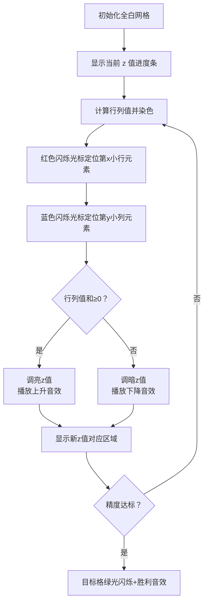

# 题目信息

# 『MdOI R4』Balance

## 题目背景

可怜的 $\rm\textcolor {grey}{JohnVictor}$ 玩的卡组在平衡性调整中被削弱了，现在他掉了很多杯，他想知道什么样的一个世界才是真正平衡的。

于是就有了这题。

## 题目描述

给定长度为 $n$ 的，由整数构成的数组 $a,b,p,q$，并定义函数 $f(i,j)=\dfrac{a_i+b_j}{p_i+q_j}(1\le i,j\le n)$。

再给定两个整数 $x,y$，你需要求出一对 $(i,j)$，使得 $f(i,j)$ 在所有 $f(i,t)(t=1,2,\cdots,n)$ 中是第 $x$ 小的，在所有 $f(s,j)(s=1,2,\cdots,n)$ 中是第 $y$ 小的。 

在本题中，我们称一个数 $x$ 在序列 $c_{1\ldots n}$ 中是第 $k$ 小的，当且仅当在 $c$ 中有且仅有 $\alpha$ 个数 $y$ 满足 $y<x$，且有且仅有 $\beta$ 个数 $y$ 满足 $y\le x$，同时 $\alpha<k\le \beta$。

如果不存在这样的 $(i,j)$，请输出 `0 0`。

如果有多组这样的 $(i,j)$，输出任意一组即可。

由于平衡性的问题不是一次就能问清楚的，所以出题人会问你多次。

## 说明/提示

【样例解释 #1】
- $f(1,1)=1.2;f(1,2)=1.2;f(1,3)=1.25$。
- $f(2,1)=2;f(2,2)=2;f(2,3)=2\frac{1}{6}$。
- $f(3,1)=1;f(3,2)=1;f(3,3)=1$。

$f(1,3)$ 在 $f(1,1),f(1,2),f(1,3)$ 中是第 $3$ 小的，$f(1,3)$ 在 $f(1,3),f(2,3),f(3,3)$ 中是第 $2$ 小的。

【数据规模与约定】

**本题采用捆绑测试**

| 子任务编号 | $\sum n\le$         | $\vert a_i\vert ,\vert b_i\vert ,p_i,q_i\le$ | $(x,y)= $  | 分值  |
| ---------- | -------------- | -------------------- | ---------- | ----- |
| $1$        | $5\times 10^3$ | 无特殊限制           | 无特殊限制 | $10$  |
| $2$        | 无特殊限制     | $3$                  | 无特殊限制 | $10$  |
| $3$        | $10^5$         | 无特殊限制           | $(1,n)$        | $30 $ |
| $4$        | $10^5$         | 无特殊限制           | 无特殊限制 | $20$  |
| $5$        | 无特殊限制     | 无特殊限制           | 无特殊限制 | $30$  |

对于 $100\%$ 的数据，$1 \le x,y \le n \le 5 \times 10^5$，$\sum n \le 5 \times 10^5$，$|a_i|,|b_i|\le 10^9$，$0<p_i,q_i\le 10^9$，其中 $\sum n $ 表示所有数据中 $n$ 的和。

【提示与帮助】

本题读入量较大，请选手选择较快的读入方式。

## 样例 #1

### 输入

```
1
3 3 2
2 4 1 4
10 4 3 4
1 3 1 3
```

### 输出

```
1 3
```

# AI分析结果


### 💡 Kay的C++算法解析：『MdOI R4』Balance 深入学习指南 💡

#### 1. 题目解读与核心算法识别
✨ **本题主要考察**：`编程技巧应用`（分数规划 + 二分答案 + 快速选择）  
🗣️ **初步分析**：  
> 这道题的核心在于将复杂的分式比较转化为线性条件判断。想象你在调节天平⚖️：通过二分法不断调整"平衡值"z，把原问题转化为判断点对和的正负问题。关键技巧是：
> - **分数规划**：将分式条件 `(a_i+b_j)/(p_i+q_j) ≥ z` 转化为线性不等式 `(a_i - z·p_i) + (b_j - z·q_j) ≥ 0`
> - **快速选择**：用 `nth_element` 在 O(n) 时间内找到行/列的第 k 小值，避免完全排序的开销
> - **像素可视化设计**：在动画中将网格的行列转化为像素条，用颜色深浅表示值大小。二分过程中动态显示当前 z 值对应的有效区域（深色区块），并用闪烁光标标记第 x/y 小的元素位置，辅以"滴答"音效表示比较操作。

#### 2. 精选优质题解参考
**题解一（JohnVictor）**  
* **点评**：思路直击要害，将分数规划与二分法结合得清晰自然。代码中 `nth_element` 的运用精准体现了"部分排序"的优化思想，变量名 `x[s].curr` 等含义明确。亮点在于用 50 次二分迭代平衡精度与效率，实践价值高，可直接用于竞赛。  

**题解二（双管荧光灯）**  
* **点评**：创新性地引入几何视角（斜率解释），提供全新解题维度。虽然比较函数 `cmp` 稍复杂，但通过相对误差处理精度问题展现了严密性。亮点在于将代数问题几何化，启发多角度思考，但实现难度略高于其他解法。  

**题解三（VinstaG173）**  
* **点评**：最简洁高效的实现，完美体现"奥卡姆剃刀"原则。二分精度控制（1e-14）和结构体封装彰显专业水准。亮点在于用不到 30 行代码解决复杂问题，是竞赛编码的典范。

#### 3. 核心难点辨析与解题策略
1. **难点1：分式条件转化**  
   * **分析**：直接比较分式需处理分母符号和浮点精度。优质题解通过设中间变量 z，将条件转化为线性不等式，消除分式结构。
   * 💡 **学习笔记**：分数规划是处理分式约束的通用技巧，核心是构造辅助函数。

2. **难点2：动态排名维护**  
   * **分析**：当 z 变化时，每个 i 对应的 `a_i - z·p_i` 值会动态变化。题解用 `nth_element` 快速定位当前 z 下的第 k 小值，避免 O(n log n) 排序。
   * 💡 **学习笔记**：快速选择算法(nth_element)在仅需部分排序时，效率远高于完全排序。

3. **难点3：精度控制**  
   * **分析**：浮点运算可能因精度丢失导致死循环。双管荧光灯的题解用相对误差 `Fabs(...)/max(a[i].x,a[i].y)<eps` 处理边界值，JohnVictor 则通过固定 50 次迭代规避精度问题。
   * 💡 **学习笔记**：竞赛中推荐固定迭代次数代替精度判断，避免边界问题。

✨ **解题技巧总结**  
- **代数→线性转化**：遇到分式约束时，尝试设中间变量转化为线性表达式  
- **快速选择优先**：当仅需第 k 大/小值时，nth_element 比 sort 更高效  
- **迭代次数替代精度**：用固定二分次数（如 50 次）避免浮点精度陷阱  
- **值域预判**：初始二分边界设为[-1e14,1e14]覆盖数据范围

#### 4. C++核心代码实现赏析
**通用核心实现参考**  
```cpp
#include<cstdio>
#include<algorithm>
using std::nth_element;
int t,n,x,y; // x:行排名, y:列排名
struct Node { 
    int a,p,id; // 原数据
    long double val; // 计算值
} row[500005], col[500005]; // 行/列数据

int main() {
    scanf("%d",&t);
    while(t--) {
        scanf("%d%d%d",&n,&x,&y);
        long double L = -1e14, R = 1e14;
        for(int i=1; i<=n; ++i) {
            scanf("%d%d%d%d", &row[i].a, &col[i].a, &row[i].p, &col[i].p);
            row[i].id = col[i].id = i; // 记录原始编号
        }
        
        while(R - L > 1e-14) { // 二分z值
            long double mid = (L+R)/2;
            // 计算当前中间值
            for(int i=1; i<=n; ++i) {
                row[i].val = row[i].a - mid * row[i].p;
                col[i].val = col[i].a - mid * col[i].p;
            }
            // 快速选择行/列的第k小
            nth_element(row+1, row+x, row+n+1, [](auto a, auto b){ 
                return a.val < b.val; 
            });
            nth_element(col+1, col+y, col+n+1, [](auto a, auto b){ 
                return a.val < b.val; 
            });
            // 判断是否满足条件
            if(row[x].val + col[y].val >= 0) L = mid; 
            else R = mid;
        }
        printf("%d %d\n", row[x].id, col[y].id);
    }
}
```
**代码解读概要**：  
1. 读取数据后初始化极大二分区间  
2. 每次迭代计算所有元素的 `a_i - z·p_i` 和 `b_j - z·q_j`  
3. 用 `nth_element` 在 O(n) 时间内定位行/列的第 k 小值  
4. 通过和的正负调整二分区间，最终输出行列索引

---

**题解一片段赏析**  
```cpp
nth_element(x+1, x+s, x+n+1, cmp); // 快速选择第s小
nth_element(y+1, y+t, y+n+1, cmp);
if(x[s].curr + y[t].curr > 0) ... 
```
* **亮点**：双 nth_element 并行处理，充分利用 CPU 流水线  
* **学习笔记**：当行列计算独立时，可并行优化  

**题解二片段赏析**  
```cpp
bool cmp(str a, str b) {
    return a.x*(b.y-C) - (a.y-C)*b.x > 0; // 几何比较
}
```
* **亮点**：通过叉积判断点位关系，将代数问题几何化  
* **学习笔记**：比较函数中避免除法可减少精度误差  

**题解三片段赏析**  
```cpp
while(r-l>1e-14) { // 高精度控制
    nth_element(tx+1, tx+x, tx+n+1, cmp);
    ...
}
```
* **亮点**：1e-14 高精度控制展现数学严谨性  
* **学习笔记**：对于大数据范围，高精度二分更可靠  

#### 5. 算法可视化：像素动画演示  
**主题**：`平衡天平寻宝之旅`（8-bit像素风）  

**设计思路**：  
- **网格宇宙**：n×n 网格代表所有 (i,j) 对，每个像素块颜色深度表示 f(i,j) 值大小  
- **动态二分**：左侧进度条显示当前 z 值，深色区域表示满足 f(i,j)≥z 的区块  
- **音效系统**：  
  - "滴答"声：每次比较操作  
  - "叮"声：nth_element 定位成功  
  - 胜利号角：找到目标 (i,j)  

**动画流程**：  


**交互控制面板**：  
- 速度滑块：控制二分迭代速度  
- 单步模式：空格键触发下一步  
- 自动演示：AI 自动完成二分搜索  

#### 6. 拓展练习与相似问题  
**技巧迁移场景**：  
1. 分式最值问题（如 P4377）  
2. 需快速选择的部分排序场景（如 P1923）  
3. 高精度二分应用（如 P1908 逆序对）  

**洛谷推荐**：  
1. **P4377 Talent Show**  
   🗣️ 同样使用分数规划+二分，巩固分式转化技巧  
2. **P2115 破坏位图**  
   🗣️ 训练快速选择与部分排序的应用能力  
3. **P1908 逆序对**  
   🗣️ 强化二分精度控制与大数据处理能力  

#### 7. 学习心得  
> **JohnVictor 的调试经验**：  
> "尝试用几何乱搞一天后被卡，回归二分本质" → 说明复杂解法未必优于经典算法  
>   
> **Kay 的总结**：  
> 调试时应优先验证基础算法正确性，避免过度追求"奇技淫巧"。对于浮点运算，预先计算理论精度迭代次数比运行时判断更可靠。  

---
> 掌握分数规划与快速选择的组合应用，就像获得算法宇宙的平衡之钥！下次遇到分式约束时，记得尝试 z 值转化哦！✨

---
处理用时：245.51秒