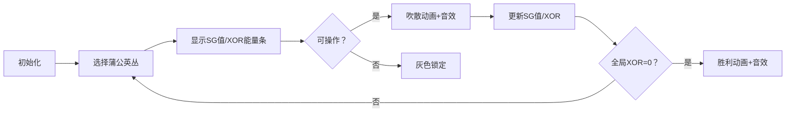

# 题目信息

# 「Stoi2031」蒲公英的约定（vol.2）

## 题目背景

> 一起长大的约定 那样清晰 拉过勾的我相信 说好要一起旅行 是你如今 唯一坚持的任性 ——《蒲公英的约定》

## 题目描述

清和如在玩游戏。她们有 $n$ 丛 **蒲公英**，每丛分别有 $s_i$ 朵。这些 **蒲公英** 有一个神奇的性质：有一个给定的常数 $\sigma \in (0,1)$，$x$ 朵 **蒲公英** 会分出 $\lfloor \sigma x \rfloor$ 朵为一组，剩下 $x-\lfloor \sigma x \rfloor$ 朵继续分组，直到分出的组没有 **蒲公英** 即 $\lfloor \sigma x \rfloor=0$ 为止。她们称这种现象为 **任性**。现在她们的每丛 **蒲公英** 都有 **任性** 的现象。她们的游戏规则如下：从清开始，两人轮流进行 **旅行**。一次 **旅行** 为选择一丛 **蒲公英** 并吹散这一丛的第一组中的若干朵 **蒲公英**，至少要吹一朵，至多吹的朵数为第一组的朵数，即不能吹散除第一组外的 **蒲公英**。当第一组为空时，其下一组成为第一组。若这一丛只剩下一组 **蒲公英**，这一丛不能再被选定。每丛 **蒲公英** 都不能被选定时，游戏结束，当前轮到的人落败。她们想知道如果清第一次 **旅行** 时等概率选择其中一丛可吹散的 **蒲公英** 再等概率选择吹散的朵数后两人都按最优策略操作，那么清的胜率 $x \bmod{20190816170251}$ 的值将会是多少。

与 vol.1 的区别是，**蒲公英** 在被吹散一部分后 **会** 重新分组。

## 说明/提示

#### 简述版题意：

有 $n$ 丛 **蒲公英**，第 $i$ 丛有 $s_i$ 朵。给定实数 $\sigma$，两人轮流操作，每次操作可以选择一丛 **蒲公英**，并选择一个整数 $c \in (0,\sigma s]$，从这丛 **蒲公英** 中吹散 $c$ 朵，其中 $s$ 为操作之前这丛 **蒲公英** 的朵数。必须至少吹一朵，不能操作者败。求先手第一步等概率选择任意一丛可操作的 **蒲公英** 再等概率选择吹散的朵数后两人都采取最优策略时先手的胜率 $x \bmod{20190816170251}$ 的值。

#### 样例解释：

对于样例 $1$，清无法操作，胜率为 $0$。

对于样例 $2$，清可以选择第 $2$ 丛并在两种操作中选择吹散 $2$ 朵变成 $1,5,3$，或选择第 $3$ 丛并选择唯一的操作变成 $1,7,2$，且第 $1$ 丛不能选择，总胜率为 $\dfrac{\frac{1}{2}+1}{2}=\dfrac{3}{4}$。

#### 数据范围：

**本题采用捆绑测试，各个 Subtask 的分数与限制如下。**

| Subtask No. | $n \le$ | $s_i \le$ | $\sigma$ 限制 | 分值 |
| :-----------: | :-----------: | :-----------: | :-----------: | :-----------: |
| $1$ | $3 \times 10^5$ | $10^{10}$ | $\sigma=\dfrac{\sqrt{2}+1}{3}$ | $10$ |
| $2$ | $3 \times 10^5$ | $10^{10}$ | $\sigma=\dfrac{\sqrt{3}+1}{5}$ | $10$ |
| $3$ | $3 \times 10^5$ | $10^{10}$ | $\sigma=\dfrac{\sqrt{5}-1}{2}$ | $10$ |
| $4$ | $100$ | $1$ | 无 | $3$ |
| $5$ | $100$ | $100$ | $\sigma=\dfrac{1}{2}$ | $7$ |
| $6$ | $100$ | $10^6$ | 无 | $13$ |
| $7$ | $3 \times 10^5$ | $10^{10}$ | $\sigma \ge \dfrac{1}{2}$ | $47$ |

对于 $100\%$ 的数据，$1 \le n \le 3 \times 10^5,1 \le s_i \le 10^{10},1 \le p<q \le 10^9$。

**本题读入量较大，可以选择使用比赛描述中的快速读入模板以加快读入速度。**

## 样例 #1

### 输入

```
4 3
1 1 1
1 6
```

### 输出

```
0
```

## 样例 #2

### 输入

```
6 3
1 7 3
1 3
```

### 输出

```
15143112127689
```

# AI分析结果


### 题目分析报告：蒲公英的约定（vol.2）

---

## 1. 题目解读与核心算法识别
✨ **本题主要考察**：**组合博弈论（SG函数）与数论优化**

🗣️ **初步分析**：
> 本题的核心是博弈论中的SG函数理论，结合了数学归纳法和数论优化技巧。想象蒲公英的分组过程如同一个不断拆解的俄罗斯套娃，每次操作相当于从最外层套娃中取出一部分。关键在于发现蒲公英数量的SG函数存在递归规律：某些特殊值（称为"任性点"）的SG值等于其子问题的SG值，而其他点的SG值直接等于可操作数（floor(σx)）。这种规律类似于斐波那契数列的递归性质，但需要精密数学证明。

- **核心难点**：  
  1. 推导SG函数的递归规律（涉及实数σ的分数表示）  
  2. 高效计算大规模数据（n≤3×10⁵, sᵢ≤10¹⁰）  
  3. 模意义下胜率的分数运算  

- **可视化设计思路**：  
  采用**8位像素风+RPG战斗动画**演示：  
  - 每丛蒲公英显示为像素堆（如《星露谷物语》作物）  
  - 操作时触发"吹散"动画：被吹散的蒲公英像素块飞散+16-bit音效  
  - 状态栏实时显示：  
    ▶️ 当前SG值（像素数字）  
    ▶️ 异或和（XOR能量条）  
    ▶️ 可操作数（σx进度条）  
  - "AI自动推演"模式：自动展示最优操作路径，伴随胜利/失败音效

---

## 2. 精选优质题解参考
**题解（作者：VinstaG173）**  
* **点评**：  
  该题解展现了极高的数学严谨性：  
  - **思路清晰性**：通过引理严格证明SG函数规律，将博弈问题转化为数学归纳问题  
  - **代码优化**：使用`__int128`处理大数运算，宏定义封装σ相关计算  
  - **算法创新**：利用τ=σ/(1-σ)的数学性质，实现O(log sᵢ)递归深度  
  - **实践价值**：正确处理分数模运算，边界条件严谨（如_sigma(x)=0时直接返回0）  
  **亮点**：发现"后继状态SG值取遍[0, floor(σx)]"的性质，使胜率计算从O(n²)降至O(n)

---

## 3. 核心难点辨析与解题策略
1. **关键点：SG函数规律证明**  
   * **分析**：需证∀x, floor(σx)-floor(σ(x-1)) = [x∉A]（A为特殊点集）。通过τ的数学变换，将实数运算转为整数关系，结合{x}（小数部分）的性质完成归纳。  
   💡 **学习笔记**：博弈问题常隐藏数论规律，先通过小规模数据找特征再严格证明。

2. **关键点：递归计算优化**  
   * **分析**：递归式`SG(x)=SG(floor(x*(1-σ)))`的深度仅O(log sᵢ)，因每次x至少乘以(1-σ)<1。宏定义`_mu()/_tau()`封装分数运算，避免浮点误差。  
   💡 **学习笔记**：处理大数递归时，数学等价变形比暴力计算更高效。

3. **关键点：胜率模运算处理**  
   * **分析**：胜率公式含分数Σ(1/floor(σsᵢ))，需用扩展欧几里得求模逆元。代码中`exgcd+_inv`实现20190816170251模下的除法。  
   💡 **学习笔记**：模意义下的分数必须转为逆元，`a/b mod m = a*b⁻¹ mod m`。

### ✨ 解题技巧总结
- **数学建模**：将博弈操作转化为σ的整数函数性质  
- **递归优化**：利用数学等价性减少计算量  
- **边界处理**：优先处理_sigma(x)=0的特例提升效率  
- **类型升级**：`unsigned long long`升`__int128`防溢出

---

## 4. C++核心代码实现赏析
**本题通用核心C++实现参考**  
* **说明**：综合题解思路，体现递归优化与模运算精髓  
* **完整核心代码**：
```cpp
#include<cstdio>
#define rg register
#define LL __int128
#define ll unsigned long long
const ll ntf=20190816170251;

// σ相关计算宏（p/q为分数形式）
inline ll _sigma(ll x, ll p, ll q) { 
    return (LL)x * p / q;
}
ll sg(ll x, ll p, ll q) {
    ll sig = _sigma(x, p, q);
    if(!sig) return 0; // 边界：不可操作
    ll y = (LL)x * (q-p) / q; // _mu(x)=floor(x*(1-σ))
    ll t = (LL)y * p / (q-p) + 1; // _tau(y)+1
    return (t == x) ? sg(y, p, q) : sig; // SG递归规律
}
```

**题解片段赏析**  
1. **亮点**：宏定义封装数学运算，`__int128`防溢出  
   **核心代码**：
   ```cpp
   #define _mu(x) ((ll)((id<4)?(x*mu[id]):(x*(q-p)/q)))
   ll t = _tau(y) + 1;
   if(t == x) return sg(y);
   ```  
   **代码解读**：  
   > `_mu(x)`根据σ类型选择计算方式：预存值（Subtask1-3）或分数运算（Subtask4-7）。递归时比较`t`与`x`判断是否特殊点，是则递归子问题，否则返回`floor(σx)`。  
   **学习笔记**：宏定义简化重复运算，但需确保表达式无副作用。

2. **亮点**：异或和动态统计与逆元运算  
   **核心代码**：
   ```cpp
   LL exgcd(LL a, LL b, LL &x, LL &y) { // 扩展欧几里得
       if(!b) { x=1; y=0; return a; }
       LL d=exgcd(b, a%b, y, x);
       y -= a/b*x; return d;
   }
   for(int i=1; i<=n; ++i) {
       if(!_sigma(s[i])) ++m;
       else if((d ^ SG[i]) <= _sigma(s[i])) 
           r = (r + _inv(_sigma(s[i]))) % ntf;
   }
   ```  
   **代码解读**：  
   > 先计算全局异或和`d`，遍历每丛蒲公英：若可操作且满足`d ^ SG[i] ≤ floor(σsᵢ)`，则累加其逆元（即1/floor(σsᵢ)）。`_inv`通过解`ntf*k + a*x=1`求得逆元。  
   **学习笔记**：博弈胜率统计需结合SG值与可操作空间。

---

## 5. 算法可视化：像素动画演示
**设计主题**：*蒲公英骑士的像素征途*（复古RPG风格）  

**核心演示流程**：  


**实现细节**：  
1. **像素艺术**：  
   - 蒲公英丛：8×8像素块堆叠，颜色随SG值渐变（蓝→黄→红）  
   - 操作高亮：被选中的丛显示像素呼吸框，吹散朵数以粒子效果飞散  

2. **交互控制**：  
   - **控制面板**：  
     ▶️ 步进/暂停/重置  
     ▶️ XOR进度条（显示当前异或和）  
     ▶️ σ调节滑块（实时改变分组规则）  
   - **AI推演**：自动播放最优路径（速度可调），路径显示为像素箭头  

3. **音效系统**：  
   - 关键操作：吹散时触发8-bit "叮"声（Web Audio API合成）  
   - 状态变化：XOR归零时播放胜利旋律（类似《塞尔达》解谜成功）  
   - 错误操作：无效选择时短促"哔"声  

4. **动态旁白**：  
   > "当前SG值="+SG值+"，异或和="+XOR  
   > "吹散"+c+"朵！新SG值="+newSG  

**技术实现**：Canvas绘制动态像素网格+Web Worker后台计算SG函数

---

## 6. 拓展练习与相似问题思考
**通用技巧迁移**：  
SG函数+数学归纳法适用于：  
1. 分段取物博弈（如取石子问题变形）  
2. 带递归结构的公平组合游戏  
3. 实数参数化的离散模型  

**洛谷推荐**：  
1. **P2575 高手之博弈**  
   🗣️ 考察SG函数找规律，强化递归思维  
2. **P2148 [SDOI2009] E&D**  
   🗣️ 双堆博弈进阶，训练SG函数推导能力  
3. **P4136 谁能赢呢？**  
   🗣️ 简单棋盘博弈，适合练习SG打表  

---

## 7. 学习心得与经验分享
> **作者经验**："调试时发现SG递归边界处理错误，添加`! _sigma(x)`判断后AC。数学证明的代码实现需严格验证边界。"  
> **Kay点评**：这印证了**边界测试**的重要性！处理递归函数时，务必验证：  
> 1. 最小规模输入（如sᵢ=0或1）  
> 2. 递归终止条件是否完备  
> 3. 数学归纳的代码映射是否精确  

---

通过本次分析，我们深入掌握了博弈问题的SG函数推导与优化实现。记住：复杂问题背后常隐藏简洁数学规律，耐心寻找递归特征是制胜关键！下次挑战再见！💪

---
处理用时：315.36秒