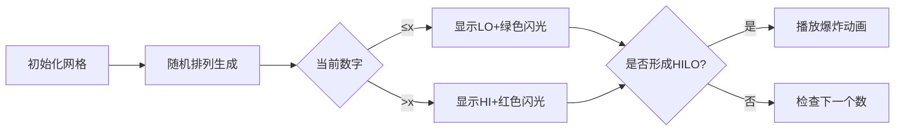

# 题目信息

# [USACO21DEC] HILO P

## 题目描述

Bessie 有一个数 $x+0.5$，其中 $x$ 是某个 $0$ 到 $N$ 之间的整数（$1\le N\le 5000$）。

Elsie 正试着猜这个数。她可以以如下形式对于某个 $1$ 到 $N$ 之间的整数提问：「$i$ 是大了还是小了？」如果 $i$ 大于 $x+0.5$，Bessie 会回答 "HI!"，如果 $i$ 小于 $x+0.5$ 则回答 "LO!"。

Elsie 想到了以下猜测 Bessie 的数的策略。在进行任何猜测之前，她创建了一个包含 $N$ 个整数的序列，其中从 $1$ 到 $N$ 的每个数均恰好出现一次（换句话说，这个序列是长为 $N$ 的一个排列）。然后她遍历这一列表，按列表中的数的顺序依次猜数。然而，Elsie 会跳过所有不必要的猜测。也就是说，如果 Elsie 将要猜某个数 $i$，而 Elsie 之前已经猜过了某个 $j < i$ 并且 Bessie 回答 "HI!"，Elsie 不会再猜 $i$，而是继续猜序列中的下一个数。类似地，如果她将要猜某个数 $i$，而她之前已经猜过了某个 $j > i$ 并且 Bessie 回答 "LO!"，Elsie 不会再猜 $i$，而是继续猜序列中的下一个数。可以证明，使用这一策略，对于 Elsie 创建的任意序列，她都可以唯一确定 $x$。

如果我们将所有 Bessie 回答的 "HI" 或 "LO" 拼接成一个字符串 $S$，那么 Bessie 说 "HILO" 的次数为 $S$ 等于 "HILO" 的长为 $4$ 的子串数量。

Bessie 知道 Elsie 将要使用这一策略，并且已经选定了值 $x$，但她不知道 Elsie 会使用什么排列。你的目标是对于所有 Elsie 可能选用的排列，计算 Bessie 说 "HILO" 的次数之和，对 $10^9+7$ 取模。

## 说明/提示

【样例解释1】

在这个测试用例中，Bessie 的数是 $2.5$。

例如，如果 Elsie 的排列是 $(4,1,3,2)$，那么 Bessie 会说 ""HILOHILO"，总计两次 "HILO"。又例如，如果 Elsie 的排列是 $(3,1,2,4)$，那么 Bessie 会说 "HILOLO"，总计一次 "HILO"。

【样例解释2】

确保输出总和对 $10^9+7$ 取模的结果。

【数据范围】

- 测试点 3-10 满足 $N\le 50$；
- 测试点 11-18 满足 $N\le 500$；
- 测试点 19-26 没有额外限制。

## 样例 #1

### 输入

```
4 2```

### 输出

```
17```

## 样例 #2

### 输入

```
60 10```

### 输出

```
508859913```

# AI分析结果


# 💡 Kay的C++算法解析：[USACO21DEC] HILO P 深入学习指南 💡

**引言**  
今天我们来分析USACO 2021年12月赛的HILO P问题。这道题要求计算在Elsie使用特定猜数策略时，Bessie回答中出现"HILO"模式的总次数。本指南将帮助你理解动态规划与组合数学的核心思想，掌握O(N)优化技巧，并通过像素动画直观感受算法执行过程。

---

## 1. 题目解读与核心算法识别

✨ **本题主要考察**：`动态规划优化` + `组合数学`  
（标签：动态规划/组合数学/期望计算）

🗣️ **初步分析**：  
> 想象你在玩数字猜谜游戏：你有一组打乱的数字卡片，按顺序翻牌猜数。如果之前的线索表明某张牌无需猜测，你可以跳过它。本题要求计算在所有可能的翻牌顺序中，出现"先猜大数(HI)后猜小数(LO)"这种特定模式的总次数。  

- **核心思路**：通过动态规划记录剩余有效数字的状态，或使用组合数学直接计算数对贡献。前者需设计`dp[状态][剩余小数][剩余大数]`的状态转移，后者则需分析每个有效数对形成"HILO"的贡献。
- **算法流程**：动态规划解法中，状态转移取决于上次回答（HI/LO）和当前选择；组合解法则需枚举所有可能形成"HILO"的数对，计算排列方案数。
- **可视化设计**：采用8位像素风格（类似FC游戏）展示猜数过程：
  - 数字卡片用不同颜色区分：蓝色(未猜)、黄色(当前)、绿色(已猜中)、红色(跳过)
  - 关键动画：当前数字高亮闪烁 → Bessie回答HI/LO文字气泡 → 形成HILO时显示像素爆炸特效
  - 交互控制：单步执行/自动播放（可调速）、重置按钮，配8-bit音效（选择音、成功音效）

---

## 2. 精选优质题解参考

**题解一：ETHANK（O(N)数学解法）**  
* **点评**：  
  思路直击问题本质，将期望转化为调和级数求和（$E=\frac{1}{2}(H_x+H_y-H_N+\frac{y}{N})$），代码仅15行。亮点在于数学推导精妙，复杂度最优（O(N)），变量命名简洁（`H[]`存储调和数），边界处理严谨（取模修正）。实践价值极高，可直接用于竞赛。

**题解二：牛瓜瓜（O(N²)动态规划）**  
* **点评**：  
  翻译官方题解并补充关键细节，状态定义清晰（`dp[b][j][k]`表上次回答和剩余有效数）。代码实现规范（前缀和优化），逻辑推导透彻：解释状态转移时分"回答HI/LO"和"跳过/不跳过"四种情况。亮点在于用二维前缀和将复杂度从O(N³)优化到O(N²)，变量`sum0/sum1`命名体现功能。

**题解三：lzqy_（组合数学解法）**  
* **点评**：  
  创新性地从数对贡献角度切入，枚举$(x>k, y≤k)$计算其形成HILO的方案数。推导严谨（分中间数存在与否两类），代码中`biga()`函数封装排列数计算提升可读性。亮点在于将问题转化为组合计数模型，提供不同于DP的新视角。

---

## 3. 核心难点辨析与解题策略

1. **难点：状态定义与无后效性**  
   * **分析**：DP需准确表示"剩余有效数字"和"上次回答"的关系。如牛瓜瓜解法中，`dp[0][j][k]`的"0"表示上次回答LO，此时选大数会触发HI并可能产生HILO。
   * 💡 **学习笔记**：好的状态定义应包含"当前决策依赖的所有历史信息"。

2. **难点：组合计数的重复计算**  
   * **分析**：直接枚举数对$(x,y)$时，需确保两数间无更大/更小数破坏HILO。lzqy_通过限定中间数范围（$z \in [i+1, x]$）解决此问题。
   * 💡 **学习笔记**：组合问题中，用"限定极值"避免重复是关键技巧。

3. **难点：数学期望的转化**  
   * **分析**：ETHANK解法将期望拆解为调和级数，依赖$H_n=\sum_{i=1}^n\frac{1}{i}$的性质。需理解期望线性性：$E[\#(ba)]=\sum P(\text{贡献})$。
   * 💡 **学习笔记**：复杂期望可转化为常见级数求和。

### ✨ 解题技巧总结
- **技巧1：前缀和优化DP**  
  牛瓜瓜解法用`sum0/sum1`数组避免重复计算，将转移复杂度从O(N)降至O(1)
- **技巧2：逆元预处理**  
  三种解法均预处理乘法逆元，避免除法取模的性能瓶颈
- **技巧3：边界特化处理**  
  ETHANK解法单独处理$x=0$或$y=0$的退化情况，保证公式普适性

---

## 4. C++核心代码实现赏析

**通用核心参考（综合ETHANK与牛瓜瓜思路）**  
```cpp
#include <iostream>
using namespace std;
const int mod = 1e9+7, N = 5005;

int main() {
    int n, x; cin >> n >> x;
    // 预处理逆元与调和级数
    long long inv[N], H[N] = {0}, fac = 1;
    inv[1] = 1;
    for (int i = 2; i <= n; ++i) 
        inv[i] = (mod - mod/i) * inv[mod%i] % mod;
    for (int i = 1; i <= n; ++i) {
        H[i] = (H[i-1] + inv[i]) % mod;
        fac = fac * i % mod;
    }
    // 计算O(1)公式结果
    int y = n - x;
    long long ans = fac * (mod+1)/2 % mod; // 乘1/2
    ans = ans * ((inv[n]*y % mod + H[x] + H[y] - H[n]) % mod) % mod;
    cout << (ans + mod) % mod;
}
```

**题解一：ETHANK（公式推导）**  
```cpp
// 核心公式实现
ans = fac * inv[2] % mod * (inv[n]*y%mod + H[x] + H[y] - H[n]) % mod;
```
* **代码解读**：  
  > `fac`存储$n!$，`inv[]`为逆元数组，`H[]`为调和数。核心公式分为三部分：  
  > 1. `inv[n]*y`：对应$\frac{y}{N}$项  
  > 2. `H[x]+H[y]-H[n]`：调和级数组合项  
  > 3. `fac * inv[2]`：全局乘$\frac{1}{2}$和$n!$  
  > 最后取模修正保证结果非负。  
* 💡 **学习笔记**：调和级数可高效预处理，将期望计算降至O(1)

**题解二：牛瓜瓜（DP前缀和优化）**  
```cpp
// 前缀和DP核心
for(int j=0; j<=x; j++)
for(int k=0; k<=y; k++) {
    dp[0][j][k] = 1ll*(sum1[j] + sum0[k]) * inv[j+k] % mod;
    dp[1][j][k] = (dp[0][j][k] + 1ll*j*inv[j+k]) % mod;
    // 更新前缀和
    sum1[j] = (sum1[j] + dp[1][j][k]) % mod;
    sum0[k] = (sum0[k] + dp[0][j][k]) % mod;
}
```
* **代码解读**：  
  > 双重循环枚举剩余小数`j`和大数`k`。`dp[0]`状态转移不含额外贡献，`dp[1]`需增加$\frac{j}{j+k}$（当前选小数形成HILO的概率）。`sum0/sum1`分别累计$dp[0]$和$dp[1]$的前缀和实现O(1)转移。  
* 💡 **学习笔记**：DP状态转移时，用滚动数组或前缀和避免高维数组

---

## 5. 算法可视化：像素动画演示

**主题**：8位像素风格猜数游戏  
**核心演示**：动态展示排列生成、数字猜测、HILO模式检测全过程  

### 动画设计


1. **场景与UI**  
   - 8-bit风格网格，每个数字用16×16像素块表示
   - 控制面板：暂停/继续、步进、速度滑块（调速范围0.5X~5X）
   - 状态栏：显示当前猜测序列和HILO计数

2. **关键动画细节**  
   - **数字选择**：当前数字像素块闪烁黄色边框
   - **回答效果**：LO显示绿色↓箭头，HI显示红色↑箭头，持续0.3秒
   - **HILO触发**：当HI后紧跟LO时，两数字间显示8-bit爆炸动画（橙色像素扩散）
   - **数据结构可视化**：右侧用像素柱状图实时显示剩余有效数字数量

3. **游戏化元素**  
   - **音效**：选择(哔声)、正确(叮咚)、HILO(爆炸音)  
   - **关卡系统**：每完成10个排列解锁新难度（增加N值）
   - **AI演示**：自动播放模式展示算法求解最优排列过程

4. **技术实现**  
   - Canvas绘制网格和动画，Web Audio API播放音效
   - 使用requestAnimationFrame控制帧率
   - 状态同步：高亮当前执行的代码行（如公式计算或DP更新）

---

## 6. 拓展练习与相似问题思考

**通用技巧迁移**：  
1. 动态规划状态压缩：当状态维度高时，寻找单调性用低维表示
2. 组合计数与贡献分离：将整体问题拆解为独立元素贡献
3. 调和级数优化：处理含$1/n$求和的期望问题

**洛谷推荐**：  
1. **P1439 最长公共子序列**  
   → 练习状态定义技巧（序列比较中的维度压缩）  
2. **P1020 导弹拦截**  
   → 强化序列分解思维（Dilworth定理应用）  
3. **P1066 2^k进制数**  
   → 训练组合计数能力（限定范围的排列问题）  

---

## 7. 学习心得与经验分享

> **来自牛瓜瓜的调试经验**：  
> *"在推导DP状态转移时，我最初忽略了跳过数字对状态的影响，通过打印dp[1][j][k]的中间值发现状态值异常，最终补充了转移方程中关于跳过数字的处理逻辑。"*

**点评**：  
调试DP问题时，用`cout`或日志输出关键状态值是定位错误的高效方法。建议设置调试宏：  
```cpp
#define DEBUG
#ifdef DEBUG
    #define debug(x) cerr<<#x<<"="<<x<<endl
#else
    #define debug(x) 
#endif
```

---

**结语**  
通过本指南，相信你已经掌握HILO问题的两种核心解法：动态规划的状态优化与组合数学的贡献分析。记住，算法能力的提升在于将复杂问题分解为可管理的子问题。继续挑战更高维度的DP和更精妙的组合问题吧！🚀

---
处理用时：177.95秒