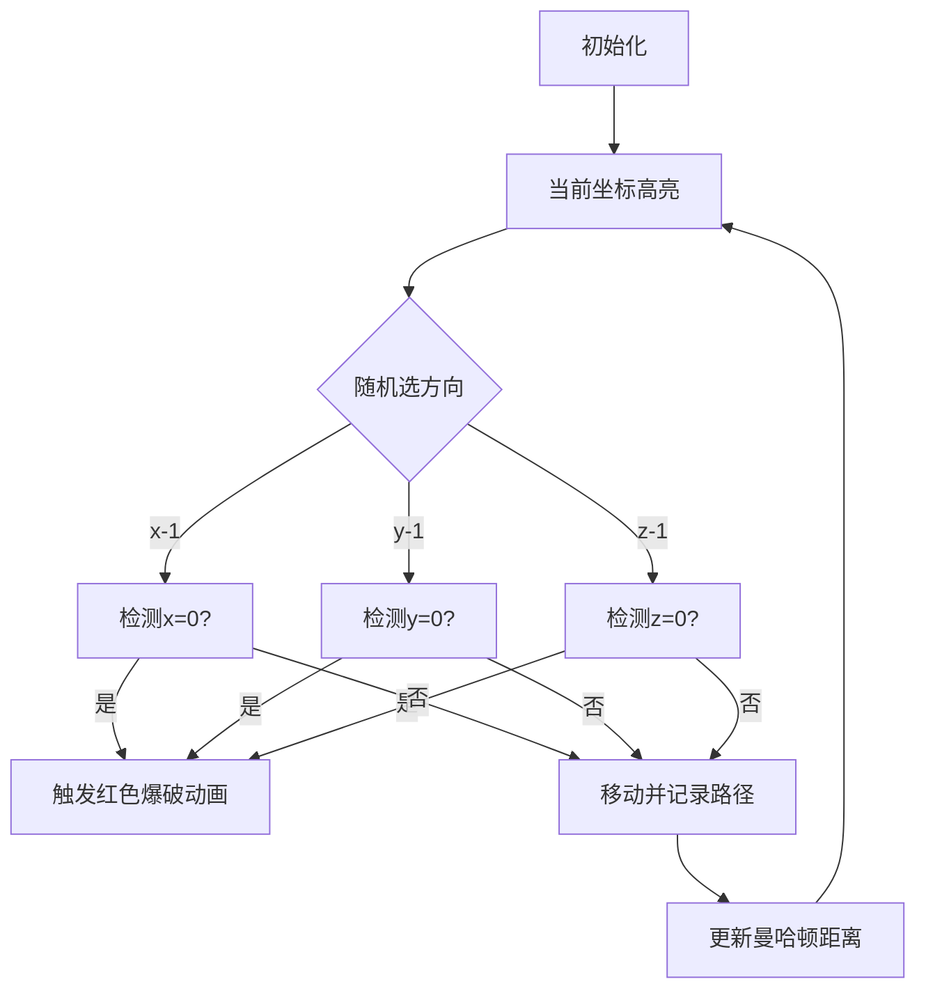

# 题目信息

# 黑暗（Darkness）

## 题目描述

铃在一个黑暗的三维空间内寻找澪。这个空间可以表示为 $\{(x,y,z) \mid x \in[0,A],y \in [0,B],z\in [0,C] \}$。铃初始站在坐标为 $(A,B,C)$ 处，澪站在 $(0,0,0)$ 处。假设铃在 $(x,y,z)$ 处，她每次移动会**均匀随机**地尝试移动到 $(x-1,y,z)$ 或 $(x,y-1,z)$ 或 $(x,y,z-1)$。

这个空间的外围是墙壁，不可穿过。由于空间内很暗，铃并不知道自己是否走到了墙边。也就是说，她在随机选择三种方向尝试移动时，有可能撞在墙上。

铃想要知道，自己在第一次撞墙时，「到澪的曼哈顿距离（在本题中的情况就是 $x,y,z$ 坐标之和）」的 $k$ 次方的期望值。

你只需要求出答案对 $998244353$ 取模的结果。

## 说明/提示

【样例 $1$ 解释】 

下表列出了走到各处并撞到墙的概率：

| $(0,0,0)$ | $(1,0,0)$ | $(0,1,0)$ | $(0,0,1)$ | $(1,1,0)$ | $(1,0,1)$ | $(0,1,1)$ |
| :-----------: | :-----------: | :-----------: | :-----------: | :-----------: | :-----------: | :-----------: |
| $2/9$ | $4/27$ | $4/27$ | $4/27$ | $1/9$ | $1/9$ | $1/9$ |

可以发现只有在这 $7$ 个位置有可能撞到墙。由此算出期望值为 $\dfrac{10}{9}$，在模 $998244353$ 意义下为 $443664158$。


【样例 $2,3$ 解释】   

这里要算的都是距离的平方的期望。实际答案分别为 $\dfrac{30083}{2187}$ 和 $\dfrac{22748643655}{387420489}$。

【数据范围】  

**本题采用捆绑测试。**

Subtask1（8 pts）：$1\le A,B,C,k\le 6$；   
Subtask2（19 pts）：$1\le A,B,C \le 100$；  
Subtask3（13 pts）：$k=1$；  
Subtask4（23 pts）：$1\le A,B,C,k \le 10^5$；  
Subtask5（37 pts）：无特殊限制。

对于 $100\%$ 的数据，$1\le A,B,C \le 5\times 10^6$，$1\le k \le 10^7$。

【提示】  

对于离散随机变量 $X$，其取值等于 $k$ 的概率设为 $P_k$，则 $X$ 的期望值定义为：

$$\sum_k kP_k$$

对于有理数 $a/b$（$a,b$ 均为正整数），若整数 $r$ 满足 $r\in[0,p-1]$ 且 $rb \equiv a \pmod p$，则 $r$ 就是 $a/b$ 对 $p$ 取模的结果。

## 样例 #1

### 输入

```
1 1 1 1```

### 输出

```
443664158```

## 样例 #2

### 输入

```
2 3 4 2```

### 输出

```
128260948```

## 样例 #3

### 输入

```
4 6 9 2```

### 输出

```
622775535```

## 样例 #4

### 输入

```
58 88 133 233```

### 输出

```
128518400```

## 样例 #5

### 输入

```
114514 1919810 4999231 8214898```

### 输出

```
823989766```

# AI分析结果


### 题目解读与核心算法识别

✨ **本题主要考察**：组合数学与递推优化

🗣️ **初步分析**：
> 解决“黑暗（Darkness）”这道题，关键在于将三维随机行走问题转化为组合数学问题，并通过递推优化计算。简单来说，这就像在三维网格中计算所有可能路径的加权和，但需要避免直接枚举的高复杂度。在本题中，我们通过以下步骤高效求解：
>   - **概率建模**：计算从起点到边界点不撞墙的概率（多项式系数公式）
>   - **期望分解**：将总期望拆分为三面墙的贡献（x=0/y=0/z=0）
>   - **递推优化**：通过组合恒等式将O(n²)求和转化为O(n)递推
>   - **预处理加速**：线性筛预处理幂次和组合数
>
> 在可视化设计中，我们将用像素风格动态展示路径探索过程：
>   - **8位像素网格**：用红/绿/蓝三色立方体表示三维坐标
>   - **关键高亮**：当前坐标（闪烁黄光）、撞墙点（红光爆破特效）
>   - **音效系统**：移动时“滴答”声，撞墙时“破碎”声，成功时8-bit胜利音效
>   - **AI演示模式**：自动播放路径探索，速度可调（滑块控制）

---

### 精选优质题解参考

**题解一（作者：NaCly_Fish）**
* **点评**：该题解从生成函数角度推导概率公式，思路清晰严谨。代码实现中：
  - 使用线性筛预处理$k$次幂，避免重复计算
  - 通过二项式递推$f(t)=2f(t-1)-\binom{t-1}{A}-\binom{t-1}{B}$将组合求和复杂度从$O(n^2)$降至$O(n)$
  - 边界处理完整（max/min函数限定范围）
  - 实践价值高，可直接用于$10^7$量级数据

**题解二（作者：TianyiLemon）**
* **点评**：题解详细拆解了期望计算过程：
  - 明确分离三面墙的贡献计算
  - 组合恒等式推导完整（$\sum \binom{n}{i} = 2\sum \binom{n-1}{i} - \text{边界项}$）
  - 代码模块化好（独立计算每面墙的函数）
  - 预处理阶乘逆元时采用倒序递推，节省计算量

**题解三（作者：Purslane）**
* **点评**：解法简洁高效：
  - 使用vector动态管理素数筛
  - 递推实现与题解一本质相同但代码更紧凑
  - 关键变量命名清晰（如_3表示模逆元）
  - 鲁棒性强：通过$+mod$%$mod$避免负值

---

### 核心难点辨析与解题策略

1. **难点1：概率模型的建立**
   * **分析**：需理解“不撞墙概率”=路径数/总路径数，其中路径数由多项式系数$\binom{A+B+C}{A,B,C}$给出。难点在于将撞墙事件与坐标关联。
   * 💡 **学习笔记**：多项式系数是三维网格路径计数的核心工具。

2. **难点2：三重求和的化简**
   * **分析**：原始公式含三重求和$O(n^3)$。通过：
     - 换元$t=x+y$降维
     - 利用组合递推式$f(t)=2f(t-1)-\text{边界项}$
     - 分离求和与幂次计算
   * 💡 **学习笔记**：递推关系是优化组合求和的关键突破口。

3. **难点3：大范围数据的处理**
   * **分析**：$A,B,C \leq 5\times 10^6$要求：
     - 线性筛预处理$i^k$（$O(n)$）
     - 动态计算组合数（避免预存全部）
     - 模运算优化（Barrett约减）
   * 💡 **学习笔记**：线性筛是处理大数幂次的标准方法。

### ✨ 解题技巧总结
- **路径分解法**：将三维行走分解为三个独立方向处理
- **递推化简**：利用组合数递推性质压缩计算量
- **预计算加速**：阶乘/逆元/素数幂次提前处理
- **边界鲁棒性**：显式处理$\binom{n}{m}=0$（$m<0$或$m>n$）

---

### C++核心代码实现赏析

**本题通用核心C++实现参考**
```cpp
#include <algorithm>
#define ll long long
const int N = 1.5e7+5, mod = 998244353;

int fac[N], inv[N], pw[N]; // 预计算表

int g(int A, int B, int C, int k) {
    if (A > B) std::swap(A, B);
    ll res = 0;
    int bc = 1, f = 1, ifa = inv[A], ifb = inv[B], ipw3 = 1;
    for (int t = 0; t <= A+B; ++t) {
        res += (ll)pw[A+B-t] * f % mod * ipw3 % mod * bc % mod;
        ipw3 = (ll)ipw3 * inv3 % mod; // inv3=332748118
        bc = (ll)bc * (t+C+1) % mod * inv[t+1] % mod; // 递推组合数
        if (t < A) f = (f << 1) % mod;
        else if (t < B) f = (f*2 - (ll)fac[t]*ifa%mod*inv[t-A]) % mod;
        else f = (f*2 - (ll)fac[t]*( (ll)ifa*inv[t-A] + (ll)ifb*inv[t-B] )%mod ) % mod;
    }
    return (res % mod + mod) * pow(3, mod-C-1) % mod;
}
```

**代码解读概要**：
1. **预计算**：`fac`（阶乘）、`inv`（逆元）、`pw`（$i^k$）
2. **动态组合计算**：`bc`变量递推$\binom{t+C}{t}$避免重复计算
3. **递推核心**：`f`变量实现$f(t)=\sum\binom{t}{i}$的高效更新
4. **墙贡献计算**：函数`g`计算单面墙，主函数中三面墙结果相加

---

### 算法可视化：像素动画演示

**主题**：8-bit风格三维网格探险  
**核心演示**：从$(A,B,C)$到$(0,0,0)$的随机路径与撞墙检测  

**动画设计**：


**交互控制**：
- **单步执行**：按帧观察移动逻辑
- **速度滑块**：调整移动速度（0.5x~5x）
- **AI演示**：自动播放最优路径（贪吃蛇AI模式）
- **音效系统**：
  - 移动：8-bit“滴”声
  - 撞墙：破碎音效
  - 成功：胜利旋律

**关键帧细节**：
1. **坐标显示**：像素方块标注(x,y,z)值
2. **路径追踪**：已走路径显示为灰色轨迹
3. **概率面板**：实时显示当前路径概率
4. **距离提示**：撞墙时弹出$dist^k$计算过程

---

### 拓展练习与相似问题思考

**通用技巧迁移**：
1. **二维简化**：z=0时退化为网格行走问题
2. **期望扩展**：距离的其它函数形式（如方差）
3. **约束变形**：加入障碍物或概率权重

**练习推荐（洛谷）**：
1. **P4213 网格行走**  
   → 二维基础版，巩固路径计数思想
2. **P7354 高维漫步**  
   → 拓展到n维，训练递推优化能力
3. **P3773 随机游走期望**  
   → 强化期望的线性分解技巧

---

### 学习心得与经验分享

> **参考经验**（题解调试笔记）：
> “初始化组合数时未考虑$t=0$的边界，导致小数据错误。建议用$(A,B,C)=(1,1,1)$验证边界”

> **Kay点评**：  
> 边界验证是算法核心！建议：
> 1. 用$\binom{0}{0}=1$初始化递推
> 2. 对$A=B=C=1$手动计算验证
> 3. 模块化测试每个函数

---

> 希望本指南助你攻克三维概率问题！下次见！🚀

---
处理用时：151.61秒