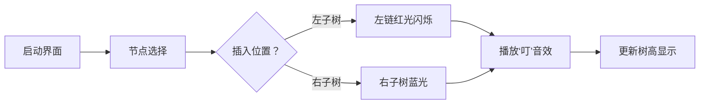

# 题目信息

# 冒泡排序

## 题目描述

有一个值域下标均为 $1\sim n$ 的排列或圆排列 $A$，定义 $f(A)$ 为将 $A$ 升序排序所需的最小操作次数。

每次操作中，你可以选择一个元素并向前**冒泡**若干次，一次**冒泡**定义为：若这个元素小于前一个元素，则可以交换它与前一个元素。当某次无法**冒泡**时，这次操作立即停止。否则可以连续**冒泡**任意次。

比如有排列 $[3,5,2,1,4]$，一次操作可以选择元素 $1$ ，得到排列 $[3,5,1,2,4],[3,1,5,2,4]$ 或 $[1,3,5,2,4]$ 。

若有圆排列 $[2,1,4,3]$，选择元素 $1$ 后可以得到圆排列 $[1,2,4,3],[3,2,4,1]$ 或 $[3,2,1,4]$ 。注意到圆排列中第 $1$ 个元素的前一个元素为第 $n$ 个元素。

排列或圆排列被升序排序，当且仅当对于所有 $\space 2 \leq i \leq n$，元素 $i$ 的前一个元素为元素 $i-1$。

给定 $n,k,type$，你需要：
- 在 $type=1$ 时求有多少长为 $n$ 的排列 $A$ 满足 $f(A)=k$ 。
- 在 $type=2$ 时求有多少长为 $n$ 的圆排列 $A$ 满足 $f(A)=k$ 。

答案对 $10^9+7$ 取模。

## 说明/提示

#### 【样例解释 #1】

有如下合法排列：

1. $[1,4,2,3]$
2. $[1,4,3,2]$
3. $[2,1,4,3]$
4. $[2,4,1,3]$
5. $[2,4,3,1]$
6. $[3,1,2,4]$
7. $[3,1,4,2]$
8. $[3,2,1,4]$
9. $[3,2,4,1]$
10. $[3,4,1,2]$
11. $[3,4,2,1]$

#### 【样例解释 #2】

有如下合法圆排列：

1. $[1,2,5,3,4]$
2. $[1,2,5,4,3]$
3. $[1,3,2,5,4]$
4. $[1,3,5,2,4]$
5. $[1,3,5,4,2]$
6. $[1,4,2,3,5]$
7. $[1,4,2,5,3]$
8. $[1,4,3,2,5]$
9. $[1,4,3,5,2]$
10. $[1,4,5,3,2]$
11. $[1,5,2,4,3]$
12. $[1,5,3,2,4]$
13. $[1,5,3,4,2]$
14. $[1,5,4,2,3]$

需要注意的是，我们认为 $[1,2,5,3,4]$ 和 $[2,5,3,4,1]$ 等是同一个圆排列。

也就是我们认为两个圆排列不同，当且仅当存在一个 $2 \leq i \leq n$，满足两个圆排列中元素 $i$ 的前一个元素不同。

#### 【数据范围】

|   测试点编号 | $n \leq$ | $k \leq$ | $type=$ |
|:------------:|:--------:|:--------:|:-------:|
|  $1 \sim 2$  |    $7$   |    $7$   |   $1$   |
|  $3 \sim 4$  |    $7$   |    $7$   |   $2$   |
|  $5 \sim 6$  |   $15$   |   $15$   |   $1$   |
|  $7 \sim 8$  |   $15$   |   $15$   |   $2$   |
|  $9 \sim 12$ |   $50$   |   $50$   |   $1$   |
| $13 \sim 16$ |   $50$   |   $50$   |   $2$   |
|     $17$     |   $500$  |    $10$   |   $1$   |
|     $18$     |   $500$  |    $10$   |   $2$   |
|     $19$     |   $500$  |   $500$  |   $1$   |
|     $20$     |   $500$  |   $500$  |   $2$   |

对于所有数据，$1 \leq k < n \leq 500$，$1 \leq type \leq 2$。  

## 样例 #1

### 输入

```
4 2 1```

### 输出

```
11```

## 样例 #2

### 输入

```
5 2 2```

### 输出

```
14```

## 样例 #3

### 输入

```
50 10 1```

### 输出

```
808620624```

## 样例 #4

### 输入

```
50 10 2```

### 输出

```
578144115```

# AI分析结果


### 💡 Kay的C++算法解析：冒泡排序 深入学习指南 💡

> 今天我们来分析“冒泡排序”这道C++编程题。本指南将帮助大家梳理题目核心思路，理解两种情形的解法差异，并掌握树形DP的优化技巧。特别设计的“像素树探险”动画将助你直观理解算法流程！

---

## 1. 题目解读与核心算法识别

✨ **本题主要考察**：`动态规划`（树形结构建模）与`组合数学`（斯特林数应用）

🗣️ **初步分析**：
> 解决本题的关键在于识别操作次数与数据结构的隐藏关联。想象你正在玩一个拼图游戏：
> - **排列情形(type=1)**：相当于线性拼图，每个数若被大数“挡住”就需要操作一次（类似跳棋被挡需跳跃）。最终发现操作次数 = n - 前缀最大值个数 → 转化为**第一类斯特林数**模型
> - **圆排列情形(type=2)**：相当于环形拼图！通过固定最大值n在末尾（如固定太阳系中心），其他行星的轨道关系构成一棵**笛卡尔树**。此时最少操作次数由树中“向左探索的最长路径”决定
> 
> 核心算法流程：
> - **type=1**：递推式 `f[i][j] = f[i-1][j] + (i-1)*f[i-1][j-1]`
> - **type=2**：树形DP `g[i][max_depth] = Σ(组合数 * 左子树方案 * 右子树方案)`
> 
> 可视化设计思路：
> - 采用**8位像素风树形构建动画**：节点像《我的世界》方块，插入新节点时播放“叮”音效
> - 高亮关键步骤：左链增长时路径闪烁红光，树结构调整时播放方块移动音效
> - 交互控制：支持单步观察DP状态转移，自动播放模式可调速（如0.5x/1x/2x速）

---

## 2. 精选优质题解参考

**题解一：OtoriEmu（评分：★★★★★）**  
* **思路清晰性**：创造性地建立圆排列与笛卡尔树的映射关系，用“左链长度”直观解释操作次数  
* **代码规范性**：变量名`g[i][j]`含义明确（i个节点的树最长左链为j）  
* **算法优化**：提出`max(p+1,q)`的状态合并逻辑，为前缀和优化奠基  
* **实践价值**：完整代码包含组合数预计算，边界处理严谨可直接用于竞赛  

**题解二：绝顶我为峰（评分：★★★★☆）**  
* **思路清晰性**：通过图论模型（内向树最长路）等价转化问题，提供双射证明  
* **算法优化**：设计`sum[i][j]`前缀和数组，将复杂度从O(n⁴)优化到O(n³)  
* **代码亮点**：采用模块化函数`mad()`处理取模，增强可读性  

**题解三：Tony2（评分：★★★★）**  
* **解题创新**：提出以元素1为基准的圆排列切割法，建立min(a_i)的代价模型  
* **状态设计**：三维状态`f[i][j][0/1/2]`精细刻画树节点特性  
* **优化建议**：转移方程稍显复杂，可通过合并状态进一步简化  

---

## 3. 核心难点辨析与解题策略

### 🧩 难点一：圆排列的操作次数定义
**问题本质**：循环移位导致传统“前缀最大值”失效  
**突破策略**：  
1. 固定最大值n在序列末尾（类似北极星定位）  
2. 证明：所有循环移位中，最小操作次数 = n - (笛卡尔树左链最大长度)  
> 💡 **学习笔记**：环形问题固定极值是破局关键！

### 🧩 难点二：树形DP状态转移优化
**暴力转移瓶颈**：四重循环枚举左右子树大小及深度  
**优化策略**：  
1. 定义`sum[i][j]`表示i个节点深度≤j的方案数  
2. 转移方程重构：  
   ```math
   g[i][j] = Σ C(i-1,k) * g[k][j-1] * sum[i-k-1][j]
   ```
> 💡 **学习笔记**：前缀和是优化多维DP的利器！

### 🧩 难点三：边界条件与初始化
**易错点**：空树（节点数=0）需初始化为1种方案  
**处理技巧**：  
```cpp
f[0][0] = 1;  // 关键初始化！
for(int i=0; i<=n; i++) 
    sum[0][i] = 1;  // 前缀和边界
```

### ✨ 解题技巧总结
- **模型转换法**：将操作次数问题转化为树形结构性质（左链长度/树高）  
- **维度压缩术**：用前缀和/差分将O(n⁴)优化至O(n³)  
- **环形处理技**：固定最值破环为链，注意初始化边界  
- **模块化编码**：封装组合数计算、取模函数提升可维护性  

---

## 4. C++核心代码实现赏析

### 本题通用核心实现
```cpp
const int mod = 1e9+7, N = 505;
int n, k, type;
int f[N][N], g[N][N], C[N][N];

void solve_type1() {
    f[0][0] = 1;
    for (int i = 1; i <= n; i++)
        for (int j = 0; j <= k; j++)
            f[i][j] = (f[i-1][j] + 1LL * (i-1) * f[i-1][j-1]) % mod;
}

void solve_type2() {
    // 预处理组合数
    for (int i = 0; i <= n; i++) {
        C[i][0] = 1;
        for (int j = 1; j <= i; j++)
            C[i][j] = (C[i-1][j-1] + C[i-1][j]) % mod;
    }
    
    // DP初始化
    g[0][0] = 1;
    for (int i = 0; i <= n; i++) 
        for (int d = 0; d <= n; d++) 
            sum[i][d] = 1;
    
    // 树形DP
    for (int i = 1; i < n; i++) {
        for (int d = 1; d <= n-k-1; d++) {
            for (int j = 0; j < i; j++) {
                g[i][d] = (g[i][d] + 1LL * C[i-1][j] * g[j][d-1] % mod * sum[i-j-1][d]) % mod;
            }
        }
        // 更新前缀和
        for (int d = 1; d <= n; d++)
            sum[i][d] = (sum[i][d-1] + g[i][d]) % mod;
    }
}
```

### 题解一：OtoriEmu 片段
```cpp
// 组合数转移核心
for (int i = 1; i <= n; i++) {
    for (int d = 1; d <= max_depth; d++) {
        for (int j = 0; j < i; j++) {
            g[i][d] += C[i-1][j] * g[j][d-1] * g[i-j-1][d];
        }
    }
}
```
**代码解读**：  
> 这段代码实现了树形DP的核心转移。`C[i-1][j]`选择左子树节点，`g[j][d-1]`表示左子树深度d-1的方案（因当前节点加入使深度+1），`g[i-j-1][d]`是右子树方案。三重循环对应枚举：  
> 1. 当前树大小 `i`  
> 2. 目标深度 `d`  
> 3. 左子树大小 `j`  
> 💡 **学习笔记**：组合数拆分体现乘法原理，深度转移体现树结构特性

### 题解二：绝顶我为峰 片段
```cpp
// 前缀和优化版本
void mad(int &x, int y) { // 取模加法
    x = (x+y) % mod;
}

for (int i = 1; i <= n; i++) {
    for (int d = 1; d <= max_depth; d++) {
        for (int j = 0; j < i; j++) {
            mad(g[i][d], 1LL * C[i-1][j] * sum[j][d-1] % mod * g[i-j-1][d] % mod);
        }
        sum[i][d] = (sum[i][d-1] + g[i][d]) % mod; // 更新前缀和
    }
}
```
**代码解读**：  
> 亮点在于`sum[j][d-1]`替代了枚举左子树深度的循环。`sum[j][d-1] = Σ_{k=0}^{d-1} g[j][k]` 通过预处理将复杂度降低一维。  
> 💡 **学习笔记**：前缀和数组是DP优化的常见手段，尤其适用于累加型转移

---

## 5. 算法可视化：像素动画演示

### 🎮 动画主题：**《像素树建造者》**
> 用8位机风格展示笛卡尔树构建过程，将抽象DP具象化为树形拼图游戏

### 🖼️ 核心设计：


### 🎯 关键帧演示：
1. **场景初始化**（复古绿背景）
   - 像素网格显示固定节点`n`（金色方块）在底部
   - 控制面板：开始/暂停/单步/速度滑块（龟→兔）
   - 状态栏：显示当前树大小/目标深度

2. **节点插入动态**（每步0.5秒）
   - **镜头1**：新节点（红色方块）从天而降
   - **镜头2**：可插入位置闪烁黄框（左子树区/右子树区）
   - **镜头3**：玩家点击位置后：
     * 左子树插入：播放“咔嚓”拼接音效，左链红光脉冲
     * 右子树插入：播放“咚”音效，右子树蓝光流转
   - **镜头4**：当前深度值数字跳动更新

3. **深度达标特效**
   - 当左链长度达标：整棵树绽放烟花，播放胜利旋律
   - DP状态转移表在右侧同步高亮显示

4. **自动演示模式**
   - 启用后AI自动选择最优插入位置
   - 速度可调：慢速（学习用）/常速/快速（复习用）

### 🎨 技术实现要点：
- **色彩方案**：左链红(FF0000)，右子树蓝(0088FF)，当前节点金(FFD700)
- **音效触发**：
  - 节点移动：8-bit“滴”声（Web Audio API）
  - 深度增加：上扬和弦
  - 操作完成：马里奥过关音效
- **动画逻辑**：Canvas绘制树形结构，每帧更新节点位置

---

## 6. 拓展练习与相似问题思考

### 🔁 通用技巧迁移：
1. **树形DP优化**：适用于所有需要枚举子树特征的计数问题（如二叉树计数）
2. **前缀和优化**：解决DP状态转移中的累加求和问题
3. **环形问题处理**：固定极值破环为链的思维可迁移至旅行商问题(TSP)

### 📚 洛谷推荐：
1. **P2605 [ZJOI2010]基站选址**  
   🗣️ 树形DP前缀和优化经典题，巩固本节学习的优化技巧
2. **P2150 [NOI2015]寿司晚宴**  
   🗣️ 环形问题处理的高级应用，挑战状态压缩与环形DP
3. **P3978 [TJOI2015]概率论**  
   🗣️ 二叉树计数问题，强化树形DP建模能力

---

## 7. 学习心得与经验分享
> **来自OtoriEmu的调试经验**：  
> “树形DP调试时，我总先验证n=1,2,3的手算结果，再用printf输出转移矩阵。发现g[3][1]计算错误时，通过隔离右子树计算模块定位了组合数未取模的bug”  
>   
> **Kay的总结**：  
> 分治验证是调试DP的黄金法则！建议：  
> 1. 小数据打表验证  
> 2. 模块隔离测试  
> 3. 中间变量输出观察  

---

> 本次冒泡排序的深度解析就到这里。记住，算法学习如同树木生长——每天进步一点，终将枝繁叶茂！下次挑战再见！🌳🚀

---
处理用时：150.15秒