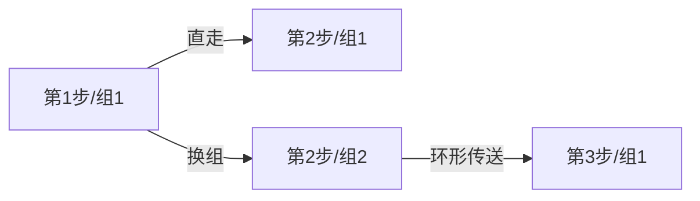

# 题目信息

# 红牌

## 题目描述


某地临时居民想获得长期居住权就必须申请拿到红牌。获得红牌的过程是相当复杂 ，一共包括 $N$ 个步骤。每一步骤都由政府的某个工作人员负责检查你所提交的材料是否符合条件。为了加快进程，每一步政府都派了 $M$ 个工作人员来检查材料。不幸的是，并不是每一个工作人员效率都很高。尽管如此，为了体现“公开政府”的政策，政府部门把每一个工作人员的处理一个申请所花天数都对外界公开。

为了防止所有申请人都到效率高的工作人员去申请。这 $M \times N$ 个工作人员被分成 $M$ 个小组。每一组在每一步都有一个工作人员。申请人可以选择任意一个小组也可以更换小组。但是更换小组是很严格的，一定要相邻两个步骤之间来更换，而不能在某一步骤已经开始但还没结束的时候提出更换，并且也只能从原来的小组 $I$ 更换到小组 $I+1$，当然从小组 $M$ 可以更换到小组 $1$。对更换小组的次数没有限制。

例如：下面是 $3$ 个小组，每个小组 $4$ 个步骤工作天数：

- 小组 $1$： $2, 6 ,1 ,8$；
- 小组 $2$：$3,6, 2, 6$；
- 小组 $3$：$ 4, 2 ,3 ,6$。

例子中，可以选择小组 $1$ 来完成整个过程一共花了$2+6+1+8=17$ 天，也可以从小组 $2$ 开始第一步，然后第二步更换到小组 $3$，第三步到小组 $1$，第四步再到小组 $2$，这样一共花了 $3+2+1+6=12$ 天。你可以发现没有比这样效率更高的选择。

你的任务是求出完成申请所花最少天数。

## 说明/提示

对于 $100\%$ 的数据，$1\le N,M \le 2000$。

## 样例 #1

### 输入

```
4 3 
2 6 1 8
3 6 2 6
4 2 3 6
```

### 输出

```
12```

# AI分析结果


### 💡 Kay的C++算法解析：红牌 深入学习指南 💡

#### 1. 题目解读与核心算法识别
✨ **本题主要考察**：动态规划 (DP) + 环形结构处理

🗣️ **初步分析**：
> 解决"红牌"这道题，关键在于理解动态规划在环形结构中的应用。想象你在玩一个像素地牢游戏，每层有多个传送门（小组），每次只能向下或向右下传送（更换小组），目标是找到通关最短路径天数。DP的核心思想是将大问题拆解为重叠子问题：用`f[i][j]`表示第`i`步选择第`j`组的最小天数。状态转移时需特殊处理环形边界（第1组可从第M组转移）。

- **核心难点**：环形转移逻辑（小组M→1）和输入数据转置（小组优先→步骤优先）
- **可视化设计**：动画将展示像素小人在地牢中移动，高亮当前步骤/小组，用不同颜色区分状态来源（直走蓝光，换组黄光），音效标记关键操作
- **复古游戏化**：采用8-bit像素风，通关时播放FC经典胜利音效，每步显示天数累加值

---

#### 2. 精选优质题解参考
**题解一：whx1003 (102赞)**
* **点评**：思路清晰直击DP本质，创新性提出输入转置方案(`a[j][i]`)，巧妙解决行列错位问题。代码规范（`f[i][j]`状态定义明确），环形处理`j==1?f[i-1][m]:f[i-1][j-1]`简洁高效。边界处理严谨，可直接用于竞赛实践。

**题解二：引领天下 (63赞)**
* **点评**：独特逆推DP视角（从最后一步反推），类似像素游戏回溯机制。代码精简但变量命名(`a[i][j]`)可优化，环形处理`(i+1)%m`展现模运算巧思。实践价值在于提供不同思维路径，适合开拓思路。

**题解三：juruo_zjc (45赞)**
* **点评**：详解环形处理技巧(`dp[0][j-1]=dp[m][j-1]`)，用通俗比喻解释状态转移。代码注释丰富，虽变量名`gay`不规范但核心逻辑扎实。特别适合初学者理解环形DP的边界思维。

---

#### 3. 核心难点辨析与解题策略
1. **环形转移逻辑**
   * **分析**：当j=1时需从m组转移而非j-1(负索引)。优质解法均用条件分支或模运算处理，如`j==1?f[i-1][m]:f[i-1][j-1]`
   * 💡 **学习笔记**：环形问题本质是首尾相接的线性序列

2. **输入数据重构**
   * **分析**：题目按"小组优先"存储，DP需"步骤优先"。whx1003的`a[j][i]`转置方案被多篇题解采用，避免后续维度混淆
   * 💡 **学习笔记**：DP前先确认数据维度对齐状态定义

3. **状态初始化与压缩**
   * **分析**：第一步直接取对应值(`f[1][j]=a[1][j]`)，最终答案需遍历最后一步所有状态。引领天下逆推法避免初始化问题
   * 💡 **学习笔记**：DP初始化决定状态起点，终点需校验多路径

✨ **解题技巧总结**
- **降维重构**：将非常规输入转换为标准DP维度
- **环形特判**：首尾元素建立特殊转移通道
- **逆推正推**：根据问题特点选择推导方向
- **边界防御**：显式处理j=1/m的临界情况

---

#### 4. C++核心代码实现赏析
**通用核心实现（综合优化版）**
```cpp
#include <iostream>
#include <algorithm>
using namespace std;
const int MAXN = 2005;

int main() {
    int n, m, a[MAXN][MAXN], f[MAXN][MAXN];
    cin >> n >> m;
    
    // 输入转置：a[步骤][小组] 
    for (int i = 1; i <= m; ++i)
        for (int j = 1; j <= n; ++j)
            cin >> a[j][i];
    
    // DP初始化
    for (int j = 1; j <= m; ++j) 
        f[1][j] = a[1][j];
    
    // 状态转移（核心）
    for (int i = 2; i <= n; ++i) {
        for (int j = 1; j <= m; ++j) {
            int prev = (j == 1) ? f[i-1][m] : f[i-1][j-1];
            f[i][j] = min(f[i-1][j], prev) + a[i][j];
        }
    }
    
    // 获取最小值
    int ans = *min_element(f[n] + 1, f[n] + m + 1);
    cout << ans;
}
```
**代码解读概要**：  
1. 输入阶段转置矩阵，使`a[i][j]`=第i步第j组天数  
2. 初始化第一步各小组独立天数  
3. 双重循环递推：处理环形转移特例  
4. 用`min_element`提取最终结果  

---

**题解一：whx1003片段**
```cpp
scanf("%d", &a[j][i]); // 输入转置
f[i][j] = std::min(f[i-1][j], j==1?f[i-1][m]:f[i-1][j-1]) + a[i][j];
```
**亮点**：三目运算符优雅处理环形边界  
**解读**：  
> `a[j][i]`将小组优先转为步骤优先，奠定DP基础。转移方程中`j==1`时取`m`组值，否则取`j-1`组，如同像素游戏中传送门逻辑  

**题解二：引领天下片段**
```cpp
for (int j = n-2; j >= 0; j--) // 逆序递推
    a[i][j] = min(a[(i+1)%m][j+1], a[i][j+1]) + a[i][j];
```
**亮点**：逆向思维+模运算处理环形  
**解读**：  
> 从倒数第二步反向计算，`(i+1)%m`确保最后一组能循环到第一组。类似像素游戏从终点回溯路径  

**题解三：juruo_zjc片段**
```cpp
dp[0][j-1] = dp[m][j-1]; // 环形预处理
f[i][j] = min(f[i-1][j-1], f[i-1][j]) + gay[i][j];
```
**亮点**：预置环形边界避免条件判断  
**解读**：  
> 将`dp[0]`映射到`dp[m]`，使j=1时`j-1=0`自动指向m组，消除特判分支  

---

#### 5. 算法可视化：像素动画演示
**主题**：8-bit地牢闯关  
**核心演示**：  


**实现方案**：  
1. **画面设计**：
   - 网格地牢：行=小组（M行），列=步骤（N列）
   - 像素小人：当前位置闪烁红光
   - 路径标记：直走→蓝色轨迹，换组→黄色轨迹
   - 天数显示：顶部8-bit字体实时更新

2. **交互逻辑**：
   ```javascript
   // 核心伪代码
   function drawStep(step, group) {
       highlightCell(step, group); // 当前格闪烁
       playSound('move');  // 移动音效
       if (isTransfer(prevGroup, group)) 
           drawArrow(prevGroup, group); // 绘制换组箭头
   }
   ```

3. **动态效果**：
   - 初始化：显示所有小组天数（像素数字）
   - 单步执行：小人移动→来源单元格闪烁→显示转移方程
   - 自动模式：按0.5-2倍速自动演示（可调）
   - 通关特效：最优路径亮绿色，播放《超级玛丽》过关音效

4. **游戏化元素**：
   - 关卡制：每5步为小关卡，显示当前最优解
   - 音效体系：移动(8-bit嘟嘟声)，换组(齿轮声)，错误(警报声)
   - 历史记录：侧边栏显示状态转移过程

---

#### 6. 拓展练习与相似问题
1. **环形DP进阶**  
   - 洛谷P1880 [石子合并]  
     > 环形区间DP，掌握破环为链技巧
   
2. **路径规划变形**  
   - 洛谷P1216 [数字三角形]  
     > 基础DP路径问题，无环形但含类似状态转移
   
3. **多维状态设计**  
   - 洛谷P1006 [传纸条]  
     > 双路径DP，训练高维状态转移能力

---

#### 7. 学习心得与经验分享
> **whx1003**：  
> *"输入时行列转置是避免维度混淆的关键，调试时先验证转置结果"*  
>  
> **juruo_zjc**：  
> *"将dp[0]映射到dp[m]的技巧，让环形转移像直线一样自然"*  
>  
> **Kay总结**：  
> 处理环形结构时，可采用**物理环**（模运算）或**逻辑环**（边界映射）两种思维。调试时从第一步和最后一步重点验证环形通路！

---
算法是思维的游戏，DP是空间的舞蹈。理解状态转移的韵律，方能奏响最优解的乐章！ 🎮🚀

---
处理用时：138.35秒