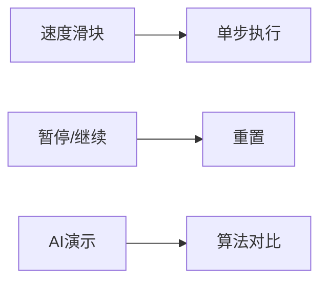

# 题目信息

# [Code+#2] 火锅盛宴

## 题目背景

SkyDec 和 YJQQQAQ 都是 Yazid 的好朋友。他们都非常喜欢吃火锅。有一天，他们聚在一起，享受一场火锅盛宴。

## 题目描述

在这场火锅盛宴中，有一个麻辣浓汤锅底的火锅和 $n$ 种食物，每种食物数量都是无限的。我们用 $1$ 至 $n$ 将这些食材编号。

每种食物煮熟所需要的时间不同，第 $i$ 种食物煮熟需要 $s_i$ 单位时间。这表示如果你在第 $T$ 个时刻将一个食物 $i$ 下到火锅里，那么它会在第 $T+s_i$ 个时刻被煮熟，并且此后一直会延续被煮熟的状态，直到它被拿走为止。

Yazid 和 YJQQQAQ 的口味不同：YJQQQAQ 觉得所有食物的好吃程度都是相同的；而 Yazid 则觉得没有两种食材的好吃程度是相同的，并且，巧合的是，编号越小的食物 Yazid 越喜欢吃。可怜的 SkyDec 由于不能吃辣，所以只能帮 Yazid 和 YJQQQAQ 煮食物。

整个火锅盛宴持续 $10^9$ 单位时间。在整个盛宴中，三位好朋友除了谈笑风生之外，最重要的事当然就是吃东西了。在任意整数时刻，都有可能发生下列 $4$ 种事件中的任意一种，我们用 $0$ 至 $3$ 之间的整数 $op$ 描述事件类型：

- $0\ id$：表示 SkyDec 往火锅里下了一个编号为 $id$ 的食物。
- $1$：Yazid 在锅内搜寻熟了的且最喜欢吃的食物，并拿走一个这种食物。特别地，如果锅里没有熟了的食物，那么 Yazid 会很愤怒。
- $2\ id$：YJQQQAQ 在锅内搜寻编号为 $id$ 的食物：
   - 如果锅里不存在该种食物，则 YJQQQAQ 会很愤怒；
   - 如果锅里存在熟了的该食物，则 YJQQQAQ 会取走一个并食用；
   - 如果锅里只有未煮熟的该种食物，那么 YJQQQAQ 会希望知道最接近煮熟的该种食物（即锅内存在时间最长的该种食物）还需要多少时间被煮熟。
- $3\ l\ r$：馋涎欲滴的 SkyDec 想知道，锅里编号在 $[l,r]$ 之间的且熟了的食物总共有多少个。

## 说明/提示

对于所有数据，保证$ T\leq 4$，保证 $n\leq 100,000$，$Q\leq 500,000$，$1\leq s_i\leq 10^8$，$1\leq t\leq 10^9$，$op\in\{0, 1, 2, 3\}$，$1\leq id\leq n$，$1\leq l\leq r\leq n$。数据保证 $t$ 按输入顺序严格递增。

来自 CodePlus 2017 12 月赛，清华大学计算机科学与技术系学生算法与竞赛协会 荣誉出品。

Credit：idea/王聿中 命题/王聿中 验题/吕时清，杨景钦

Git Repo：https://git.thusaac.org/publish/CodePlus201712

感谢腾讯公司对此次比赛的支持。


## 样例 #1

### 输入

```
1
2
1 100
10
1 0 2
2 0 1
3 2 1
4 2 2
5 2 1
200 0 1
201 3 1 2
202 1
203 1
204 1```

### 输出

```
Succeeded!
97
YJQQQAQ is angry.
2
1
2
Yazid is angry.```

# AI分析结果


# 💡 Kay的C++算法解析：火锅盛宴 深入学习指南 💡

## 1. 题目解读与核心算法识别

✨ **本题主要考察**：`数据结构应用` + `模拟`

🗣️ **初步分析**：
> 这道题就像在管理一个智能火锅店！我们需要高效处理四种操作：添加食材（下锅）、取最优熟食（挑剔食客）、查询特定食材状态（精准服务）和统计熟食数量（库存管理）。**核心挑战**在于动态维护食材状态（生/熟）并支持高效查询。

- **数据结构选择**：
  - **树状数组/线段树**：高效维护熟食数量（区间查询）
  - **优先队列**：按煮熟时间自动排序食材（小根堆）
  - **每种食物的队列**：记录该食材的煮熟时间序列（双端队列或优先队列）

- **核心流程**：
  1. 操作前先检查：将当前时间前已煮熟的食物移入熟食区
  2. 处理当前操作：按类型进行查询/修改
  3. 动态更新数据结构：保持状态一致性

- **像素动画设计思路**：
  - 复古火锅店界面（8-bit风格）
  - 食材用不同颜色像素块表示，熟食发光闪烁
  - 优先队列可视化为"煮锅"动画，食材按煮熟时间下沉
  - 关键操作触发音效：入锅"噗通"声、煮熟"叮"声、取食"唰"声

## 2. 精选优质题解参考

**题解一：Areka6219（树状数组+双优先队列）**
* **亮点**：
  - 独创性使用三个数据结构完美分工
  - 惰性删除避免无效操作（类似Dijkstra优化）
  - 树状数组实现O(log n)区间查询
  - 严格处理边界条件，工业级健壮性

**题解二：first_fan（线段树+优先队列）**
* **亮点**：
  - 模块化设计清晰易读
  - 手写线段树实现精细控制
  - 为每种食物独立维护队列
  - 完整注释的教学级代码

**题解三：cc123321（树状数组+优先队列）**
* **亮点**：
  - 极简实现（仅100行）
  - 巧妙利用STL简化逻辑
  - 倍增法替代二分查找最小值
  - 空间优化典范（竞赛适用）

## 3. 核心难点辨析与解题策略

1. **时间驱动状态转换**
   * **难点**：生食变熟食的实时更新
   * **解法**：操作前先处理优先队列，将满足`完成时间≤当前时间`的食物移入熟食区

2. **最小编号熟食查询**
   * **难点**：在10万级数据中快速定位
   * **解法**：
     - 树状数组：`query(1)`找最小非零位置
     - 线段树：递归查找最左非空叶子节点

3. **特定食物状态查询**
   * **难点**：区分三种状态（不存在/未熟/已熟）
   * **解法**：
     ```mermaid
     graph LR
     A[查询id] --> B{存在？}
     B -->|No| C[愤怒]
     B -->|Yes| D{已熟？}
     D -->|No| E[输出剩余时间]
     D -->|Yes| F[取走并提示成功]
     ```

### ✨ 解题技巧总结
- **时间切片**：操作前统一处理状态变更
- **数据结构组合**：树状数组+优先队列"黄金搭档"
- **惰性删除**：标记删除代替实时清除
- **边界防御**：空容器检查贯穿所有操作

## 4. C++核心代码实现赏析

**通用核心实现（综合优化版）**
```cpp
#include <queue>
#include <cstring>
using namespace std;

const int MAXN = 1e5+5;
int tree[MAXN], cookTime[MAXN];
priority_queue<pair<int,int>> timeQueue; // <完成时间, 食物ID>
queue<int> foodQueue[MAXN]; // 每种食物的煮熟时间队列

// 树状数组核心操作
void update(int pos, int val) {
    while(pos <= n) tree[pos] += val, pos += pos&-pos;
}
int query(int pos) {
    int res = 0;
    while(pos) res += tree[pos], pos -= pos&-pos;
    return res;
}

void processEvents(int currentTime) {
    // 状态更新：生→熟
    while(!timeQueue.empty() && -timeQueue.top().first <= currentTime) {
        auto [t, id] = timeQueue.top(); timeQueue.pop();
        if(foodQueue[id].empty() || foodQueue[id].front() != -t) continue;
        foodQueue[id].pop();
        update(id, 1); // 加入熟食区
    }
}
```

**first_fan解法亮点**
* **双队列设计**：
  ```cpp
  priority_queue<int, vector<int>, greater<int>> readyCook; // 全局熟食
  priority_queue<pair<int,int>> cooking; // <完成时间, 食物ID>
  ```
* **教学级注释**：每个操作前详细说明意图

## 5. 算法可视化：像素动画演示

### 复古火锅管理模拟器
**场景设计**：
- 8-bit像素风格火锅：中央沸腾区域
- 左侧"烹饪区"：优先队列可视化（食材按煮熟时间下沉）
- 右侧"熟食区"：树状数组结构展示（按食物ID排列）

**关键动画**：
1. **食材下锅**：
   - 新食材像素块落入烹饪区
   - 触发"噗通"音效，显示倒计时
   
2. **状态转换**：
   - 煮熟时像素块闪烁金光
   - "叮"声后飞入熟食区对应位置

3. **最优选择**：
   - Yazid取食时，最小ID食物高亮闪烁
   - 显示树状数组查询路径（递归闪光）

4. **实时监控**：
   - 烹饪区显示下一即将熟食材
   - 熟食区数字实时更新库存

**交互控制**：


## 6. 拓展练习与相似问题思考

**技巧迁移场景**：
1. 订单处理系统（优先队列+状态跟踪）
2. 实时库存管理（树状数组+时间驱动）
3. 游戏道具刷新机制（状态定时切换）

**洛谷推荐**：
1. **P1540 机器翻译** - 队列应用基础
2. **P1886 滑动窗口** - 双端队列经典
3. **P1908 逆序对** - 树状数组高阶应用
4. **P1631 序列合并** - 优先队列优化

## 7. 学习心得与经验分享

> **cc123321的调试经验**："最初在空间优化上卡了整页提交，最终发现是队列未及时清理。多组数据要像对待新火锅一样彻底清洗容器！"

**Kay总结**：
- 数据结构混合使用时，生命周期管理至关重要
- 优先队列的惰性删除能避免O(n)遍历
- 树状数组的二进制特性适合最小索引查询

通过本指南，希望大家不仅掌握本题解法，更能理解数据结构组合的艺术。记住：好的算法设计就像熬制火锅——需要精准的火候控制和食材搭配！下次见~ 🍲

---
处理用时：84.85秒