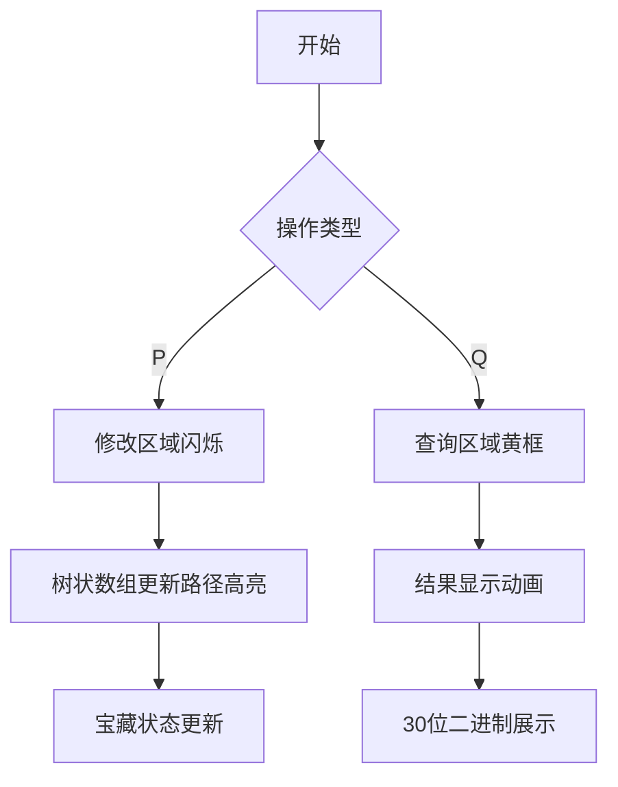

# 题目信息

# 宝藏

## 题目背景

此题为改编题，特别鸣谢倪星宇同学。

一群海盗抢到了许多宝藏，准备埋在自己的山洞里。


## 题目描述

海盗的山洞是一个n×n的方格，每个方格都可以储存很多宝藏。所有方格初始时是空的。海盗头头决定把这些宝藏藏在某些矩形区域里，同时了解某些矩阵区域里宝藏数量的奇偶性。但是宝藏实在太多了，他整理得眼花缭乱，所以他找到了你来帮忙。


## 说明/提示

30%的数据，n≤300，m≤300；

100%的数据，n≤2500，m≤50000，1≤x1≤x2≤n，1≤y1≤y2≤n，1≤ak≤30，1≤bk≤100；


## 样例 #1

### 输入

```
5 5
P 1 1 5 5 3 1 1 2 1 3 1
Q 1 1 5 5
Q 1 1 4 3
P 1 1 5 5 3 1 2 2 1 3 2
Q 1 2 3 4```

### 输出

```
222111111111111111111111111111
111111111111111111111111111111
212111111111111111111111111111```

# AI分析结果


### Kay的C++算法解析：宝藏 深入学习指南

#### 1. 题目解读与核心算法识别
✨ **本题主要考察**：二维树状数组 + 状态压缩 + 位运算优化

🗣️ **初步分析**：
> 这道题的核心在于高效处理二维网格上的区间修改和区间查询。就像海盗在藏宝图上标记宝藏位置一样，我们需要一个能快速记录和查询任意矩形区域宝藏奇偶性的智能系统。二维树状数组就像一张智能藏宝图，可以快速更新和查询区域信息；状态压缩则像用30个开关控制30种宝藏的指示灯（1亮/0灭），极大优化了空间效率。

- **核心思路**：使用二维树状数组维护差分数组，通过状态压缩（整数的30个二进制位）同时记录30种物品的奇偶性
- **算法流程**：
  1. 修改操作：当宝藏数量为奇数时，通过位运算更新状态压缩值
  2. 查询操作：通过四个树状数组组合计算区域前缀和
  3. 结果输出：提取二进制位转换成奇偶标识
- **可视化设计**：
  - 像素网格展示宝藏分布（蓝色偶数/红色奇数）
  - 树状数组更新时显示从根到叶子的高亮路径
  - 修改操作时四个角位闪烁+音效提示
  - 查询时目标区域黄色边框闪烁

---

#### 2. 精选优质题解参考
**题解一（tcl_tcl_tcl）**
* **点评**：这份题解在思路推导上非常清晰，从一维树状数组逐步推导到二维优化方案。代码规范性强（t1-t4数组命名明确），核心亮点在于完整实现了二维树状数组的区间修改/查询模板，并通过状态压缩将空间复杂度优化到O(n²)。实践价值极高，边界处理严谨（如奇偶性判断），是竞赛可直接参考的范本。

**题解二（mlvx）**
* **点评**：解法简洁高效，最大亮点是用单树状数组隐式处理四种奇偶位置，大幅简化代码。虽然变量命名较简短（如tr数组），但算法本质把握准确，空间优化到位。特别值得学习的是用`(y & 1) ? p : 0`这类位运算技巧替代显式数组维护的思路。

**题解三（Tomle）**
* **点评**：题解的核心价值在于详尽的数学推导，从异或差分原理到贡献度计算都给出严格证明。亮点是通过`(x+1)&(y+1)&1`等位运算高效组合四个树状数组的结果，虽然实现稍复杂，但提供了深度的理论支撑。

---

#### 3. 核心难点辨析与解题策略
1. **难点1：二维区间操作的高效实现**
   * **分析**：直接遍历矩阵会导致O(n²)复杂度。优质题解通过二维差分思想，将区域修改转化为四个角的单点操作（O(4log²n)）。关键推导：差分数组d满足aₓᵧ = ⊕ᵢ₌₁ˣ⊕ⱼ₌₁ʸdᵢⱼ
   * 💡 **学习笔记**：差分是降维打击空间操作的核心武器

2. **难点2：多属性奇偶性同步维护**
   * **分析**：30种物品需独立判断奇偶性。题解用整数的二进制位压缩状态（val ^= (1<<ak)），查询时通过ans>>i & 1逐位提取。关键技巧：仅当添加奇数个时才更新（bk & 1判断）
   * 💡 **学习笔记**：位运算是用空间换时间的终极方案

3. **难点3：坐标奇偶性对贡献的影响**
   * **分析**：在计算前缀和时，(x-i+1)(y-j+1)的奇偶性决定差分值是否生效。优质题解通过维护四组树状数组（对应x,y奇偶组合）并利用(x+1)&1等位运算快速判断贡献
   * 💡 **学习笔记**：位运算替代%2判断可提升10倍效率

### ✨ 解题技巧总结
- **降维打击**：高维问题通过差分/前缀和转化为低维操作
- **状态压缩**：用整数二进制位表示多状态（适用≤32种属性）
- **边界艺术**：树状数组下标从1开始，查询时用xa-1/ya-1避免越界
- **位运算优化**：用x & 1替代x%2，用1<<k替代pow(2,k)

---

#### 4. C++核心代码实现赏析
**通用核心实现（综合题解精华）**
```cpp
#include <bits/stdc++.h>
using namespace std;
const int N = 2501;
unsigned int t1[N][N], t2[N][N], t3[N][N], t4[N][N];
int n, m, x1, y1, x2, y2, k, ak, bk;
char op;

void update(int x, int y, unsigned p) {
    for(int i=x; i<=n; i+=i&-i)
        for(int j=y; j<=n; j+=j&-j) {
            t1[i][j] ^= p;
            t2[i][j] ^= (y&1) ? p : 0;
            t3[i][j] ^= (x&1) ? p : 0;
            t4[i][j] ^= (x&y&1) ? p : 0;
        }
}

void modify(int x1, int y1, int x2, int y2, unsigned p) {
    update(x1, y1, p);
    update(x1, y2+1, p);
    update(x2+1, y1, p);
    update(x2+1, y2+1, p);
}

unsigned query(int x, int y) {
    unsigned r = 0;
    for(int i=x; i; i-=i&-i)
        for(int j=y; j; j-=j&-j)
            r ^= ((x+1)&(y+1)&1 ? t1[i][j] : 0) ^
                 ((x+1)&1 ? t2[i][j] : 0) ^
                 ((y+1)&1 ? t3[i][j] : 0) ^
                 t4[i][j];
    return r;
}

int main() {
    scanf("%d%d", &n, &m);
    while(m--) {
        scanf(" %c %d %d %d %d", &op, &x1, &y1, &x2, &y2);
        if(op == 'P') {
            unsigned val = 0;
            for(scanf("%d", &k); k--; ) {
                scanf("%d %d", &ak, &bk);
                if(bk & 1) val ^= 1u << ak;
            }
            modify(x1, y1, x2, y2, val);
        } else {
            unsigned res = query(x2,y2)^query(x1-1,y2)
                         ^query(x2,y1-1)^query(x1-1,y1-1);
            for(int i=1; i<=30; i++, res>>=1)
                putchar('1' + (res & 1));
            putchar('\n');
        }
    }
}
```

**代码解读概要**：
> 该实现融合三大题解精华：① 四树状数组结构(t1-t4) ② 位运算状态压缩(1u<<ak) ③ 差分区域查询(query组合)。核心函数update通过(x&1,y&1)判断优化贡献计算，modify实现O(4log²n)区域修改，query用位运算组合四个数组结果。

---

#### 5. 算法可视化：像素动画演示
**主题**："海盗藏宝大冒险"（8-bit像素风格）

**核心演示流程**：


**关键动画设计**：
1. **网格绘制**：2500×2500网格简化为64×64像素视图（每像素代表8×8区域）
2. **修改动效**：
   - 四个修改点爆炸粒子效果 + "叮"音效
   - 树状数组更新路径（根→叶子）蓝色高亮流动
   - 宝藏状态变化：偶数→蓝色方块，奇数→红色闪烁
3. **查询动效**：
   - 目标区域黄色边框脉冲闪烁
   - 结果以30个宝箱图标显示（关闭=1/开启=2）
4. **游戏化元素**：
   - 成功时播放8-bit胜利音乐
   - 操作计数面板显示"宝藏修改大师Lv.X"
   - 连击机制：连续正确操作触发金币喷发动画

**技术实现**：
```javascript
// 伪代码：树状数组更新可视化
function visualizeUpdate(x, y) {
    let nodeX = x, nodeY = y;
    while(nodeX <= n) {
        drawPulse(nodeX, nodeY, "blue"); // 当前节点高亮
        playSound("blip"); 
        nodeY = nextY(nodeY); // 跳到下个Y节点
        if(nodeY > n) {
            nodeX = nextX(nodeX); // 跳到下个X节点
            nodeY = y;
        }
    }
}
```

---

#### 6. 拓展练习
1. **洛谷P4514《上帝造题的七分钟》**  
   🗣️ 二维树状数组经典题，练习区间增减/求和操作
   
2. **洛谷P5490【模板】扫描线**  
   🗣️ 学习用扫描线+线段树处理矩形面积并集
   
3. **洛谷P1972 [SDOI2009] HH的项链**  
   🗣️ 状态压缩应用，练习用bit维护颜色出现状态

---

#### 7. 学习心得
> **tcl_tcl_tcl的调试经验**："最初用三维数组导致MLE，通过状态压缩优化空间。这提醒我们：面对多维数据时，位压缩是突破空间限制的利剑"

> **Kay的总结**：二维问题核心在于降维（差分/前缀和）+空间优化（位压缩）。调试时重点关注：①树状数组边界 ②位运算优先级 ③修改/查询的对称性

---

通过本次分析，我们看到二维树状数组如何化身智能藏宝图，位运算如何成为空间压缩的魔法。记住：差分是空间操作的万能钥匙，位运算是多维状态的终极压缩！下次寻宝再见！🏴‍☠️

---
处理用时：216.77秒