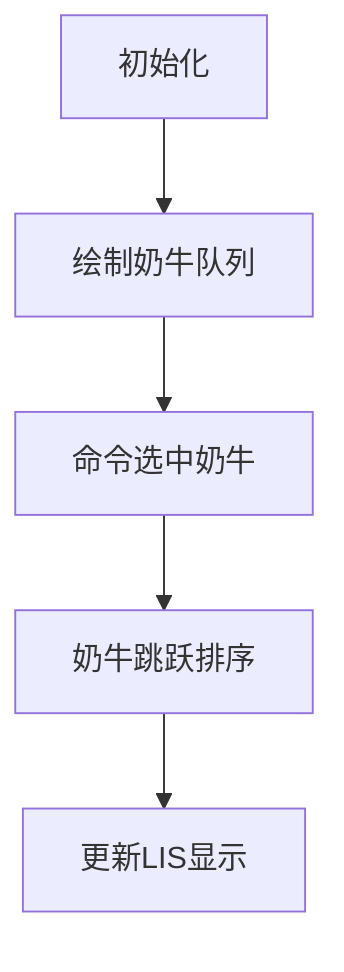

# 题目信息

# [USACO18DEC] Sort It Out P

## 题目描述

FJ 有 $N$（$1 \leq N \leq 10^5$）头奶牛（分别用 $1 \ldots N$ 编号）排成一行。FJ 喜欢他的奶牛以升序排列，不幸的是现在她们的顺序被打乱了。在过去，FJ 曾经使用一些诸如“冒泡排序”的开创性算法来使他的奶牛排好序，但今天他想偷个懒。取而代之，他会每次对着一头奶牛叫道“按顺序排好”。当一头奶牛被叫到的时候，她会确保自己在队伍中的顺序是正确的（从她的角度看来）。当有一头紧接在她右边的奶牛的编号比她小，她们就交换位置。然后，当有一头紧接在她左边的奶牛的编号比她大，她们就交换位置。这样这头奶牛就完成了“按顺序排好”，在这头奶牛看来左边的奶牛编号比她小，右边的奶牛编号比她大。

FJ 想要选出这些奶牛的一个子集，然后遍历这个子集，依次对着每一头奶牛发号施令（按编号递增的顺序），重复这样直到所有 $N$ 头奶牛排好顺序。例如，如果他选出了编号为 $\{2,4,5\}$ 的奶牛的子集，那么他会喊叫奶牛 $2$，然后是奶牛 $4$，然后是奶牛 $5$。如果 $N$ 头奶牛此时仍未排好顺序，他会再次对着这几头奶牛喊叫，如果有必要的话继续重复。

由于 FJ 不确定哪些奶牛比较专心，他想要使得这个子集最小。此外，他认为 $K$ 是个幸运数字。请帮他求出满足重复喊叫可以使得所有奶牛排好顺序的最小子集之中字典序第 $K$ 小的子集。

我们称 $\{1, \ldots ,N\}$ 的一个子集 $S$ 在字典序下小于子集 $T$，当 $S$ 的所有元素组成的序列（按升序排列）在字典序下小于 $T$ 的所有元素组成的序列（按升序排列）。例如，$\{1,3,6\}$ 在字典序下小于 $\{1,4,5\}$。

## 说明/提示

开始的时候序列为 $ \mathtt{\:4\:\; 2\:\; 1\:\; 3\:} $ 。在FJ喊叫编号为 $ 1 $ 的奶牛之后，序列变为 $ \mathtt{\:1\:\; 4\:\; 2\:\; 3\:} $ 。在FJ喊叫编号为 $ 4 $ 的奶牛之后，序列变为 $ \mathtt{\:1\:\; 2\:\; 3\:\; 4\:} $ 。在这个时候，序列已经完成了排序。

## 子任务

对于占总分 $ 3/16 $ 的测试数据， $ N \leq 6 $ ，并且 $ K=1 $ 。

对于另外的占总分 $ 5/16 $ 的测试数据， $ K=1 $ 。

对于另外的占总分 $ 8/16 $ 的测试数据，没有其他限制。

## 样例 #1

### 输入

```
4 1
4 2 1 3
```

### 输出

```
2
1
4
```

# AI分析结果


# 💡 Kay的C++算法解析：[USACO18DEC] Sort It Out P 深入学习指南 💡

> 我是Kay，一位专注于C++算法教学的引导者。今天我们将一起探索这道关于奶牛排序的趣味题目，通过像素动画和清晰解析，帮助你掌握LIS（最长上升子序列）的核心思想！

## 1. 题目解读与核心算法识别

✨ **本题主要考察**：`LIS应用与字典序处理`

🗣️ **初步分析**：
> 想象一群编号乱序的奶牛排成一队，FJ每次命令特定奶牛“自我排序”。经过分析，**未被选中的奶牛必须保持原始升序排列**——这等价于寻找序列的**最长上升子序列（LIS）**。最小选中集合大小就是总奶牛数减去LIS长度，而字典序第K小的选中集合对应LIS补集的第K大字典序排列。

- **核心难点**：如何在O(n log n)时间内计算LIS数量？如何高效定位字典序第K大的LIS？
- **算法流程**：1) 倒序DP求每个位置开头的LIS长度和数量；2) 树状数组加速状态转移；3) 按LIS长度分层，从大到小试填。
- **可视化设计**：我们将用**像素网格+音效**模拟奶牛移动：红色方块代表选中奶牛，蓝色为LIS成员。每次命令时，选中奶牛“跳跃”到正确位置并发出8-bit音效，LIS序列逐步高亮显示，控制面板支持单步调试和自动演示。


---

## 2. 精选优质题解参考

**题解一（作者：Mirach）**
* **亮点**：极简树状数组实现，巧妙用链式前向星替代排序，空间效率O(n)。代码中`g[i]`存储以i开头LIS信息，`ae()`构建长度分层链表，试填时直接遍历链表跳过无效位置。
* **学习价值**：变量命名精准（如`chs`标记选中），边界处理严谨（`while(R<v)清空左侧`），避免vector排序开销。

**题解二（作者：xianglingao）**
* **亮点**：双树状数组结构清晰，`b[a[i]]=i`转换直观体现下标-值关系。`vector<int> V[]`分层存储，降序排列逻辑独立于主函数。`use[]`标记和`res`输出分离，便于理解。
* **学习价值**：模块化思想优秀，`min(inf, cnt)`处理大数溢出，注释详细解释权值转换意义。

---

## 3. 核心难点辨析与解题策略

1.  **难点：LIS数量统计与K值关系**
    * **分析**：K可达1e18，直接存储所有LIS不现实。优质题解使用**后缀和树状数组**：倒序扫描时，用树状数组维护“比当前值大的LIS信息”，通过`min(inf, cnt)`控制数值上溢。
    * 💡 **学习笔记**：树状数组不仅能求最值，还能维护带限制的状态和！

2.  **难点：字典序第K大的LIS构造**
    * **分析**：将LIS按长度分层后，每层需**降序排列候选值**（确保优先选大数）。试填时维护**最后选中位置cur**，跳过左侧元素（保持相对位置），根据`f[i]`与K大小决定选中或跳过。
    * 💡 **学习笔记**：试填法本质是字典序问题的通用解法——按位确定+剪枝。

3.  **难点：下标与权值的映射转换**
    * **分析**：原序列中`a[i]`表示位置i的奶牛编号。通过`b[a[i]]=i`建立双向映射，将“值的大小比较”转化为“下标位置约束”，简化LIS判断。
    * 💡 **学习笔记**：排列问题中，下标与值的互换是降维利器！

### ✨ 解题技巧总结
- **技巧1：逆向DP** - 从后往前计算LIS，天然满足时间后效性。
- **技巧2：分层处理** - 按LIS长度分组，避免无效状态转移。
- **技巧3：链式存储** - 用链表或vector预存分层数据，试填时直接访问。

---

## 4. C++核心代码实现赏析

**本题通用核心C++实现参考**
* **说明**：综合Mirach与xianglingao题解优点，重构可读性更强的代码。
* **完整核心代码**：
```cpp
#include <bits/stdc++.h>
using namespace std;
typedef long long ll;
const int N = 1e5 + 10;
const ll INF = 1e18;

struct Node { int len; ll cnt; };
vector<int> lis_layer[N];  // 按LIS长度分层
int n, a[N], pos[N];       // pos[i]: 编号i的位置
ll K;
Node f[N];                // f[i]: 以位置i开头的LIS信息
bool selected[N];          // 标记在LIS中的元素

struct BIT {
    Node tree[N];
    void update(int idx, Node val) {
        for (; idx; idx -= idx & -idx) {
            if (val.len > tree[idx].len) tree[idx] = val;
            else if (val.len == tree[idx].len) 
                tree[idx].cnt = min(INF, tree[idx].cnt + val.cnt);
        }
    }
    Node query(int idx) {
        Node res = {0, 1};
        for (; idx <= n; idx += idx & -idx) {
            if (tree[idx].len > res.len) res = tree[idx];
            else if (tree[idx].len == res.len)
                res.cnt = min(INF, res.cnt + tree[idx].cnt);
        }
        return res;
    }
} bit;

int main() {
    cin >> n >> K;
    for (int i = 1; i <= n; ++i) {
        cin >> a[i];
        pos[a[i]] = i;
    }

    // 倒序求LIS信息
    for (int i = n; i >= 1; --i) {
        Node tmp = bit.query(pos[i] + 1);
        f[i] = {tmp.len + 1, tmp.cnt};
        lis_layer[f[i].len].push_back(i);
        bit.update(pos[i], f[i]);
    }
    int max_lis = bit.query(1).len;

    // 字典序试填
    int last_pos = 0;
    for (int len = max_lis; len; --len) {
        sort(lis_layer[len].rbegin(), lis_layer[len].rend()); // 降序
        for (int x : lis_layer[len]) {
            if (pos[x] < last_pos) continue; // 确保位置递增
            if (K > f[x].cnt) K -= f[x].cnt;
            else {
                selected[x] = true;
                last_pos = pos[x];
                break;
            }
        }
    }

    // 输出结果
    cout << n - max_lis << endl;
    for (int i = 1; i <= n; ++i)
        if (!selected[i]) cout << i << endl;
}
```
* **代码解读概要**：
  1. **BIT结构体**：树状数组维护后缀LIS信息，update和query支持合并状态。
  2. **分层存储**：`lis_layer[len]`存储所有LIS长度为len的起始元素。
  3. **试填逻辑**：从最长层开始降序遍历，通过`last_pos`保证位置递增性。

---

## 5. 算法可视化：像素动画演示

**主题**：`奶牛跳跃：LIS构造模拟器`  
**核心演示**：在8-bit风格网格中，用不同颜色方块表示奶牛状态，动态展示LIS构造过程。



### 实现细节
1. **场景设计**：
   - **奶牛网格**：25x25像素奶牛，按编号着色，LIS成员显示为蓝框，选中奶牛红框。
   - **控制面板**：开始/暂停、单步、速度滑块、重置按钮。
   - **状态栏**：当前K值、已选LIS序列。

2. **关键动画**：
   - **命令触发**：选中奶牛闪烁三次→发出“嘀”音效→移动到正确位置（平滑位移动画）。
   - **LIS更新**：新加入LIS的奶牛头顶显示“+1”并播放升级音效。
   - **试填过程**：候选奶牛绿色高亮，选中时播放“啾”音效。

3. **交互逻辑**：
   ```javascript
   // 伪代码：试填步进逻辑
   function step() {
     if (current_len > 0) {
        let candidates = getCandidates(); // 获取当前层候选
        for (let cow of candidates) {
           highlight(cow); // 绿色高亮
           playSound('tick'); 
           if (cow.cnt < K) {
              K -= cow.cnt;
              flash(cow, 'gray'); // 跳过变灰
           } else {
              select(cow);        // 选中变红
              playSound('select');
              break;
           }
        }
     }
   }
   ```

4. **音效设计**：
   - 移动：FC游戏跳跃音效
   - 选中：超级玛丽吃金币声
   - 错误：俄罗斯方块旋转失败
   - 完成：塞尔达解谜成功和弦

---

## 6. 拓展练习与相似问题思考

### 相似问题
1. **P1020 导弹拦截**：LIS经典变形，理解单调性应用
2. **P1439 最长公共子序列**：排列转化为LIS的典范
3. **P2513 逆序对统计**：LIS与逆序对结合

### 洛谷推荐
1. **P1439 【模板】最长公共子序列**  
   → 掌握排列LCS转LIS的技巧
2. **P4303 基因匹配**  
   → 练习特殊条件下的LIS优化
3. **P2215 序列**  
   → 强化字典序LIS构造能力

---

## 7. 学习心得与经验分享

> **Mirach的调试经验**：“我在处理K值递减时忽略了`f[i]`可能超过LL范围，导致WA。用`min(INF, cnt)`限制后AC”  
> **Kay点评**：大数据计数问题中，**提前预估上限**并设置阈值是避免溢出的关键技巧。建议在树状数组和DP中始终加入`min(INF, ...)`保护。

> **xianglingao的心得**：“下标与值映射转换后，突然发现不需要考虑原序列位置了”  
> **Kay点评**：**问题转化**是算法设计的核心能力。这道题教会我们：当问题复杂时，尝试创建**中间映射层**可能打开新思路。

---

通过本次分析，我们深入掌握了LIS的树状数组优化和字典序处理技巧。记住：好的算法=清晰的问题转化+高效的数据结构+严谨的边界处理！下次挑战见！🚀

---
处理用时：122.30秒