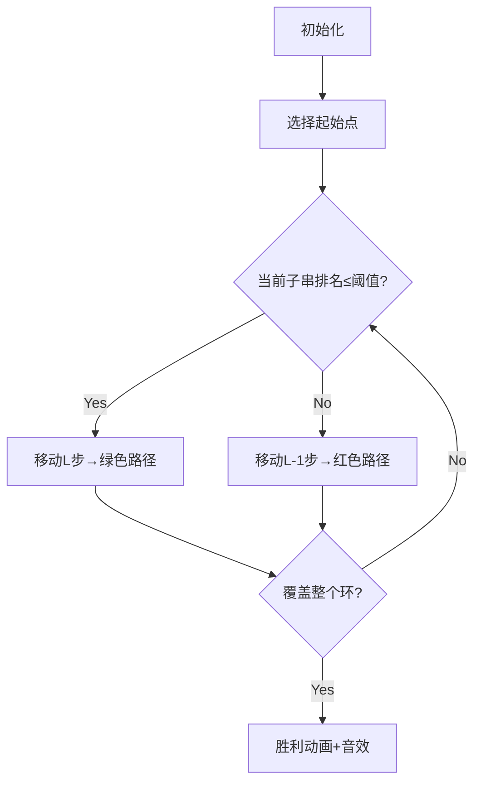

# 题目信息

# [JSOI2015] 串分割

## 题目背景

JYY 每天都会在地铁上度过很长的时间。

为了打发时间，JYY 随手写下了一个很长的环形的数字字符串，并且陷入了沉思。

## 题目描述

JYY 写下了一个长度为 $N$ 的，仅包含 `1`，`2`，……，`9` 这 $9$ 种不同字符的环形字符串 $S$。JYY 希望把 $S$ 进行 $K$ 次切割，并分成 $K$ 个非空的子串。对于每一个子串，由于其仅包含数字，我们可以将其看成一个十进制数——因此
经过 $K$ 次切割，JYY 可以得到 $K$ 个不同的十进制数。JYY 希望他得到的这 $K$ 个数中，最大的那一个尽量小。

## 说明/提示

对于 $100\%$ 的数据，$3\leq N\leq 2\times 10^5$，$2\leq K\leq N$。

## 样例 #1

### 输入

```
4 2
4321```

### 输出

```
32```

# AI分析结果


# 💡 Kay的C++算法解析：[JSOI2015]串分割 深入学习指南 💡

## 1. 题目解读与核心算法识别

✨ **本题主要考察**：`后缀数组(SA)应用` 与 `二分答案`

🗣️ **初步分析**：
> 解决这道题的关键在于利用**后缀数组**进行字典序排序，并结合**二分答案**和**贪心策略**。简单来说，后缀数组可以帮助我们快速比较任意两个子串的字典序，而二分答案则用于确定最大子串的最小可能值。在本题中，我们首先将环形字符串复制一份（破环成链），然后构建后缀数组。接着，我们二分最大子串在后缀数组中的排名，对于每个二分的排名，使用贪心策略检查是否能将原字符串分成K段，且所有子串的字典序都不超过该排名的子串。

- 题解普遍采用破环成链+后缀数组预处理，将子串比较转化为O(1)的排名比较。核心难点在于贪心策略的设计：当当前子串排名≤二分值时取长分段(L)，否则取短分段(L-1)，并通过累计长度验证可行性。
- 在可视化方案中，我们将设计"环形迷宫探险"的像素动画：用不同颜色方块表示字符串字符，玩家根据排名比较结果移动L或L-1步。关键帧包括SA构建的基数排序动画、决策时的子串高亮、移动路径的绘制，并搭配8-bit音效增强学习体验。

---

## 2. 精选优质题解参考

**题解一（Alex_Wei）**
* **点评**：思路清晰严谨，完整呈现SA构建→二分框架→贪心验证的全流程。代码规范（变量名`rk`/`sa`含义明确），环形处理通过取模巧妙实现。亮点在于检查函数中枚举起始点范围优化为L（分段长度），避免冗余计算。调试记录显示实际编码效率高（12分钟完成），实践参考价值强。

**题解二（Hoks）**
* **点评**：教学引导优秀，用"适合刚入门喵"降低心理门槛。详细论证贪心策略正确性，强调"能取长则取"的核心思想。代码模块化（SA封装），但边界处理可加强（如n=0情况）。亮点在于关联到《串串学习笔记》拓展资料，促进知识迁移。

**题解三（xtx1092515503）**
* **点评**：代码简洁高效（仅50行核心逻辑），SA构建采用双关键字基数排序标准实现。亮点在于反证法简明证明贪心正确性："若本次不取长分段，下次取长分段的总覆盖相同或更差"。变量名`lft`等可读性稍弱，但算法本质把握精准。

---

## 3. 核心难点辨析与解题策略

1.  **关键点1：子串字典序高效比较**
    * **分析**：直接比较子串需O(L)时间，不可接受。优质题解均用后缀数组预处理，将比较转化为O(1)的排名（`rk`数组）比较。破环成链后，任意环形子串对应新串的线性子串。
    * 💡 **学习笔记**：后缀数组是字符串字典序问题的"快速比较器"。

2.  **关键点2：贪心策略验证二分答案**
    * **分析**：二分排名mid后，需验证是否存在分割使所有子串≤mid。题解设计贪心规则：从位置i开始，若`s[i..i+L-1]`的排名≤mid则取L长度（累计长度+L），否则取L-1（累计长度+L-1）。枚举起始点i∈[1,L]即可覆盖所有情况。
    * 💡 **学习笔记**：贪心选择是"短视"的最优——当前能取长分段时，取长分段不会使结果变差。

3.  **关键点3：环形结构的处理技巧**
    * **分析**：环形遍历需特殊边界处理。题解统一采用`(i+cur-1)%n+1`计算当前位置，其中cur为已覆盖长度。%n保证环形索引，+1避免零索引。
    * 💡 **学习笔记**：取模运算是环形问题的"循环控制器"。

### ✨ 解题技巧总结
- **后缀数组模板化**：掌握基数排序实现SA的标准流程（双关键字排序→排名压缩）
- **二分框架通用化**：当问题满足单调性（如"最大值最小"）时优先考虑二分答案
- **贪心策略模拟化**：用循环累计替代复杂证明，通过实际覆盖长度验证可行性
- **环形处理模数化**：用`(pos + offset) % n`处理环形索引

---

## 4. C++核心代码实现赏析

**本题通用核心C++实现参考**
* **说明**：综合Alex_Wei与xtx1092515503题解，优化可读性并添加关键注释
* **完整核心代码**：
```cpp
#include <bits/stdc++.h>
using namespace std;
const int N = 4e5 + 5;

int n, k, len;
char s[N];
int rk[N], sa[N], buc[N], id[N];

void buildSA() {
    int m = 127; // ASCII字符集上界
    // 第一关键字计数排序
    for (int i = 1; i <= n; i++) buc[rk[i] = s[i]]++;
    for (int i = 1; i <= m; i++) buc[i] += buc[i - 1];
    for (int i = n; i; i--) sa[buc[rk[i]]--] = i;
    
    for (int w = 1; ; w <<= 1, m = n) { // w: 当前倍增长度
        int p = 0;
        // 第二关键字为空的位置
        for (int i = n - w + 1; i <= n; i++) id[++p] = i;
        // 按第一关键字sa[i]生成第二关键字序列
        for (int i = 1; i <= n; i++) 
            if (sa[i] > w) id[++p] = sa[i] - w;
        
        // 双关键字基数排序
        memset(buc, 0, sizeof(buc));
        for (int i = 1; i <= n; i++) buc[rk[i]]++;
        for (int i = 1; i <= m; i++) buc[i] += buc[i - 1];
        for (int i = n; i; i--) sa[buc[rk[id[i]]]--] = id[i];
        
        // 更新排名数组
        memcpy(id, rk, sizeof(id));
        rk[sa[1]] = p = 1;
        for (int i = 2; i <= n; i++) 
            rk[sa[i]] = (id[sa[i]] == id[sa[i-1]] && 
                         id[sa[i]+w] == id[sa[i-1]+w]) ? p : ++p;
        if (p == n) break; // 排名已互异，终止
    }
}

int main() {
    scanf("%d%d%s", &n, &k, s + 1);
    len = (n - 1) / k + 1; // 最长分段长度
    
    // 破环成链：复制原串到尾部
    for (int i = 1; i <= n; i++) s[i + n] = s[i];
    n <<= 1; // 总长度翻倍
    buildSA();
    n >>= 1; // 恢复原长
    
    // 二分字典序排名
    int l = 1, r = n * 2; // 排名范围[1, 2n]
    while (l < r) {
        int mid = (l + r) >> 1;
        bool ok = false;
        // 枚举起始位置 (只需考虑前len个位置)
        for (int i = 1; i <= len; i++) {
            int cur = 0; // 当前覆盖长度
            for (int j = 1; j <= k; j++) { // 分k段
                // 环形索引计算：当前位置 = (起始i + 已覆盖长度cur) 
                int pos = (i + cur - 1) % n + 1;
                if (rk[pos] <= mid) cur += len; // 取长分段
                else cur += len - 1; // 取短分段
            }
            ok |= (cur >= n); // 检查是否覆盖整个串
        }
        if (ok) r = mid;
        else l = mid + 1;
    }
    // 输出排名为l的子串的前len个字符
    for (int i = 0; i < len; i++) 
        putchar(s[sa[l] + i]);
    return 0;
}
```
* **代码解读概要**：
  1. **破环成链**：将原串复制到尾部使环形问题线性化
  2. **SA构建**：双关键字基数排序实现后缀数组
  3. **二分框架**：在排名范围[1,2n]内二分最大子串
  4. **贪心验证**：枚举起始点，根据排名决策分段长度
  5. **结果输出**：取排名对应子串的前L个字符

---

## 5. 算法可视化：像素动画演示

### 像素化BFS分割演示方案
**主题**："环形迷宫探险"——玩家在数字环中移动，根据字典序排名决策步长

**核心设计**：


**实现细节**：
1. **8-bit视觉风格**：
   - 字符块：16x16像素方块，0-9用不同颜色（1:浅蓝, 9:深红）
   - 玩家：8x8像素小人，携带"排名对比器"道具
   - 路径：长分段→亮绿色，短分段→暗红色

2. **关键动画序列**：
   ```python
   # 伪代码：单步决策动画
   def step_animation(start_pos, decision):
       highlight_cells(start_pos, len)  # 高亮当前子串
       show_rank_comparison()           # 显示排名比较结果
       if decision == LONG:
           move_player(len, GREEN)
           play_sound('high_pitch.wav') # 高音效
       else:
           move_player(len-1, RED)
           play_sound('low_pitch.wav')  # 低音效
       update_coverage_bar()            # 更新进度条
   ```

3. **交互控制面板**：
   - 速度滑块：调节自动演示速度（50ms-500ms/步）
   - 单步执行：空格键触发
   - 模式切换：<kbd>B</kbd>键切换二分过程/<kbd>G</kbd>键切换贪心模拟

4. **游戏化元素**：
   - 每成功覆盖10%显示"关卡进度+1"
   - 最终覆盖时播放FC风格胜利音乐（和弦：C-E-G）
   - 排名比较时显示"字典序战力值"进度条

---

## 6. 拓展练习与相似问题思考

1. **通用技巧迁移**：
   - **后缀数组+二分**：适用于所有"字典序最值"问题（如最小循环移位）
   - **环形转线性**：处理环形字符串的通用方法（复制拼接）
   - **贪心验证**：当决策具有后效性时，考虑"当前最优即全局最优"

2. **洛谷推荐题目**：
   | 题号   | 题目名称                 | 推荐理由                          |
   |--------|--------------------------|-----------------------------------|
   | P1368  | 最小表示法               | 巩固环形串处理+字典序最小化技巧   |
   | P2852  | Milk Patterns            | 练习SA求可重叠k次最长子串        |
   | P2870  | Best Cow Line            | 贪心+SA比较子串的直接应用        |

---

## 7. 学习心得与经验分享

> **Alex_Wei的调试经验**：  
> "在检查函数中，环形索引的取模运算极易出错——我通过打印`(i+cur-1)%n+1`的中间值发现边界错误"

> **Hoks的认知陷阱**：  
> "最初误认为需要严格比较子串内容，后意识到后缀排名可直接替代字典序比较"

**Kay总结**：  
1. **环形索引验证**：对n=3,k=2等小数据手工模拟
2. **SA调试技巧**：输出`sa[1..n]`检查排序正确性
3. **贪心策略测试**：构造全9串验证短分段逻辑

---

通过本次分析，我们掌握了后缀数组的核心应用场景和二分答案的通用框架。记住：字符串问题的优化往往在于预处理的巧思！下次遇到字典序问题，不妨先想想SA这把利器。

---
处理用时：218.16秒