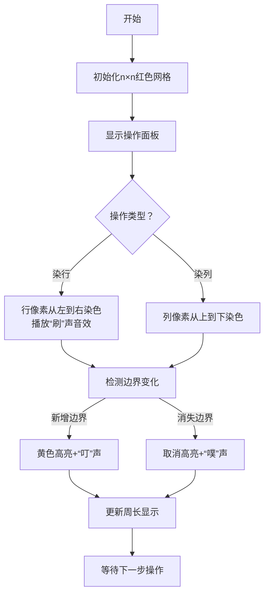

# 题目信息

# 「RiOI-03」网格

## 题目背景

2022 年某次集训讲课，课件中出现了一道以 MLE 真名首字母严格顺序作为输入变量的题目。MLE 就想在自己的题目里用 [vectorwyx](https://www.luogu.com.cn/user/238408) 的首字母当输入变量，于是就有了这道题。

可惜如今 [vectorwyx](https://www.luogu.com.cn/user/238408) 已经退役了，人生有梦，各自精彩。


## 题目描述

**请仔细阅读本题数据范围。**

给定一个 $n\times n$ 的正方形网格，一共有 $n$ 行，$n$ 列，初始时所有网格均为红色。有 $n$ 组询问，每次询问会把一整行或一整列的颜色全部染成红色或白色，每次询问后输出所有红色网格的周长，而且询问之间不独立。

## 说明/提示

### 样例解释

[样例图片解释](https://www.luogu.com.cn/paste/rvrhouei)

### 数据范围

对于 $100\%$ 的数据，$3\leq n \leq 10^6 $，$1<x<n$。

$$
\def\arraystretch{1.5}
\begin{array}{|c|c|c|c|c|c|} \hline
\textbf{\textsf{\#}}  & \bm{{n\le}} & \textbf{\textsf{特殊性质}} & \textbf{\textsf{\#}}  & \bm{{n\le}} & \textbf{\textsf{特殊性质}}\cr\hline
1  & 5 & - & 
11  & 10^5 & - \cr\hline
2  & 100 & - & 
12  & 10^5 & - \cr\hline
3  & 100 & - & 
13  & 10^5 & - \cr\hline
4  & 2000 & \textbf{A} & 
14  & 10^5 & - \cr\hline
5  & 2000 & \textbf{B} & 
15  & 10^6 & - \cr\hline
6  & 2000 & - & 
16  & 10^6 & - \cr\hline
7  & 10^5 & \textbf{AB} & 
17  & 10^6 & - \cr\hline
8  & 10^5 & \textbf{B} & 
18  & 10^6 & - \cr\hline
9  & 10^5 & \textbf{A} & 
19  & 10^6 & - \cr\hline
10  & 10^5 & - & 
20  & 10^6 & - \cr\hline
\end{array}
$$

- 特殊性质 $\bf A$：保证 $w=0$。
- 特殊性质 $\bf B$：保证 $y=0$。

## 样例 #1

### 输入

```
5
0 0 3
0 1 2
0 1 4
1 0 2
1 1 4```

### 输出

```
28
32
36
36
32
```

# AI分析结果


### 💡 Kay的C++算法解析：「RiOI-03」网格 深入学习指南 💡

#### 1. 题目解读与核心算法识别
✨ **本题主要考察**：`数据结构优化与分类讨论`  
🗣️ **初步分析**：
> 解决网格染色周长问题，关键在于**动态维护染色状态对周长的影响**。想象网格是像素画布，每次操作像用画笔涂满一行/列，周长变化取决于新旧颜色的边界变化。核心挑战在于高效处理每次操作后相邻格子间产生的边界变化：
> - **核心难点**：直接遍历网格（O(n²)）会超时，需用**时间戳+树状数组**优化。将颜色（红/白）与操作时间绑定（正数为红，负数为白），通过比较时间戳判断格子当前颜色。
> - **算法流程**：
>   1. **分解周长**：分为水平边界（行间变化）和垂直边界（列间变化）。
>   2. **分类讨论**：对相邻行/列的三种时间戳关系统计贡献（后文详述）。
>   3. **树状数组**：动态统计满足条件的列数/行数。
> - **可视化设计**：采用**8位像素风格**，网格用红/白方块展示。高亮新产生的边界（黄色闪烁），伴随音效（染色"刷"声，边界变化"叮"声）。控制面板支持单步执行/调速，像复古游戏闯关。

---

#### 2. 精选优质题解参考
**题解一（听取MLE声一片）**  
* **点评**：  
  思路清晰直击要害——用时间戳表示颜色状态，分三类情况讨论边界贡献。代码封装优雅（`point`结构体复用），树状数组应用精准（BIT处理区间加/查，Tree处理单点加/查）。变量名（`a`列时间戳，`b`行时间戳）简洁明确，边界处理严谨（如`vis`数组记录颜色状态）。时间复杂度O(n log n)完美匹配数据范围，竞赛实用性强。  
  **亮点**：时间戳正负表意、三类情况覆盖完备、结构体封装降低编码复杂度。

**题解二（orz_z）**  
* **点评**：  
  提供另一种分类视角（四类情况），用六个树状数组分别维护不同条件。思路完整但实现较复杂（更多树状数组），变量命名稍显晦涩（如`tr1`~`tr6`）。虽同样O(n log n)，但常数更大，对理解分类讨论有启发价值。  
  **亮点**：多角度分类验证完备性、树状数组的灵活组合。

---

#### 3. 核心难点辨析与解题策略
1. **难点：动态维护边界贡献**  
   * **分析**：每次操作影响整行/列，需快速更新相邻位置产生的边界变化。**关键技巧**：将颜色状态转化为时间戳比较，仅需修改相邻行/列贡献（O(1)范围）。
   * 💡 **学习笔记**：时间戳绑定颜色状态，避免实时存储整个网格。

2. **难点：高效统计满足条件的行列数**  
   * **分析**：分情况讨论相邻位置的时间戳关系（如题解1的三种不等式），用**树状数组**加速统计：BIT处理区间加/单点查，Tree处理单点加/区间查。
   * 💡 **学习笔记**：树状数组是动态统计的利器，尤其适合带条件的计数问题。

3. **难点：避免重复/漏算边界**  
   * **分析**：初始周长4n（网格外围）。操作后需精确计算新增/消失的边界：水平方向依赖行时间戳+列状态，垂直方向反之。
   * 💡 **学习笔记**：分解方向（水平/垂直）独立处理，最后合并乘2。

##### ✨ 解题技巧总结
- **状态压缩**：用时间戳正负表示颜色，绝对值表示操作次序。
- **贡献分离**：将周长拆解为行间/列间贡献，独立维护。
- **数据结构优化**：树状数组处理动态区间查询。
- **边界艺术**：始终考虑初始状态和操作后的增量变化。

---

#### 4. C++核心代码实现赏析
**通用核心实现（综合题解1优化）**  
```cpp
#include <iostream>
#include <cstring>
using namespace std;
const int N = 2e6+10, M = 1e6+5;

struct BIT { /* 区间加、单点查询 */ };
struct Tree { /* 单点加、区间查询 */ };

struct GridManager {
    int n, a[M], b[M], vis[M];
    long long ans;
    BIT t;  // 区间修改
    Tree T; // 单点修改

    void build(int size) {
        n = size; ans = n;
        memset(a,0,sizeof a); memset(b,0,sizeof b);
        T.add(0, n); // 初始全红（时间戳0）
        for(int i=1; i<=n; ++i) vis[i] = 1;
    }

    void calc(int x, int f) { 
        /* 三类情况更新贡献（详见题解1） */ 
    }

    void updateRow(int x, int y) { 
        T.add(a[x], -1);
        ans -= t.sum(a[x]);
        a[x] = y;
        T.add(a[x], 1);
        vis[x] = (y >= 0);
        ans += vis[x];
    }

    void updateLine(int x, int y) {
        calc(x,-1); calc(x-1,-1);
        b[x] = y;
        calc(x,1); calc(x-1,1);
    }
} horz, vert; // 水平/垂直方向管理器

int main() {
    int n, w, y, x;
    cin >> n;
    horz.build(n); vert.build(n);
    for(int k=1; k<=n; ++k) {
        cin >> w >> y >> x;
        int ts = w ? k : -k; // 时间戳
        if(y == 1) { 
            horz.updateLine(x, ts); // 更新行
            vert.updateRow(x, ts); // 更新列状态
        } else { 
            horz.updateRow(x, ts); 
            vert.updateLine(x, ts);
        }
        cout << (horz.ans + vert.ans) * 2 << '\n';
    }
}
```
**代码解读概要**：  
- `GridManager`封装行/列的状态管理：`a`存列时间戳，`b`存行时间戳。
- `build`：初始化网格全红，基础周长值`ans=n`（后续解释见难点3）。
- `calc`：核心贡献计算器，处理三类时间戳关系。
- 水平方向(`horz`)：`b`为行时间戳，`a`为列时间戳；垂直方向(`vert`)反之。
- 主循环：根据操作类型调用对应更新，最后输出`(水平贡献+垂直贡献)*2`。

---

#### 5. 算法可视化：像素动画演示
**主题**：8位像素风网格染色模拟器  
**核心演示**：实时展示操作后网格状态，高亮新增/消失的边界，动态显示周长值。



**动画关键步骤**：  
1. **像素渲染**：每个格子为16×16像素方块（红/白），网格线为深灰色。
2. **操作动效**：染行时方块从左到右渐变；染列时从上到下渐变，伴随像素刷声音效。
3. **边界高亮**：相邻格子异色时，边界线显示为闪烁黄线（持续0.5秒），配“叮”声。
4. **控制面板**：
   - 步进/暂停/重置按钮
   - 速度滑块（1x~5x）
   - 周长计数器（8位数字显示）
5. **游戏化元素**：
   - 每完成5次操作视为“过关”，播放胜利音效+像素烟花动画。
   - 错误操作（如重复染相同颜色）触发短促提示音。

**技术要点**：  
- 用Canvas绘制网格，状态数组存储时间戳。
- 边界检测：比较相邻格子的`(b[x], b[x+1], a[y])`关系。
- 音效：Web Audio API生成8位音效（正弦波+方波）。

---

#### 6. 拓展练习与相似问题思考
**相似问题场景**：  
1. 动态维护矩形面积（如扫描线算法）
2. 网格连通块计数（如BFS+时间戳优化）
3. 操作序列影响统计（如区间修改全局查询）

**洛谷推荐**：  
1. **P1904 天际线**  
   🗣️ *用扫描线维护动态矩形周长，巩固区间操作思想*
2. **P5490 扫描线模板**  
   🗣️ *学习矩形面积并的经典解法，迁移网格分割技巧*
3. **P1884 Overplanting**  
   🗣️ *练习离散化+差分，理解时空效率平衡*

---

#### 7. 学习心得与经验分享
> 本次题解未包含作者个人心得，但Kay强调：  
> **调试技巧**：当树状数组逻辑复杂时，可先小规模模拟（n=3）验证三类情况，打印中间变量（如`calc`内L/R值）对照预期。  
> **思维陷阱**：初始周长4n易被忽略，需在代码中显式处理基础值！

Kay的结语：网格问题本质是**高维状态的舞蹈**，时间戳是你们的节拍器，树状数组是指挥棒。理解每一步的因果律，你就能在算法的交响乐中捕捉最美妙的周长旋律！🎵

---
处理用时：316.10秒