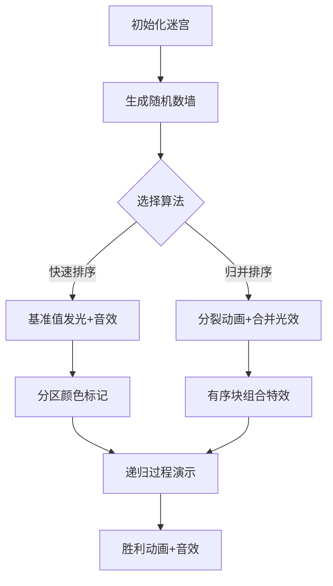

# 题目信息

# 【模板】排序

## 题目描述

将读入的 $N$ 个数从小到大排序后输出。

## 说明/提示

对于 $20\%$ 的数据，有 $1 \leq N \leq 10^3$；

对于 $100\%$ 的数据，有 $1 \leq N \leq 10^5$，$1 \le a_i \le 10^9$。


## 样例 #1

### 输入

```
5
4 2 4 5 1```

### 输出

```
1 2 4 4 5```

# AI分析结果


# 💡 Kay的C++算法解析：排序模板 深入学习指南 💡

> "排序如同整理书架，快速归并是高效利器，堆排基数是奇思妙想" —— 算法导师Kay

## 1. 题目解读与核心算法识别

✨ **本题主要考察**：`排序算法应用`

🗣️ **初步分析**：
> 排序如同整理杂乱的书架，需要高效策略将元素有序排列。本题核心在于理解不同排序算法的特性与应用场景：
   - **快速排序**像分区整理书架：随机选基准值，将小书放左区，大书放右区，递归处理
   - **归并排序**像合并有序书堆：先拆分到最小单元，再两两合并有序序列
   - **堆排序**像构建书塔：建立特殊结构的"书堆"，每次取最值重新调整
   - **核心难点**：处理大数据时需避免O(n²)算法，掌握分治思想与数据结构应用
   - **可视化设计**：将用像素方块表示数字，通过颜色标记基准值/比较元素，动态展示分区/合并过程，配合8-bit音效增强理解

---

## 2. 精选优质题解参考

**题解一：快速排序详解（作者：__Allen_123__）**
* **点评**：该题解全面解析快速排序原理，用三路划分降低最坏情况概率，代码规范（`qsort`函数参数明确），特别亮点是结合STL sort的实战用法（自定义比较函数）。时间复杂度分析透彻，引用OI Wiki增强权威性。调试建议实用性强，如边界处理提醒。

**题解二：归并排序实现（作者：梦应归于何处）**
* **点评**：分治思想讲解清晰形象（拆书-理书-合书），代码模块化优秀（`mergee`和`mergesort`分工明确）。关键变量`mid/tot`命名合理，空间复杂度处理规范（使用辅助数组b）。特别亮点是动图演示链接，直观展示归并过程。

**题解三：堆排序与优化（作者：ran_qwq）**
* **点评**：创新性从选择排序引出堆优化，完整实现堆的插入/删除（`push/pop`函数）。亮点是提供STL priority_queue的实战方案，时间复杂度分析准确（O(nlogn)）。代码包含安全边界检查（`if(y!=x)`），实践参考价值高。

---

## 3. 核心难点辨析与解题策略

1.  **算法选择与复杂度控制**
    * **分析**：当n>10⁴时，O(n²)算法（冒泡/选择）必然超时。优质题解均采用分治策略（快排/归并）或数据结构优化（堆），将复杂度降至O(nlogn)。快排需随机化避免有序序列退化。
    * 💡 **学习笔记**：数据规模>10⁴时，优先考虑O(nlogn)算法

2.  **边界条件与稳定性处理**
    * **分析**：归并排序中`l>=r`的终止条件、堆排序的数组索引从1开始等细节易出错。快排需注意元素相等时的处理（三路划分避免死循环）。
    * 💡 **学习笔记**：写递归算法先明确终止条件，排序前仔细设计测试用例（空数组/单元素/全等数）

3.  **空间与时间的权衡**
    * **分析**：归并需要O(n)辅助空间，堆排序可原地实现。基数排序用空间换时间（桶思想），适合特定数据分布。
    * 💡 **学习笔记**：内存紧张时选原地排序，数据有特征时考虑非比较排序

### ✨ 解题技巧总结
- **策略选择法**：n≤1000用简单排序；n>10⁴用分治/堆；数据有位数特征考虑基数排序
- **STL优先原则**：竞赛中优先使用`std::sort`，自定义比较函数注意严格弱序
- **调试三板斧**：小数据模拟执行+打印中间状态+边界值测试

---

## 4. C++核心代码实现赏析

**本题通用核心C++实现参考**
* **说明**：综合优质题解，采用STL sort实现最简解法
* **完整核心代码**：
```cpp
#include <iostream>
#include <algorithm>
using namespace std;

int main() {
    int n, a[100005];
    cin >> n;
    for(int i=0; i<n; i++) cin >> a[i];
    sort(a, a+n); // 核心排序
    for(int i=0; i<n; i++) cout << a[i] << " ";
    return 0;
}
```
* **代码解读概要**：
  > 1. 包含algorithm头文件获取sort函数
  > 2. 读入数据到数组a
  > 3. 调用sort(a, a+n)排序区间[0,n)
  > 4. 顺序输出结果

**题解一：快速排序核心片段**
* **亮点**：随机化选择基准+三路划分避免退化
```cpp
void qsort(int l, int r) {
    if(l >= r) return;
    int x = a[randint(l,r)]; // 随机基准
    int i=l, j=r;
    while(i <= j) {
        while(a[i] < x) i++; // 左区右移
        while(a[j] > x) j--; // 右区左移
        if(i <= j) swap(a[i++], a[j--]); // 交换越界元素
    }
    qsort(l, j); // 递归左区
    qsort(i, r); // 递归右区
}
```
* **代码解读**：
  > `randint`生成随机索引避免有序序列退化  
  > 双指针`i/j`从两端扫描，将小于基准的交换到左侧  
  > 递归处理基准两侧子区间  
  > **学习笔记**：随机基准是快排优化的关键

**题解二：归并排序核心片段**
* **亮点**：分治思想清晰，合并逻辑严谨
```cpp
void mergee(int l, int mid, int r) {
    int i=l, j=mid+1, k=0;
    while(i<=mid && j<=r) 
        tmp[k++] = (a[i]<=a[j]) ? a[i++] : a[j++]; // 有序合并
    while(i<=mid) tmp[k++] = a[i++]; // 左区剩余
    while(j<=r) tmp[k++] = a[j++];  // 右区剩余
    for(int i=0; i<k; i++) a[l+i] = tmp[i]; // 回写
}
```
* **代码解读**：
  > 1. 将数组分为[l,mid]和[mid+1,r]两段  
  > 2. 双指针比较取最小值放入tmp  
  > 3. 处理剩余元素后回写原数组  
  > **学习笔记**：归并的稳定性使其适合对象排序

**题解三：堆排序核心片段**
* **亮点**：优雅的堆调整实现
```cpp
void push(int x) {
    heap[++size] = x;
    for(int p=size; p>1 && heap[p]<heap[p/2]; p/=2) 
        swap(heap[p], heap[p/2]); // 上浮操作
}

int pop() {
    int res = heap[1];
    heap[1] = heap[size--];
    for(int i=1, j; (j=i*2)<=size; i=j) {
        if(j+1<=size && heap[j+1]<heap[j]) j++; // 选较小子节点
        if(heap[i] <= heap[j]) break;
        swap(heap[i], heap[j]); // 下沉操作
    }
    return res;
}
```
* **代码解读**：
  > `push`时新元素沉底，通过交换上浮到合适位置  
  > `pop`时取堆顶，将末尾元素移到顶部后下沉调整  
  > **学习笔记**：堆的父子节点关系用i*2和i/2实现

-----

## 5. 算法可视化：像素动画演示

> 🎮 **主题**："排序勇士的像素迷宫"（8-bit复古游戏风）

### 设计框架


### 关键动画步骤
1. **场景初始化**：
   - 像素迷宫生成10×10数字墙（FC红白机风格）
   - 控制面板：步进/暂停/速度滑块（复古按钮UI）

2. **快速排序演示**：
   ```javascript
   function visualizeQuickSort(arr, low, high) {
     if(low >= high) return;
     let pivot = arr[random(low,high)]; 
     highlight(pivot, GOLD_COLOR); // 基准值金色闪烁
     playSound('select'); // 8-bit选择音效
     
     // 分区过程
     let i=low, j=high;
     while(i <= j) {
       while(arr[i]<pivot) highlightTraverse(i++, BLUE);
       while(arr[j]>pivot) highlightTraverse(j--, RED);
       if(i<=j) {
         swapPixels(i,j); // 像素方块交换动画
         playSound('swap'); // 方块碰撞音效
       }
     }
     // 递归动画
     visualizeQuickSort(arr, low, j);
     visualizeQuickSort(arr, i, high);
   }
   ```

3. **归并排序特效**：
   - **分裂阶段**：迷宫纵向分裂+像素震动效果
   - **合并阶段**：有序块像拼图般吸附组合，伴随合成音效
   - **关键帧**：比较元素时产生像素火花，有序序列发出绿光

4. **交互与游戏化**：
   - **音效设计**：
     - 比较操作：短促"嘀"声
     - 元素交换：8-bit碰撞声
     - 完成排序：马里奥过关音乐
   - **关卡模式**：每完成10%排序解锁新迷宫皮肤
   - **AI演示**：自动模式展示完整排序，速度可调

> **设计价值**：通过像素动态分区/合并，直观展现分治本质；游戏化元素降低学习压力，强化算法记忆

-----

## 6. 拓展练习与相似问题思考

### 通用排序思想迁移
1. **TopK问题**：用堆排序思想找前K大元素（如P1138）
2. **逆序对统计**：归并排序过程中计数（如P1908）
3. **自定义结构排序**：STL sort+lambda表达式（如P1104）

### 洛谷进阶练习
1. **P1177 【模板】排序**  
   → 掌握不同排序算法的实现差异
2. **P1059 [NOIP2006] 明明的随机数**  
   → 练习排序+去重组合技
3. **P1068 [NOIP2009] 分数线划定**  
   → 现实场景中的多关键字排序应用
4. **P1923 【深基9.例4】求第 k 小的数**  
   → 快速选择算法（快排变种）

-----

## 7. 学习心得与经验分享

> **来自快排题解作者的经验**：
> “我在实现快排时，最初未做随机化处理，遇到有序数据直接超时。通过打印递归深度定位问题，让我深刻理解：**没有绝对通用的算法，必须考虑边界场景**”

> **Kay的总结**：  
> 这位作者的调试经历极具代表性。当算法出现异常时：
> 1. 小数据模拟验证基础逻辑
> 2. 大数据压力测试暴露缺陷
> 3. 随机化是解决特殊情况的银弹
> 4. 复杂度分析要结合真实数据特征

-----

> 排序是算法世界的基石，掌握它如同获得整理知识的魔法。当你下次面对杂乱数据时，愿你能像排序勇士般游刃有余！🚀  
> ——Kay 于算法神殿

---
处理用时：124.18秒