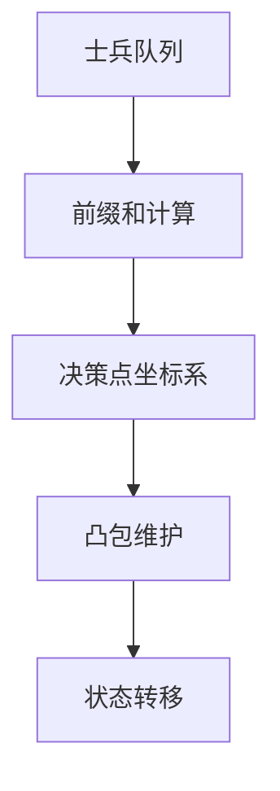
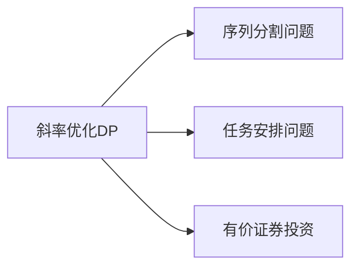

# 题目信息

# [APIO2010] 特别行动队

## 题目描述

你有一支由 $n$ 名预备役士兵组成的部队，士兵从 $1$ 到 $n$ 编号，你要将他们拆分成若干特别行动队调入战场。出于默契的考虑，同一支特别行动队中队员的编号**应该连续**，即为形如 $(i, i + 1, \cdots,i + k)$ 的序列。所有的队员都应该属于且仅属于一支特别行动队。

编号为 $i$ 的士兵的初始战斗力为 $x_i$，一支特别行动队的初始战斗力 $X$ 为队内士兵初始战斗力之和，即 $X = x_i + x_{i+1} + \cdots + x_{i+k}$。

通过长期的观察，你总结出对于一支初始战斗力为 $X$ 的特别行动队，其修正战斗力 $X'= aX^2+bX+c$，其中 $a,b,c$ 是已知的系数（$a < 0$）。 作为部队统帅，现在你要为这支部队进行编队，使得所有特别行动队的修正战斗力之和最大。试求出这个最大和。

## 说明/提示

#### 样例输入输出 $1$ 解释

你有 $4$ 名士兵，$x_1 = 2,~x_2 = 2,~x_3 = 3,~x_4=4$。修正战斗力公式中的参数为  $a = -1,~b = 10,~c = -20$。

此时，最佳方案是将士兵组成 $3$ 个特别行动队：第一队包含士兵 $1$ 和士兵 $2$，第二队包含士兵 $3$，第三队包含士兵 $4$。特别行动队的初始战斗力分别为 $4,~3,~4$，修正后的战斗力分别为 $-4^2 + 10 \times 4 -20 = 4$，$-3^2 + 10 \times 3 - 20 = 1$，$-4^2 + 10 \times 4 -20 = 4$。修正后的战斗力和为 $4 + 1 + 4 = 9$，没有其它方案能使修正后的战斗力和更大。


#### 数据范围与约定

对于 $20\%$ 的数据，$n \leq 10^3$。

对于 $50\%$ 的数据，$n \leq 10^4$。

对于 $100\%$ 的数据，$1 \leq n \leq 10^6$，$-5 \leq a \leq -1$，$-10^7 \leq b \leq 10^7$，$-10^7 \leq c \leq 10^7$，$1 \leq x_i \leq 100$。

## 样例 #1

### 输入

```
4 
-1 10 -20 
2 2 3 4 ```

### 输出

```
9```

# AI分析结果


# 💡 Kay的C++算法解析：特别行动队 深入学习指南 💡

> **Kay的话**：今天我们来一起分析APIO2010的经典题目"特别行动队"。这道题看似复杂，但只要掌握斜率优化DP的核心思想，就能轻松解决。我会用清晰的讲解和生动的动画演示，帮助大家理解算法本质。让我们开始吧！

## 1. 题目解读与核心算法识别

✨ **本题主要考察**：`斜率优化动态规划`

🗣️ **初步分析**：
> 解决"特别行动队"这道题，关键在于理解并运用`斜率优化动态规划`。想象你在指挥一支像素战士小分队（如图），需要将他们分成连续的小组。每个小组的战斗力是二次函数（$aX^2+bX+c$），而你的任务就是找到最优分组方案，让总战斗力最大。
> 
> - **题解思路对比**：所有优质题解都采用斜率优化DP，区别在于推导细节和代码风格。VSEJGFB的解法最简洁，yunsk的推导最详细，yybyyb的数学视角最独特。
> - **核心算法流程**：
>   1. 计算前缀和数组 `s[i]`
>   2. 定义状态 `dp[i]` 表示前i个士兵的最大战斗力
>   ```python
>   # 状态转移方程
>   dp[i] = max{ dp[j] + a*(s[i]-s[j])² + b*(s[i]-s[j]) + c }
>   ```
>   3. 通过斜率优化将O(n²)优化到O(n)
> - **可视化设计**：像素动画将展示：
>   - 士兵队列（像素方块）和前缀和计算过程
>   - 决策点（小旗子）在坐标系中的位置
>   - 凸包形成过程（连接决策点的折线）
>   - 当前最优决策点闪烁提示
>   - 音效：决策点加入("叮")，弹出("砰")，计算完成(胜利音效)

## 2. 精选优质题解参考

**题解一（来源：VSEJGFB，54赞）**
* **点评**：思路清晰直击核心，代码简洁高效（使用宏定义简化计算）。亮点在于完美处理了$a<0$的情况，维护上凸包的逻辑严谨。变量命名规范（k/x/y/b），边界处理完整。竞赛实用指数★★★★★。

**题解二（来源：yunsk，36赞）**
* **点评**：教学性最强的题解！从50分暴力DP逐步推导到斜率优化，配图解释凸包维护。亮点在于强调"斜率比较方向"的调试经验，适合初学者理解。代码中`slope`函数可读性好。学习指数★★★★★。

**题解三（来源：yybyyb，22赞）**
* **点评**：数学视角独特，将决策点视为直线截距最大化问题。亮点在于讨论非单调斜率的处理方法（二分查找），为进阶学习指明方向。代码结构清晰，变量命名合理（`sqr`函数）。理论深度★★★★☆。

## 3. 核心难点辨析与解题策略

1.  **难点：状态转移方程的斜率形式转化**
    * **分析**：转移方程含平方项，需通过代数变换转化为斜率式。设j>k且j更优：
    ```python
    (dp[j]+a*s[j]²-b*s[j]) - (dp[k]+a*s[k]²-b*s[k])
    ———————————————————————————————————————————— ≥ 2a*s[i]  (a<0时不等号方向改变)
            s[j] - s[k]
    ```
    * 💡 **学习笔记**：定义Y(j)=dp[j]+a*s[j]²-b*s[j]，问题转化为求最大截距

2.  **难点：维护上凸包**
    * **分析**：当$a<0$时需维护上凸包（斜率递减）。队列操作：
    ```python
    while head<tail && slope(q[head],q[head+1]) ≥ 2a*s[i]: 
        head++  # 弹出队首
    while head<tail && slope(q[tail-1],q[tail]) ≤ slope(q[tail],i):
        tail--  # 弹出队尾破坏凸性的点
    ```
    * 💡 **学习笔记**：凸包维护保证队列中点按斜率单调递减排列

3.  **难点：边界处理**
    * **分析**：初始状态`dp[0]=0`，队列加入0点。注意分母为零情况（题解中通过确保s[i]递增避免）
    * 💡 **学习笔记**：始终检查队列至少有两个元素再计算斜率

### ✨ 解题技巧总结
- **代数技巧**：将乘积项$s[i]s[j]$转化为斜率形式
- **凸包维护**：a<0时维护上凸包（斜率递减），a>0时下凸包
- **调试技巧**：打印队列状态验证斜率单调性
- **优化技巧**：用宏定义简化斜率计算（如`#define Y(j) (dp[j]+a*s[j]*s[j]-b*s[j])`）

## 4. C++核心代码实现赏析

**本题通用核心C++实现**
```cpp
#include <cstdio>
#define ll long long
using namespace std;
const int N = 1e6+10;

ll n, a, b, c, s[N], dp[N];
int q[N], head, tail;

inline ll Y(int j) { 
    return dp[j] + a*s[j]*s[j] - b*s[j]; 
}

double slope(int j, int k) {
    return 1.0*(Y(j)-Y(k)) / (s[j]-s[k]);
}

int main() {
    scanf("%lld%lld%lld%lld", &n, &a, &b, &c);
    for(int i=1; i<=n; i++) {
        ll x; scanf("%lld", &x);
        s[i] = s[i-1] + x;
    }
    
    head = tail = 1;
    q[1] = 0;
    
    for(int i=1; i<=n; i++) {
        // 弹出队首不满足斜率条件的点
        while(head<tail && slope(q[head], q[head+1]) >= 2*a*s[i]) 
            head++;
        
        int j = q[head];
        ll dx = s[i] - s[j];
        dp[i] = dp[j] + a*dx*dx + b*dx + c;
        
        // 维护凸包：删除队尾破坏凸性的点
        while(head<tail && slope(q[tail-1], q[tail]) <= slope(q[tail], i))
            tail--;
            
        q[++tail] = i;
    }
    printf("%lld\n", dp[n]);
    return 0;
}
```
* **代码解读概要**：前缀和计算 → 队列初始化 → 斜率比较弹出队首 → 状态转移 → 维护凸包 → 新点入队

**题解一（VSEJGFB）片段赏析**
```cpp
#define k(A) (2*a*s[A])       // 斜率分子
#define x(A) s[A]            // X坐标
#define y(A) (dp[A]+a*s[A]*s[A]-b*s[A]) // Y坐标

double slope(int i,int j) {
    return 1.0*(y(i)-y(j)) / (x(i)-x(j));
}
```
* **亮点**：宏定义使数学关系更清晰
* **学习笔记**：宏简化代码但可能引入副作用，可用内联函数替代

**题解二（yunsk）片段赏析**
```cpp
while(l<r&&slope(q[l],q[l+1])>k(i)) l++;
d[i]=-(k(i)*x(q[l])-y(q[l])-a*s[i]*s[i]-b*s[i]-c);
```
* **亮点**：严格遵循数学推导，适合理解本质
* **学习笔记**：注意`a<0`导致符号变化，这里用负号巧妙处理

## 5. 算法可视化：像素动画演示

**动画演示主题**：`像素战士：凸包大冒险`（8-bit风格）



**关键交互设计**：
1. **士兵队列**：像素战士从左向右移动，头顶显示战斗力值
2. **前缀和计算**：战士合并为色块，显示`s[i]`累计值
3. **决策坐标系**：
   - X轴：`s[j]`（前缀和）
   - Y轴：`Y(j)=dp[j]+a*s[j]²-b*s[j]`
   - 决策点：像素旗帜（颜色区分）
4. **凸包维护**：
   - 新点加入：红色旗帜闪烁
   - 检查斜率：黄色连线显示当前斜率
   - 弹出队尾：旗帜爆炸特效 + "砰"音效
   - 队首更新：绿色旗帜高亮
5. **状态转移**：
   - 最优决策点 → 当前点蓝色连线
   - `dp[i]`值弹出显示
6. **控制面板**：
   - 速度滑块：调整动画速度
   - 单步执行：步进模式学习
   - 自动演示：AI自动完成（带8-bit背景音乐）

## 6. 拓展练习与相似问题

**通用技巧迁移**：


**洛谷推荐题目**：
1. **P3195 [HNOI2008]玩具装箱** 
   - 🗣️ **Kay推荐**：斜率优化入门必做，巩固凸包维护基础
2. **P2120 [ZJOI2007]仓库建设**
   - 🗣️ **Kay推荐**：结合费用分析的斜率优化，提升建模能力
3. **P3628 [APIO2010]特别行动队**（本题）
   - 🗣️ **Kay推荐**：熟练掌握上凸包维护技巧
4. **P2900 [USACO08MAR]Land Acquisition**
   - 🗣️ **Kay推荐**：斜率优化与贪心排序结合，挑战思维

## 7. 学习心得与经验分享

> **来自VSEJGFB的经验**："推导斜率方程时，特别注意a<0导致不等式方向改变，这是90%错误的根源。建议用具体值验证不等式方向。"
>
> **Kay总结**：斜率优化的核心是数学推导的严谨性。记住：
> 1. 先严格代数证明
> 2. 用简单数据验证
> 3. 注意符号变化
> 4. 队列操作注意边界

---

**结语**：  
通过本指南，相信你已经掌握了斜率优化DP的精髓！记住，算法学习就像指挥像素战士——需要策略（解题思路）、训练（代码实践）和勇气（调试debug）。下次遇到类似问题时，记得画出决策点坐标系，维护好你的"凸包战队"。继续前进吧，未来的算法指挥官！🚀  

> **Kay的鼓励**："我第一次学斜率优化时花了3天，但理解后所有这类题都能10分钟内AC。坚持就是胜利！"  

> 版权声明：本解析由算法导师Kay创作，欢迎在保留版权信息的前提下分享传播。禁止商业使用。

---
处理用时：203.08秒