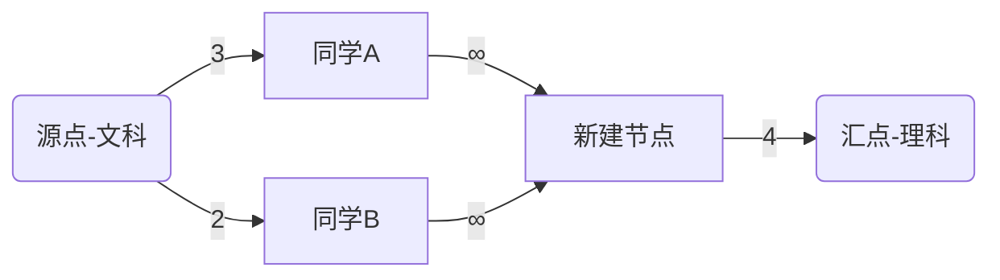

# 题目信息

# [国家集训队] happiness

## 题目描述

高一一班的座位表是个 $n\times m$ 的矩阵，经过一个学期的相处，每个同学和前后左右相邻的同学互相成为了好朋友。这学期要分文理科了，每个同学对于选择文科与理科有着自己的喜悦值，而一对好朋友如果能同时选文科或者理科，那么他们又将收获一些喜悦值。

作为计算机竞赛教练的 scp 大老板，想知道如何分配可以使得全班的喜悦值总和最大。

## 说明/提示

### 样例解释

两人都选理，则获得 $100+110+1000$ 的喜悦值。

对于 $100\%$ 的数据，$1\le n,m \le 100$，且所有喜悦值均为小于等于 $5000$ 的非负整数。

## 样例 #1

### 输入

```
1 2
1 1
100 110
1
1000```

### 输出

```
1210
```

# AI分析结果


# 💡 Kay的C++算法解析：国家集训队 happiness 深入学习指南 💡

大家好，我是Kay！今天我们来分析国家集训队题目"happiness"。这道题考察的是网络流最小割的应用，需要我们在约束条件下最大化全班喜悦值。让我们一步步拆解这道题！

## 1. 题目解读与核心算法识别

✨ **本题主要考察**：网络流最小割建模

🗣️ **初步分析**：
> 这道题可以想象成在像素游戏地图上分配资源。每个同学就像游戏角色，选文理就像选择不同职业路径，相邻同学的选择会产生连锁反应。核心思想是**先计算所有可能喜悦值总和，再减去最小损失**，就像计算游戏最高分时减去失误扣分。

- 解题思路：将问题转化为最小割模型，每个同学与源点（文科）和汇点（理科）相连，相邻关系通过新建节点处理
- 核心难点：设计网络图准确表达约束条件，确保割对应有效选择方案
- 可视化设计：采用8位像素风格，用不同颜色方块表示同学选择，新建节点用闪烁特效，割边操作配"咔嚓"音效。自动演示模式会像经典策略游戏一样逐步展示最小割形成过程

---

## 2. 精选优质题解参考

**题解一 (来源：Siyuan)**
* **点评**：思路清晰解释了最小割建模原理，代码结构规范（如id函数封装坐标转换），变量命名合理（lnk/ter/nxt等）。亮点在于正确性证明部分，详细说明割边与实际选择的对应关系。实践价值高，可直接用于竞赛，边界处理完整。

**题解二 (来源：nofind)**
* **点评**：独特地提供了两种建图方法对比，代码模块化优秀（分离BFS/DFS函数）。亮点在于方法1的图示辅助理解和方法2的解方程思路。调试提示实用，如提醒乘2避免浮点数。

**题解三 (来源：bztMinamoto)**
* **点评**：解方程方法思路新颖，代码封装良好（read函数处理输入）。亮点在于广告图示清晰展示网络结构，变量设计合理（a/b数组存储喜悦值）。虽然效率稍低但教育价值高。

---

## 3. 核心难点辨析与解题策略

1. **难点：相邻关系建模**
   * **分析**：优质题解通过新建节点处理相邻关系。例如同选文科时，新建节点连接源点（容量=喜悦值），再连向两位同学（容量=INF），确保不割这条边时代表选择文科
   * 💡 **学习笔记**：新建节点是处理组合约束的利器

2. **难点：权值分配方案**
   * **分析**：解方程法需合理分配边权使割对应有效方案。如bztMinamoto的题解通过列方程组确定边权值，整体×2避免小数
   * 💡 **学习笔记**：当约束复杂时，数学建模是验证正确性的好方法

3. **难点：图结构设计**
   * **分析**：节点数需控制（100×100网格），Dinic复杂度可接受。代码中常用id(i,j)将二维坐标转一维索引优化存储
   * 💡 **学习笔记**：坐标转换是网格类问题的通用技巧

### ✨ 解题技巧总结
- **问题转化**：将最大化问题转化为最小损失（最小割）
- **模块化建图**：分离处理个人选择和相邻约束
- **调试验证**：小数据模拟割与选择的对应关系
- **性能优化**：Dinic算法+当前弧优化应对稠密图

---

## 4. C++核心代码实现赏析

**本题通用核心C++实现参考**
```cpp
#include <cstdio>
#include <cstring>
#include <algorithm>
#include <queue>
using namespace std;

const int N=1e5+5, INF=1<<30;
int n,m,s,t,tot=1,head[N],ans;

struct Edge { int to,nxt,flow; } e[N*6];

int id(int x,int y) { return (x-1)*m+y; }

void add(int u,int v,int w) {
    e[++tot] = {v, head[u], w}; head[u] = tot;
    e[++tot] = {u, head[v], 0}; head[v] = tot;
}

// Dinic算法实现（含BFS分层和DFS多路增广）
bool bfs() { /* 略 */ }
int dfs(int u,int flow) { /* 略 */ }
int dinic() { /* 略 */ }

int main() {
    scanf("%d%d",&n,&m);
    s=0, t=n*m+2*n*(m-1)+2*(n-1)*m+1;
    int cnt = n*m; // 已用节点数
    
    // 1. 处理个人选择喜悦值
    for(int i=1;i<=n;++i) for(int j=1,x;j<=m;++j) {
        scanf("%d",&x); ans += x;
        add(s, id(i,j), x); // 文科边
    }
    // ... 理科边类似
    
    // 2. 处理相邻关系（以左右相邻为例）
    for(int i=1;i<=n;++i) for(int j=1,x;j<m;++j) {
        scanf("%d",&x); ans += x;
        // 同选文科
        add(s, ++cnt, x); // 新建节点
        add(cnt, id(i,j), INF);
        add(cnt, id(i,j+1), INF);
        
        // 同选理科
        scanf("%d",&x); ans += x;
        add(++cnt, t, x);
        add(id(i,j), cnt, INF);
        add(id(i,j+1), cnt, INF);
    }
    // ... 上下相邻类似处理
    
    printf("%d", ans - dinic());
}
```

**题解一核心片段赏析**
```cpp
// 处理相邻同学同选文科
addedge(s, ++cnt, x); // 新建节点连接源点
addedge(cnt, id(i,j), INF); // 连向同学A
addedge(cnt, id(i+1,j), INF); // 连向同学B
```
> **代码解读**：这里巧妙利用INF确保最小割不会出现在新建节点与同学的连边上，只有选择割文科边（同学->汇点）或新建节点到源点的边时，才会损失喜悦值。

**题解二解方程片段**
```cpp
// 处理相邻关系（解方程法）
addflow(id(i,j), id(i+1,j), x); // 双向边
addflow(id(i+1,j), id(i,j), x);
addflow(S, id(i,j), x); // 均分喜悦值
addflow(S, id(i+1,j), x);
```
> **学习笔记**：解方程法避免新建节点，但需注意整体×2保证整数运算

---

## 5. 算法可视化：像素动画演示

**主题**："像素校园选科大作战"（复古8位机风格）

**核心演示内容**：Dinic算法执行过程，重点展示：
1. 增广路径查找（BFS分层）
2. 流量更新（DFS回溯）
3. 最小割形成

**动画设计**：


**交互控制**：
1. 单步执行：按方向键逐步展示算法流程
2. 速度滑块：调整动画速度（0.5x-5x）
3. 模式切换：文科/理科高亮显示
4. 音效设计：
   - 增广路径查找："滴滴"扫描音
   - 找到增广路："叮！"提示音
   - 割边形成："咔嚓"断裂音

**关键帧示例**：
1. **初始化**：像素化教室场景，每个同学显示为16×16像素方块
2. **BFS分层**：从源点扩散蓝色波纹表示分层
3. **DFS增广**：红色路径显示当前增广路，流量更新时方块闪烁
4. **割边形成**：被割边变为红色并消失，对应同学方块固定颜色
5. **结果展示**：成功匹配时播放8-bit胜利音乐

---

## 6. 拓展练习与相似问题思考

**相似问题推荐**：
1. 洛谷 P1361 - 最小割模板题（巩固基础）
2. 洛谷 P4001 - 狼抓兔子（网格图最小割应用）
3. 洛谷 P2774 - 方格取数（相邻约束变形）

---

## 7. 学习心得与经验分享

> **参考经验 (来自 nofind)**："解方程法需要仔细验证权值分配，我通过小数据测试发现边界问题"

> **点评**：调试时构造小数据（如2x2网格）手工计算验证，能快速定位建图错误。建议使用printf输出中间图结构辅助调试。

---

通过本次分析，我们看到网络流建模的精妙之处——将复杂约束转化为图结构。记住：最小割=最小损失=最大收益！多加练习，你也能掌握这个强大工具！💪

---
处理用时：91.18秒