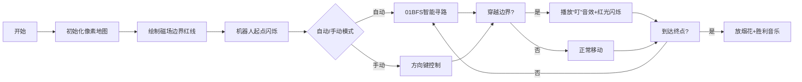

# 题目信息

# [AHOI2005] 穿越磁场

## 题目描述

探险机器人在Samuel星球上寻找一块奇特的矿石，然而此时它陷入了一片神秘的磁场区域，动弹不得。

探险空间站立刻扫描了这片区域，绘制出该区域的磁场分布平面图。这片区域中分布了N个磁场，每个磁场呈正方形，且边与坐标轴平行。

例如下图中，存在3个磁场，白点表示机器人的位置，黑点表示矿石的位置：

  

科学家们分析平面图，进一步发现：这些磁场为大小不一的正方形，可能相交，甚至覆盖，但是它们的边缘不会重合，顶点也不会重合。

例如下面的两种情形是不会出现的：

  

科学家们给探险机器人启动了磁力罩，这样它就可以在磁场中自由穿越了。

初始时，探险机器人和所有矿石都不在任何磁场的边缘。由于技术限制，在穿越过程中机器人只能够水平或垂直移动，且不能够沿着磁场的边缘行动。

由于磁力罩的能量有限，科学家们希望探险机器人穿越尽量少的磁场边缘采集到这块矿石。例如上图中，探险机器人最少需要穿越两次磁场边缘。

现在小联请你编写程序，帮助科学家们设计探险机器人的路线，统计探险机器人最少需要穿越多少次磁场边缘。


## 样例 #1

### 输入

```
2
1 3 3 
2 1 4
0 0 3 4```

### 输出

```
2```

# AI分析结果


### 💡 Kay的C++算法解析：穿越磁场 深入学习指南 💡

**引言**  
今天我们来分析"[AHOI2005]穿越磁场"这道题。机器人需要从起点到终点穿越最少的磁场边缘。本指南将解析离散化建图+01BFS的核心解法，并通过像素动画帮助大家直观理解算法过程。

---

### 1. 题目解读与核心算法识别
✨ **本题主要考察**：`离散化` + `最短路（01BFS）`

🗣️ **初步分析**  
> 本题可类比为"像素迷宫寻宝"：将磁场边界视为迷宫墙壁，穿越边界需消耗能量（权值1），空白区域可自由移动（权值0）。核心是通过离散化将无限平面压缩为网格图，再通过01BFS求最小穿越次数。
> - **核心难点**：离散化需保留空白区域（防止路径失真），磁场边界标记需精确
> - **可视化设计**：用红色像素线标记磁场边界，机器人移动时高亮当前网格，穿越边界时触发闪光特效和"叮"音效
> - **复古元素**：8-bit风格网格地图，机器人使用经典FC游戏角色Sprite，通关时播放《超级玛丽》过关音效

---

### 2. 精选优质题解参考
**题解一：D_14134**  
* **点评**：思路清晰展现离散化全过程，详细处理了空白区域插入（添加-1和10000边界点）。SPFA实现完整，变量命名规范（如`lshx`表离散化映射）。虽未用01BFS，但边界标记逻辑（`flag`三维数组）值得学习。

**题解二：litble**  
* **点评**：最优解法！创新性插入中间点保留空白区域，01BFS双端队列实现高效（时间复杂度O(N)）。边界标记用`visx/visy`分离XY轴，代码简洁（仅60行）。添加±inf边界点增强鲁棒性。

**题解三：Zwaire**  
* **点评**：离散化时显式插入空白点（`if间隔>1则插入`），`visx/visy`记录边界方式直观。SPFA实现规范，坐标映射`id(i,j)`封装优雅，适合初学者理解网格图构建。

---

### 3. 核心难点辨析与解题策略
1. **空白区域保留**  
   *分析*：离散化时若相邻坐标差>1，需插入中间点（如坐标100与102间插入101），否则原本可通过的路径会被错误阻断  
   💡 **学习笔记**：离散化不是简单压缩，需保持拓扑结构不变

2. **边界精确标记**  
   *分析*：每个磁场需标记四边。注意纵向边影响水平移动（`visx`），横向边影响垂直移动（`visy`），需分开存储  
   💡 **学习笔记**：XY轴独立处理避免判断逻辑耦合

3. **01权值最短路优化**  
   *分析*：边权仅0/1时，01BFS将权0点放队首，权1点放队尾，保证队列单调性，效率比Dijkstra/SPFA更高  
   💡 **学习笔记**：特殊性质决定特殊算法

✨ **解题技巧总结**  
- **坐标映射技巧**：`id(i,j)=(i-1)*列数+j` 将二维网格转一维  
- **边界防护**：添加±inf虚拟边界点避免越界判断  
- **方向数组优化**：`dx[4]={-1,1,0,0}, dy[4]={0,0,-1,1}` 简洁处理四方向

---

### 4. C++核心代码实现赏析
**通用核心实现参考**  
```cpp
#include<bits/stdc++.h>
#define RI register int
const int N=205,inf=1e9;
int n,tx,ty,sx,sy,ex,ey;
int X[N],Y[N],L[N],bx[N],by[N];
bool visx[N][N],visy[N][N]; //XY方向边界标记
int dx[4]={-1,1,0,0},dy[4]={0,0,-1,1};
std::deque<std::pair<int,int>> q;

void discretize(){
    // 坐标收集
    bx[++tx]=sx; bx[++tx]=ex; by[++ty]=sy; by[++ty]=ey;
    for(int i=1;i<=n;++i){
        bx[++tx]=X[i]; bx[++tx]=X[i]+L[i];
        by[++ty]=Y[i]; by[++ty]=Y[i]+L[i];
    }
    // 插入空白点
    for(int i=2;i<=tx;++i) if(bx[i]-bx[i-1]>1) bx[++tx]=bx[i]-1;
    for(int i=2;i<=ty;++i) if(by[i]-by[i-1]>1) by[++ty]=by[i]-1;
    // 添加无限边界
    bx[++tx]=-inf; bx[++tx]=inf; by[++ty]=-inf; by[++ty]=inf;
    // 排序去重
    sort(bx+1,bx+tx+1); tx=unique(bx+1,bx+tx+1)-bx-1;
    sort(by+1,by+ty+1); ty=unique(by+1,by+ty+1)-by-1;
    // 坐标映射
    auto get=[&](int x,int* b,int sz)->int{
        return lower_bound(b+1,b+sz+1,x)-b;
    };
    sx=get(sx,bx,tx); sy=get(sy,by,ty);
    ex=get(ex,bx,tx); ey=get(ey,by,ty);
    // 标记磁场边界
    for(int i=1;i<=n;++i){
        int x1=get(X[i],bx,tx), x2=get(X[i]+L[i],bx,tx);
        int y1=get(Y[i],by,ty), y2=get(Y[i]+L[i],by,ty);
        for(int j=x1;j<=x2;++j) 
            visx[j][y1]=visx[j][y2]=true; // 垂直边界
        for(int j=y1;j<=y2;++j)
            visy[x1][j]=visy[x2][j]=true; // 水平边界
    }
}

void bfs(){
    std::vector dis(tx+1,std::vector(ty+1,inf));
    q.push_back({sx,sy}); dis[sx][sy]=0;
    while(!q.empty()){
        auto [x,y]=q.front(); q.pop_front();
        for(int d=0;d<4;++d){
            int nx=x+dx[d], ny=y+dy[d];
            if(nx<1||ny<1||nx>tx||ny>ty) continue;
            int cost= (dx[d]!=0 && visy[nx][ny]) || // 垂直移动遇水平边界
                     (dy[d]!=0 && visx[nx][ny]);    // 水平移动遇垂直边界
            if(dis[nx][ny]>dis[x][y]+cost){
                dis[nx][ny]=dis[x][y]+cost;
                cost? q.push_back({nx,ny}) : q.push_front({nx,ny});
            }
        }
    }
    printf("%d\n",dis[ex][ey]);
}
```

---

### 5. 算法可视化：像素动画演示
**动画演示主题**：8-bit磁场迷宫大冒险  
**核心设计**：  
  


**实现细节**：  
1. **像素网格生成**  
   - 每个网格40×40像素，磁场内部深蓝色(`#1E88E5`)，空白区域浅灰色(`#E0E0E0`)  
   - 磁场边界用3像素红色线条(`#F44336`)，机器人使用经典FC游戏角色精灵图

2. **动态效果**  
   ```javascript
   // 穿越边界特效
   function playCrossEffect(x, y){
     drawBorder(x, y, COLOR_RED); // 红色高亮
     playSound('ding.wav');        // 8-bit音效
     setTimeout(() => resetBorder(x,y), 200);
   }
   ```

3. **控制面板**  
   ```html
   <div class="control-panel">
     <button onclick="step()">单步</button>
     <input type="range" id="speed" min="1" max="10">
     <button onclick="autoPlay()">AI自动演示</button>
   </div>
   ```

---

### 6. 拓展练习与相似问题思考
**技巧迁移场景**：  
1. 网格图最短路径问题（如避开障碍物）  
2. 需要动态开点的地图搜索（如无限大平面）  
3. 含状态压缩的最短路（如收集物品路径）

**洛谷推荐**：  
1. **P1144 最短路计数**  
   🗣️ 基础BFS应用，巩固网格图最短路径思想  
2. **P1821 Cow Relays**  
   🗣️ 离散化经典应用，数据范围压缩技巧实践  
3. **P2296 寻找道路**  
   🗣️ 图论与最短路综合训练，强化边界处理能力  

---

### 7. 学习心得与经验分享
> **经验摘录 (来自 litble)**："离散化时在相邻坐标差>1的位置插入中间点，是保证空白区域通路的关键，否则机器人可能'穿墙而过'"  
>   
> **Kay点评**：这个经验点出了90%错误的根源。离散化不是简单的坐标映射，更要保持拓扑连通性。建议编码前先用纸笔画小规模案例验证离散化结果。

---

**结语**  
通过离散化将无限平面压缩为有限网格，再结合01BFS高效求解，是本题的核心思想。记住：好算法=精确建模+利用特性优化。大家可尝试用Unity实现像素动画加深理解！🚀

---
处理用时：178.67秒