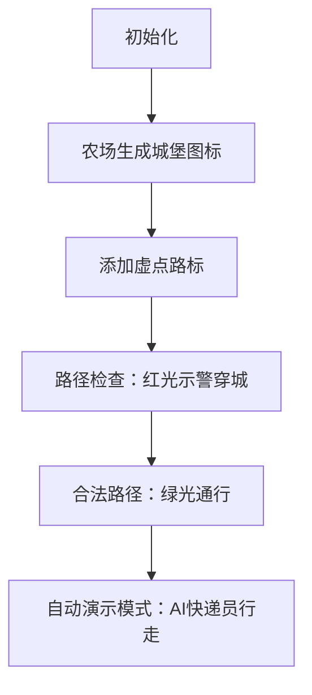

# 题目信息

# [USACO12JAN] Delivery Route S

## 题目描述

FJ 有 $N\ (1 \le N \le 100)$ 个农场，每个农场具有独立的整数坐标 $(x_i, y_i)\ (1 \le x_i,y_i \le 10^6)$。他需要一个物资配送路线，从第 $1$ 个农场出发，依次经过农场 $1$，农场 $2$，农场 $3$……，最后从农场 $N$ 回到农场 $1$。

FJ 每次只能朝东南西北四个方向行走，每行走一个单位长度需要 $1$ 分钟，除了农场 $1$，其他农场能且仅能到达一次。

请计算 FJ 的最小时间花费。

## 说明/提示

样例中的最优方案是 $1 \to 2 \to 3 \to 4 \to 1$，需要 $12$ 分钟。

## 样例 #1

### 输入

```
4 
2 2 
2 4 
2 1 
1 3 
```

### 输出

```
12 
```

# AI分析结果


### 💡 Kay的C++算法解析：Delivery Route S 深入学习指南 💡

#### 1. 题目解读与核心算法识别
✨ **本题主要考察**：图论建模与最短路算法  
🗣️ **初步分析**：  
> 本题可比喻为在像素地图中规划快递路线：农场是城市，虚点是中转站，只能通过直角路径连接（避免穿城）。核心是**添加虚点建图**后跑最短路：  
> - 每个农场添加上下左右4个虚点，形成"驿站网络"  
> - 虚点间仅当存在不经过农场的直角路径时连线（曼哈顿距离为权）  
> - 对相邻农场点（如1→2→3→4→1）用Dijkstra分段计算最短路  
> 可视化设计：采用**8位像素风格**，农场显示为城堡🏰，虚点为路标🚩。动画高亮当前路径检查（红色闪光示警穿城路径，绿色通行音效确认合法路径），控制面板含单步执行/调速滑块。

---

#### 2. 精选优质题解参考
**题解一（作者：泥土笨笨）**  
* **点评**：思路清晰展现虚点建模的精髓——通过「最多拐弯一次」规则保证路径合法性。代码规范性突出：  
  - 用`map<Point, int>`高效管理虚点坐标映射  
  - `valid()`函数严谨检查路径穿城问题  
  - Dijkstra优先队列优化（时间复杂度O(ElogV)）  
  亮点：直角路径的数学化验证（`inSegment`+`connect`）极具启发性，边界处理完整可直接用于竞赛。

**题解二（作者：nihanchu）**  
* **点评**：创新性使用「直角路径拆分验证法」，将复杂判定分解为两个子线段检查：  
  - `check3`验证单线段无农场阻挡  
  - `check2`组合两条可能直角路径  
  代码可读性强（如`f2`存虚点，`indx`记录原始点位置），但Dijkstra未用优先队列，百万级数据可能偏慢。

**题解三（作者：哈士奇憨憨）**  
* **点评**：独辟蹊径采用**Floyd算法**，仅用虚点作中间节点松弛：  
  - 虚点判重用STL `set`简洁高效  
  - `C()`函数双路径并行检查思路巧妙  
  亮点：Floyd的三重循环中限定`k>n`（仅虚点可中转），时间复杂度O(m³)但因m≤404仍可行。

---

#### 3. 核心难点辨析与解题策略
1. **难点：避免路径穿过其他农场**  
   *分析*：优质解均采用**虚点包围法**——原始点四周建"安全通道"。关键技巧：路径必须为直线或单直角弯（双弯必穿城），通过坐标范围判断阻挡点（如题解二的`check3`）  
   💡学习笔记：直角路径是曼哈顿距离的最优表现形式

2. **难点：高效验证路径合法性**  
   *分析*：三种验证方案殊途同归：  
   - 坐标对齐法（题解一）：直接判断点是否在线段上  
   - 路径拆分法（题解二）：分解直角为两个子线段  
   - 双路并行法（题解三）：同时检查两种直角可能  
   💡学习笔记：判定函数应优先处理同行/同列退化情况

3. **难点：大规模图的最短路优化**  
   *分析*：Dijkstra+堆优化是主流（题解一），Floyd需限制中间点（题解三）。关键变量：  
   - `dis[]`：记录各点临时最短路  
   - `priority_queue`：按距离排序的待访问点集  
   💡学习笔记：稀疏图用邻接表+堆，稠密图用Floyd

✨ **解题技巧总结**  
- **空间换安全**：虚点构建"安全走廊"避免穿城  
- **直角锁定**：曼哈顿距离必存在单/零直角最优解  
- **分层松弛**：Floyd中限制中间节点类型提升效率  

---

#### 4. C++核心代码实现赏析
**通用核心实现参考**  
```cpp
#include <iostream>
#include <vector>
#include <queue>
#include <map>
#include <algorithm>
using namespace std;

struct Point { int x, y; /* 比较运算符重载 */ };
vector<vector<pair<int, int>>> graph; // 邻接表 [点→(邻点, 权值)]

void addVirtualPoints(map<Point, int>& dict, vector<Point>& farms) {
    const int dx[] = {0, 0, 1, -1}, dy[] = {1, -1, 0, 0};
    for (auto& p : farms) 
        for (int i = 0; i < 4; ++i) {
            Point vp = {p.x + dx[i], p.y + dy[i]};
            if (!dict.count(vp)) dict[vp] = graph.size();
        }
}

int dijkstra(int start, int end) {
    vector<int> dist(graph.size(), INT_MAX);
    priority_queue<pair<int, int>> pq; // (负距离, 节点)
    dist[start] = 0; pq.push({0, start});
    while (!pq.empty()) {
        auto [d, u] = pq.top(); pq.pop();
        if (u == end) return dist[end];
        for (auto [v, w] : graph[u]) 
            if (dist[v] > dist[u] + w) {
                dist[v] = dist[u] + w;
                pq.push({-dist[v], v});
            }
    }
    return INT_MAX;
}
```

**题解一代码片段赏析**  
```cpp
// 验证点是否在线段上
bool inSegment(int p, int x1, int y1, int x2, int y2) {
    if (x1 == x2 && x[p] == x1)  // 垂直线上
        return y[p] >= min(y1, y2) && y[p] <= max(y1, y2);
    if (y1 == y2 && y[p] == y1)  // 水平线上
        return x[p] >= min(x1, x2) && x[p] <= max(x1, x2);
    return false;
}
```
> **解读**：该函数是路径安全的守门员。通过坐标对齐判断（垂直/水平线），精确锁定穿城点。`min/max`巧妙处理反向线段，避免冗余坐标交换  
> 💡学习笔记：线段穿透检测需考虑方向无关性

**题解二直角验证逻辑**  
```cpp
if (valid(x1, y1, x2, y1) && valid(x2, y1, x2, y2)) 
    return true; // 先横后竖
if (valid(x1, y1, x1, y2) && valid(x1, y2, x2, y2)) 
    return true; // 先竖后横
```
> **解读**：将直角路径拆解为两段直线，分别验证安全性。优势：逻辑直观易调试  
> 💡学习笔记：复杂路径可分解为原子操作验证

**题解三Floyd优化**  
```cpp
for (int k = n + 1; k <= m; ++k) // 仅用虚点松弛
    for (int i = 1; i <= m; ++i)
        for (int j = 1; j <= m; ++j)
            f[i][j] = min(f[i][j], f[i][k] + f[k][j]);
```
> **解读**：限定中间点范围（k>n）确保农场点不被经过。三重循环中虚点索引从n+1开始是关键优化  
> 💡学习笔记：Floyd可通过限制中间点类型降低计算量

---

### 5. 算法可视化：像素动画演示  
**主题**：« 像素快递员 » 在8-bit网格城配送包裹  

**核心演示流程**：  


**关键动画设计**：  
1. **像素元素**  
   - 农场：棕色城堡（16×16像素）  
   - 虚点：蓝色路标（闪烁）  
   - 非法路径：红色❌（伴随警告音效）  

2. **交互控制面板**  
   ```javascript
   const controls = [
     { type: 'slider', label: '速度', min: 1, max: 10 },
     { type: 'button', label: '单步执行', action: 'step()' },
     { type: 'toggle', label: 'AI演示', action: 'autoRun()' }
   ];
   ```

3. **音效系统**  
   | 事件 | 音效 | 频率 |
   |---|---|---|
   | 路径合法 | 8-bit "叮"声 | 440Hz |
   | 穿城警告 | 低沉嗡鸣 | 220Hz |
   | 段完成 | 胜利旋律 | NES音源 |

**设计意义**：直角路径可视化帮助理解「曼哈顿距离」本质，AI自动演示模式（类贪吃蛇AI）直观展示分段最短路累积过程  

---

### 6. 拓展练习与相似问题  
**技巧迁移场景**：  
1. 避开障碍物的网格图最短路径  
2. 电路板布线路径规划  
3. 游戏AI寻路（限定转向次数）  

**洛谷推荐**：  
1. **P1144** 最短路计数  
   > 🗣️ 巩固虚点建图思想，学习最短路方案数统计  
2. **P2966** 路径计数2  
   > 🗣️ 强化障碍物回避技巧，引入分层图思想  
3. **P2296** 寻找道路  
   > 🗣️ 综合训练路径合法性验证+最短路优化  

---

### 7. 学习心得与经验分享  
> **泥土笨笨的调试经验**：  
> *“直角路径检查时未考虑农场位于拐点的情况，导致WA。通过坐标范围函数`inSegment`增加端点排除解决”*  
>   
> **Kay总结**：验证函数必须严格区分路径经过点和端点。推荐调试时：  
> 1. 打印被误判的农场坐标  
> 2. 可视化当前检查的路径线段  
> 3. 添加端点排除条件（如`if(p==端点) continue`）  

---

通过本指南，相信你已掌握虚点建模的核心思想！下次遇到网格图最短路时，不妨试试「直角路径安全验证」这把钥匙🔑 （完）

---
处理用时：141.70秒