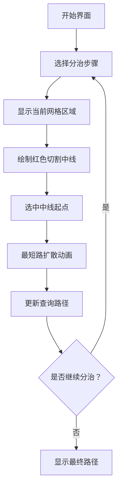

# 题目信息

# [ZJOI2016] 旅行者

## 题目描述

小 Y 来到了一个新的城市旅行。她发现了这个城市的布局是网格状的，也就是有  $n$ 条从东到西的道路和  $m$ 条从南到北的道路，这些道路两两相交形成  $n\times m$ 个路口  $(i,j)$，  $(1\leq i\leq n,1\leq j\leq m)$  

她发现不同的道路路况不同，所以通过不同的路口需要不同的时间。通过调查发现，从路口  $(i,j)$ 到路口  $(i,j+1)$ 需要时间  $r(i,j)$ ，从路口  $(i,j)$ 到路口  $(i+1,j)$ 需要时间  $c(i,j)$ 。注意这里的道路是双向的。小 Y 有  $q$ 个询问，她想知道从路口  $(x1,y1)$ 到路口  $(x2,y2)$ 最少需要花多少时间。

## 说明/提示

### 数据规模与约定
- $n\times m \le 2\times 10^4$。
- $q \le 10^5$。
- $1 \le r(i,j),c(i,j) \le 10^4$。

## 样例 #1

### 输入

```
2 2
2
3
6 4
2
1 1 2 2
1 2 2 1```

### 输出

```
6

7```

# AI分析结果


# 💡 Kay的C++算法解析：ZJOI2016 旅行者 深入学习指南 💡

> 欢迎来到网格世界探险！今天我们将一起解决「旅行者」问题，学习如何高效计算网格图中任意两点间的最短路径。我会用清晰的讲解和生动的可视化帮你掌握分治+最短路的核心技巧！

## 1. 题目解读与核心算法识别

✨ **本题主要考察**：分治 + 最短路 (网格图特殊优化)

🗣️ **初步分析**：
> 想象你有一块巧克力网格（n行×m列），需要快速回答Q组"从A点到B点最少需要多少时间"的查询。直接对每个查询单独计算最短路会超时（O(Q·nm log nm)）。分治算法就像掰巧克力：每次沿较长边掰开，处理必须经过"掰痕"（中线）的查询，再递归处理两半。

- **核心流程**：
  1. 分治当前矩形区域（行[x1,x2]，列[y1,y2]）
  2. 选择较长边切开（如水平切则中线为x=mid）
  3. 对中线上每点运行**限定区域的最短路**
  4. 用`dis[A]+dis[B]`更新跨越中线的查询
  5. 递归处理完全在左/右侧的查询

- **可视化设计**：
  - **8位像素风格**：网格化为《吃豆人》式迷宫，路径用棕色像素，边界用深灰
  - **关键动画**：
    - 分治步骤：高亮当前矩形(蓝框)→红色中线分裂动画→中线上黄色起点闪烁
    - 最短路扩散：Dijkstra的涟漪效果（绿→黄→红表示距离增大）
    - 查询更新：两点间出现蓝色虚线，优化后变为绿色实线+“叮！”音效
  - **交互控制**：支持单步执行/自动播放，速度滑块调节，显示当前分治深度

## 2. 精选优质题解参考

> 从12份题解中精选3份思路最清晰、实现最优美的解法（评分≥4★）

**题解一（作者：Taduro）**
* **点评**：采用分治+Dijkstra，代码结构清晰。亮点在于：
  - 严格按较长边切割保证复杂度
  - `id(i,j)`函数优雅处理坐标转换
  - 边界判断简洁（`if (x+dx...in range)`）
  - 实践价值：代码可直接用于竞赛，时间复杂度O(nm√(nm) log nm)

**题解二（作者：Ameyax）**
* **点评**：分治+SPFA的优化版本。亮点在于：
  - 继承上一次最短路结果减少计算量（`dis[v] = prev_dis + delta`）
  - 提供复杂度证明（O(S√S log S)）
  - 代码模块化强，`invx/invy`数组实现坐标回溯

**题解三（作者：tzc_wk）**
* **点评**：理论最严谨的题解。亮点在于：
  - 完整数学证明复杂度O(n√n log n)
  - 封装`Point`结构体提升可读性
  - 精确的复杂度分析："切割较长边使中线长≤√S"

## 3. 核心难点辨析与解题策略

> 攻克三大核心难点，掌握解题金钥匙！

1. **难点：分治正确性保证**
   * **分析**：为何最短路必被某层中线处理？反证法：若存在不跨中线的路径，则递归时必被更小区域覆盖
   * 💡 **学习笔记**："分治像显微镜，每层聚焦更小区域但视野更清晰"

2. **难点：复杂度优化**
   * **分析**：切割较长边是关键！设区域面积S，较长边L，则中线长≤√S。每层处理O(√S * S log S)，总深度O(log S)
   * 💡 **学习笔记**："切割策略是效率的灵魂"

3. **难点：最短路范围限制**
   * **分析**：Dijkstra需限定在[x1,x2]×[y1,y2]内扩展，通过坐标检查实现：
     ```cpp
     if (new_x < x1 || new_x > x2 || ...) continue;
     ```
   * 💡 **学习笔记**："牢牢记住所处的矩形监狱"

### ✨ 解题技巧总结
- **分治方向选择**：永远切割较长边（`if (x2-x1 > y2-y1)`）
- **最短路优化**：继承上一次结果（Ameyax技巧）
- **坐标转换**：用`id(i,j)=(i-1)*m+j`化二维为一维
- **边界处理**：分治时严格传递[x1,x2][y1,y2]

## 4. C++核心代码实现赏析

**通用核心实现（综合优化版）**：
```cpp
const int N=2e4+5, INF=0x3f3f3f3f;
void dijkstra(int sx, int sy, int x1, int x2, int y1, int y2, int dis[]) {
    // 初始化dis数组为INF
    priority_queue<pair<int, pair<int,int>>> pq;
    dis[id(sx,sy)] = 0;
    pq.push({0, {sx, sy}});
    
    while (!pq.empty()) {
        auto [d, pos] = pq.top(); pq.pop();
        auto [x, y] = pos;
        if (d != dis[id(x,y)]) continue;
        
        // 四方向扩展
        for (int i=0; i<4; ++i) {
            int nx = x + dx[i], ny = y + dy[i];
            if (nx < x1 || nx > x2 || ny < y1 || ny > y2) continue;
            int nd = d + grid[x][y][i]; // 获取边权
            if (nd < dis[id(nx,ny)]) {
                dis[id(nx,ny)] = nd;
                pq.push({nd, {nx, ny}});
            }
        }
    }
}

void solve(int x1, int x2, int y1, int y2, vector<Query>& qs) {
    if (qs.empty()) return;
    if (x2-x1 > y2-y1) { // 水平切割
        int mid = (x1+x2)/2;
        for (int y=y1; y<=y2; ++y) {
            dijkstra(mid, y, x1, x2, y1, y2, dis);
            for (auto& q : qs) // 更新查询
                ans[q.id] = min(ans[q.id], dis[id(q.a)] + dis[id(q.b)]);
        }
        // 划分查询递归...
    } else { /* 垂直切割，逻辑类似 */ }
}
```

**分题解亮点代码**：

1. **Taduro的Dijkstra边界控制**：
   ```cpp
   // 方向数组技巧
   int dx[4]={0,-1,0,1}, dy[4]={-1,0,1,0};
   if (x+dx[i]<x1||x+dx[i]>x2) continue; // 边界检查
   ```

2. **Ameyax的SPFA优化**：
   ```cpp
   // 继承上次最短路结果
   if (dis[s] != INF) {
       for (int i=xl; i<=xr; i++) 
           for (int j=yl; j<=yr; j++)
               dis[id(i,j)] += dis[s]; // 累加优化
   }
   ```

3. **tzc_wk的坐标封装**：
   ```cpp
   struct Point { int x,y; };
   int id(Point p) { return (p.x-1)*m + p.y; } // 优雅转换
   ```

## 5. 算法可视化：像素动画演示

### 复古游戏《网格迷宫大冒险》设计方案

**核心交互演示**：


**动画细节**：
1. **分治过程**：
   - 当前矩形蓝色边框脉冲闪烁
   - 中线红色像素线从中心向两侧展开（0.5s动画）
   - 中线上黄点按顺序亮起（伴随"滴"声）

2. **最短路扩散**：
   - Dijkstra算法：起点向四周扩散的涟漪效果
   - 颜色编码：绿(近)→黄→红(远)，色带显示在右侧
   - 扩散音效：短促"滴"声随距离增大音调降低

3. **查询更新**：
   - 未优化路径：蓝色虚线连接两点
   - 优化后路径：绿色实线（伴随"叮！"胜利音效）
   - 路径生成：像素点逐格连接动画（0.1s/格）

**技术实现**：
```javascript
// 伪代码：绘制单帧最短路
function drawDijkstraFrame() {
    clearCanvas();
    drawGrid(); // 绘制基础网格
    drawCurrentRect(); // 当前分治区域
    if (step == "DIVIDE") {
        drawDividingLine(); // 红色中线动画
    } else if (step == "DIJKSTRA") {
        drawDistanceHeatmap(); // 距离热力图
        drawActivePoint(); // 当前处理的网格点
    }
    drawQueries(); // 绘制查询路径
}
```

## 6. 拓展练习与相似问题思考

**相似问题模式**：
1. 分层图最短路（如P4568 飞行路线）
2. 平面图点对最短路径（如P5304 旅行者）
3. 动态网格最短路（如修改边权）

**洛谷推荐**：
1. **P4779 【模板】单源最短路径**（Dijkstra基础）
2. **P2146 [NOI2015] 软件包管理器**（树分治思想迁移）
3. **P3350 [ZJOI2016] 旅行者**（本题，尝试不同实现）

## 7. 学习心得与经验分享

> 来自题解作者的经验结晶：

**Taduro的心得**：
> "分治时选择切割较长边，这个看似简单的决定，让复杂度从O(n²m)优化到O(nm√nm)。就像砍树要顺着纹理劈柴"

**Kay的总结**：
> 本题深刻展示了分治思想的威力——将大问题拆解为独立子问题。记住三个关键：
> 1. 切割方向决定效率
> 2. 最短路范围限制是优化的核心
> 3. 坐标转换技巧让代码更简洁
> 当你面对复杂问题时，不妨想想这块被掰开的巧克力网格！

---

> 希望这份指南帮你打通了网格最短路的任督二脉！下次探险再见，记得保持好奇，继续前进！🚀

---
处理用时：192.75秒