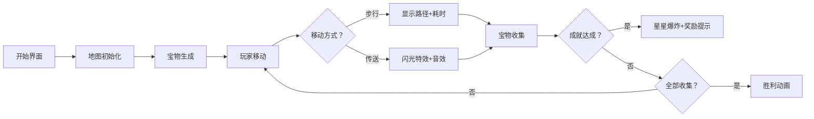
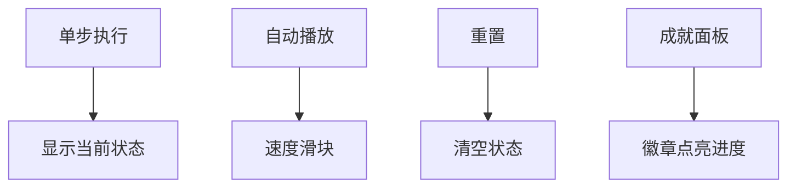

# 题目信息

# [MtOI2018] gcd？人生赢家！

## 题目背景

gcd 是一个热爱游戏的人。

## 题目描述

gcd 最近在玩一个有趣的游戏。

我们把这个游戏抽象成一张图，图上有 $n$ 个点，gcd 需要寻找总计 $m$ 件宝物，它们分布在图上。

对于每件宝物而言，将会有一个前置集合 $S$。只有当取得所有前置宝物时，才能获得该宝物。

gcd 拥有一件神器，这件神器具有传送功能，它可以使用 $k$ 次，可以传送到一个任意节点。

对于游戏而言，肯定会有额外的成就，这些成就会奖励一定的传送次数，成就的达成是满足集合 $S$ 的一瞬间。

现在 gcd 想知道能最快通关的方法，请你求出通关的最少时间。

## 说明/提示

### 子任务

对于 $20\%$ 的数据，$s=0$。

对于 $100\%$ 的数据，$n\leq 200$，$m\leq 12$，$k\leq 4$，$s\leq 8$，$e\leq 20000$ ，奖励次数总和不超过 $8$，保证每两个宝物的位置不相同，可能有重边，保证有解。

### 题目来源

[MtOI2018 迷途の家の水题大赛](https://www.luogu.org/contest/11260) T5

出题人：b2019dy

78488

## 样例 #1

### 输入

```
3 2 0
1
1 1
1
2 3
3
1 2 20
1 3 20
3 2 1
0
0
1
```

### 输出

```
20```

## 样例 #2

### 输入

```
3 2 0
1
1 1
1
2 3
3
1 2 1
1 3 20
3 2 20
1 2
0
1```

### 输出

```
40```

# AI分析结果


# 💡 Kay的C++算法解析：[MtOI2018] gcd？人生赢家！ 深入学习指南 💡

## 1. 题目解读与核心算法识别

✨ **本题主要考察**：`状态压缩动态规划` + `图论最短路`

🗣️ **初步分析**：
> 这道题就像在像素游戏地图上收集钥匙通关：你需要按顺序收集宝物（每把钥匙需要前置钥匙），同时拥有瞬间移动道具（传送神器）和成就奖励机制。解题关键在于：
> - **状态压缩(状压)**：用一个二进制数表示已收集的宝物（就像背包格子点亮效果）
> - **动态规划**：记录每种收集状态、当前位置和传送次数下的最短时间
> - **Floyd最短路**：预处理任意两点间最短距离（就像解锁地图传送点）
> 
> **可视化设计思路**：我们将设计一个8-bit RPG风格的动画——主角在网格地图移动，收集宝物时点亮对应图标，传送时出现像素闪光特效。关键高亮：
> - 宝物收集状态（二进制进度条）
> - 传送次数计数器（道具栏显示）
> - 成就达成时的奖励特效（星星爆炸+音效）

---

## 2. 精选优质题解参考

### 题解一：Drawing_Yang (状压DP)
* **点评**：该解法采用经典状压DP框架，思路清晰直白。亮点在于：
  - 使用**lowbit优化**状态枚举，显著提升效率
  - 预处理**成就奖励映射**，避免重复计算
  - 完整处理**边界条件**（无前置宝物初始化）
  - 代码变量命名规范（`f[s][i][j]`状态含义明确）

### 题解二：_Wind_Leaves_ShaDow_ (状态压缩BFS)
* **点评**：创新性使用优先队列BFS实现状态转移：
  - **实时成就奖励计算**：动态获取新增传送次数
  - **记忆化剪枝**：三维vis数组避免重复状态
  - **Dijkstra思想**：优先队列保证最优解
  - 结构体封装状态，代码可读性极佳

---

## 3. 核心难点辨析与解题策略

1.  **关键点1：状态空间设计**
    * **分析**：需同时表示宝物集合+当前位置+传送次数。状压DP中用`f[state][pos][k]`三维数组，BFS用`(state, pos, k)`三元组
    * 💡 **学习笔记**：状态压缩的本质是将指数级组合转化为二进制数处理

2.  **关键点2：前置条件校验**
    * **分析**：收集新宝物前需检查`current_state & pre_req == pre_req`。题解中用位运算`bf[i]`存储前置要求
    * 💡 **学习笔记**：位运算`&`是检查集合包含关系的利器

3.  **关键点3：成就奖励整合**
    * **分析**：成就达成会动态增加传送次数。解法一预处理状态奖励映射，解法二实时计算增量
    * 💡 **学习笔记**：奖励机制应视为状态转移的一部分

### ✨ 解题技巧总结
- **技巧1：Floyd预处理**：200节点图的最短路预处理是效率关键
- **技巧2：lowbit枚举优化**：快速遍历状态中的元素 `while(s) { i = lowbit(s); s -= i; }`
- **技巧3：状态初始化策略**：仅初始化无前置要求的宝物，避免无效状态

---

## 4. C++核心代码实现赏析

### 通用核心实现（综合优化版）
```cpp
#include <cstring>
#include <algorithm>
const int INF = 0x3f3f3f3f;
int f[1<<12][13][13]; // [state][pos][k]
int g[205][205];      // Floyd矩阵
int pre[20], ach[10]; // 宝物前置/成就状态

void initFloyd(int n) {
    for(int k=1; k<=n; ++k)
    for(int i=1; i<=n; ++i)
    for(int j=1; j<=n; ++j)
        g[i][j] = min(g[i][j], g[i][k]+g[k][j]);
}

int solve(int n, int m, int K, int start) {
    memset(f, 0x3f, sizeof f);
    // 初始化无前置宝物
    for(int i=0; i<m; ++i) 
        if(!pre[i]) {
            f[1<<i][i][0] = g[start][pos[i]];
            if(K) f[1<<i][i][1] = 0;
        }
    
    for(int s=0; s<(1<<m); ++s)
    for(int i=s; i; i-=lowbit(i)) {
        int cur = __builtin_ctz(lowbit(i));
        if((s^ (1<<cur)) & pre[cur]) continue;
        
        for(int j=s; j; j-=lowbit(j)) {
            int prev = __builtin_ctz(lowbit(j));
            int cost = g[pos[prev]][pos[cur]];
            
            for(int k=0; k<=maxK; ++k) {
                // 正常移动
                f[s][cur][k] = min(f[s][cur][k], 
                    f[s^(1<<cur)][prev][k] + cost);
                // 使用传送
                if(k) f[s][cur][k] = min(f[s][cur][k],
                    f[s^(1<<cur)][prev][k-1]);
            }
        }
    }
    // 返回最终状态最小值
    return *min_element(f[(1<<m)-1][0], f[(1<<m)-1][0]+K+8); 
}
```
* **代码解读概要**：
  1. **Floyd预处理**：计算任意节点间最短路
  2. **状态初始化**：仅处理无前置要求的起始宝物
  3. **三重循环转移**：遍历所有状态/当前位置/传送次数
  4. **双移动策略**：正常移动增加距离，传送消耗次数

### 题解一核心片段（Drawing_Yang）
```cpp
for(int s=0; s<(1<<m); s++) {
    for(int i=s; i; i-=lowbit(i)) {
        int t1 = __builtin_ctz(lowbit(i));
        if (((s^(1<<t1)) & pre[t1]) != pre[t1]) continue;
        
        for(int j=s^(1<<t1); j; j-=lowbit(j)) {
            int t2 = __builtin_ctz(lowbit(j));
            int cost = g[pos[t2]][pos[t1]];
            
            for(int k=0; k<=maxK; k++) {
                // 正常移动
                f[s][t1][k] = min(f[s][t1][k], 
                    f[s^(1<<t1)][t2][k] + cost);
                // 传送
                if(k) f[s][t1][k] = min(f[s][t1][k],
                    f[s^(1<<t1)][t2][k-1]);
            }
        }
    }
}
```
* **亮点**：lowbit遍历状态中所有宝物
* **学习笔记**：`__builtin_ctz`获取二进制末尾0的个数是位运算优化利器

### 题解二核心片段（_Wind_Leaves_ShaDow_）
```cpp
struct Node{ int pos, state, k, cost; 
    bool operator>(const Node& o) const { 
        return cost > o.cost; 
    } 
};

priority_queue<Node, vector<Node>, greater<Node>> pq;

while(!pq.empty()) {
    auto [pos, s, k, cost] = pq.top(); pq.pop();
    if(vis[pos][s][k]) continue;
    vis[pos][s][k] = true;
    
    if(s == FINAL) return cost;
    
    for(int i=0; i<m; ++i) {
        if(s & (1<<i)) continue; // 已收集
        if((s & pre[i]) != pre[i]) continue; // 检查前置
        
        int new_s = s | (1<<i);
        int new_k = k + ach[new_s] - ach[s]; // 成就增量
        
        // 正常移动
        pq.push({i, new_s, new_k, cost + g[pos][i]});
        // 传送
        if(new_k > 0) 
            pq.push({i, new_s, new_k-1, cost});
    }
}
```
* **亮点**：优先队列实现类Dijkstra搜索
* **学习笔记**：成就奖励增量计算避免全局重算

---

## 5. 算法可视化：像素动画演示

### 像素探险家寻宝记
**设计思路**：采用经典8-bit RPG风格（类似初代塞尔达），通过以下元素直观展示算法：


**关键动画帧**：
1. **世界初始化**（8-bit风格）：
   - 网格地图（20x20像素块）
   - 宝物图标（不同颜色钻石）
   - 玩家像素角色（16x16）

2. **移动过程**：
   - **步行**：沿Floyd路径移动，显示足迹和耗时计数器
   - **传送**：角色闪烁消失→目标位置像素粒子重组

3. **宝物收集**：
   - 接触宝物时播放"叮"音效
   - 状态栏对应宝物位点亮（二进制进度条）

4. **成就系统**：
   - 达成时播放胜利旋律
   - 传送次数`+N`浮动显示
   - 成就徽章点亮特效

**交互控制面板**：


**音效设计**：
- 移动：8-bit脚步声（不同地形不同音调）
- 传送："嗖"的科幻音
- 成就：经典FC过关旋律
- 错误：短促"哔"声

---

## 6. 拓展练习与相似问题思考

### 相似问题模式
1. **旅行商问题(TSP)**：访问所有节点的最短路径
2. **钥匙与房间**：有前置条件的图遍历
3. **状态压缩+BFS**：小规模状态空间搜索

### 推荐练习（洛谷）
1. **P1171 售货员的难题**  
   → 经典TSP问题，巩固状压DP基础
2. **P2831 愤怒的小鸟**  
   → 状态压缩+几何判断的优秀练习
3. **P3959 宝藏**  
   → 状态压缩与生成树的完美结合

---

## 7. 学习心得与经验分享

> **来自Drawing_Yang的经验**：  
> "成就奖励的预处理是本题关键，直接动态计算会导致状态转移复杂度过高"

> **来自_Wind_Leaves_ShaDow_的教训**：  
> "BFS一定要在pop时标记vis，而不是push时，否则会错过更优解"

**Kay的总结**：  
1. 状压问题优先考虑位运算优化（lowbit/__builtin_ctz）
2. 动态增加的状态量（如传送次数）要设计增量更新
3. 预处理是降低复杂度的关键手段
4. BFS和DP各有适用场景：DP适合状态转移清晰，BFS适合实时决策

---

通过本指南，希望大家能掌握状态压缩DP的精髓，并在未来的算法学习中举一反三。记住：每个复杂的算法都可以拆解成像素游戏般的小关卡，逐步征服它们吧！🚀

---
处理用时：171.83秒