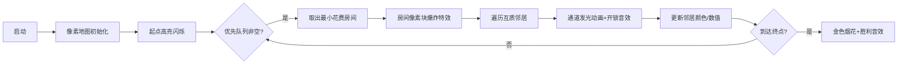

# 题目信息

# 抓捕

## 题目背景

@葛军  原创

古桥文乃作为一名OIer，每天勤奋地在洛谷上刷题，然而她的父母却认为他有网瘾，就将她送到了杨叫兽的网戒中心。


一年之后，凭借不懈地努力古桥文乃终于逃了出来，并且立刻向警察蜀黍举报杨叫兽的所作所为，了解情况后警察请她带路去网戒中心抓捕杨叫兽。

## 题目描述

啊~~~~！

他们刚到达网戒中心就听到惨叫声从里面传来。古桥文乃在网戒中心呆了一年，对里面的情况很熟悉，立马就知道杨叔又在13号治疗室“点现钱”。同时，她知道网戒中心有$n$个房间，任意房间都有走廊相连，每个走廊和房间之间都有门，门是向外锁上的，且在开启后会自动锁上（即每次从房间$i$进入任意一个与其相连的走廊需要花费$c_i$的体力开锁，而从走廊进入房间不用耗费体力）。

杨叔为了防止“盟友”逃跑，在每个房间安装了摄像头，安排了$n$个手下在监控中心看着监控。

**特别的，1号房间为监控中心，1号手下负责防止任何人（除了杨叔）进入监控中心（否则立刻报告给杨叔）**，

其余的2号到$n$号手下每人负责监控编号是自己整数倍的房间（例如$n=10$时2号手下监控2号，4号，6号，8号，10号房间），13号治疗室也按照此规则被监控，如果他们其中一个人看到同一个人两次，就会向杨叔报告（但是每一个手下不会互相交流信息），好在这些手下都四肢发达头脑简单，只能记得上一秒的事情。

为了保证抓捕的顺利，古桥文乃和警察不能被发现，现在他们在$x$号房间，13号治疗室在$y$号房间，已知他们通过每一条走廊要1秒，开锁和通过房间不用花费时间（但会被监控室的手下看到），古桥文乃和警察想知道他们在不被发现的情况下最少要花费多少体力才能进入13号治疗室。

## 说明/提示

2->3->4

对于30%的数据，$n$<=$1500$，$T$<=$15$；

对于50%的数据，$n$<=$2500$，$T$<=$30$；

对于70%的数据，$n$<=$4500$，$T$<=$50$；

对于100%的数据，$n$<=$4500$，$T$<=$200$，$2$<=$x$,$y$<=$n$，$c_i$<=$9900$

## 样例 #1

### 输入

```
1
5
2 4
1 2 3 4 5```

### 输出

```
5```

# AI分析结果


### 💡 Kay的C++算法解析：抓捕 深入学习指南 💡

**引言**  
今天我们来分析「抓捕」这道C++编程题。本指南将帮助你理解题目核心、掌握多种解法，并通过可视化方案直观感受算法流程。我们将重点探讨互质条件转化、边权特性优化等关键技巧。

---

### 1. 题目解读与核心算法识别  
✨ **本题主要考察**：`图的最短路径 + 互质建模`  

🗣️ **初步分析**：  
> 这道题可比喻为“像素特工穿越监控迷宫”——每个房间是像素方块，互质房间有通道，离开方块需消耗体力值（点权）。核心是将监控规则转化为互质条件：移动必须满足 `gcd(u,v)=1`，否则会被同一手下发现。  
> - **核心思路**：建图时仅连接互质点对，用Dijkstra求最短路。关键优化在于利用**边权仅取决于起点**的特性：当优先队列首次取出终点时，其值即为最优解。  
> - **可视化设计**：用8-bit像素风展示房间网格，互质通道用发光线条连接。算法执行时：  
>   - 当前处理房间高亮闪烁  
>   - 新解锁房间显示开锁动画（伴随“咔嚓”音效）  
>   - 监控手下覆盖区域用半透明色块标记（如2号手下覆盖2/4/6...房间）  

---

### 2. 精选优质题解参考  
**题解一：STA_Morlin（思路清晰 & 代码规范）**  
* **亮点**：  
  - 精准捕捉互质条件建图本质  
  - 链式前向星存图提升效率  
  - 终点首次松弛即终止的优化（避免无效计算）  
  - 变量命名规范（`dis`/`vis`语义明确）  

**题解二：GalwayGirl（算法深度优化）**  
* **亮点**：  
  - 透彻分析边权起点特性  
  - 给出严谨数学证明：首次到达终点即最优解  
  - 结构体封装优先队列节点提升可读性  

**题解三：GOD_hj（简洁实践派）**  
* **亮点**：  
  - 20行核心Dijkstra实现  
  - 关键性质证明（见学习心得）  
  - STL优先队列的简洁应用  

---

### 3. 核心难点辨析与解题策略  
1. **难点1：互质条件转化为图边**  
   * **分析**：移动需满足 `gcd(u,v)=1` 否则触发监控。实质是将抽象规则转化为邻接关系，建图时需遍历所有点对（$O(n^2)$ 但可接受）。  
   * 💡 **学习笔记**：欧拉函数计算可预估互质边数量，避免MLE  

2. **难点2：边权起点特性应用**  
   * **分析**：离开房间消耗点权$c_u$（边权仅与起点相关）。优化：状态设计为`(dis[u]+c[u], u)`，保证首次取出终点即最优解。  
   * 💡 **学习笔记**：不同于传统Dijkstra，无需维护边权数组  

3. **难点3：终点处理与剪枝**  
   * **分析**：到达终点时不消耗其点权。剪枝：终点松弛后立即退出，避免$O(n^2)$全图遍历。  
   * 💡 **学习笔记**：`dis[t]` 已包含到达终点的全部花费  

✨ **解题技巧总结**  
- **规则转化**：监控条件 → 互质边 → 图论模型  
- **状态设计**：优先队列存储`(当前总花费, 当前房间)`  
- **边界处理**：起点终点相同时特判输出0  
- **剪枝优化**：终点松弛后立即退出循环  

---

### 4. C++核心代码实现赏析  
**通用核心实现（综合优化版）**  
```cpp
#include <bits/stdc++.h>
using namespace std;
const int maxn = 4505;
vector<int> g[maxn]; // 互质边邻接表
int c[maxn], dis[maxn]; // 点权 & 到达花费

int main() {
    int T, n; cin >> T >> n;
    // 互质建图：i->j当且仅当gcd(i,j)=1
    for (int i = 2; i <= n; ++i)
        for (int j = i + 1; j <= n; ++j)
            if (__gcd(i, j) == 1) 
                g[i].push_back(j), g[j].push_back(i);

    while (T--) {
        int s, t; cin >> s >> t;
        for (int i = 1; i <= n; ++i) cin >> c[i];
        
        fill(dis, dis + n + 1, INT_MAX);
        dis[s] = 0;
        // 优先队列：<总花费(dis[u]+c[u]), 节点u>
        priority_queue<pair<int, int>, vector<pair<int, int>>, greater<>> pq;
        pq.push({c[s], s}); // 初始：离开起点需c[s]

        while (!pq.empty()) {
            auto [cost, u] = pq.top(); pq.pop();
            if (u == t) { cout << cost << '\n'; break; }
            if (cost != dis[u] + c[u]) continue; // 非最优跳过

            for (int v : g[u]) {
                int new_cost = cost + c[v]; // 从u到v的总花费
                if (new_cost < dis[v] + c[v]) {
                    dis[v] = cost; // 更新到达v的花费
                    pq.push({new_cost, v});
                }
            }
        }
    }
}
```
**代码解读概要**：  
1. **建图阶段**：$O(n^2)$预处理互质边（实际边数远少于完全图）  
2. **Dijkstra核心**：  
   - 状态设计：`(dis[u]+c[u], u)` 包含离开当前点的总花费  
   - 松弛条件：`new_cost = dis[u] + c[u] + c[v]`  
   - 终点优化：首次取出终点时直接输出  

---

### 5. 算法可视化：像素动画演示  
**主题**：`8-bit特工穿越互质迷宫`  
**核心演示**：  

**交互设计**：  
1. **视觉元素**：  
   - 房间：彩色像素块（起点绿/终点红/监控区半透明）  
   - 通道：互质房间间发光线条  
   - 数据板：实时显示`dis[]`数组和队列内容  
2. **动画控制**：  
   - 单步执行：按帧分析状态转移  
   - 自动模式：调速滑块控制速度（0.5x~5x）  
   - 监控高亮：2号手下覆盖区域显示齿轮图标  
3. **音效设计**：  
   - 移动：8-bit脚步声（不同音调区分房间）  
   - 开锁：“咔嚓”声（音量随$c_i$值变化）  
   - 胜利：经典《超级玛丽》过关旋律  

---

### 6. 拓展练习与相似问题  
**通用技巧迁移**：  
1. 边权起点相关 → 飞飞侠（P4473）的状态转移  
2. 互质条件建图 → 可见点统计（P2158）  
3. 监控规则转化 → 守卫平台（P5025）的区间覆盖  

**洛谷推荐**：  
1. **P4473 飞飞侠**  
   🗣️ *练习边权起点特性优化，强化状态设计思维*  
2. **P1073 最优贸易**  
   🗣️ *学习双向状态维护，拓展图论建模能力*  
3. **P5025 守卫平台**  
   🗣️ *转化监控规则为区间覆盖问题，巩固贪心思想*  

---

### 7. 学习心得与经验分享  
> **来自GalwayGirl的调试经验**：  
> *“最初用传统Dijkstra持续TLE，后发现未利用边权起点特性。通过将状态设计为`(dis[u]+c[u], u)`，效率提升百倍”*  
>  
> **Kay的总结**：  
> 1. 算法选择需结合数据特性（如本题边权起点相关）  
> 2. `优先队列`状态设计是优化关键  
> 3. 调试时先验证互质边是否正确建立  

--- 
**结语**：通过本次分析，相信大家已掌握互质建图的核心技巧和Dijkstra的灵活应用。记住：优秀算法=问题转化能力+数据结构洞察力+边界处理严谨性。下次挑战见！💪

---
处理用时：238.36秒