# 题目信息

# [USACO21DEC]  Tickets P

## 题目描述

Bessie 正在参加远足旅行！她当前正在旅行的路线由编号为 $1\ldots N$（$1\le N\le 10^5$）的 $N$ 个检查点组成。

有 $K$（$1\le K\le 10^5$）张票可供购买。第 $i$ 张票可以在检查站 $c_i$（$1\le c_i\le N$）以 $p_i$（$1\le p_i\le 10^9$）的价格购得，并且可以用其进入所有检查站 $[a_i,b_i]$（$1\le a_i\le b_i\le N$）。在进入任何检查站之前，Bessie 必须已购买一张允许其进入该检查站的票。一旦 Bessie 可以前往某一检查站，她就可以在未来的任何时候回到该检查站。

对于每一个 $i\in [1,N]$，如果 Bessie 最初只能进入检查点 $i$，输出使得可以进入检查点 $1$ 和 $N$ 所需的最低总价。如果无法这样做，输出 $-1$。


## 说明/提示

【样例解释】

如果 Bessie 从检查点 $i=4$ 开始，那么一种购得进入检查点 $1$ 和 $N$ 的方法如下：

在检查点 $4$ 购买第一张票，使 Bessie 可以进入检查点 $2$ 和 $3$。

在检查点 $2$ 购买第三张票，使 Bessie 可以进入检查点 $7$。

回到检查点 $4$ 购买第二张票，使 Bessie 可以进入检查点 $5$ 和 $6$。

在检查点 $6$ 购买第四张票，使 Bessie 可以进入检查点 $1$。

【数据范围】

- 测试点 1-7 满足 $N,K\le 1000$。
- 测试点 8-19 没有额外限制。


## 样例 #1

### 输入

```
7 6
4 1 2 3
4 10 5 6
2 100 7 7
6 1000 1 1
5 10000 1 4
6 100000 5 6```

### 输出

```
-1
-1
-1
1111
10100
110100
-1```

# AI分析结果


### 💡 Kay的C++算法解析：Tickets P 深入学习指南 💡

#### 1. 题目解读与核心算法识别
✨ **本题主要考察**：`线段树优化建图` + `最短路算法(Dijkstra)`

🗣️ **初步分析**：
> 解决“Tickets P”的关键在于将区间连边问题转化为高效图结构，并用最短路处理路径重复计算。想象检查点是城市，票是通行证：在特定城市购买后，可免费进入指定区域。核心挑战是：
> - **区间连边优化**：避免O(n²)暴力建边
> - **路径去重**：从起点到1和n的路径可能有重叠
>
> 解法分三步：
> 1. 线段树优化建图：将票视为虚拟节点，检查点cᵢ→票连边（权pᵢ），票→区间[aᵢ,bᵢ]通过线段树节点连边（权0）
> 2. 反图跑两次Dijkstra：求各点到1和n的最短距离dis1/dis2
> 3. 合并答案：初始化ans[i]=dis1[i]+dis2[i]，再跑Dijkstra消除重复边权
>
> **可视化设计**：采用8位像素风格展示：
> - 网格底层：检查点（1~n）
> - 中层：线段树节点（树状分层）
> - 顶层：票节点（彩色方块）
> - 动画高亮：Dijkstra扩展时当前节点闪烁，边松弛时变色，合并阶段显示红+蓝→绿叠加效果
> - 音效：扩展节点（8-bit“滴”声），松弛成功（上升音调），错误（短促警报）

---

#### 2. 精选优质题解参考
**题解一（ETHANK，赞14）**
* **点评**：思路清晰，完整实现线段树建图。代码规范性优秀（如模块化build/update函数），变量名`dis1/dis2`直白。亮点在于明确三次Dijkstra的层次：两次反图+一次合并。实践价值高，适合学习建图细节。

**题解二（vectorwyx，赞6）**
* **点评**：代码结构简洁，重点突出第三次Dijkstra的实现——直接以`dis1+dis2`初始化优先队列。亮点在注释强调“避免重复计算”的本质，帮助理解核心思想。

**题解三（Benq解法，ETHANK提及）**
* **点评**：创新性避免显式建图，用线段树维护右端点最大值，动态更新票状态。时间复杂度优化至O(n log n)，洛谷实测最优。亮点在复杂度的严格证明，适合进阶学习。

---

#### 3. 核心难点辨析与解题策略
1. **难点1：区间连边的空间优化**
   * **分析**：直接连边需O(n²)空间。线段树建图将区间分解为O(log n)节点，虚拟票节点连接线段树而非单个点。
   * 💡 **学习笔记**：线段树本质是空间换时间的经典平衡

2. **难点2：路径重复计算的消除**
   * **分析**：dis1[i]+dis2[i]可能重复计算i到交汇点的边权。通过第三次Dijkstra（初始值dis1[i]+dis2[i]），用`ans[j]=min(ans[j], ans[i]+w)`松弛，确保公共边仅计一次。
   * 💡 **学习笔记**：最短路松弛操作天然处理重叠路径

3. **难点3：反图构建的思维转换**
   * **分析**：为求各点到1/n的距离，需反转"票→检查点"的边，变1/n为汇点。反图构建需保持线段树结构不变，仅反转检查点相关边。
   * 💡 **学习笔记**：反图法是多点汇最短路问题的通用技巧

### ✨ 解题技巧总结
- **技巧1：虚拟节点设计**  
  为票创建虚拟节点，分离"购买"和"通行"逻辑
- **技巧2：分层初始化**  
  第三次Dijkstra前直接赋初值`ans[i]=dis1[i]+dis2[i]`，减少冗余计算
- **技巧3：边界处理**  
  未连通点初始化为`INF`，最终输出时判断`ans[i]>INF/2`

---

#### 4. C++核心代码实现赏析
**通用核心实现（综合优化版）**
```cpp
#include <bits/stdc++.h>
#define rep(i,a,b) for(int i=(a);i<=(b);++i)
using namespace std;
typedef long long ll;
const int N=4e5+5;
const ll INF=1e18;
vector<pair<int,ll>> G[N];
int n,k,tot,tr[N<<2];

void build(int p,int l,int r) {
    if(l==r) { tr[p]=l; return; }
    int mid=(l+r)>>1;
    tr[p]=++tot;
    build(p<<1,l,mid); build(p<<1|1,mid+1,r);
    G[tr[p<<1]].push_back({tr[p],0});
    G[tr[p<<1|1]].push_back({tr[p],0});
}

void update(int p,int l,int r,int L,int R,int v,ll w) {
    if(L<=l && r<=R) {
        G[tr[p]].push_back({v,w});
        return;
    }
    int mid=(l+r)>>1;
    if(L<=mid) update(p<<1,l,mid,L,R,v,w);
    if(R>mid) update(p<<1|1,mid+1,r,L,R,v,w);
}

void dijkstra(vector<ll>& dis, int s) {
    priority_queue<pair<ll,int>> pq;
    pq.push({0,s}); dis[s]=0;
    while(!pq.empty()) {
        auto [d,u]=pq.top(); pq.pop();
        if(-d!=dis[u]) continue;
        for(auto [v,w]:G[u]) 
            if(dis[v]>dis[u]+w) 
                pq.push({-(dis[v]=dis[u]+w),v});
    }
}

int main() {
    cin>>n>>k; tot=n;
    build(1,1,n);
    rep(i,1,k) {
        int c,p,a,b; cin>>c>>p>>a>>b;
        int id=++tot;
        update(1,1,n,a,b,id,0);
        G[id].push_back({c,p});
    }
    vector<ll> dis1(tot+1,INF), dis2(tot+1,INF), ans(tot+1,INF);
    dijkstra(dis1,1); dijkstra(dis2,n);
    rep(i,1,tot) if(dis1[i]<INF && dis2[i]<INF) {
        ans[i]=dis1[i]+dis2[i];
        pq.push({-ans[i],i});
    }
    dijkstra(ans,0); // 第三次Dijkstra
    rep(i,1,n) cout<<(ans[i]<INF?ans[i]:-1)<<'\n';
}
```

**代码解读概要**：
1. **线段树建图**：`build`初始化树节点，`tr`存储线段树节点对应图编号
2. **票节点处理**：每张票创建虚拟节点`id`，线段树区间连`id`（权0），`id`连检查点c（权p）
3. **三次最短路**：
   - 第一次：反图求各点到1的最短距离`dis1`
   - 第二次：反图求各点到n的最短距离`dis2`
   - 第三次：以`dis1[i]+dis2[i]`为初值跑正图Dijkstra

---

#### 5. 算法可视化：像素动画演示
**主题**："像素票务员"的线段树之旅

**设计**：

```mermaid
graph LR
    A[检查点1-7] -->|网格| B[线段树节点]
    B --> C[票节点]
    C -->|0权边| D[区间检查点]
    D -->|高亮绿色| E[松弛成功]
```


**动画流程**：
1. **初始化场景**：
   - 底层：8-bit风格网格（1~n检查点）
   - 中层：二叉树结构线段树（节点闪烁白光）
   - 顶层：票节点（不同颜色区分）

2. **Dijkstra扩展演示**：
   - **阶段1（红色扩散）**：从1号点出发，沿反图边扩展，被访问节点变红+音效"滴"
   - **阶段2（蓝色扩散）**：从n号点出发，节点变蓝，与红色重叠处变紫
   - **阶段3（绿色合并）**：紫色节点以初始值出发，松弛时成功更新的边闪绿+上升音效

3. **交互控制**：
   - 步进按钮：单步执行算法
   - 速度滑块：调整自动播放速度
   - 重置按钮：恢复初始状态
   - 模式切换：对比显式建图与Benq动态更新法

**技术实现**：
- Canvas绘制网格/树结构，requestAnimationFrame驱动动画
- 状态存储：`visited`数组决定节点颜色
- 音效：Web Audio API播放8-bit音效

---

#### 6. 拓展练习与相似问题
1. **技巧迁移场景**：
   - 区间覆盖问题（如CF786B）
   - 带状态的最短路（分层图）
   - 动态移除已更新节点（Benq方法）

2. **洛谷推荐**：
   - [P6348 Journeys](https://www.luogu.com.cn/problem/P6348)  
     → 练习线段树优化建图基础
   - [P4568 飞行路线](https://www.luogu.com.cn/problem/P4568)  
     → 分层图思想应用
   - [P4768 归程](https://www.luogu.com.cn/problem/P4768)  
     → 结合最小生成树的最短路

---

#### 7. 学习心得与经验分享
> **ETHANK的调试经验**：  
> *"最初在dis1[i]+dis2[i]直接输出结果WA，意识到重复计算后增加第三次最短路"*  
>   
> **Kay总结**：  
> 本题的重复路径问题极具迷惑性。经验告诉我们：  
> - 遇到多源汇最短路时，先手算小样例验证算法
> - 调试时输出中间值（dis1/dis2）比对

---

通过本次分析，我们深入理解了线段树优化建图与最短路去重的精妙结合。记住：好的算法既是科学也是艺术，多实践方能融会贯通！🚀

---
处理用时：173.88秒