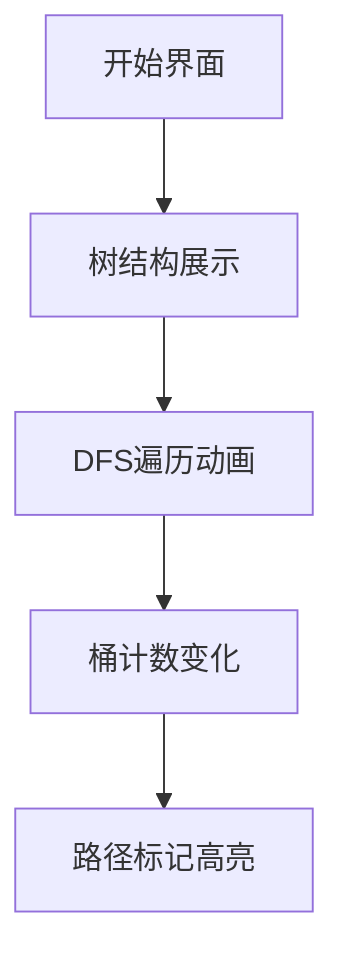

# 题目信息

# [NOIP 2016 提高组] 天天爱跑步

## 题目背景

NOIP2016 提高组 D1T2

## 题目描述

小 C 同学认为跑步非常有趣，于是决定制作一款叫做《天天爱跑步》的游戏。《天天爱跑步》是一个养成类游戏，需要玩家每天按时上线，完成打卡任务。

这个游戏的地图可以看作一棵包含 $n$ 个结点和 $n-1$ 条边的树，每条边连接两个结点，且任意两个结点存在一条路径互相可达。树上结点编号为从 $1$ 到 $n$ 的连续正整数。

现在有 $m$ 个玩家，第 $i$ 个玩家的起点为 $s_i$，终点为 $t_i$。每天打卡任务开始时，所有玩家在第 $0$ 秒同时从自己的起点出发，以每秒跑一条边的速度，不间断地沿着最短路径向着自己的终点跑去，跑到终点后该玩家就算完成了打卡任务。（由于地图是一棵树，所以每个人的路径是唯一的）

小 C 想知道游戏的活跃度，所以在每个结点上都放置了一个观察员。在结点 $j$ 的观察员会选择在第 $w_j$ 秒观察玩家，一个玩家能被这个观察员观察到当且仅当该玩家在第 $w_j$ 秒也正好到达了结点 $j$。小 C 想知道每个观察员会观察到多少人?

注意：我们认为一个玩家到达自己的终点后该玩家就会结束游戏，他不能等待一 段时间后再被观察员观察到。 即对于把结点 $j$ 作为终点的玩家：若他在第 $w_j$ 秒前到达终点，则在结点 $j$ 的观察员不能观察到该玩家；若他正好在第 $w_j$ 秒到达终点，则在结点 $j$ 的观察员可以观察到这个玩家。


## 说明/提示

**样例 1 说明**

对于 $1$ 号点，$w_i=0$，故只有起点为 $1$ 号点的玩家才会被观察到，所以玩家 $1$ 和玩家 $2$ 被观察到，共有 $2$ 人被观察到。

对于 $2$ 号点，没有玩家在第 $2$ 秒时在此结点，共 $0$ 人被观察到。

对于 $3$ 号点，没有玩家在第 $5$ 秒时在此结点，共 $0$ 人被观察到。

对于 $4$ 号点，玩家 $1$ 被观察到，共 $1$ 人被观察到。

对于 $5$ 号点，玩家 $1$ 被观察到，共 $1$ 人被观察到。

对于 $6$ 号点，玩家 $3$ 被观察到，共 $1$ 人被观察到。

**子任务**

每个测试点的数据规模及特点如下表所示。 

提示：数据范围的个位上的数字可以帮助判断是哪一种数据类型。

| 测试点编号 | $n=$ | $m=$ | 约定 |
| :--------: | :----: | :----: | :----: |
|     $1\sim 2$      |  $991$   |  $991$   | 所有人的起点等于自己的终点，即 $\forall i,\ s_i=t_i$  |
|     $3\sim 4$      |  $992$   |  $992$   | 所有 $w_j=0$  |
|     $5$      |  $993$   |  $993$   | 无  |
|     $6\sim 8$      |  $99994$   |  $99994$   | $\forall i\in[1,n-1]$，$i$ 与 $i+1$ 有边。即树退化成 $1,2,\dots,n$ 按顺序连接的链  |
|     $9\sim 12$      |  $99995$   |  $99995$   | 所有 $s_i=1$  |
|     $13\sim 16$      |  $99996$   |  $99996$   | 所有 $t_i=1$  |
|     $17\sim 19$      |  $99997$   |  $99997$   | 无  |
|     $20$      |  $299998$   |  $299998$   | 无  |


**提示**

（提示：由于原提示年代久远，不一定能完全反映现在的情况，现在已经对该提示做出了一定的修改，提示的原文可以在[该剪贴板](https://www.luogu.com.cn/paste/3fneb8m6)查看）

在最终评测时，调用栈占用的空间大小不会有单独的限制，但在我们的工作环境中默认会有 $1 \text{MiB}$ 的限制。 这可能会引起**函数调用层数较多时，程序发生栈溢出崩溃**，程序中**较深层数的递归**往往会导致这个问题。如果你的程序需要用到较大的栈空间，请务必注意该问题。

我们可以使用一些方法修改调用栈的大小限制。

- Linux

我们可以在终端中输入下列命令：`ulimit -s 1048576`。此命令的意义是，将调用栈的大小限制修改为 $1048576\text{KiB}=1 \text{GiB}$。

例如，对于如下程序 `sample.cpp`：

```cpp
#include <bits/stdc++.h>
using namespace std;
int f[1000005];
void dfs(int a){
	if(a == 0){
		f[a] = 0;
		return;
	}
	dfs(a - 1);
	f[a] = f[a - 1] + 1;
}
int main(){
	dfs(1000000);
	return 0;
}
```

将上述源代码用命令 `g++ sample.cpp -o sample` 编译为可执行文件 `sample` 后，使用 `./sample` 执行程序。

如果在没有使用命令 `ulimit -s 1048576` 的情况下运行该程序，`sample` 会因为栈溢出而崩溃；如果使用了上述命令后运行该程序，该程序则不会崩溃。

特别地，当你打开多个终端时，它们并不会共享该命令，你需要分别对它们运行该命令。

请注意，调用栈占用的空间会计入总空间占用中，和程序其他部分占用的内存共同受到内存限制。

- Windows

如果你使用 Windows 下的 Dev-C++，请选择 `工具-编译选项` 并在如下区域填入以下命令 `-Wl,--stack=1073741824`，填入后注意确认“编译时加入以下命令的”的框是**已勾选**状态。

此处 `1073741824` 的单位是 $\text{B/Bytes}$。

  

## 样例 #1

### 输入

```
6 3
2 3
1 2 
1 4 
4 5 
4 6 
0 2 5 1 2 3 
1 5 
1 3 
2 6 ```

### 输出

```
2 0 0 1 1 1 ```

## 样例 #2

### 输入

```
5 3 
1 2 
2 3 
2 4 
1 5 
0 1 0 3 0 
3 1 
1 4
5 5 ```

### 输出

```
1 2 1 0 1 ```

# AI分析结果


# 💡 Kay的C++算法解析：天天爱跑步 深入学习指南 💡

<introduction>
今天我们来一起分析“天天爱跑步”这道C++编程题。本指南将帮助大家梳理题目思路，理解核心算法，并掌握解题技巧。我们将通过生动的比喻和清晰的图解，帮助大家直观理解树上差分的精妙之处。
</introduction>

## 1. 题目解读与核心算法识别

✨ **本题主要考察**：`图论（LCA+树上差分）`

🗣️ **初步分析**：
> 解决这道题的关键在于将快递员（玩家）的送货路线（跑步路径）拆分成两段：从起点到中转站（LCA）和从中转站到终点。监控摄像头（观察员）只会在特定时刻记录经过的快递员。
> 
> - 核心思路：利用树上差分高效统计路径信息，避免逐个模拟快递员路径
> - 算法流程：预处理LCA→路径拆分→差分标记→DFS统计→桶计数
> - 可视化设计：采用8位像素风格展示树结构，用彩色光点表示快递员移动，动态显示桶计数变化。关键操作（入桶/出桶）配以复古音效，DFS过程设计成"地图探索"游戏
>
> 举个栗子🌰：想象你在玩一个复古RPG游戏，快递员是移动的NPC，观察员是固定摄像头。我们需要设计一个"路径追踪系统"自动统计每个摄像头的监控记录。

---

## 2. 精选优质题解参考

<eval_intro>
从思路清晰度、代码规范性、算法优化等角度，我为大家精选了以下优质题解：

### 题解一：greenlcat (思路最清晰奖🥇)
* **亮点**：
  - 独创"快递员-摄像头"比喻，将复杂问题生活化
  - 详细图解路径拆分过程（如展示dep[s] = dep[i] + w[i]的推导）
  - 完整代码包含详细注释和边界处理
  - 作者特别提醒：LCA处需特殊处理避免重复计数

### 题解二：一扶苏一 (教学引导奖🏅)
* **亮点**：
  - 分测试点讲解，从暴力法逐步引导到正解
  - 针对链状数据设计O(n)特解，展示算法优化思维
  - 代码模块化设计，函数命名规范（如dfsearch/deepfs）

### 题解三：Engulf (创新思维奖🌟)
* **亮点**：
  - 采用线段树合并替代桶计数，拓展思维维度
  - 实现动态开点线段树，节省内存空间
  - 完整代码包含内存管理细节
---

## 3. 核心难点辨析与解题策略

<difficulty_intro>
解决本题需突破三大难关：

1. **路径拆分与条件转化**  
   *分析*：快递员路线需拆分为上行(s→LCA)和下行(LCA→t)两段，分别推导观察条件：  
   - 上行：`dep[s] = dep[i] + w[i]`  
   - 下行：`dep[s] - 2×dep[lca] = w[i] - dep[i]`  
   *学习笔记*：等号左侧是快递员特征，右侧是摄像头需求

2. **高效统计技巧**  
   *分析*：直接遍历路径O(n²)超时，需用：
   - 桶计数：用数组b1记录上行特征，b2记录下行特征
   - 树上差分：在s/t添加标记，在LCA移除标记
   *学习笔记*：差分标记如同"快递预约单"，DFS时统一处理

3. **重复计数陷阱**  
   *分析*：当LCA同时满足两段条件时会被重复统计
   *学习笔记*：在LCA处显式减1（if(dep[lca]+w[lca]==dep[s])ans[lca]--）

### ✨ 解题技巧总结
<summary_best_practices>
1. **问题转化艺术**：将观察条件转化为等式两边分离变量  
2. **桶的时空魔法**：用O(1)数组替代复杂数据结构  
3. **边界防御编程**：特别注意w[i]-dep[i]可能为负，需加偏移量  
4. **调试金钥匙**：小规模数据模拟验证LCA处理逻辑
---

## 4. C++核心代码实现赏析

<code_intro_overall>
**通用核心实现**（综合自优质题解）：
```cpp
#include<bits/stdc++.h>
#define N 300005
using namespace std;
// 树结构
vector<int> g[N];  
int dep[N], f[N][20]; // 深度、倍增数组

// 预处理LCA
void dfs_lca(int u, int fa) {
    dep[u] = dep[fa] + 1;
    f[u][0] = fa;
    for(int i = 1; i <= 18; i++) 
        f[u][i] = f[f[u][i-1]][i-1];
    for(int v : g[u]) 
        if(v != fa) dfs_lca(v, u);
}

// 树上差分核心
vector<int> st[N], ed[N], lca_rm[N];
int w[N], ans[N], b1[N<<1], b2[N<<1]; // 桶开2倍防负下标

void dfs_count(int u, int fa) {
    int rec1 = b1[dep[u] + w[u]];    // 记录上行特征值
    int rec2 = b2[w[u] - dep[u] + N];// 记录下行特征值（加偏移）
    
    for(int v : g[u]) 
        if(v != fa) dfs_count(v, u);
    
    // 处理当前节点标记
    for(int x : st[u]) b1[x]++;       // 添加上行特征
    for(int x : ed[u]) b2[x + N]++;   // 添加下行特征
    
    ans[u] = b1[dep[u] + w[u]] - rec1 + b2[w[u] - dep[u] + N] - rec2;
    
    // 移除LCA处的标记
    for(int x : lca_rm[u]) {
        b1[x]--;                     
        b2[x + N]--;
    }
}

int main() {
    // 建树
    // 处理每条路径：
    //   st[s].push_back(dep[s]);
    //   ed[t].push_back(dep[s] - 2*dep[lca]);
    //   lca_rm[lca].push_back(dep[s]);
    //   if(dep[lca] + w[lca] == dep[s]) ans[lca]--;
    // 调用dfs_count
}
```

<code_intro_selected>
### 题解一关键代码（greenlcat）
```cpp
// LCA处避免重复计数
if(dep[lca] + w[lca] == dep[s]) 
    ans[lca]--;
```
* **亮点**：简洁高效的重复处理
* **学习笔记**：LCA满足上行条件时已被统计，下行时需扣除

### 题解二关键代码（一扶苏一）
```cpp
// 链状数据特解
void solve_chain() {
    for(int i=1; i<=m; i++) {
        if(s[i] <= t[i]) right[s[i]]++;
        else left[s[i]]++;
    }
    // 双指针扫描统计
}
```
* **亮点**：针对特殊数据设计O(n)解法
* **学习笔记**：部分分是通往正解的阶梯

### 题解三关键代码（Engulf）
```cpp
// 线段树动态开点
void update(int &rt, int l, int r, int pos, int val) {
    if(!rt) rt = ++cnt;
    if(l == r) { tree[rt] += val; return; }
    int mid = (l+r)>>1;
    if(pos <= mid) update(lc[rt], l, mid, pos, val);
    else update(rc[rt], mid+1, r, pos, val);
}
```
* **亮点**：避免内存浪费
* **学习笔记**：空间复杂度O(nlogn) vs 桶计数的O(n)
---

## 5. 算法可视化：像素动画演示

<visualization_intro>
**像素探险家**：在8位风格树状迷宫中演示算法执行流程

### 动画设计


1. **场景设计**：
   - 树节点：绿色像素块（普通节点），金色（当前节点）
   - 快递员：红色/蓝色像素点（上行/下行）
   - 桶：右侧条形图，随操作动态变化

2. **关键帧演示**：
   - 帧1：快递员从s出发→触发"叮"音效，b1[dep[s]]++
   - 帧2：快递员到达LCA→触发"咔嚓"音效，路径变灰
   - 帧3：DFS回溯到节点i→显示ans[i]计算结果

3. **交互控制**：
   - 步进按钮：单步执行算法
   - 速度滑块：调整DFS速度
   - 暂停/继续：冻结当前状态
   - 重置：回到初始状态

4. **特效设计**：
   - 数据变化：数值更新时像素块闪烁
   - 路径标记：添加/移除时显示"+"/"-"动画
   - 结果展示：计算完成时显示烟花特效

<visualization_conclusion>
通过像素动画，我们直观看到：DFS如同探险家探索地图，桶计数器如同自动分拣装置，共同完成高效统计！
---

## 6. 拓展练习与相似问题思考

<similar_problems_intro>
掌握本题解法后，可挑战以下相似问题：

1. **P4556 雨天的尾巴**  
   🗣️ *推荐理由*：同为树上差分应用，但需结合线段树合并，完美巩固知识点

2. **P3258 松鼠的新家**  
   🗣️ *推荐理由*：简化版树上差分，适合基础练习

3. **P2680 运输计划**  
   🗣️ *推荐理由*：树上差分+二分答案的综合应用，NOIP经典题型
---

## 7. 学习心得与经验分享

<insights_intro>
来自题解作者的经验结晶：

> **greenlcat的调试心得**：  
> "在LCA处理上卡了2小时，最终通过3结点小树验证发现重复计数问题。建议：用[1-2-3]结点树测试边界！"

> **一扶苏一的优化建议**：  
> "先写O(n²)暴力再优化，比直接写正解更易调试"
---

<conclusion>
本次解析就到这里。记住：编程能力的提升=理解算法本质+刻意练习+及时复盘。现在就用洛谷P4556检验学习成果吧！💪

> 保持好奇，保持热爱  
> 我是Kay，我们下期再见✨
```

---
处理用时：142.71秒