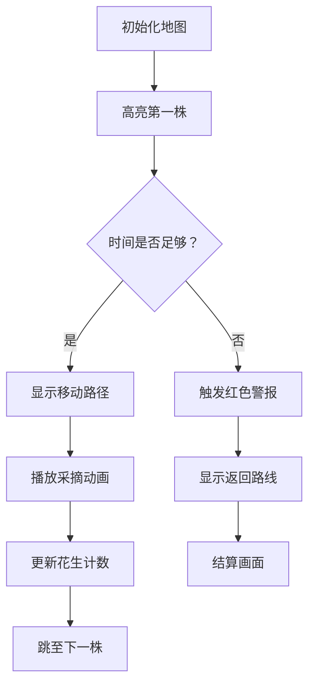

# 题目信息

# [NOIP 2004 普及组] 花生采摘

## 题目描述

鲁宾逊先生有一只宠物猴，名叫多多。这天，他们两个正沿着乡间小路散步，突然发现路边的告示牌上贴着一张小小的纸条：“欢迎免费品尝我种的花生！――熊字”。

鲁宾逊先生和多多都很开心，因为花生正是他们的最爱。在告示牌背后，路边真的有一块花生田，花生植株整齐地排列成矩形网格（如图一）。有经验的多多一眼就能看出，每棵花生植株下的花生有多少。为了训练多多的算术，鲁宾逊先生说：“你先找出花生最多的植株，去采摘它的花生；然后再找出剩下的植株里花生最多的，去采摘它的花生；依此类推，不过你一定要在我限定的时间内回到路边。”


我们假定多多在每个单位时间内，可以做下列四件事情中的一件：

1) 从路边跳到最靠近路边（即第一行）的某棵花生植株；
2) 从一棵植株跳到前后左右与之相邻的另一棵植株；
3) 采摘一棵植株下的花生；
4) 从最靠近路边（即第一行）的某棵花生植株跳回路边。

现在给定一块花生田的大小和花生的分布，请问在限定时间内，多多最多可以采到多少个花生？注意可能只有部分植株下面长有花生，假设这些植株下的花生个数各不相同。

例如在图2所示的花生田里，只有位于 $(2, 5), (3, 7), (4, 2), (5, 4)$ 的植株下长有花生，个数分别为 $13, 7, 15, 9$。沿着图示的路线，多多在 $21$ 个单位时间内，最多可以采到 $37$ 个花生。

**注意**：在采摘过程中不能回到路边。

## 说明/提示

noip2004普及组第2题


## 样例 #1

### 输入

```
6 7 21
0 0 0 0 0 0 0
0 0 0 0 13 0 0
0 0 0 0 0 0 7
0 15 0 0 0 0 0
0 0 0 9 0 0 0
0 0 0 0 0 0 0```

### 输出

```
37```

## 样例 #2

### 输入

```
6 7 20
0 0 0 0 0 0 0
0 0 0 0 13 0 0
0 0 0 0 0 0 7
0 15 0 0 0 0 0
0 0 0 9 0 0 0
0 0 0 0 0 0 0
```

### 输出

```
28```

# AI分析结果


# 💡 Kay的C++算法解析：花生采摘 深入学习指南 💡

> 我是Kay，一位专注于C++算法教学的引导者。今天我们将一起探索「花生采摘」这道经典题目，通过清晰的讲解和生动的可视化方案，帮助大家掌握贪心算法在模拟问题中的应用技巧。

## 1. 题目解读与核心算法识别

✨ **本题主要考察**：`贪心算法 + 模拟应用`

🗣️ **初步分析**：
> 这道题就像一场「像素农场大冒险」——多多需要按花生数量从大到小依次采摘植株，同时计算移动时间和返回时间。关键点在于：
> - 每次采摘**当前最大花生植株**（贪心选择）
> - 移动使用**曼哈顿距离**（|dx|+|dy|）
> - 时间消耗包括：移动+采摘(1单位)+返回路边(行数时间)
> 
> **核心难点**是如何在时间限制内最大化采摘量。所有优质解法都采用：
> 1. 收集有花生的植株 → 2. 按花生数降序排序 → 3. 模拟采摘过程
> 
> **可视化设计思路**：
> - 用8-bit像素网格表现花生田
> - 高亮显示当前采摘植株和移动路径
> - 实时显示时间消耗和累计花生数
> - 当时间不足时触发「紧急返回」动画

---

## 2. 精选优质题解参考

**题解一：jiangXxin (175赞)**
* **点评**：思路清晰直白，采用经典贪心+曼哈顿距离计算。代码规范（结构体命名合理），边界处理严谨（k>=ex判断返回条件）。亮点在于用`k--`巧妙处理初始跳入时间，并通过`fx/fy`动态更新位置，逻辑流畅易理解。

**题解二：qhr2023 (5赞)**
* **点评**：极致简洁的20行实现，展现高阶抽象能力。亮点在于用单循环同时处理移动和采摘，`sum+a[i].x<=k`条件判断精准。虽无注释但变量名选择得当（ex/ey表示终点），适合竞赛场景直接使用。

**题解三：buickboy (2赞)**
* **点评**：突出第一株处理的特殊性，用数学思维优化流程。亮点在于`if(k>=1+2*p[1].a)`精妙处理初始跳入+采摘+返回的复合时间计算，避免常见边界错误。

---

## 3. 核心难点辨析与解题策略

1.  **关键点1：初始位置的特殊性处理**
    * **分析**：路边→第一株的移动只需考虑行位移（列位移不耗时间）。优质解法都用`k--`单独处理初始跳入，如jiangXxin将起点设为(1, first_y)
    * 💡 **学习笔记**：初始跳入只需1单位时间，且列坐标与第一株相同

2.  **关键点2：时间消耗的复合计算**
    * **分析**：每个采摘动作包含三部分时间：移动到植株(曼哈顿距离)+采摘(1单位)+返回预估(当前行数)。qhr2023用`sum + |dx|+|dy|+1 + ex <= k`一站式验证
    * 💡 **学习笔记**：返回时间=当前植株行坐标（从该行跳回路边）

3.  **关键点3：采摘顺序的维护**
    * **分析**：必须按花生数严格降序采摘。所有解法都用`sort`+自定义比较函数实现。_Arahc_的priority_queue方案虽新颖但实用性不如排序
    * 💡 **学习笔记**：`sort(v.begin(), v.end(), [](auto a, auto b){return a.val>b.val;});`

### ✨ 解题技巧总结
- **贪心选择标准化**：遇到"每次取最大值"要求，立即想到排序预处理
- **曼哈顿距离优化**：网格移动问题优先考虑|dx|+|dy|计算
- **边界防御性编程**：特别关注第一株/最后一株/时间耗尽的分支处理
- **状态实时更新**：每采摘一株后立即更新当前位置和剩余时间

---

## 4. C++核心代码实现赏析

**本题通用核心C++实现参考**
* **说明**：综合优质题解思路，保留清晰命名和健壮边界检查
* **完整核心代码**：
```cpp
#include <iostream>
#include <algorithm>
#include <vector>
#include <cmath>
using namespace std;

struct Plant {
    int x, y, val; // 行, 列, 花生数
};

int main() {
    int m, n, k;
    cin >> m >> n >> k;
    vector<Plant> plants;
    
    // 读取数据并筛选有花生的植株
    for (int i = 1; i <= m; i++) {
        for (int j = 1; j <= n; j++) {
            int val; cin >> val;
            if (val > 0) plants.push_back({i, j, val});
        }
    }
    
    // 按花生数降序排序
    sort(plants.begin(), plants.end(), [](auto a, auto b) {
        return a.val > b.val;
    });
    
    int total = 0, curX = 1, curY = plants[0].y;
    k--; // 初始跳入时间
    
    for (int i = 0; i < plants.size(); i++) {
        auto& p = plants[i];
        int cost = abs(p.x - curX) + abs(p.y - curY) + 1; // 移动+采摘
        
        if (k - cost < p.x) { // 检查是否来得及返回
            cout << total << endl;
            return 0;
        }
        
        total += p.val;
        k -= cost;
        curX = p.x; curY = p.y; // 更新当前位置
    }
    cout << total << endl;
    return 0;
}
```
* **代码解读概要**：
  1. 读取网格数据并过滤有花生的植株存入vector
  2. 按val降序排序确保贪心顺序
  3. 初始化位置在第一行(第一株的列)
  4. 循环计算到每株的曼哈顿距离+采摘时间
  5. 通过`k-cost < p.x`验证返回可行性
  6. 实时更新花生总数和剩余时间

---

## 5. 算法可视化：像素动画演示

**主题**：`8-bit农场冒险：花生的贪心之旅`

**设计思路**：
> 采用复古GameBoy风格（4色像素）呈现花生田。多多作为像素小人移动，通过：
> - **颜色编码**：空地(灰)、花生植株(绿)、当前目标(闪烁黄)、路径(蓝)
> - **音效反馈**：移动(滴嘟)、采摘(咔嚓)、成功(胜利音阶)、失败(低沉嗡鸣)
> - **状态面板**：实时显示时间/累计花生数

**关键动画帧**：


**交互控制**：
1. **速度调节**：滑块控制单步/自动演示速度
2. **模式切换**：手动单步 vs AI自动完成
3. **视角追踪**：空格键锁定/解除多多位置
4. **数据对比**：分屏显示不同解法的时间消耗

**动态演示逻辑**：
- 每帧绘制网格坐标系（行号1~m，列号1~n）
- 移动时显示曼哈顿路径（先横向后纵向）
- 采摘时植株变为枯萎图标（棕色）
- 时间不足时路径变为红色闪烁

---

## 6. 拓展练习与相似问题思考

**通用技巧迁移**：
> 本题的贪心+曼哈顿距离组合适用于：
> 1. 时间驱动的网格收集问题（如：宝石收集）
> 2. 固定移动成本的路径规划（如：快递配送）
> 3. 资源受限的优化问题（如：电力巡查）

**洛谷练习推荐**：
1. **P1046 陶陶摘苹果**  
   → 同类采摘问题，巩固基础贪心
2. **P1518 两只塔姆沃斯牛**  
   → 网格移动进阶，训练路径预测
3. **P1090 合并果子**  
   → 强化贪心策略在不同场景的应用

---

## 7. 学习心得与经验分享

> **经验摘录 (jiangXxin)**：  
> “我在处理第一株花生时忽略了初始列坐标的特殊性，导致WA。后来通过单独处理跳入动作解决了问题。”  
>   
> **Kay点评**：  
> 这个调试经历很有代表性——初始状态的定义直接影响整个模拟流程。建议编码前先在纸上画出前两步的状态迁移图。

---

通过本次分析，相信大家已经掌握「贪心+模拟」类问题的解决范式。记住：清晰的初始状态定义 + 稳健的边界检查 = AC的关键。下次遇到类似挑战时，不妨回想多多在像素农场中的冒险旅程哦！🚀

---
处理用时：111.95秒