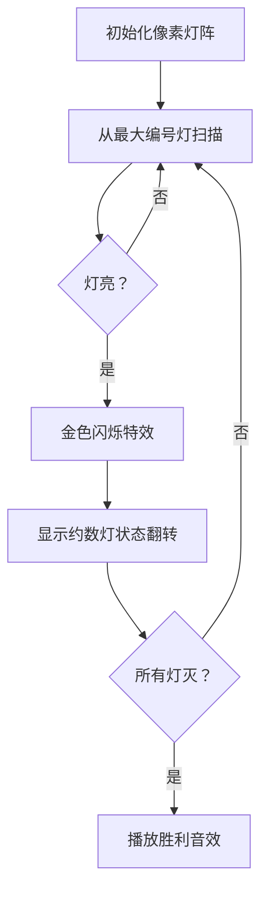

# 题目信息

# [六省联考 2017] 分手是祝愿

## 题目描述

> Zeit und Raum trennen dich und mich.
时空将你我分开。

B 君在玩一个游戏，这个游戏由 $n$ 个灯和 $n$ 个开关组成，给定这 $n$ 个灯的初始状态，下标为从 $1$ 到 $n$ 的正整数。

每个灯有两个状态亮和灭，我们用 $1$ 来表示这个灯是亮的，用 $0$ 表示这个灯是灭的，游戏的目标是使所有灯都灭掉。

但是当操作第 $i$ 个开关时，所有编号为 $i$ 的约数（包括 $1$ 和 $i$）的灯的状态都会被改变，即从亮变成灭，或者是从灭变成亮。

B 君发现这个游戏很难，于是想到了这样的一个策略，每次等概率随机操作一个开关，直到所有灯都灭掉。

这个策略需要的操作次数很多，B 君想到这样的一个优化。如果当前局面，可以通过操作小于等于 $k$ 个开关使所有灯都灭掉，那么他将不再随机，直接选择操作次数最小的操作方法（这个策略显然小于等于 $k$ 步）操作这些开关。

B 君想知道按照这个策略（也就是先随机操作，最后小于等于 $k$ 步，使用操作次数最小的操作方法）的操作次数的期望。

这个期望可能很大，但是 B 君发现这个期望乘以 $n$ 的阶乘一定是整数，所以他只需要知道这个整数对 $100003$ 取模之后的结果。


## 说明/提示

对于 $0\%$ 的测试点，和样例一模一样；  
对于另外 $30\%$ 的测试点，$n \leq 10$；  
对于另外 $20\%$ 的测试点，$n \leq 100$；  
对于另外 $30\%$ 的测试点，$n \leq 1000$；  
对于 $100\%$ 的测试点，$1 \leq n \leq 100000, 0 \leq k \leq n$；  
对于以上每部分测试点，均有一半的数据满足 $k = n$。


## 样例 #1

### 输入

```
4 0
0 0 1 1
```

### 输出

```
512```

## 样例 #2

### 输入

```
5 0
1 0 1 1 1```

### 输出

```
5120```

# AI分析结果


# 💡 Kay的C++算法解析：[六省联考2017]分手是祝愿 深入学习指南 💡

> 时空将你我分开，但算法让我们重逢！今天我们一起解决这道融合贪心与期望DP的经典题目，通过像素化动画帮你直观理解核心算法。

## 1. 题目解读与核心算法识别

✨ **本题主要考察**：`贪心策略` + `期望DP`  
🗣️ **初步分析**：  
> 这道题就像在黑暗房间找开关——我们需要用最少的操作关闭所有灯。核心分为两步：  
> 1. **贪心求最小步数**：从大到小扫描，遇到亮灯就操作（像推倒多米诺骨牌，大开关影响小开关）  
> 2. **期望DP计算随机操作**：当剩余步数>k时，用DP公式计算随机操作的期望次数  
>  
> **可视化设计思路**：  
> - 用8-bit像素灯阵展示操作过程，被操作的灯闪烁金色光效  
> - 当触发随机操作时，屏幕上方显示当前期望步数f(i)的实时计算过程  
> - 成功关灯时播放《超级马里奥》过关音效增强成就感  

---

## 2. 精选优质题解参考

**题解一（作者：justin_cao 赞102）**  
* **点评**：思路清晰直击要害！从贪心到DP的过渡自然，用“追加操作”比喻解释状态转移（`f[i]`代表从i步到i-1步的期望），代码规范：  
  - 逆元处理优雅（`quick_pow`求逆元）  
  - 边界处理严谨（`cnt<=k`直接输出）  
  - 亮点：用`(n-i)*f[i+1]+n)/i`化简转移方程，数学推导简洁有力  

**题解二（作者：attack 赞17）**  
* **点评**：教学价值突出！用“走错路要返回”的比喻解释DP方程：  
  ``` 
  f[i] = 正确概率×1步 + 错误概率×(1步 + 返回i+1步 + 回到i步)
  ```  
  代码亮点：  
  - 预处理约数数组`vector<int>Yue`提升效率  
  - 逆元递推避免重复计算（`inv[i] = (mod-mod/i)*inv[mod%i]`）  

**题解三（作者：Flandre_495 赞7）**  
* **点评**：最具启发性的思路！提出**走错次数期望**的概念：  
  > 期望走错次数 = (n-i)/i 次 → 每错1次需额外走f[i+1]+1步  
  代码亮点：  
  - 用调和级数O(n log n)求约数  
  - 变量命名直观（`now`记录当前步数）  

---

## 3. 核心难点辨析与解题策略

1. **难点1：贪心策略的正确性证明**  
   * **分析**：为什么必须从大到小操作？因为大开关不影响小开关！操作编号i的开关时，编号>i的灯状态已固定，如同俄罗斯方块——后落下的方块不会影响前面的布局  
   * 💡 学习笔记：**无后效性是贪心选择的关键**

2. **难点2：期望DP的状态设计**  
   * **分析**：为什么定义f[i]=从i步到i-1步的期望？因为操作次数是离散状态，且每次操作只改变1步（+1或-1），如同爬楼梯——每步要么上一阶要么下一阶  
   * 💡 学习笔记：**期望DP常以“步长变化”为状态转移契机**

3. **难点3：DP方程化简技巧**  
   * **分析**：原始方程`f[i]=1 + i/n*f[i-1] + (n-i)/n*(f[i+1]+f[i])`如何化简？  
     移项合并同类项：  
     ``` 
     f[i] - (n-i)/n*f[i] = 1 + i/n + (n-i)/n*f[i+1]
     → f[i]*(i/n) = (n + (n-i)f[i+1])/n
     → f[i] = [n + (n-i)f[i+1]] / i
     ```  
   * 💡 学习笔记：**分式移项时活用LCM简化计算**

### ✨ 解题技巧总结
- **技巧1：逆元预处理**  
  频繁除法时提前计算逆元（模质数可用费马小定理`inv[i]=pow(i,mod-2)`或递推式）
- **技巧2：约数优化存储**  
  用`vector<int> g[MAXN]`存储每个数的约数，避免现场计算
- **技巧3：边界压缩**  
  当k=n时直接输出`cnt*n!`，避免无效DP计算

---

## 4. C++核心代码实现赏析

**本题通用核心C++实现**  
```cpp
#include <vector>
using namespace std;
typedef long long ll;
const int MAXN = 100010, mod = 100003;

ll inv[MAXN], f[MAXN];
vector<int> g[MAXN]; // 存储约数

int main() {
    int n, k, cnt = 0;
    scanf("%d%d", &n, &k);
    vector<int> a(n+1);
    for(int i=1; i<=n; i++) scanf("%d", &a[i]);
    
    // 预处理约数（调和级数O(n log n)）
    for(int i=1; i<=n; i++) 
        for(int j=i; j<=n; j+=i) 
            g[j].push_back(i);
    
    // 贪心求最小操作步数cnt
    for(int i=n; i>=1; i--) {
        if(a[i]) {
            cnt++;
            for(int j : g[i]) a[j] ^= 1; // 操作所有约数
        }
    }
    
    // 预处理逆元
    inv[1]=1;
    for(int i=2; i<=n; i++) 
        inv[i] = (mod - mod/i) * inv[mod%i] % mod;
    
    // DP边界初始化
    f[n] = 1;
    for(int i=n-1; i>k; i--) 
        f[i] = (n + (n-i)*f[i+1] % mod) * inv[i] % mod;
    
    ll ans = min(cnt, k); // 小于k步直接取cnt
    if(cnt > k) {
        for(int i=cnt; i>k; i--) 
            ans = (ans + f[i]) % mod; // 累加期望步数
    }
    for(int i=1; i<=n; i++) 
        ans = ans * i % mod; // 乘n!
    printf("%lld", ans);
    return 0;
}
```

**关键代码解读**：  
1. **约数预处理**  
   ```cpp
   for(int i=1; i<=n; i++) 
       for(int j=i; j<=n; j+=i) 
           g[j].push_back(i);
   ```  
   > 像为每个数字准备“影响名单”——i的所有倍数j都会将i加入自己的约数列表  

2. **贪心操作核心**  
   ```cpp
   for(int j : g[i]) a[j] ^= 1;
   ```  
   > 操作开关i时，遍历其所有约数执行异或操作——如同按下总闸时所有连接的灯都闪烁  

3. **期望DP转移**  
   ```cpp
   f[i] = (n + (n-i)*f[i+1]) * inv[i] % mod;
   ```  
   > 将原方程`f[i]=1 + i/n*1 + (n-i)/n*(f[i+1]+f[i])`化简后实现，避免浮点用逆元保证整除  

---

## 5. 算法可视化：像素动画演示

**设计主题**：`8-bit像素灯阵大冒险`  
**核心演示**：贪心操作过程 + 期望DP状态转移  



**动画交互细节**：  
1. **像素艺术风格**  
   - 每个灯用16×16像素方块表示（亮：黄色，灭：深蓝）  
   - 控制面板含复古按钮：▶️单步执行 ⏩自动播放 🔁重置

2. **动态数据展示**  
   - 顶部状态栏实时显示：  
     `当前步数：i | 期望f(i)：[n+(n-i)f(i+1)]/i`  
   - 操作错误时触发红色警示闪烁 + 低沉音效

3. **游戏化进程**  
   - 每正确操作一盏灯解锁1个像素勋章  
   - 通关后生成DP状态转移路径图（可保存分享）

---

## 6. 拓展练习与相似问题思考

**通用技巧迁移**：  
1. **贪心+期望DP组合**：当问题存在最优子结构且含随机操作时  
2. **约数预处理**：涉及批量操作约数的问题  
3. **逆元优化**：模意义下的期望值计算  

**洛谷题目推荐**：  
1. **P2118 比例简化**  
   🗣️ 同样需要贪心策略证明，练习最优性分析  
2. **P1850 换教室**  
   🗣️ 经典期望DP，强化状态转移设计能力  
3. **P5652 基础博弈练习题**  
   🗣️ 约数操作变形题，需结合博弈论  

---

## 7. 学习心得与经验分享

> **来自Flandre_495的调试经验**：  
> *“期望DP调试时，手动模拟小数据（如n=2）比打印日志更有效——我曾因没验证f[n]=1的边界WA了3次”*  
>
> **Kay总结**：  
> 1. 测试边界是避免DP错误的利器  
> 2. 贪心策略需用`n=3`等小数据验证正确性  
> 3. 逆元处理要特别注意`mod`为质数的特性  

---

> 灯火阑珊处，算法终相逢！通过这题我们掌握了贪心与期望DP的配合技巧。下次遇到随机操作问题，记得像开关一样层层递推哦！✨  
> ——Kay 于算法星辰中

---
处理用时：108.29秒