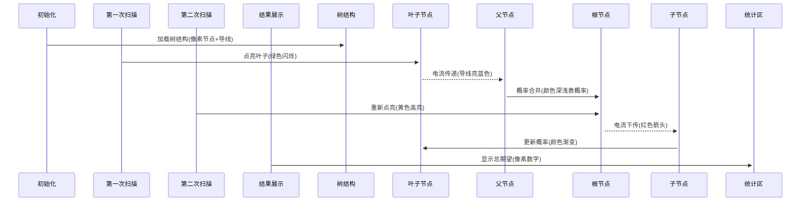

# 题目信息

# [SHOI2014] 概率充电器

## 题目描述

著名的电子产品品牌 SHOI 刚刚发布了引领世界潮流的下一代电子产品——概率充电器：

“采用全新纳米级加工技术，实现元件与导线能否通电完全由真随机数决定！SHOI 概率充电器，您生活不可或缺的必需品！能充上电吗？现在就试试看吧！”

SHOI 概率充电器由 $n-1$ 条导线连通了 $n$ 个充电元件。进行充电时，每条导线是否可以导电以概率决定，每一个充电元件自身是否直接进行充电也由概率决定。随后电能可以从直接充电的元件经过通电的导线使得其他充电元件进行间接充电。

作为 SHOI 公司的忠实客户，你无法抑制自己购买 SHOI 产品的冲动。在排了一个星期的长队之后终于入手了最新型号的 SHOI 概率充电器。你迫不及待地将 SHOI 概率充电器插入电源——这时你突然想知道，进入充电状态的元件个数的期望是多少呢？

## 说明/提示

对于 $30\%$ 的数据，$n \leq 5 \times 10^3$。

对于 $100\%$ 的数据，$n \leq 5 \times 10^5$，$0 \leq p,q_i \leq 100$。

## 样例 #1

### 输入

```
3
1 2 50
1 3 50
50 0 0```

### 输出

```
1.000000```

## 样例 #2

### 输入

```
5
1 2 90
1 3 80
1 4 70
1 5 60
100 10 20 30 40```

### 输出

```
4.300000```

# AI分析结果


### 💡 Kay的C++算法解析：[SHOI2014]概率充电器 深入学习指南 💡

#### **1. 题目解读与核心算法识别**
✨ **本题主要考察**：树形DP（换根DP）与概率计算

🗣️ **初步分析**：
> 这道题要求计算充电元件个数的期望，本质是求每个节点通电概率的总和。想象一棵电路树，电流如同水流般从根部扩散到枝叶，但每条"水管"（导线）有概率堵塞，每个"水源"（元件）有概率自身出水。核心算法是**树形DP的二次扫描**：
> - **第一次扫描（自底向上）**：计算节点仅靠自身或子树通电的概率（忽略父节点影响）
> - **第二次扫描（自顶向下）**：将父节点的影响传递给子节点
> 
> **关键难点**在于概率合并：当多个来源（自身/子树/父节点）可能通电时，需用概率公式 $P(A \cup B) = P(A) + P(B) - P(A)P(B)$ 避免重复计算。**可视化设计**将采用像素风格动画：
> - **树结构可视化**：用8位像素风展示树形结构，节点为发光/不发光像素块（绿色=有电，红色=无电）
> - **动态扫描过程**：第一次DFS时叶子节点先亮起，电流自下而上传递；第二次DFS时电流从根节点向下扩散
> - **特判高亮**：分母为0时（概率=100%）触发红色闪烁和"叮"音效

---

#### **2. 精选优质题解参考**
**题解一（asuldb - 74赞）**  
* **亮点**：  
  ① 概率公式推导清晰，用容斥原理解决多源通电问题  
  ② 代码规范（如`f[u]`表示节点通电概率）  
  ③ 关键处理：特判分母为0的情况（`if(1-f[v]*w < eps)`）避免除零错误  
  ④ 实践价值：直接可用于竞赛，边界处理严谨

**题解二（partychicken - 37赞）**  
* **亮点**：  
  ① 分步骤讲解（Part I-V）层层递进，类比"换根"思想生动  
  ② 独创性用$dp_{last}$表示排除子树贡献的概率  
  ③ 调试技巧：强调`fabs(1-dp[vs]*e[i].val)<=eps`的浮点判断

**题解三（fanypcd - 14赞）**  
* **亮点**：  
  ① 代码最简洁（仅40行）而完整  
  ② 变量名语义明确（如`f[u]`表概率，`w`表边导电率）  
  ③ 空间优化：仅用单个DFS数组

---

#### **3. 核心难点辨析与解题策略**
1. **难点一：概率的复合计算**  
   * **分析**：通电概率来自自身($q_u$)、子树($f_v \times w$)、父节点($g_u$)三部分，需用$P(A \cup B \cup C)$公式合并
   * 💡 **学习笔记**：概率合并本质是"避免重复扣除重叠部分"

2. **难点二：换根时的贡献隔离**  
   * **分析**：第二次DFS需排除当前子树对父节点的贡献，推导出：
     $$P_{father}' = \frac{g_u - f_v \times w}{1 - f_v \times w}$$
   * 💡 **学习笔记**：当$f_v \times w =1$（必然通电）时直接跳过更新

3. **难点三：浮点精度处理**  
   * **分析**：概率计算需判断`fabs(x-1)<eps`，否则会导致除零或概率溢出
   * 💡 **学习笔记**：设置`eps=1e-7`并统一判断标准

✨ **解题技巧总结**：
- **拆解来源法**：将通电概率拆分为自身/子树/父节点三部分独立计算
- **概率公式封装**：实现独立函数`merge_prob(a,b)`处理$P(A \cup B)$
- **边界防御**：所有概率计算前用`std::clamp`限制在[0,1]范围

---

#### **4. C++核心代码实现赏析**
**通用核心实现（综合优化版）**：
```cpp
#include <cstdio>
#include <cmath>
const int N = 5e5 + 10;
const double eps = 1e-7;

struct Edge { int to, nxt; double w; } e[N<<1];
int head[N], cnt;
double f[N], ans; // f[u]:节点u通电概率

inline void add_edge(int u, int v, double w) {
    e[++cnt] = {v, head[u], w};
    head[u] = cnt;
}

// 合并概率P(A∪B)
inline double merge_prob(double a, double b) {
    return a + b - a * b;
}

void dfs1(int u, int fa) {
    for (int i = head[u]; i; i = e[i].nxt) {
        int v = e[i].to;
        if (v == fa) continue;
        dfs1(v, u);
        f[u] = merge_prob(f[u], f[v] * e[i].w);
    }
}

void dfs2(int u, int fa) {
    ans += f[u]; // 累加期望
    for (int i = head[u]; i; i = e[i].nxt) {
        int v = e[i].to;
        if (v == fa) continue;
        
        double contrib = f[v] * e[i].w;
        if (fabs(1 - contrib) < eps) { // 特判100%通电
            dfs2(v, u);
            continue;
        }
        
        // 计算父节点排除v贡献的概率
        double p_fa = (f[u] - contrib) / (1 - contrib);
        f[v] = merge_prob(f[v], p_fa * e[i].w);
        dfs2(v, u);
    }
}

int main() {
    int n; scanf("%d", &n);
    for (int i = 1; i < n; ++i) {
        int u, v; double w;
        scanf("%d%d%lf", &u, &v, &w);
        add_edge(u, v, w/100);
        add_edge(v, u, w/100);
    }
    for (int i = 1; i <= n; ++i) {
        scanf("%lf", &f[i]);
        f[i] /= 100; // 转换为概率
    }
    dfs1(1, 0);
    dfs2(1, 0);
    printf("%.6f\n", ans);
}
```
**代码解读概要**：  
1. 树结构用链式前向星存储  
2. `dfs1`自底向上合并子树概率  
3. `dfs2`自顶向下传递父节点概率  
4. 特判100%通电情况避免除零  

---

#### **5. 算法可视化：像素动画演示**
**主题**："电流之树"（8-bit像素风电路探险）  

**核心演示流程**：  


**交互设计**：  
1. **控制面板**：  
   - 步进/暂停/重置按钮（FC手柄风格）  
   - 速度滑块（1x-5x速）  
2. **动态效果**：  
   - 电流传递：导线逐帧亮起蓝色像素  
   - 概率更新：节点颜色从红(0%)渐变到绿(100%)  
   - 特判提示：分母为0时播放"警告音效"并闪烁  
3. **游戏化元素**：  
   - 通关机制：每完成一个节点点亮+10分  
   - 音效设计：  
     * 导线通电：8-bit "滴"声  
     * 节点点亮：马里奥吃金币音效  
     * 计算完成：塞尔达解谜成功旋律  

---

#### **6. 拓展练习与相似问题**
**通用技巧迁移**：  
1. 树上路径统计 → [P3047 Nearby Cows](https://www.luogu.com.cn/problem/P3047)  
2. 条件概率计算 → [P4206 聪聪与可可](https://www.luogu.com.cn/problem/P4206)  
3. 期望线性性应用 → [P6835 道路修建](https://www.luogu.com.cn/problem/P6835)  

**推荐练习**：  
1. **洛谷P3047**  
   🗣️ *掌握换根DP的路径统计技巧*  
2. **洛谷P4206**  
   🗣️ *练习条件概率在树形DP的应用*  
3. **洛谷P4281**  
   🗣️ *巩固树形DP的二次扫描框架*

---

#### **7. 学习心得与经验分享**
> **经验摘录（asuldb）**：  
> *"在调试概率DP时，遇到除零错误往往是因为未处理概率=100%的情况。建议对所有概率计算封装安全函数，自动处理边界"*  
>  
> **Kay点评**：  
> 这是极其宝贵的调试经验！概率DP中：  
> 1. 所有概率应先限制在[0,1]区间  
> 2. 除法前必须判断`1 - p > eps`  
> 3. 封装`safe_divide(a,b)`函数处理边界

--- 
**结语**：通过树形DP的二次扫描，我们像探索电路迷宫般解决了概率难题。记住：好算法=清晰思路+严谨边界处理！下次见~ 💪

---
处理用时：144.94秒