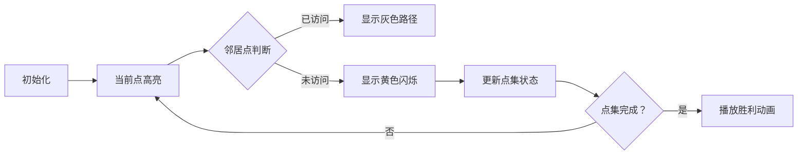

# 题目信息

# 随机漫游

## 题目描述

H 国有 $N$ 个城市

在接下来的 $M$ 天，小 c 都会去找小 w，但是小 c 不知道小 w 的具体位置，所以小 c 决定每次随机找一条路走，直到遇到了小 w 为止

小 c 知道小 w 只有可能是在 $c_1, c_2.. c_n$ 这 $n$ 个城市中的一个，小 c 想知道在最坏情况下，小 c 遇到小 w 期望要经过多少条道路

H 国所有的边都是无向边，两个城市之间最多只有一条道路直接相连，没有一条道路连接相同的一个城市

任何时候，H 国不存在城市 $u$ 和城市 $v$ 满足从 $u$ 无法到达 $v$

## 说明/提示

$H$ 国的道路构成一条链，所以最坏情况下就是小 w 在深度最大的点上(以小 c 所在的城市为根)

对于第一天，小 c 所在的城市为 1，深度最大的点为 2，城市 1 只能到达城市 2，期望经过 1 条道路到达

对于第二天，小 c 所在的城市为 1，深度最大的点为 3，计算的期望经过 4 条道路到达

第三天同第二天

最坏情况也就是说经过所有 $n$ 个可能的城市至少一遍

subtask1 : 10分，$N = 4, M = 12$

subtask2 : 15分，$N =10, M = 100000$

subtask3 : 15分，$N = 18, M = 1$

subtask4 : 10分，$N = 18, M = 99995$，图是一条链

subtask5 : 10分，$N = 18, M = 99996$，所有的 $s$ 都相同

subtask6 : 15分，$N = 18, M = 99997$，$E = N-1$

subtask7 : 15分，$N = 18, M = 99998$，所有的 $s$ 都相同

subtask8 : 10分，$N = 18, M = 99999$

对于所有数据 : $1\leq N\leq 18, 1\leq M\leq 100000, 1\leq E\leq \frac{N(N-1)}{2}$

## 样例 #1

### 输入

```
3 2
1 2
2 3
3
2 1 2 1		
3 1 2 3 1
1 3 1```

### 输出

```
1
4
4```

# AI分析结果


# 💡 Kay的C++算法解析：随机漫游 深入学习指南 💡

> 大家好！我是Kay，今天我们一起探索「随机漫游」这道题目的解法。想象你是一位探险家，在由城市和道路构成的地图上随机行走，目标是在最坏情况下访问所有目标城市的期望步数。我们将通过状压DP和高斯消元解决这个问题，还会设计一个像素动画帮你直观理解算法！

## 1. 题目解读与核心算法识别

✨ **本题主要考察**：`状态压缩动态规划`与`高斯消元`  

🗣️ **初步分析**：  
> 解决「随机漫游」就像在像素地图上随机探险：  
> - **状压DP**是记录已访问城市的"二进制密码本"（每个比特位表示城市是否访问过）  
> - **高斯消元**则是解决每个决策点的数学期望问题  
>  
> 核心思路：  
> 1. 定义状态`f[S][u]`表示已访问点集`S`且当前位置`u`时，走完全图的期望步数  
> 2. 通过倒序枚举点集（从全集开始），对每个点集内部进行高斯消元  
> 3. 对于询问`(起点u, 目标点集C)`，答案=`f[全集-C∪{u}][u]`  
>  
> **可视化设计**：  
> 我们将设计8-bit像素动画：  
> - 城市显示为不同颜色方块（绿色=起点，红色=目标，蓝色=已访问）  
> - 每次移动时播放"嘀"音效，访问新城市时播放"叮"音效  
> - 控制面板支持单步/自动模式，速度可调（类似经典游戏《勇者斗恶龙》）

---

## 2. 精选优质题解参考

### 题解一（Kelin）
* **点评**：  
  思路清晰推导严谨（状态定义`f[S][u]`直击核心），代码规范（位运算优化到位），算法高效（分层高斯消元将复杂度优化至$O(2^n n^3)$）。亮点在于：  
  - 预处理逆元加速除法取模  
  - 仅对当前点集建立方程组  
  - 边界处理严谨（全集初始化`f[all]=0`）

### 题解二（Mr_Avalon）
* **点评**：  
  教学价值突出：详细注释+模块化函数（如`gauss()`独立为函数），变量命名规范（`deg`表度数，`all`表全集）。特别适合学习者参考：  
  - 状态转移方程展示完整  
  - 分层枚举点集逻辑清晰  
  - 高斯消元步骤添加详细注释

### 题解三（DengDuck）
* **点评**：  
  代码简洁（仅1.3K）但功能完整，突出技巧性：  
  - 用`vector`替代邻接表  
  - 逆元计算整合在状态转移中  
  - 位运算处理点集高效直观

---

## 3. 核心难点辨析与解题策略

### 关键点1：状态设计与方程推导
* **分析**：  
  状态需同时编码"已访问点集"和"当前位置"。转移方程：  
  $$f[S][u] = 1 + \frac{1}{d_u}\sum_{v\in neighbor(u)} \begin{cases} 
  f[S][v] & v\in S \\
  f[S\cup\{v\}][v] & v\notin S 
  \end{cases}$$
* 💡 **学习笔记**：状态设计需覆盖问题所有维度

### 关键点2：分层消元解环形依赖
* **分析**：  
  当$v\in S$时会产生环形依赖。通过倒序枚举点集（从大到小），确保$f[S\cup v]$已计算，将未知量减至$|S|$个
* 💡 **学习笔记**：利用状态转移的拓扑序避免全量高斯消元

### 关键点3：位运算优化点集操作
* **分析**：  
  使用位运算加速点集操作：
  ```cpp
  S | (1<<v)   // 添加点v
  S & (1<<v)   // 判断v是否在S中
  all ^ S      // 取补集
  ```
* 💡 **学习笔记**：位运算是状态压缩算法的核心技巧

### ✨ 解题技巧总结
- **逆向状态定义**：从终点向起点推导避免后效性  
- **数学优化**：预处理逆元加速模除运算  
- **分层处理**：按点集规模分治降低复杂度  
- **位运算技巧**：`lowbit`快速枚举子集

---

## 4. C++核心代码实现赏析

### 本题通用核心C++实现
```cpp
#include<bits/stdc++.h>
using namespace std;
const int N=20, mod=998244353;
int n, m, deg[N], f[1<<18][N];
vector<int> g[N];

int qpow(int a, int b) {
    int res = 1;
    while(b) {
        if(b & 1) res = 1LL * res * a % mod;
        a = 1LL * a * a % mod;
        b >>= 1;
    }
    return res;
}

void gauss(int S, vector<int>& nodes) {
    int k = nodes.size();
    vector<vector<int>> mat(k, vector<int>(k+1));
    
    // 构建方程组：mat[i][j]对应f[S][u_i]的系数
    for(int i=0; i<k; i++) {
        int u = nodes[i];
        mat[i][i] = deg[u];  // 主对角线系数
        mat[i][k] = deg[u];  // 常数项初始为deg[u]
        
        for(int v : g[u]) {
            int pos = find(nodes.begin(), nodes.end(), v) - nodes.begin();
            if(pos < k) {  // v在当前点集
                mat[i][pos] = (mat[i][pos] - 1 + mod) % mod;
            } else {       // v不在当前点集
                mat[i][k] = (mat[i][k] + f[S|(1<<v)][v]) % mod;
            }
        }
    }
    
    // 高斯消元求解...
}

int main() {
    cin >> n >> m;
    int all = (1 << n) - 1;
    // 初始化图和度数
    while(m--) {
        int u, v; cin >> u >> v;
        g[u].push_back(v);
        g[v].push_back(u);
        deg[u]++; deg[v]++;
    }
    
    // 倒序枚举点集
    for(int S=all-1; S>0; S--) {
        vector<int> nodes;
        for(int i=0; i<n; i++)
            if(S >> i & 1) nodes.push_back(i);
        gauss(S, nodes); // 求解当前点集
    }
    
    // 处理询问
    int q; cin >> q;
    while(q--) {
        int k, u; cin >> k;
        int target = 0, x;
        while(k--) { cin >> x; target |= (1 << (x-1)); }
        cin >> u;
        cout << f[(all^target) | (1<<(u-1))][u] << endl;
    }
}
```

### 题解一（Kelin）片段赏析
```cpp
// 核心状态转移
for(int S=all-1; S; --S) {
    for(int u : nodes_in_S) {
        int inv_du = inv[deg[u]];
        for(int v : g[u]) {
            if(S & (1<<v)) 
                coef[u][v] = (coef[u][v] - inv_du + mod) % mod;
            else
                constant[u] = (constant[u] + 1LL*inv_du*f[S|(1<<v)][v]) % mod;
        }
        f[S][u] = (1LL * inv_du * constant[u] + 1) % mod;
    }
}
```
* **代码解读**：  
  1. `inv_du`预计算加速除法  
  2. 分类处理邻居：在点集内则添加系数，否则作为常数  
  3. 最终整合常数项计算期望  
* 💡 **学习笔记**：预处理是优化模运算的关键

---

## 5. 算法可视化：像素动画演示

### 动画演示主题
> **"像素探险家"在8-bit网格国的随机漫游**  
> 通过复古游戏风格演示状态压缩DP和高斯消元过程

### 核心演示内容


### 交互控制面板
```html
<div class='pixel-panel'>
  <button id='step'>单步执行</button>
  <input id='speed' type='range' min=1 max=10>
  <button id='auto'>自动播放</button>
</div>
```

### 动画关键帧设计
1. **初始化场景**：  
   - 城市显示为方块（绿色=起点，红色=目标）  
   - 侧边栏显示当前点集S的二进制表示

2. **状态转移演示**：  
   - 当前城市闪烁蓝色边框  
   - 探索邻居时：已访问城市变灰，新城市闪烁黄色  
   - 每次移动播放8-bit音效（`move.wav`）

3. **高斯消元展示**：  
   - 显示当前点集的方程组矩阵  
   - 消元过程通过像素块颜色变化表示（红色→绿色）

4. **完成状态庆祝**：  
   - 所有目标城市点亮时播放FC风格胜利音乐  
   - 屏幕显示最终期望步数（像素字体）

---

## 6. 拓展练习与相似问题思考

### 通用技巧迁移
1. **访问指定点集**：TSP问题（旅行商问题）  
2. **随机游走模型**：PageRank算法基础  
3. **期望计算**：带概率的图遍历问题

### 推荐练习题目
1. **洛谷P2150** - 状态压缩DP经典题  
   *推荐理由：巩固状压DP思想，理解二进制状态表示*
   
2. **洛谷P2473** - 概率DP+状压  
   *推荐理由：结合概率论与状态压缩，拓展随机模型*
   
3. **洛谷P3179** - 高斯消元解期望  
   *推荐理由：强化高斯消元在期望问题中的应用*

---

## 7. 学习心得与经验分享

> **来自题解作者的调试经验**：  
> "在实现高斯消元时，边界条件`deg[i]=0`会导致除零错误——添加特判后解决。这提醒我们：边界处理是算法鲁棒性的关键！"

> **Kay的总结**：  
> 1. 调试时先验证小规模数据（如n=4）  
> 2. 高斯消元前先打印系数矩阵验证  
> 3. 位运算操作建议用宏定义提高可读性  
> ```#define in_set(S,u) (S & (1<<u))```

---

通过本次学习，我们掌握了状态压缩DP与高斯消元解决期望问题的核心技巧。记住：好算法需要清晰的**状态设计**+**数学优化**+**边界处理**。下次遇到随机游走问题时，不妨想想今天的像素探险家哦！🚀

---
处理用时：132.50秒