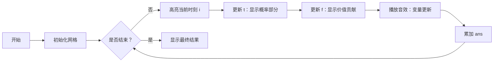

# 题目信息

# Ryoku 爱学习

## 题目背景

Ryoku 继承了 Riri 在学习方面的天赋，所以她非常热爱学习。但是，不管再怎么热爱学习，Ryoku 也会疲倦的。

## 题目描述

Ryoku 在第 $i$ 时刻会了解到有一个新知识 $i$，这个新知识的实际价值为 $w_i$，由于 Ryoku 爱学习，所以她不会选择不学习知识，但她只有 $p_i$ 的概率能成功掌握这个知识。

然而如果 Ryoku 同时掌握了太多知识，由于 Ryoku 内心的疲倦等因素，Ryoku 感受到的对知识的喜爱程度会改变，我们用一个数值 $R$ 来描述**喜爱程度**的大小。具体而言，设 $R=f(l,r)$ 代表 Ryoku **连续掌握**时刻 $l$ 至时刻 $r$ 的知识时对这些知识的喜爱程度的总和，有参数 $a, b$（$0 < a, b<1$），则有：

$$ f(l,r)=a^{b(r-l)}  \sum_{i=l}^r w_i$$

Ryoku 想要知道她期望能**掌握的每一段连续时刻的知识**的喜爱程度之和是多少（需要注意的是，这里所说的连续时刻的知识不能被一段更长的所包含）。你能帮帮她吗？


## 说明/提示

**【样例 1 说明】**

掌握知识 $1$、知识 $2$、知识 $3$ 时，每一段连续掌握知识的喜爱程度之和为 $\left(\dfrac 12\right)^{\frac12\times 2}(2+3+3)=4$。

掌握知识 $1$、知识 $2$ 时，每一段连续掌握知识的喜爱程度之和为 $\left(\dfrac 12\right)^{\frac12\times 1}(2+3)=\dfrac {5\sqrt2}2\approx 3.536$。

掌握知识 $1$、知识 $3$ 时，每一段连续掌握知识的喜爱程度之和为 $\left(\dfrac 12\right)^{\frac12\times 0}\times 2 +\left(\dfrac 12\right)^{\frac12\times 0}\times 3  = 5$。

掌握知识 $2$、知识 $3$ 时，每一段连续掌握知识的喜爱程度之和为 $\left(\dfrac 12\right)^{\frac12\times 1}(3+3)=3\sqrt 2\approx 4.243$。

只掌握知识 $1$ 时，每一段连续掌握知识的喜爱程度之和为 $\left(\dfrac 12\right)^{\frac12\times 0}\times 2  = 2$。

只掌握知识 $2$ 时，每一段连续掌握知识的喜爱程度之和为 $\left(\dfrac 12\right)^{\frac12\times 0}\times 3  = 3$。

只掌握宝物 $3$ 时，每一段连续掌握知识的喜爱程度之和为 $\left(\dfrac 12\right)^{\frac12\times 0}\times 3  = 3$。

什么都不掌握时，每一段连续掌握知识的喜爱程度之和为 $0$。

以上 $8$ 种情况出现的概率均为 $\dfrac 18$，所以答案约为：

$$(4+3.536+5+4.243+2+3+3+0)\times \dfrac 18\approx3.0973$$

---

**【数据规模与约定】**

对于 $20\%$ 的数据，$n \le 18$。  
对于另外 $15\%$ 的数据，$w_i = 1$。  
对于 $55\%$ 的数据，$n \le 10^3$。  
对于另外 $15\%$ 的数据，$w_i = 1$。  
对于另外 $15\%$ 的数据，$b_i \le 0.2$。  

此外，对于 $100\%$ 的数据，$0<n\le10^5$，$0<a,b,p_i<1$，$0<w_i\le10^3$。保证输入数据的精度不超过 $10^{-2}$。

**本题使用 Special Judge，如果某个测试点中你的答案与标准答案相差小于等于 $10^{-3}$，你就可以通过该测试点。**


## 样例 #1

### 输入

```
3 0.5 0.5
2 3 3
0.5 0.5 0.5
```

### 输出

```
3.097```

## 样例 #2

### 输入

```
6 0.8 0.2
1 1 4 5 1 4
0.9 0.6 0.7 0.7 0.6 0.8
```

### 输出

```
10.521```

# AI分析结果


# 💡 Kay的C++算法解析：Ryoku爱学习 深入学习指南 💡

> 大家好，我是Kay！今天我们将一起探索这道关于期望计算的动态规划问题。题目看起来复杂，但核心思想非常精妙——通过巧妙的递推关系避免重复计算。我会用清晰的解释和生动的可视化帮助大家理解，准备好开始了吗？🚀

## 1. 题目解读与核心算法识别

✨ **本题主要考察**：`动态规划（期望计算）`

🗣️ **初步分析**：
> 这道题要求计算所有连续知识段喜爱程度的期望和，关键在于**分解贡献+避免重复计算**。想象你在搭积木：短积木（小区间）组合成长积木（大区间）时，如何高效计算新积木的贡献？这就是动态规划的用武之地！  
> - **核心思路**：将整体期望拆分为每个位置的贡献，设计两个递推变量：
>   - `t`：概率相关量（连续段出现的概率权重）
>   - `f`：当前结束位置的贡献期望
> - **难点突破**：理解递推式的物理意义（如何通过`a^b`关联相邻状态）和边界处理（首尾概率）
> - **可视化设计**：我们将用像素网格表示时间轴，高亮当前处理的时刻和更新的连续段，用颜色深度表示权重，音效标记关键操作（如变量更新）

---

## 2. 精选优质题解参考

### 题解一（作者：hhoppitree）
* **点评**：这份题解以极致空间优化（O(1)额外空间）脱颖而出。使用滚动变量`t`和`f`替代数组，大幅减少内存访问开销；代码简洁（仅20行），核心递推逻辑清晰：`t`维护概率权重，`f`整合价值贡献。边界处理严谨（`p1`/`p3`滚动更新），输入优化技巧（避免`cin`和`%lf`）对竞赛实践极具参考价值。

### 题解二（作者：WYXkk）
* **点评**：通过定义`end_i`（以i结尾的连续段贡献）和`P_i`（概率衰减因子）两个状态，提供更直观的数学视角。推导过程完整展示从暴力到DP的优化思路，代码变量命名规范（`dp`/`end`/`P`），帮助初学者理解期望分解的本质。虽空间效率略低，但教学价值突出。

### 题解三（作者：z7z_Eta）
* **点评**：题解详细推导了原始公式到DP的转化过程，给出明确的物理意义解释（`f_i`和`t_i`的数学含义）。代码结构工整，严格对应状态定义，注释虽简但逻辑闭环。特别强调"区间贡献独立性"这一关键点，对理解题目本质有重要启发。

---

## 3. 核心难点辨析与解题策略

1.  **难点1：状态设计的物理意义**
    * **分析**：如何将公式中的区间求和转化为可递推的状态？优质题解通过设计`t`和`f`两个变量解决：
      - `t_i` = $\sum$ [以位置i结尾的长度为k的区间概率权重]
      - `f_i` = $\sum$ [以位置i结尾的区间对答案的贡献]
    * 💡 **学习笔记**：好的状态设计应能通过增量更新避免重复计算。

2.  **难点2：递推式的推导技巧**
    * **分析**：当新增位置i时：
      - `t_i` = $a^b \cdot p_i \cdot t_{i-1}$（延续旧区间） + $p_i(1-p_{i-1})$（新区间起始）
      - `f_i` = $a^b \cdot p_i \cdot f_{i-1}$（继承旧贡献） + $w_i \cdot t_i$（新增当前值贡献）
    * 💡 **学习笔记**：递推本质是考虑当前位置"延续区间"或"另起炉灶"两种情况。

3.  **难点3：边界条件的处理**
    * **分析**：需特殊处理首尾位置的概率：
      - 起始时$p_0=0$（`p1`初始化为0）
      - 结束时$p_{n+1}=0$（循环中特判`p3`）
    * 💡 **学习笔记**：边界条件需在代码中显式定义，避免隐含假设。

### ✨ 解题技巧总结
- **技巧1：滚动数组优化** - 当状态仅依赖前一步时，用变量替代数组节省空间
- **技巧2：贡献分离** - 将复杂期望拆解为独立单元的贡献和
- **技巧3：输入输出优化** - 大规模数据避免`cin`/`%lf`，改用`getchar`快速读取

---

## 4. C++核心代码实现赏析

```cpp
#include<bits/stdc++.h>
using namespace std;
int w[100005]; // 知识价值数组

int main() {
    int n; scanf("%d", &n);
    double a, b; scanf("%lf%lf", &a, &b);
    a = pow(a, b); // 预计算a^b
    
    double ans = 0, t = 0, f = 0;
    double p_prev = 0, p_curr, p_next = 0;
    
    for(int i = 1; i <= n; ++i) scanf("%d", &w[i]);
    scanf("%lf", &p_curr); // 读取第一个概率
    
    for(int i = 1; i <= n; ++i) {
        if(i < n) scanf("%lf", &p_next); // 非末尾读取下一个概率
        
        // 核心递推式
        t = a * p_curr * t + p_curr * (1 - p_prev);
        f = a * p_curr * f + t * w[i];
        ans += (1 - p_next) * f; // 乘以后续不选的概率
        
        p_prev = p_curr; // 滚动更新概率
        p_curr = p_next;
    }
    printf("%.10lf\n", ans);
    return 0;
}
```

**代码解读概要**：
> 代码通过滚动变量`t`和`f`实现O(1)空间复杂度：
> 1. **初始化**：预计算`a^b`，读取`w`数组
> 2. **概率滚动**：`p_prev`/`p_curr`/`p_next`分别表示$p_{i-1}$, $p_i$, $p_{i+1}$
> 3. **核心循环**：
>    - 更新`t`：计算当前连续段的概率权重
>    - 更新`f`：计算以当前位置结尾的贡献
>    - 累加`ans`：乘以后续不选的概率$1-p_{i+1}$
> 4. **输出**：保留精度至小数点后10位

---

### 题解一（hhoppitree）核心代码
```cpp
t = a * p2 * t + p2 * (1 - p1);
f = a * p2 * f + t * w[i];
ans += (1 - p3) * f;
```
* **亮点**：极致空间优化（仅用3个双精度变量）
* **解读**：
  > 1. `t`更新：`a*p2*t`延续旧区间，`p2*(1-p1)`启动新区间
  > 2. `f`更新：`a*p2*f`继承历史贡献，`t*w[i]`新增当前价值
  > 3. `ans`累加：`(1-p3)`保证区间独立性

* 💡 **学习笔记**：滚动变量是空间优化的利器，尤其适用于链式递推问题。

### 题解二（WYXkk）核心代码
```cpp
P[i] = t * p[i-1] * P[i-1] + 1 - p[i-1];
end[i] = p[i] * (t * end[i-1] + P[i] * w[i]);
dp[i] = (1-p[i])*dp[i-1] + p[i]*(dp[i-1]-end[i-1])+end[i];
```
* **亮点**：状态定义清晰（end/P），数学推导完备
* **解读**：
  > - `P[i]`：位置i作为区间起点的概率衰减因子
  > - `end[i]`：以i结尾的连续段贡献期望
  > - `dp[i]`：前i个位置的总期望，通过增量更新避免重复计算

* 💡 **学习笔记**：多状态设计能更好匹配问题原始定义，适合教学展示。

### 题解三（z7z_Eta）核心代码
```cpp
t[i] = x * p[i] * t[i-1] + p[i] * (1 - p[i-1]);
f[i] = x * p[i] * f[i-1] + t[i] * w[i];
ans += (1 - p[i+1]) * f[i];
```
* **亮点**：公式与代码严格对应，物理意义明确
* **解读**：
  > 1. `t[i]`：包含位置i的概率权重（类似题解一的`t`）
  > 2. `f[i]`：以i结尾的区间贡献（类似`f`）
  > 3. 实时累加`ans`而非最后求和，减少存储

* 💡 **学习笔记**：在循环中即时累加结果可降低空间复杂度。

---

## 5. 算法可视化：像素动画演示

**主题**：`"时间旅行者"的期望之旅`  
**核心演示**：DP过程在时间轴上的递推，重点展示`t`和`f`的更新逻辑  



**设计细节**：
1. **8位像素网格**：
   - 横轴表示时间（1-n），纵轴显示`w_i`值（柱状高度）
   - 当前处理位置`i`闪烁黄色边框
   - 连续段用同色方块连接（长度变化时播放"延伸"音效）

2. **控制面板**：
   - 步进控制：单步/自动模式（可调速）
   - 变量监视器：实时显示`t`, `f`, `ans`数值变化
   - 音效方案：
     * 步进："嘀"（8-bit短音）
     * 更新`t`：中音"叮"
     * 更新`f`：高音"咚"
     * 完成：胜利旋律

3. **关键帧示例**：
   - 当计算`t = a*p_curr*t_prev + ...`时：
     * 左侧显示公式分解：`a^b`(红色) * `p_curr`(蓝色) * `t_prev`(绿色) + 新项(黄色)
     * 对应代码行高亮
   - 更新`f`时，当前`w[i]`值脉冲闪烁

**教学价值**：通过动画理解递推式的物理意义——每一步如何整合历史状态与当前输入生成新状态。

---

## 6. 拓展练习与相似问题思考

1. **期望DP的通用模式**：
   - 问题特征：带概率的序列操作，贡献与连续段相关
   - 解题框架：
     * 分离位置贡献
     * 设计状态表示历史影响
     * 推导增量更新式

2. **推荐题目**：
   - 洛谷 P1654：OSU!（基础期望DP）
   - 洛谷 P1365：WJMZBMR打osu!（变形期望计算）
   - 洛谷 P6154：游走（期望+图论）

---

## 7. 学习心得与经验分享

> **参考经验 (来自 hhoppitree)**：  
> "输入优化至关重要——开始使用`%lf`读取导致性能下降，改用`getchar`快速读取后成为最优解"

> **Kay的总结**：  
> 1. **输入输出效率**是竞赛的重要细节
> 2. 期望类问题常用**线性可加性**拆解贡献
> 3. 推导递推式时，思考**物理意义**比机械变形更重要

---

通过今天的分析，希望大家不仅学会这道题的解法，更能掌握"期望DP"的核心思想——将随机性问题转化为确定性状态转移。记住：每个复杂问题都是由简单组件构成的，学会拆解就能化难为易！💪

---
处理用时：145.24秒