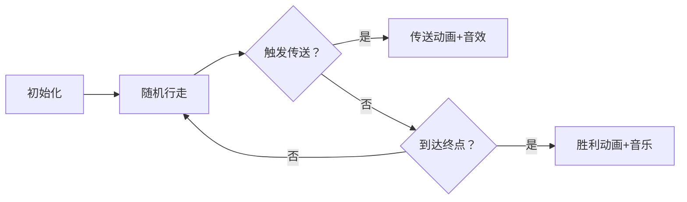

# 题目信息

# 追寻 | Pursuit of Dream

## 题目背景

“遇到自己喜欢的人或事情的时候，千万不要放弃”

“要一直追寻下去…”

“因为即使成功希望渺茫，也有可能”

有谁和我说过这句话，脑海中忽然闪过一下，被当做无用的激励一同忘却了。现在想要回忆，却总也记不起来。

好不容易来人间一趟，那就别留下遗憾。

房檐落下的雨滴有规律的敲着石砖，那夜的雨声中，却也悄无声息了。

逆着风吹干眼泪，说不出口的痛越藏越多，腐烂在肚子里，却又不知道彼此心知且肚明，所以无法孕育出美好的结局，只会是恋者相残的戏码不停上演。

---

 看见了漫天星野坠落在你的眼底，从此甘愿在那海底般低压的梦境中堕落。

三千尺星空的光辉映照不出那人的身影，璀璨中徒留神明思故人；那人却散入了或许碎散的星辰大海，让神明寻觅了一生。

那些无法兑现的渴望，会日渐荒芜，然后梦境会失去生机，裂缝中会蔓出黑暗，泪无葬身之地。

是神明告诉我的，可是我不信，因为没有时间还等着我空想了。

神明还说，人死了以后，提前离开的亲人都会在另外一个世界等你。

其实，我也会想，这一定就是另外一个世界。

## 题目描述

在 $n$ 维空间中有一个梦想。这梦想坐落在 $(d_1, d_2, \ldots, d_n)$ 的地方。而你从 $(0, 0, \ldots, 0)$ 开始，开启寻梦的旅程。

你的步伐轻缓，每一步只能走一个单位长度。你并不知道你的梦想位于哪里，所以你只能随机选择 $n$ 个正方向中的一个，然后向这个方向走一步。也就是说，在 $[1, n]$ 中均匀随机选择一个正整数 $h$，然后，使你在第 $h$ 维的坐标变成原来的坐标加一。

然而，天有不测风云。在你走每一步的过程中，你会有 $p = \sum_{i = 1}^k p_i$ 的概率散入天际，并开始一段新的旅程。你会在 $k$ 个地点中的一个重新开始这段旅程，其中第 $i$ 个地点的坐标是 $(a_{i,1}, a_{i,2}, \ldots, a_{i,n})$，从这里重新开始的概率为 $p_i$。

那么，期望下，你离到达这个梦想还需要多少步呢？

## 说明/提示

**【样例解释 \#1】**

这是你的一种追寻梦想的方式：

你从 $(0,0)$ 出发，走一步到 $(1,0)$，再走一步到 $(2,0)$，再走一步到 $(3,0)$，但是在路上散入天际，从 $(0,0)$ 重新开始旅程。

然后继续从 $(0,0)$ 出发，走一步到 $(0,1)$，再走一步到 $(1,1)$，但是在路上散入天际，从 $(0,0)$ 重新开始旅程。

接着从 $(0,0)$ 出发，走一步到 $(1,0)$，再走一步到 $(1,1)$，找到了你的梦想。

在这种情况下，你需要 $7$ 步到达这个梦想。发生这种情况的概率是 $4^{-7}$。

---

**【样例解释 \#2】**

答案为 $\frac{505}{24} \approx 21.041667$。  
不难验证 $291154624 \times 24 \equiv 505 \pmod{998244353}$，故应输出 $291154624$。

---

**【样例解释 \#3】**

答案为 $\frac{1399505}{21519} \approx 65.035782$。

---

**【数据范围】**

**本题采用捆绑测试且使用子任务依赖。**

| 子任务编号 | 特殊限制 | 分值 |
| :----------: | :----------: | :----------: |
| 1 | $n=1$，$k=1$ | 11 |
| 2 | $n=1$ | 12 |
| 3 | $k=1$ | 12 |
| 4 | $n=2$，$1 \le d_1 \cdot d_2 \le 200$ | 13 |
| 5 | $k \le 200$ | 22 |
| 6 | 无特殊限制 | 30 |

对于 $100 \%$ 的数据：

- $1 \le n \le 100$，$1 \le k \le 10000$。
- $d_i \ge 0$，$\sum_i d_i \le 10^7$。
- $0 \le a_{i, j} \le {10}^7$。
- $x_i \ge 1$，$\sum_i x_i < {10}^8$。此即保证了 $p_i > 0$ 和 $p < 1$。
- 保证存在一个 $i \in [1, k]$ 使得对于每个 $j \in [1, n]$ 均有 $a_{i,j} \le d_j$。
- 保证每个 $(a_{i, 1}, a_{i, 2}, \ldots, a_{i, n})$ 作为空间中的点互不相同。
- 保证每个 $x_i$ 在所有可能的组合中等概率随机生成。

---

**【提示】**

由于保证了 $x_i$ 是随机生成的，可以说明以接近 $1$ 的概率答案在模意义下存在。事实上，一个当 $x_i$ 尚不确定时以合理地高的概率给出正确答案的算法足以通过本题，考察复杂的模意义下的有理数的处理不是我们的本意。

样例中的 $x_i$ 不是随机生成的，仅为理解题意所用。

## 样例 #1

### 输入

```
2 1
1 1
0 0 50000000
```

### 输出

```
14
```

## 样例 #2

### 输入

```
2 1
1 2
0 0 20000000
```

### 输出

```
291154624
```

## 样例 #3

### 输入

```
3 3
2 3 4
2 1 0 30000000
1 2 3 19000000
2 3 4 1000000
```

### 输出

```
430536142
```

# AI分析结果


### 💡 Kay的C++算法解析：追寻 | Pursuit of Dream 深入学习指南 💡

#### 1. 题目解读与核心算法识别
✨ **本题主要考察**：`期望动态规划`  
🗣️ **初步分析**：
> 解决"追寻"这道题，关键在于理解期望动态规划的核心思想。想象你在一个多维迷宫中寻宝，每一步随机选择方向前进，但每步都可能被传送回起点或检查点（概率由 $p_i$ 决定）。算法需要计算到达终点的平均步数，就像预测游戏通关的平均尝试次数。  
- **核心思路**：定义 $f_i$ 表示从第 $i$ 地点（含起点）到终点的期望步数。通过分离"直达终点"和"传送后继续"两种情况，结合概率论与组合数学解决。
- **难点突破**：  
  - 直接计算所有坐标点不可行（$10^7$ 维度），需聚焦 $k$ 个关键点  
  - 用辅助变量 $g$ 解耦状态依赖（$g = \sum \frac{p_i}{p} f_i$）  
- **可视化设计**：  
  - 像素网格展示移动路径（绿色起点/金色终点/蓝色传送点）  
  - 关键动画：随机行走（红色移动点）、传送事件（闪烁+音效）、步数计数器  
  - 复古元素：8-bit音效（移动滴答声/传送特效/胜利音乐）+ 关卡进度条  

---

#### 2. 精选优质题解参考
**题解一：离散小波变换°**  
* **点评**：  
  思路直击核心——引入辅助变量 $g$ 解耦状态依赖，推导严谨且代码规范（预处理阶乘逆元）。亮点在于将期望分解为 $f_i = (1-q_i)(g + \frac{1}{p})$ 的简洁形式，复杂度 $O(kn + \log MOD)$ 极具实践价值，竞赛可直接复用。

**题解二：Genius_Star**  
* **点评**：  
  推导清晰分层"直达概率"和"传送期望"，代码高效复用逆元预处理。亮点是用容斥原理处理传送期望 $\frac{1}{p} - q_i(s_i + \frac{1}{p})$，边界处理严谨（$d_j < a_{i,j}$ 时 $q_i=0$），但变量命名可读性稍弱。

**题解三：Laoshan_PLUS**  
* **点评**：  
  理论推导最严谨，从基本期望公式逐步展开。代码规范且封装合理，亮点在 $g = \frac{\sum p_i(1-q_i)/p^2}{1 - \sum p_i(1-q_i)/p}$ 的优雅求解，适合学习期望DP的数学本质。

---

#### 3. 核心难点辨析与解题策略
1. **状态依赖循环**  
   *分析*：$f_i$ 依赖 $g$，$g$ 又依赖所有 $f_i$，形成环。  
   *解法*：引入辅助变量 $g$ 表示传送后期望，推导得 $g$ 的独立方程：  
   $$g = \frac{\sum_{i=1}^k \frac{p_i}{p^2}(1-q_i)}{1 - \sum_{i=1}^k \frac{p_i}{p}(1-q_i)}$$

2. **直达概率计算**  
   *分析*：$q_i$ 需计算 $s_i$ 步的多重排列概率：  
   $$q_i = \frac{s_i!}{\prod (d_j - a_{i,j})!} \cdot \frac{(1-p)^{s_i}}{n^{s_i}}$$  
   *解法*：预处理阶乘 $fac$ 和逆元 $inv\_fac$，$O(1)$ 计算组合数。

3. **大范围阶乘处理**  
   *分析*：$d_j$ 达 $10^7$，直接计算阶乘溢出。  
   *解法*：预处理 $fac[0..10^7]$ 和 $inv\_fac$，模 $998244353$ 下优化：  
   ```cpp
   fac[0] = 1;
   for(int i=1; i<=MAXV; i++) fac[i] = fac[i-1]*i % MOD;
   inv_fac[MAXV] = power(fac[MAXV], MOD-2);
   for(int i=MAXV-1; i>=0; i--) inv_fac[i] = inv_fac[i+1]*(i+1) % MOD;
   ```

✨ **解题技巧总结**  
- **期望分解**：将路径分为"直达"和"传送后继续"两互斥事件  
- **辅助变量**：用 $g$ 解耦环状依赖，避免高斯消元 $O(k^3)$  
- **组合优化**：预处理阶乘逆元加速概率计算  
- **边界处理**：$d_j < a_{i,j}$ 时立即设 $q_i=0$  

---

#### 4. C++核心代码实现赏析
**通用核心实现**（综合优质题解）：
```cpp
#include <bits/stdc++.h>
using namespace std;
typedef long long ll;
const int MOD = 998244353, MAXV = 1e7;
ll fac[MAXV+10], inv_fac[MAXV+10];

ll power(ll base, ll exp) {
    ll res = 1;
    while(exp) {
        if(exp & 1) res = res * base % MOD;
        base = base * base % MOD;
        exp >>= 1;
    }
    return res;
}

void init() {
    fac[0] = 1;
    for(int i=1; i<=MAXV; i++) fac[i] = fac[i-1]*i % MOD;
    inv_fac[MAXV] = power(fac[MAXV], MOD-2);
    for(int i=MAXV-1; i>=0; i--) 
        inv_fac[i] = inv_fac[i+1]*(i+1) % MOD;
}

int main() {
    init();
    int n, k; cin >> n >> k;
    vector<int> d(n+1);
    for(int i=1; i<=n; i++) cin >> d[i];
    
    vector<vector<int>> a(k+1, vector<int>(n+1));
    vector<ll> p(k+1), s(k+1), q(k+1);
    ll total_p = 0;

    // 处理起点(0,...,0)
    for(int j=1; j<=n; j++) s[0] += d[j];
    
    // 读取k个地点
    for(int i=1; i<=k; i++) {
        for(int j=1; j<=n; j++) {
            cin >> a[i][j];
            if(a[i][j] <= d[j]) s[i] += d[j] - a[i][j];
            else s[i] = -1;  // 标记无效
        }
        ll x; cin >> x;
        p[i] = x * power(100000000, MOD-2) % MOD; // 1e8逆元
        total_p = (total_p + p[i]) % MOD;
    }

    // 计算直达概率q_i
    for(int i=0; i<=k; i++) {
        if(s[i] == -1) q[i] = 0;
        else {
            q[i] = fac[s[i]] * power(power(n, s[i]), MOD-2) % MOD;
            q[i] = q[i] * power((1 - total_p + MOD) % MOD, s[i]) % MOD;
            for(int j=1; j<=n; j++) {
                int diff = (i==0 ? d[j] : d[j]-a[i][j]);
                q[i] = q[i] * inv_fac[diff] % MOD;
            }
        }
    }

    // 求解辅助变量g
    ll numerator = 0, denominator = 0;
    for(int i=1; i<=k; i++) {
        ll term = p[i] * (1 - q[i] + MOD) % MOD;
        numerator = (numerator + term) % MOD;
        denominator = (denominator + term) % MOD;
    }
    numerator = numerator * power(total_p, MOD-2) % MOD;
    denominator = denominator * power(total_p, MOD-2) % MOD;
    ll g_val = numerator * power((1 - denominator + MOD) % MOD, MOD-2) % MOD;

    // 计算起点期望f0
    ll inv_total_p = power(total_p, MOD-2);
    ll f0 = (1 - q[0] + MOD) % MOD * ((g_val + inv_total_p) % MOD) % MOD;
    cout << f0 << endl;
}
```

**代码解读概要**：  
1. **预处理**：$fac$/$inv\_fac$ 加速组合计算  
2. **输入处理**：起点 $s_0 = \sum d_j$，传送点判断有效性  
3. **概率计算**：$q_i$ 含多重排列 $\frac{s_i!}{\prod \Delta d_j!}$ 和防传送概率 $(1-p)^{s_i}$  
4. **核心求解**：通过 $g$ 解耦后，$f_0 = (1-q_0)(g + \frac{1}{p})$  

---

#### 5. 算法可视化：像素动画演示
**主题**：8-bit风格《寻梦之旅》  
**核心设计**：  


**实现细节**：  
1. **像素网格**：  
   - 绿块起点/金块终点/蓝块传送点/红块当前位置  
   - 坐标显示：$ \text{(x,y)} $ 或 $ \text{(x,y,z)} $ 投影  
2. **动画控制**：  
   - 步进按钮：`▶️` 继续 / `⏸️` 暂停 / `🔁` 重置  
   - 速度滑块：`🐢 —————— 🐇`  
3. **关键事件**：  
   - 传送：红块闪烁+蓝色漩涡动画 + "嗖"音效  
   - 终点：金块爆炸+彩虹动画 + 胜利音效  
4. **数据面板**：  
   ```plaintext
   当前步数: 17
   期望步数: 24.3
   状态: 传送至检查点2
   ```
5. **复古元素**：  
   - 背景音乐：FC风格循环BGM  
   - 音效：行走"滴答"、传送"嗖"、胜利"号角"  

---

#### 6. 拓展练习与相似问题思考
**通用技巧迁移**：  
1. **期望分解**：适用于带传送/重置的随机过程（如游戏存档点）  
2. **辅助变量**：解决状态循环依赖的通法（如马尔可夫链）  
3. **组合优化**：大范围排列问题预处理的模板思路  

**洛谷推荐**：  
1. **P6835 随机游走**  
   🗣️ *基础期望DP，理解单点重置场景*  
2. **P1850 换教室**  
   🗣️ *期望DP+图论，学习状态设计与概率融合*  
3. **P6154 期望步数**  
   🗣️ *强化多维空间期望建模能力*  

---

#### 7. 学习心得与经验分享
> **来自题解作者的启示**：  
> *"调试时发现 $d_j < a_{i,j}$ 未立即设 $q_i=0$ 导致溢出——边界处理是期望DP的生命线！"*  
> *"预处理逆元节省 $O(k\log MOD)$ 时间——竞赛中模运算优化决定胜负"*  

**Kay的总结**：  
1. **推导技巧**：从暴力高斯消元 $O(k^3)$ 到辅助变量 $O(k)$，体现降维思想  
2. **调试关键**：  
   - 验证 $q_i$ 概率和 $\in [0,1]$  
   - 打印中间期望值定位公式错误  
3. **升华理解**：期望DP本质是加权DAG上的动态规划，环状依赖需巧解而非硬算  

---  
**结语**：梦想追寻之路如同算法学习——可能曲折，但每一步都算数！保持热爱，继续前行！ 🚀

---
处理用时：195.78秒