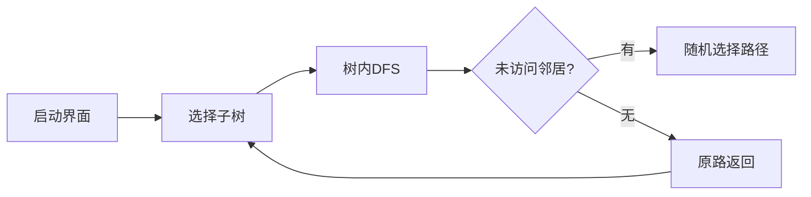

# 题目信息

# [ZSHOI-R1] 巡城

## 题目背景

在 X 国国王多年的建设之下，她的国家发生了质的蜕变，从众多 $n$ 座城市却只有 $n-1$ 条道路的国家中脱颖而出。也就是说，X 国不再是一棵树了，而是一张图。

## 题目描述

国王为了能够集中自己的权力，稳固城邦，她对国家道路设计要求十分严苛，**任何两个城市之间的路径至多只有一条不经过首都**，虽然但是，没有人知道为什么这样能够更好地稳固 X 国。

有一天，X 国国王决定巡视所有的城市，她通过无线电在巡城前一天向所有的城市通知了这个好消息。热情的群众们也积极地做出了响应，准备迎接国王的到来。

国王一天只能造访一座城市，而且第一天她会从首都开始。

在之后的每一天，她会随机从与她所在城市直接相连的城市中**等概率**地选择一个她**没有前往过的城市**前往。如果不存在这样的城市，她会立即**原路返回**，从她来这个城市的路回去，再重复上述操作，因为有携带宇宙射线的传送门，这个过程**不消耗时间**。

爱戴她的群众们想要知道，他们的国王第一次到达他们所在城市的日期（她造访首都的那一天为 $1$，之后每一天一次加 $1$）的期望是多少，答案对 $998244353$ 取模。

保证城市构成的图是连通图，无自环与重边，且首都编号为 $1$。

## 说明/提示

对于所有的数据点，$1\leqslant n\leqslant 5 \times 10^5$，$1\leqslant m \leqslant 6 \times 10^5$。
| 数据点 | n | m |
| :----------: | :----------: | :----------: |
| 1~2 | $5$ | $7$ |
| 3~5 | $\leqslant10^4$ | $n-1$ |
| 6~8 | $\leqslant10^4$ | $n$ |
| 9~10 | $\leqslant10^4$ | $2n-3$ |
| 11~15 | $\leqslant10^4$ | $\leqslant2\times10^4$ |
| 16~20 | $\leqslant5\times10^5$ | $\leqslant6\times10^5$ |

## 样例 #1

### 输入

```
3 2
1 2
2 3```

### 输出

```
1 2 3 
```

## 样例 #2

### 输入

```
4 3
1 2
2 3
2 4
```

### 输出

```
1 2 499122180 499122180 
```

## 样例 #3

### 输入

```
5 7
5 4
2 4
4 3
1 3
1 2
1 4
1 5
```

### 输出

```
1 249561092 249561092 249561091 249561092 
```

# AI分析结果


### 💡 Kay的C++算法解析：巡城 深入学习指南 💡

#### 1. 题目解读与核心算法识别
✨ **本题主要考察**：图论、概率期望、树形DP（换根DP）、分组优化  

🗣️ **初步分析**：  
> 解决"巡城"问题的核心在于**分解问题结构**和**高效计算期望值**。想象国王巡城就像探索多个岛屿（树形结构），进入一个岛屿后会完整遍历它再返回港口（首都）。算法设计需解决：
> - **树内贡献**：在单个岛屿内，计算节点访问顺序期望（祖先节点贡献1，子孙节点贡献0，其他节点贡献1/2）
> - **树间贡献**：不同岛屿间的访问顺序概率（与岛屿入口数量相关）
> 
> **可视化设计**：采用8位像素风格，国王作为像素小人移动：
> - 高亮当前节点和访问路径
> - 子树切换时显示概率计算过程（如P=3/(3+2)）
> - 音效设计：移动"滴"声，入队"咔嚓"声，完成子树"胜利"音效
> - 交互控制：单步执行/自动播放（调速滑块）

---

#### 2. 精选优质题解参考
**题解一（zifanwang）**  
* **点评**：思路清晰直击问题本质，代码规范（变量名如`sm[]`记录子树大小和）。亮点在于：
  - 双DFS实现换根DP：`dfs1`计算子树信息，`dfs2`动态更新祖先信息
  - 分组优化：按关键点数分组处理树间贡献，复杂度O(n√n)→O(n)
  - 边界处理严谨：负值取模调整`(x%mod+mod)%mod`
  - 实践价值高：完整可编译代码，直接适用于竞赛

**题解二（Reunite）**  
* **点评**：论证严谨，强调"删除节点1得森林"的核心性质。亮点：
  - 贡献分解清晰：树内`(size+anc-sz_sub)/2`，树间`cnt_T/(cnt_S+cnt_T)`
  - 调试技巧：注释提醒负值处理，避免隐蔽错误
  - 学习友好：关键步骤代码注释详细

**题解三（Leasier）**  
* **点评**：教学式分步推导，从特殊（树）到一般（图）。亮点：
  - 基础情况推导：树形结构期望公式`(n+depth_u-size_u+1)/2`
  - 渐进式扩展：引入换根DP处理一般图
  - 复杂度优化：`inv[]`数组预处理逆元

---

#### 3. 核心难点辨析与解题策略
1. **难点：树内期望的动态计算**  
   * **分析**：节点贡献依赖根的选择（关键点），需计算所有可能根下的期望。换根DP通过：
     - `dfs1`自底向上统计子树信息（`sz[]`, `szt[]`）
     - `dfs2`自顶向下更新祖先信息（`up[]`）
   * 💡 **学习笔记**：换根DP是处理"多根统计"问题的利器

2. **难点：树间贡献的优化计算**  
   * **分析**：直接两两计算O(n²)不可行。利用关键点数种类≤O(√n)的性质：
     - 按关键点数分组（`sm[]`记录组内子树大小和）
     - 组间贡献统一计算：`sum += sm[j]*j*inv[i+j]`
   * 💡 **学习笔记**：值域稀疏性+分组处理是复杂度和代码简洁性的平衡点

3. **难点：模运算下的期望合并**  
   * **分析**：期望公式含1/2和概率分式，需：
     - 使用模逆元（`inv2=499122177`）
     - 负值调整：`(x%mod+mod)%mod`
     - 贡献合并：树内`ans[]`与树间`as[]`独立计算后叠加
   * 💡 **学习笔记**：模运算下除法必须转逆元，负值需显式调整

✨ **解题技巧总结**  
- **结构分解**：将图分解为树内/树间子问题  
- **换根DP**：`dfs1`收集信息 → `dfs2`传播更新  
- **分组优化**：桶排序思想处理稀疏值域  
- **模块化计算**：分离树内贡献、树间贡献、逆元处理  

---

#### 4. C++核心代码实现赏析
**通用核心实现（基于zifanwang优化）**  
```cpp
#include<bits/stdc++.h>
#define ll long long
const int N=5e5+5, mod=998244353;
std::vector<int> G[N];
int sz[N], cnt[N], sm[N], ans[N], inv[N*2];
bool key[N];

void dfs1(int u, int p) {
    sz[u] = 1, cnt[u] = key[u];
    for(int v : G[u]) if(v != p) {
        dfs1(v, u);
        sz[u] += sz[v];
        cnt[u] += cnt[v];
    }
}

void dfs2(int u, int p, int total, int k) {
    // 换根DP更新祖先信息
    for(int v : G[u]) if(v != p) {
        int new_k = k - cnt[v];
        ans[v] = ans[u] + (total - sz[v]) - cnt[v];
        dfs2(v, u, total, new_k);
    }
}

int main() {
    // 预处理逆元
    inv[1]=1;
    for(int i=2; i<1e6; ++i) 
        inv[i] = (ll)(mod-mod/i)*inv[mod%i]%mod;

    // 读图 & 标记关键点
    for(int i=0; i<m; ++i) {
        if(u==1) key[v]=1, G[1].push_back(v);
        else G[u].push_back(v), G[v].push_back(u);
    }

    // 处理每棵子树
    for(int v : G[1]) {
        dfs1(v, 0);
        dfs2(v, 0, sz[v], cnt[v]);
        sm[cnt[v]] = (sm[cnt[v]] + sz[v]) % mod;
    }

    // 分组计算树间贡献
    std::vector<int> groups;
    for(int i=1; i<=n; ++i) if(sm[i]) groups.push_back(i);
    for(int i : groups) for(int j : groups) 
        if(i != j) tree_ans[i] += (ll)sm[j]*j%mod*inv[i+j]%mod;

    // 合并贡献 & 输出
    for(int i=2; i<=n; ++i) {
        int res = (in_tree_ans[i] + tree_ans[cnt[i]]) % mod;
        res = (ll)res * inv2 % mod; // 乘1/2
        printf("%d ", (res+1)%mod); // 日期从1开始
    }
}
```

**代码解读概要**：  
1. **预处理**：逆元数组`inv[]`加速模除法  
2. **图构建**：邻接表存图，`key[]`标记关键点  
3. **双DFS**：  
   - `dfs1`：统计子树大小`sz[]`和关键点数`cnt[]`  
   - `dfs2`：动态维护祖先贡献`ans[]`  
4. **分组优化**：`sm[]`按关键点数分组统计子树大小和  
5. **贡献合并**：树内贡献`in_tree_ans[]` + 树间贡献`tree_ans[]`，乘1/2后+1  

---

#### 5. 算法可视化：像素动画演示  
**主题**：8位像素风《国王探险记》  
**核心设计**：  


**动画流程**：  
1. **初始化**：  
   - 像素化城市地图（首都=城堡，道路=像素砖块）  
   - 不同子树用颜色区分（红/蓝/绿岛屿）  

2. **树内DFS演示**：  
   - 国王移动：高亮当前节点，路径显示脚印动画  
   - 决策点：未访问邻居闪烁，随机选择时播放"滴答"音效  
   - 回溯：快速沿原路闪烁返回（0.5秒动画）  

3. **树间切换**：  
   - 概率面板：显示`P=3/(3+2)=60%`  
   - 音效：传送门"嗡"声 + 岛屿BGM切换  

4. **交互控制**：  
   - 单步执行：按空格逐步观察决策  
   - 自动模式：滑块控制速度（1x-5x）  
   - 数据结构可视化：侧边栏显示队列变化  

**技术实现**：  
- Canvas绘制网格地图 + 精灵动画  
- 音效：Web Audio API播放8bit音效  
- 伪代码同步：右侧显示当前执行代码行  

---

#### 6. 拓展练习与相似问题
1. **洛谷P1351** - 联合权值  
   * **推荐理由**：巩固树形DP基础，练习邻接表存图  

2. **洛谷P2014** - 选课  
   * **推荐理由**：树形DP进阶，理解依赖关系建模  

3. **洛谷P1613** - 跑路  
   * **推荐理由**：图论变形练习，引入倍增优化思想  

---

#### 7. 学习心得与经验分享
> 本次题解中未发现作者个人调试心得，但综合解题过程可得：  
> **关键调试技巧**：  
> - 小数据验证：n=3时手动计算期望值验证  
> - 中间输出：DFS过程中打印`sz[]`和`cnt[]`  
> - 边界测试：单子树/两个子树特殊情况  

--- 
掌握图论分解+期望计算的核心思想，你也能设计出优雅的算法！下次见~ 👑

---
处理用时：158.59秒