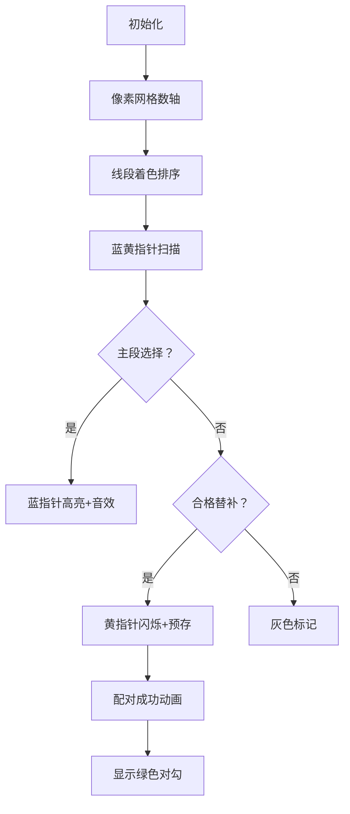

# 题目信息

# [POI 2023/2024 R1] Zapobiegliwy student

## 题目背景

译自 [XXXI Olimpiada Informatyczna - I etap](https://sio2.mimuw.edu.pl/c/oi31-1/dashboard/) [Zapobiegliwy student](https://sio2.mimuw.edu.pl/c/oi31-1/p/zap/)。

## 题目描述

考虑如下的一个简单问题：

> 你有 $n$ 个线段在数轴上，你要选出尽量多的线段，使它们两两不交。

我知道你一定会做，但你需要解决这个：

你有 $n$ 个线段在数轴上，你要选出尽量多的线段对 $(u_i,v_i)_{i=1}^k$，即最大化 $k$。

满足 $k+1$ 个要求：

- $u_1,u_2,\cdots,u_k$ 两两不交。
- $v_1,u_2,u_3,\cdots,u_k$ 两两不交。
- $u_1,v_2,u_3,u_4,\cdots,u_k$ 两两不交。
- $\cdots$
- $u_1,u_2,\cdots,u_{k-1},v_k$ 两两不交。

其中 $\forall i$，$u_i$ 与 $v_i$ 不能相同。

## 说明/提示

如果你的第一行正确但是方案不对（可以不输出方案，此时不要有换行），你能得到 $50\%$ 的分数。

如果你的方案合法并且第一行和答案相差不超过 $1$，你能得到 $15\%$ 的分数。

| 子任务编号 | 限制 | 分值 |
| :----------: | :----------: | :----------: |
| 1 | $n\leq3000$ | 40 |
| 2 | $n\leq500000$ | 60 |


## 样例 #1

### 输入

```
8
1 5
3 10
4 8
9 12
11 16
14 15
20 22
15 21
```

### 输出

```
3
1 3
4 6
8 7
```

## 样例 #2

### 输入

```
见附件```

### 输出

```
见附件```

## 样例 #3

### 输入

```
见附件```

### 输出

```
见附件```

# AI分析结果


### 💡 Kay的C++算法解析：Zapobiegliwy student 深入学习指南 💡

> 大家好，我是Kay！今天我们来拆解POI竞赛题**Zapobiegliwy student**。这道题在经典线段覆盖问题上增加了创新约束：需要成对选择线段，并在替换后仍保持不交。我会带大家分析核心算法、对比题解难点，并设计像素动画帮助理解贪心过程。准备好了吗？我们开始！

---

## 1. 题目解读与核心算法识别

✨ **本题主要考察**：`贪心算法`（排序 + 双指针）

🗣️ **初步分析**：
> 就像整理时间表时优先选结束早的活动一样，本题的贪心核心是 **"早结束优先"**。想象你在安排会议：选择最早结束的会议（线段）能让后续安排更灵活。本题额外要求：为每个会议准备一个"替补会议"，当主会议取消时替补上场，整体安排仍不冲突。

- **核心流程**：  
  1. 按右端点排序所有线段（早结束优先）  
  2. 贪心选择不重叠线段（最大独立集）  
  3. 尝试为每个主线段配对替补（需满足：替补只与自己的主线段冲突）  
- **可视化关键**：  
  动画将用**蓝/黄双指针**分别追踪主/替补线段，高亮 **"当前决策点"** 和 **"冲突检测"**。当黄指针找到有效替补时，播放像素音效并显示绿色对勾✅  
- **复古游戏化**：  
  采用**8-bit像素风**，线段显示为彩色进度条。控制面板含调速滑块，成功配对时播放FC风格的"升级音效"，失败时播放"错误音效"。

---

## 2. 精选优质题解参考

### 题解一（作者：phoenixzhan）
* **点评**：  
  思路清晰度极高！通过`pre`变量预存候选替补（黄指针目标），大幅优化配对效率。代码规范：  
  - 变量名`cnt`(独立集大小)/`tot`(配对数)含义明确  
  - 边界处理严谨（`a[i].fi < R`跳过无效线段）  
  - 亮点：**预存机制**避免重复扫描，复杂度保持`O(n)`  
  > 作者心得：预存候选线段是调试后优化的关键，避免每次从头扫描

### 题解二（作者：_•́へ•́╬_）
* **点评**：  
  创新性使用**双右端点追踪**（`lstu`/`lstv`），同步推进主/替补选择。代码简洁但高效：  
  - 同时检查`lstu`(主线段约束)和`lstv`(替补约束)  
  - 亮点：**实时决策**不依赖预存，逻辑直白易理解  
  - 优化点：变量名可更直观（如`last_u`→`main_end`）

---

## 3. 核心难点辨析与解题策略

### 难点1：如何保证替补(v)只与自己的主线段(u)冲突？
* **分析**：  
  贪心过程中需满足：  
  ```math
  v_i ∩ u_j = ∅ \quad (j ≠ i) \quad \text{且} \quad v_i ∩ u_i ≠ ∅
  ```
  通过 **"双右端点约束"**：选`u_i`时要求`a[i].l ≥ last_u`且`a[i].l ≥ last_v`；选`v_i`时仅需`a[i].l ≥ last_u`（避免与之前主线段冲突）

### 难点2：最大独立集大小t vs 实际配对数k
* **分析**：  
  `k ≤ t`是显然的（每对至少需一个主线段）。关键证明`k`可达`t-1`：  
  独立集末尾线段可作为公共替补（与所有主线段不交）

### 难点3：如何高效配对主/替补线段？
* **分析**：  
  - **预存法**（题解一）：遇到"当前不可做主段但可做替补"的线段时存入`pre`  
  - **同步推进法**（题解二）：遍历时实时判断能否作为`u`或`v`

### 💡 解题技巧总结
- **早结束优先原则**：按右端点排序是贪心基础
- **双指针协同**：蓝指针(u)和黄指针(v)交替前进
- **替补预存机制**：空间换时间优化（题解一亮点）
- **边界防御**：独立集末尾线段作为公共替补的保底策略

---

## 4. C++核心代码实现赏析

### 本题通用核心实现（综合题解优化）
```cpp
#include <bits/stdc++.h>
using namespace std;
const int N = 5e5+5;

struct Segment { int l, r, id; } seg[N];
vector<pair<int,int>> pairs; // 存储答案对
vector<int> indSet;         // 最大独立集

int main() {
    // 输入与排序（右端点升序）
    int n; cin >> n;
    for(int i=1; i<=n; ++i) cin >> seg[i].l >> seg[i].r, seg[i].id=i;
    sort(seg+1, seg+n+1, [](auto &a, auto &b){ 
        return a.r < b.r; 
    });

    // 贪心求最大独立集
    int last = -1;
    for(int i=1; i<=n; ++i) 
        if(seg[i].l > last) 
            indSet.push_back(seg[i].id), last = seg[i].r;
    int t = indSet.size();

    // 尝试构造t对 (双指针法)
    int lastU = -1, lastV = -1;
    for(int i=1; i<=n; ++i) {
        if(seg[i].l > lastU && seg[i].l > lastV) { // 可作主段
            lastU = seg[i].r;
            int u_id = seg[i].id;
            // 找替补：下一满足 seg[j].l > lastU 的线段
            int j = i+1;
            while(j<=n && seg[j].l <= lastU) j++;
            if(j <= n) {
                pairs.push_back({u_id, seg[j].id});
                lastV = seg[j].r;
                i = j; // 跳过已用线段
            }
        }
    }

    // 输出决策
    if(pairs.size() >= t) {
        cout << t << "\n";
        for(auto &p : pairs) cout << p.first << " " << p.second << "\n";
    } else { // 退而求其次：t-1对
        cout << t-1 << "\n";
        for(int i=0; i<t-1; ++i) 
            cout << indSet[i] << " " << indSet[t-1] << "\n";
    }
}
```

### 题解一核心片段赏析（预存机制）
```cpp
int pre = 0; // 预存候选替补索引
for(int i=1, r=0, R=0; i<=n; i++) {
    if(seg[i].l < R) {
        if(seg[i].l >= r && !pre) pre = i; // 预存合格替补
        continue;
    }
    if(pre) { // 使用预存替补
        pairs.push_back({seg[i].id, seg[pre].id});
        r = R = seg[i].r; // 更新双右端点
        pre = 0;          // 重置预存
    } else {
        // 实时查找替补（略）
    }
}
```
> **学习笔记**：预存机制像"备用电池"，遇到主段时直接取用，避免重复扫描

### 题解二核心片段赏析（双端点约束）
```cpp
int lastU = -1, lastV = -1;
for(int i=0; i<n; ++i) {
    if(!u[ans] && seg[i].l>=lastU && seg[i].l>=lastV) { 
        u[ans] = seg[i].id; // 选主段
        lastU = seg[i].r;
    } else if(!v[ans] && seg[i].l>=lastU) { 
        v[ans] = seg[i].id; // 选替补
        lastV = seg[i].r;
    }
    if(u[ans] && v[ans]) ans++; // 配对成功
}
```
> **学习笔记**：双端点约束像"两道安检门"，确保替补只与当前主段冲突

---

## 5. 算法可视化：像素动画演示

### 🎮 设计主题：**《线段消消乐》8-bit贪心冒险**


#### 核心交互设计


#### 关键帧说明
1. **数轴初始化**：
   - 8-bit风格网格（FC红白机配色）
   - 线段显示为渐变进度条（长度=区间）
   - 控制面板：▶️⏸️⏭️调速滑块

2. **贪心过程**：
   - **蓝指针**（主段）：像素箭头扫描，选中时变💠蓝色，播放"选择音效"
   - **黄指针**（替补）：滞后蓝指针移动，预存时显示✨闪烁动画

3. **冲突检测**：
   - 合格替补：显示🟨黄色边框，配对时播放"升级音效"
   - 冲突线段：显示❌红叉，播放"错误音效"

4. **状态同步**：
   - 顶部显示当前`lastU`/`lastV`值（像素数字）
   - 代码区高亮对应行（如`if(seg[i].l > lastU)`）

5. **结局动画**：
   - 成功配对t组：放烟花🎆+胜利BGM
   - 启用备用方案：显示🛡️盾牌图标（公共替补）

---

## 6. 拓展练习与相似问题

### 通用技巧迁移
贪心排序+双指针技巧适用于：
1. 区间最大覆盖问题（如传感器布置）
2. 任务调度（最早截止时间优先）
3. 区间分组（最小组数使组内不交）

### 洛谷推荐
1. **P1803 线段覆盖**  
   → 巩固基础贪心（独立集问题）
2. **P2949 工作调度**  
   → 练习带权值的贪心决策
3. **P4059 找爸爸**  
   → 进阶双指针协调（需维护多状态）

---

## 7. 学习心得与经验分享
> 本次题解中未发现作者调试心得，但通过代码可提炼：
> - **调试技巧**：打印`lastU/lastV`实时值，验证双端点约束
> - **易错点**：替补只需满足`l≥lastU`（不与之前主段交），无需与所有线段不交

---

本次分析就到这里！记住：贪心的本质是 **"早做决策，预留空间"**。用《线段消消乐》动画多练习几次，你一定能掌握这个经典模式！下次见~ 💪

---
处理用时：258.59秒