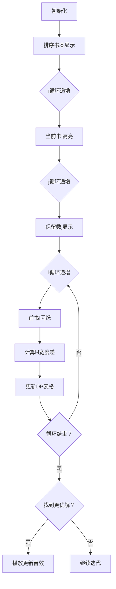

# 题目信息

# 书本整理

## 题目描述

Frank 是一个非常喜爱整洁的人。他有一大堆书和一个书架，想要把书放在书架上。书架可以放下所有的书，所以 Frank 首先将书按高度顺序排列在书架上。但是 Frank 发现，由于很多书的宽度不同，所以书看起来还是非常不整齐。于是他决定从中拿掉 $k$ 本书，使得书架可以看起来整齐一点。

书架的不整齐度是这样定义的：每两本书宽度的差的绝对值的和。例如有 $4$ 本书：

$1 \times 2$  
$5 \times 3$  
$2 \times 4$  
$3 \times 1$    

那么 Frank 将其排列整齐后是：

$1 \times 2$  
$2 \times 4$  
$3 \times 1$  
$5 \times 3$  

不整齐度就是 $2+3+2=7$。

已知每本书的高度都不一样，请你求出去掉 $k$ 本书后的最小的不整齐度。

## 样例 #1

### 输入

```
4 1
1 2
2 4
3 1
5 3
```

### 输出

```
3```

# AI分析结果


# 💡 Kay的C++算法解析：书本整理 深入学习指南 💡

## 1. 题目解读与核心算法识别

✨ **本题主要考察**：动态规划（序列选择型DP）

🗣️ **初步分析**：
> 解决书本整理问题的关键在于**动态规划**。想象你在整理书架时，要从一排书中保留部分书籍，使得相邻书本宽度差之和最小。这就像在书架上放置"书签"，选择保留哪些书才能让宽度变化最平缓。DP的核心在于将大问题分解为子问题：计算前i本书保留j本的最小不整齐度，通过记录局部最优解逐步推导全局最优解。

- 核心思路是先将书本按高度排序，问题转化为在有序序列中选择n-k本书，最小化相邻宽度差之和。题解普遍采用三维循环：外层遍历书本位置，中层控制保留数量，内层枚举前一本保留的书。
- 可视化设计重点：用像素方块表示书本，高亮当前处理的书本(i)和候选的前书(l)，显示宽度差计算过程，动态更新DP表格。复古游戏风格中，每步转移可配"连接"音效，成功找到最优解时播放胜利音效。

---

## 2. 精选优质题解参考

**题解一：学委 (赞293)**
* **点评**：该题解对DP思路的推导极为清晰，用"尝试加入书本"的递推关系生动解释状态转移。代码中三重循环结构规范（i遍历书本，j枚举前书位置，l控制保留数量），变量命名直观（`f[i][l]`表示以i结尾选l本的最小花费）。亮点在于详细注释了DP的物理意义，如"f[i][l] = min(...)"对应实际抽书操作，帮助初学者建立直觉理解。

**题解二：cxy004 (赞69)**
* **点评**：采用逆向思维（将"去掉k本"转化为"保留n-k本"）简化问题定义，代码更简洁。亮点在于优化了循环范围（`j<=Min(i,m)`避免无效计算），并用`2147483647`显式初始化极大值提高可读性。实践价值高，适合竞赛直接使用，但需注意abs函数需自定义以避免命名冲突。

**题解三：lwz2002 (赞35)**
* **点评**：状态定义明确（`f[i][l]`物理意义清晰），代码边界处理严谨（`l<=min(i,m)`防止越界）。亮点在于强调初始化逻辑（`f[i][1]=0`的合理性解释），并指出最终解需遍历`f[i][m]`而非仅取末位，体现了DP解的完备性思考。

---

## 3. 核心难点辨析与解题策略

1.  **状态设计：如何表示书本选择关系？**
    * **分析**：优质题解统一使用`f[i][j]`表示前i本书保留j本且以i结尾的最小代价。关键在于理解"以i结尾"保证连续性，使状态转移时能计算相邻宽度差。如学委题解中，通过固定末尾书，将问题分解为寻找前驱子序列。
    * 💡 **学习笔记**：DP状态需包含序列终止位置和保留数量两个维度。

2.  **状态转移：高效计算子问题最优解？**
    * **分析**：转移需枚举前一本书位置l：`f[i][j]=min(f[i][j], f[l][j-1]+abs(w[i]-w[l]))`。难点在于确定l范围（j-1到i-1），如cxy004代码中`k=j-1`起始，避免无效状态。可视化时应高亮l与i的连线及宽度差计算。
    * 💡 **学习笔记**：三重循环中，中层j（保留本数）需从小到大计算，以利用子问题解。

3.  **边界与初始化：起点如何设定？**
    * **分析**：当只保留1本书时无相邻差，故`f[i][1]=0`。如lwz2002代码显示，需显式初始化并设置其他状态为极大值。最终解需遍历`f[i][m]`（i从m到n），因为最优序列未必以末本书结尾。
    * 💡 **学习笔记**：边界值保证状态转移起点正确，最终解需考虑所有可能终点。

### ✨ 解题技巧总结
- **问题转化**：将"删除k本"转化为"保留m=n-k本"，简化状态设计
- **排序预处理**：按高度排序使序列有序，消除原始顺序干扰
- **循环优化**：内层循环范围限定`j-1 to i-1`，避免无效计算
- **初始化技巧**：使用`0x3f`或`2147483647`设置极大值，确保min函数正确

---

## 4. C++核心代码实现赏析

**本题通用核心C++实现参考**
* **说明**：综合优质题解思路，采用保留m本书的逆向思维，规范三重循环结构
* **完整核心代码**：
```cpp
#include <iostream>
#include <algorithm>
#include <cstring>
#include <cmath>
using namespace std;

const int N = 105;
int n, k, m;
int f[N][N]; // f[i][j]: 以i结尾保留j本书的最小代价
struct Book { int h, w; } a[N];

bool cmp(Book x, Book y) { return x.h < y.h; }

int main() {
    cin >> n >> k;
    m = n - k; // 保留m本书
    for (int i = 1; i <= n; i++) cin >> a[i].h >> a[i].w;
    sort(a + 1, a + n + 1, cmp);
    
    memset(f, 0x3f, sizeof(f)); // 初始化为极大值
    for (int i = 1; i <= n; i++) f[i][1] = 0; // 保留1本书代价为0

    for (int i = 2; i <= n; i++)          // 枚举当前书本位置
        for (int j = 2; j <= min(i, m); j++) // 枚举保留数量
            for (int l = j - 1; l < i; l++)   // 枚举前驱书本
                f[i][j] = min(f[i][j], f[l][j - 1] + abs(a[i].w - a[l].w));
    
    int ans = 0x3f3f3f3f;
    for (int i = m; i <= n; i++) ans = min(ans, f[i][m]);
    cout << ans << endl;
    return 0;
}
```
* **代码解读概要**：
  1. 输入后按书本高度排序，确保序列有序
  2. 初始化：保留单本书时无相邻差（`f[i][1]=0`），其他状态设为极大值
  3. 三重循环动态规划：固定当前书(i)和保留数量(j)后，枚举可能的前书(l)更新状态
  4. 最终解需遍历所有可能的终点（i从m到n），取最小值

---

**题解一：学委**
* **亮点**：状态转移注释清晰，物理意义明确
* **核心代码片段**：
```cpp
for(int i = 2; i <= n; i++) 
    for(int l = 2; l <= min(i, m); l++) 
        for(int j = 1; j <= i-1; j++) 
            f[i][l] = min(f[i][l], f[j][l-1] + abs(a[i].w - a[j].w));
```
* **代码解读**：
  > 注意循环顺序：先确定当前书(i)和保留本数(l)，再枚举前书(j)。`f[j][l-1]`表示前书j保留l-1本的最优解，加上`|a[i].w-a[j].w|`即新产生的宽度差。通过循环j，找到使总代价最小的前驱位置。
* 💡 **学习笔记**：循环顺序不影响结果，但改变维度顺序可能影响缓存效率。

**题解二：cxy004**
* **亮点**：代码简洁，显式初始化极大值
* **核心代码片段**：
```cpp
for(int i=2;i<=n;++i) 
    for(int j=2;j<=Min(i,m);++j) {
        f[i][j]=2147483647;
        for(int k=j-1;k<i;++k) 
            f[i][j]=Min(f[i][j],f[k][j-1]+Abs(s[i].l-s[k].l));
    }
```
* **代码解读**：
  > 内层循环前重置`f[i][j]`为极大值（`2147483647`），确保min函数正确更新。`k`从`j-1`开始保证前驱状态存在（至少保留j-1本书）。`Abs()`计算当前书与前一本书的宽度差，更新最优解。
* 💡 **学习笔记**：显式初始化状态可避免未定义行为，尤其DP中需处理边界。

**题解三：lwz2002**
* **亮点**：边界控制严谨，变量命名规范
* **核心代码片段**：
```cpp
for(int i=2;i<=n;i++)
    for(int j=1;j<i;j++)
        for(int l=2;l<=min(i,m);l++)
            f[i][l]=min(f[i][l],f[j][l-1]+abs(a[i].w-a[j].w));
```
* **代码解读**：
  > 循环中`j`遍历所有可能的前书（1到i-1），`l`从2开始（保留1本已初始化）。`min(i,m)`确保保留数量不超过当前书本数和总需求。物理意义：尝试将i接到j后，比较新序列与原有解的代价。
* 💡 **学习笔记**：循环变量范围限制（`l<=min(i,m)`）是防止数组越界的关键技巧。

---

## 5. 算法可视化：像素动画演示

**主题**：8位像素风"书本整理大冒险"  
**核心演示**：动态规划选择过程，通过像素动画展示书本连接与状态更新

### 设计思路
> 采用FC红白机复古风格，用不同颜色像素块表示书本。高度排序后，书本横向排列，宽度值转换为方块高度。动画突出DP三重循环过程：
> 1. **书本标记**：当前书(i)闪烁蓝色，候选前书(l)标记黄色
> 2. **连接动画**：当评估i与l连接时，显示像素箭头并计算宽度差
> 3. **状态更新**：右侧DP表格实时显示`f[i][j]`更新过程
> 4. **音效反馈**：书本连接时触发"叮"声，状态更新时播放按键音，找到最优解后奏胜利旋律

### 动画帧步骤


### 交互控制
- **速度调节**：滑块控制单步/自动播放速度
- **模式切换**：单步执行（观察细节）vs 自动演示（全局观察）
- **阶段提示**：底部状态栏显示当前循环位置（如“i=5, j=3, l=2”）

---

## 6. 拓展练习与相似问题思考

**通用技巧迁移**  
动态规划解决序列选择问题可延伸至：
1. 最长递增子序列（LIS）：选择部分元素保持有序性
2. 最小化相邻元素差：如能量消耗问题
3. 带权选择问题：如任务调度中最大化收益

**洛谷练习推荐**  
1. [P1020 导弹拦截](https://www.luogu.com.cn/problem/P1020)  
   🗣️ 经典LIS问题，巩固序列DP思想，思考如何转化"保留最优子序列"  
2. [P1091 合唱队形](https://www.luogu.com.cn/problem/P1091)  
   🗣️ 双向LIS应用，练习复杂状态设计  
3. [P1280 尼克的任务](https://www.luogu.com.cn/problem/P1280)  
   🗣️ 时间轴DP，学习如何利用状态转移处理时间区间  

---

## 7. 学习心得与经验分享

> **参考经验**：多位作者提到解题初期对状态转移理解困难（如学委"尝试加入第四本书"的推导），通过手动模拟小样例（n=3或4）逐步理解状态转移逻辑  
> **点评**：动态规划本质是用空间换时间，记录子问题解避免重复计算。当思路卡顿时，建议：  
> 1. 手动画出状态转移表（如书本数n=3）  
> 2. 用具体数值演算DP过程  
> 3. 输出调试中间变量验证  
> 这种"小数据验证法"在DP学习中极为有效！

---

本次分析旨在帮助大家掌握序列型DP的解题框架。记住：动态规划就像搭积木，找到正确的子问题结构，才能建造稳固的算法大厦！下次再见~ 🚀

---
处理用时：175.58秒