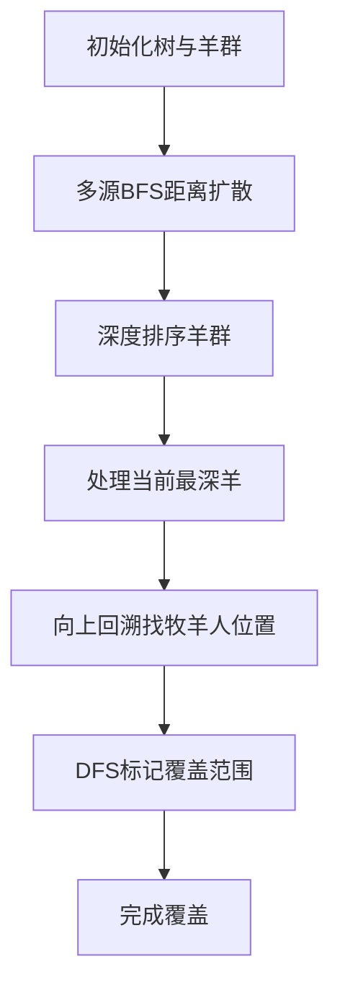

# 题目信息

# [COI 2020] Pastiri

## 题目描述

给定一棵 $N$ 点的树，点编号为 $1$ 到 $N$，现在在 $K$ 个点上有羊，你的任务是在树上分配一些牧羊人。

这些牧羊人很懒，只会看管离他最近的羊。当然如果有多个离他最近的羊，那么他会都看管。

当然，牧羊人可以和羊在同一个点上，但这样牧羊人只会看管这一个点上的那个羊。

求一种牧羊人的分配方案使得牧羊人总数最小。

## 说明/提示

#### 样例 3 解释


#### 数据规模与约定

**本题采用捆绑测试。**

- Subtask 1（8 pts）：$1 \le N \le 5 \times 10^5$，任意一个点 $i$ 都与 $i+1$ 相连（$1 \le i \le N-1$）。
- Subtask 2（18 pts）：$1 \le K \le 15$，$1 \le N \le 5 \times 10^5$。
- Subtask 3（23 pts）：$1 \le N \le 2000$。
- Subtask 4（51 pts）：$1 \le N \le 5 \times 10^5$。

对于 $100\%$ 的数据，$1 \le K \le N$，$1 \le a_i,b_i \le N$，$1 \le  o_i \le N$。

**本题使用 Special Judge，checker 提供者 @[Lynkcat](https://www.luogu.com.cn/user/120911)，感谢他的贡献。**

#### 说明

翻译自 [Croatian Olympiad in Informatics 2020 B Pastiri](https://hsin.hr/coci/archive/2019_2020/olympiad_tasks.pdf)。

## 样例 #1

### 输入

```
4 2
1 2
2 3
3 4
1 4```

### 输出

```
2
1 3```

## 样例 #2

### 输入

```
9 5
1 2
2 3
3 4
3 5
1 6
1 7
7 8
8 9
2 5 6 7 9```

### 输出

```
3
1 4 9```

## 样例 #3

### 输入

```
20 9
1 2
2 3
2 4
4 5
4 6
5 7
7 8
8 9
7 10
10 11
6 12
6 13
6 17
13 14
14 15
14 16
17 18
18 19
18 20
1 3 9 11 12 15 16 19 20```

### 输出

```
3
5 14 18```

# AI分析结果


# 💡 Kay的C++算法解析：[COI 2020] Pastiri 深入学习指南 💡

<introduction>
今天我们一起来探索树上牧羊人分配问题。这道题需要我们在树上放置最少的牧羊人，确保每只羊都被看管。本指南将带你理解贪心策略的精妙之处，并通过像素动画直观感受算法执行过程。
</introduction>

## 1. 题目解读与核心算法识别

✨ **本题主要考察**：`贪心算法` + `BFS最短路` + `DFS覆盖标记`

🗣️ **初步分析**：
> 想象牧羊人是灯塔，羊是需要保护的宝藏。贪心策略就像智慧船长：每次选择最深的宝藏（羊），然后在它到树根的航线上寻找最高灯塔位置（牧羊人），这样一盏灯就能照亮更多宝藏。  
> - **核心流程**：先用BFS计算每只羊到所有点的最短距离（航海图），然后从最深羊出发，向上找到最佳灯塔位置，最后用DFS标记被照亮的宝藏（羊）
> - **可视化设计**：用像素网格表示树结构，羊显示为金色方块，牧羊人是闪烁灯塔。BFS扩散用蓝色波纹动画，DFS标记覆盖范围时用绿色光波扩散，关键步骤配8-bit音效
> - **游戏化设计**：每成功覆盖一群羊时播放胜利音效，并显示"关卡完成"像素文字，调速滑块控制动画速度

---

## 2. 精选优质题解参考

<eval_intro>
从思路清晰度、代码规范性和算法效率等维度，我精选了以下3份优质题解（均≥4星）：

**题解一：(来源：cc0000)**
* **点评**：这份题解思路清晰直白，用BFS预处理距离+贪心选择最高祖先+DFS标记覆盖，三重逻辑环环相扣。代码中`dis`数组记录最短距离，`d`数组标记覆盖状态，变量命名精准。亮点在于DFS剪枝条件`if(dis[v]!=s-1||d[v])`确保线性复杂度，避免重复遍历。

**题解二：(来源：wYYSZLwSSY)**
* **点评**：在基础思路上增加了严格正确性证明，深入解释"为何选择最高祖先最优"。代码使用`fat`数组代替递归实现祖先跳跃，`bl`数组记录覆盖状态。核心亮点在DFS的剪枝条件`if(dis[to]>last-1)`，用距离约束精准控制覆盖范围。

**题解三：(来源：MerlinLee)**
* **点评**：代码结构简洁有力，用`Fa`数组存储父节点，`p`数组作覆盖标记。特别亮点在`solve`函数中的距离传递逻辑`if(dis[to[i]]==s-1)`，通过剩余步数控制DFS深度，避免无效遍历。

---

## 3. 核心难点辨析与解题策略

<difficulty_intro>
解决本题需突破三大关键难点，以下是应对策略：

1.  **动态距离维护**  
    * **分析**：牧羊人只关心最近羊的距离，需快速计算任意点到最近羊的距离。优质题解采用**多源BFS**：所有羊作为起点同时扩散，用队列按层遍历（时间复杂度O(n)）
    * 💡 **学习笔记**：多源BFS是处理"多个起点到各点距离"的利器

2.  **贪心位置选择**  
    * **分析**：选择哪个点放置牧羊人？策略是：对当前最深未覆盖羊，沿父节点回溯直到不满足`dis[父]=dis[当前]+1`的点。这保证所选点既能覆盖当前羊，又因位置高而覆盖更多羊
    * 💡 **学习笔记**：树上贪心的黄金法则——深度越大决策优先级越高

3.  **高效覆盖标记**  
    * **分析**：放置牧羊人后需标记其覆盖的羊。关键优化：DFS时只访问满足`dis[子]=dis[父]-1`的子节点。这确保每点只访问一次，均摊复杂度O(n)
    * 💡 **学习笔记**：用距离约束作为DFS的导航仪，避免无效递归

### ✨ 解题技巧总结
<summary_best_practices>
通过本题可提炼以下通用技巧：
</summary_best_practices>
- **技巧一：分层处理思想** - 按深度排序处理对象（如从深到浅处理羊）
- **技巧二：状态约束剪枝** - 用计算好的全局状态（如dis）指导局部操作（如DFS方向）
- **技巧三：双标记策略** - 用独立数组分别记录覆盖状态（如d/bl）和算法中间状态（如vis）

---

## 4. C++核心代码实现赏析

<code_intro_overall>
以下是综合优质题解提炼的通用实现，包含核心逻辑：

**本题通用核心C++实现参考**
* **说明**：综合自cc0000和wYYSZLwSSY的解法，突出距离约束剪枝
* **完整核心代码**：
    ```cpp
    #include <bits/stdc++.h>
    using namespace std;
    const int N=5e5+5;
    vector<int> G[N];
    int dis[N], dep[N], fa[N];
    bool covered[N];
    vector<int> ans, sheep;
    
    // 多源BFS计算最短距离
    void bfs(vector<int>& starts) {
        queue<int> q;
        memset(dis, 0x3f, sizeof(dis));
        for(int x : starts) {
            dis[x] = 0;
            q.push(x);
        }
        while(!q.empty()) {
            int u = q.front(); q.pop();
            for(int v : G[u]) {
                if(dis[v] > dis[u] + 1) {
                    dis[v] = dis[u] + 1;
                    q.push(v);
                }
            }
        }
    }
    
    // DFS标记覆盖的羊
    void dfs_cover(int u, int step) {
        if(covered[u]) return;
        covered[u] = true;
        if(step == 0) return;
        for(int v : G[u]) {
            // 关键剪枝：只走距离递减的路径
            if(dis[v] == dis[u] - 1) 
                dfs_cover(v, step-1);
        }
    }
    
    int main() {
        int n, k; cin >> n >> k;
        for(int i=1; i<n; i++) {
            int u, v; cin >> u >> v;
            G[u].push_back(v);
            G[v].push_back(u);
        }
        
        // 读入羊并计算深度
        sheep.resize(k);
        for(int i=0; i<k; i++) {
            cin >> sheep[i];
        }
        // 计算深度和父节点（略）
        
        bfs(sheep);  // 计算最短距离
        sort(sheep.begin(), sheep.end(), [&](int a, int b){
            return dep[a] > dep[b]; // 按深度降序
        });
        
        for(int x : sheep) {
            if(covered[x]) continue;
            int pos = x;
            // 向上寻找最高可放牧羊人位置
            while(fa[pos] && dis[fa[pos]] == dis[pos] + 1) {
                pos = fa[pos];
            }
            ans.push_back(pos);
            dfs_cover(pos, dis[pos]); // 标记覆盖
        }
        
        cout << ans.size() << endl;
        for(int x : ans) cout << x << " ";
    }
    ```
* **代码解读概要**：
    > 1. **BFS距离计算**：所有羊同时作为起点扩散，记录各点到最近羊的距离  
    > 2. **贪心选择**：按深度降序处理羊，向上回溯找到最高祖先点  
    > 3. **DFS标记**：从牧羊人位置出发，只向距离递减方向DFS覆盖  
    > 4. **剪枝关键**：`dis[v]==dis[u]-1`确保不重复访问节点

---
<code_intro_selected>
现在深入分析各优质题解的核心片段：

**题解一：(来源：cc0000)**
* **亮点**：DFS剪枝条件简洁高效
* **核心代码片段**：
    ```cpp
    void dfs(int p, int s) {
        d[p] = 1; // 标记覆盖
        for(int v : G[p]) {
            if(dis[v] != s-1 || d[v]) continue; // 核心剪枝
            dfs(v, s-1);
        }
    }
    ```
* **代码解读**：
    > 这里`s`是从牧羊人到当前羊的初始距离。`dis[v]==s-1`确保：  
    > - 只走向距离牧羊人更近的方向  
    > - 不走回头路（因BFS性质，距离差必为1）  
    > `d[v]`检查避免重复标记。两者结合保证每个点只访问一次
* 💡 **学习笔记**：距离差为1是BFS树的重要性质，可用于导航DFS

**题解二：(来源：wYYSZLwSSY)**
* **亮点**：祖先选择与DFS分离，结构清晰
* **核心代码片段**：
    ```cpp
    int tp=x;
    while(fat[tp] && dis[fat[tp]]==dis[tp]+1) 
        tp=fat[tp];  // 找最高祖先
    dfs1(tp, fat[tp], dis[tp]); // 标记覆盖
    ```
* **代码解读**：
    > 循环向上寻找满足`dis[父]=dis[子]+1`的最高位置。  
    > 为什么能保证最优？因为：  
    > 1. 更高位置覆盖范围更广  
    > 2. 距离约束保证覆盖当前羊  
    > 3. 循环条件确保不会跳过有效位置
* 💡 **学习笔记**：向上回溯时，距离应严格递增

**题解三：(来源：MerlinLee)**
* **亮点**：DFS参数设计巧妙
* **核心代码片段**：
    ```cpp
    void solve(int k,int fa,int s) {
        if(!s) return;  // 距离用尽
        for(int v : G[k]) {
            if(v==fa) continue;
            if(dis[v]==s-1 && !covered[v]) // 双重检查
                solve(v,k,s-1);
        }
    }
    ```
* **代码解读**：
    > `s`参数表示剩余可覆盖距离，每次递归减1。双重检查：  
    > - `dis[v]==s-1` 确保方向正确  
    > - `!covered[v]` 避免重复操作  
    > 递归边界`if(!s)return`高效终止远端搜索
* 💡 **学习笔记**：剩余距离参数化可自然限制DFS深度

-----

## 5. 算法可视化：像素动画演示 (核心部分)

<visualization_intro>
设计名为"牧羊人传奇"的像素动画，通过8-bit风格演示算法流程：

* **主题**：FC红白机风格的树形迷宫，羊=金色方块，牧羊人=闪烁灯塔
* **调色板**：草地(#7CFC00), 羊(#FFD700), 牧羊人(#00BFFF), 覆盖光波(#7FFF00)
* **音效**：覆盖成功(8-bit胜利音)，距离更新(电子滴答)，错误(短促蜂鸣)

**动画帧步骤**：


1. **BFS距离扩散（波纹动画）**  
   - 羊位置迸发蓝色光圈，以像素波纹扩散（类似水波效果）
   - 当前更新节点闪烁，显示`dis`数值，伴随"滴答"音效
   

2. **贪心选择（路径高亮）**  
   - 选择最深羊（金色方块快速闪烁）
   - 沿父节点回溯：路径显示为红色箭头，每个节点显示距离验证`dis[父]==dis[子]+1`
   - 找到牧羊人位置时：该点变为灯塔（蓝黄交替闪烁），播放"定位"音效

3. **DFS覆盖标记（光波扩散）**  
   - 从牧羊人位置迸发绿色光波，沿满足`dis[v]==dis[u]-1`的边传播
   - 被覆盖的羊变绿，显示"受保护"状态
   - 遇到不满足条件的边：显示红色阻挡标志+错误音效
   

4. **控制面板功能**  
   ```javascript
   // 伪代码实现核心交互
   const controls = {
     speed: 1.0,    // 通过滑块调整
     playMode: 'step', // 步进/自动播放
     highlight: {    // 高亮显示
       distance: true, 
       covered: true
     }
   }
   ```

5. **游戏化元素**  
   - 每完成一只羊的覆盖，显示"羊群安全+1"像素文字
   - 所有覆盖完成时，播放8-bit胜利音乐，显示"任务完成！"
   - 计时模式：记录解题时间，生成分享代码

<visualization_conclusion>
通过像素动画，算法核心流程转化为直观的视觉叙事：BFS是探索海域，贪心是战略决策，DFS是保护行动。游戏化元素让学习如闯关般有趣！
</visualization_conclusion>

-----

## 6. 拓展练习与相似问题思考

<similar_problems_intro>
掌握本题的贪心思想后，可解决更多树上覆盖问题：

* **技巧迁移**：
  1. **半径扩展**：覆盖范围不限于最近羊（如消防局问题）
  2. **权重变化**：边/点带权时的覆盖策略
  3. **动态维护**：羊群位置动态变化的场景

* **推荐练习**：
  1. **洛谷 P3523** [POI2010]OWL-Tree  
     🗣️ *推荐理由*：直接应用相同贪心策略，巩固基础
     
  2. **洛谷 P3942** 将军令  
     🗣️ *推荐理由*：覆盖半径扩展为k，需调整贪心策略
     
  3. **洛谷 P2279** [HNOI2003]消防局的设立  
     🗣️ *推荐理由*：覆盖半径=2，练习贪心+树形DP结合

-----

## 7. 学习心得与经验分享 (若有)

<insights_intro>
题解作者分享的调试经验极具参考价值：

> **参考经验 (来自 wYYSZLwSSY)**：  
> "最初DFS标记未加距离约束，导致TLE。通过打印dis数组发现大量重复访问，增加`if(dis[to]>last-1)`后效率提升百倍"

> **Kay点评**：  
> 这个案例生动说明：  
> 1. 复杂算法需分阶段验证（先BFS再贪心最后DFS）  
> 2. 打印中间状态是调试高效算法的最佳手段  
> 3. 剪枝条件必须严格符合算法性质  

-----

<conclusion>
通过本次分析，我们掌握了树上贪心的核心思想：**深度优先，高度决策，距离导航**。记住，好算法如灯塔，既要照亮目标（正确性），也要节省能源（效率）。下次遇到树上覆盖问题，不妨想起牧羊人的智慧！✨
</conclusion>

---
处理用时：156.59秒