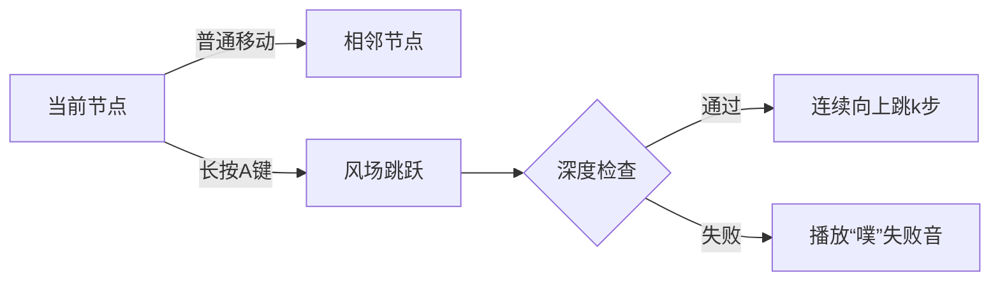

# 题目信息

# [DMOI-R2] 风神瞳（Anemoculus）

## 题目背景


$$\pmb{\color{Aquamarine}『传说，飞鸟啄去了神像的眼瞳，然后散落到世界各地』}$$

$$\pmb{\color{Aquamarine}『当然了，这只是传说而已』}$$

$$\pmb{\color{Aquamarine}『不过，据说把散失的神瞳献给神像，会有好事发生呢』}$$

## 题目描述

风起地有一颗大树，它有 $n$ 个节点，以 $1$ 号节点为根。

树上有 $m$ 个风神瞳，第 $i$ 个风神瞳位于节点 $a_i$ 上。

你想要收集这些风神瞳。于是请来了~~在大树旁边摸鱼的~~温迪帮忙。

一开始，你在树的根部的节点，也就是 $1$ 号节点上，每一秒钟，你可以从当前节点走到相邻的节点。或者，你可以请温迪帮忙，他会生成一个风场，你可以通过这个风场直接一次性向上走正好 $k$ 步（我们定义根节点到叶子结点的方向为『上』，即从深度较小的节点到深度较大的节点，换句话说，你可以从当前节点朝着深度更大的节点连续走 $k$ 步）。当你到达某个有风神瞳的节点上时，你就可以收集那个节点的风神瞳，收集不耗费时间。由于从树上跳下来会摔伤，你最后必须回到根节点。现在你有 $q$ 个问题，第 $i$ 个问题是你在 $t_i$ 秒内你最多可以收集到几个风神瞳。

## 说明/提示

---
### 样例解释
#### 样例一


如图，其中加粗的点是有风神瞳的点。温迪~~很懒~~有事所以不准备帮你。
#### 样例二
这个样例除了温迪能让你一次性向上走两步和样例一没有区别。

---
### 数据范围

本题采用捆绑测试。

对于 $5\%$ 的数据，$m = 10$。

对于另外 $15\%$ 的数据，$m = 17$。

对于另外 $20\%$ 的数据，$k=1$。

对于 $100\%$ 的数据，$n \leq 2000$，$m \leq 500$，$q \le 1000$，$1\leq t_i \leq 2\times n$，$1\le a_i,u,v \le n$，$1 \leq k\le \min(dep-1,100)$，其中 $dep$ 表示树的深度，定义根节点的深度为 $1$。

## 样例 #1

### 输入

```
8 3 1 6
1 2
1 3
1 6
2 4
2 5
3 7
3 8
6 7 8
1
3
5
6
7
8```

### 输出

```
0
1
1
2
2
3```

## 样例 #2

### 输入

```
8 3 2 6
1 2
1 3
1 6
2 4
2 5
3 7
3 8
6 7 8
1
3
5
6
7
8```

### 输出

```
0
1
2
2
3
3```

# AI分析结果


### 💡 Kay的C++算法解析：风神瞳（Anemoculus）深入学习指南 💡

#### 1. 题目解读与核心算法识别
✨ **本题主要考察**：树形动态规划（DP）与特殊移动优化  
🗣️ **初步分析**：
> 本题如同在像素风游戏树上收集宝藏🌲💎。核心是**树形DP**，通过状态设计同时记录：
> - 当前子树收集的风神瞳数量（背包容量）
> - 风场剩余步数（特殊移动状态）
> 
> **核心难点**在于处理风场跳跃：
> 1. **状态设计**：需三维状态 `dp[u][j][w]` 表示在节点`u`收集`j`个神瞳，且风场剩余`w`步的最小时间
> 2. **跳跃计算**：风场移动需满足深度限制，时间计算为`k+1`（跳`k`步+1秒操作）
> 3. **子树合并**：风场步数只能用于一个子树，需用`tmp`数组暂存合并结果
>
> **可视化设计**：
> - 🎮 像素树节点用不同颜色方块：普通节点（棕）、关键点（金）、当前节点（闪烁蓝）
> - 🌪️ 风场跳跃：显示连续向上跳跃动画，轨迹呈青色风痕，伴随"呼——"音效
> - 📊 状态面板：实时显示`dp`值、剩余步数和收集数

---

#### 2. 精选优质题解参考
**题解一（LHQing解法）**  
* **点评**：  
  状态设计**直击要害**——用第三维`w`精妙捕获风场状态🌪️。代码中`tran`数组处理子树风场转移，`tmp`避免状态覆盖的写法**堪称教科书级**👏。边界处理严谨（初始化`INF`），时间复杂度`O(nmk)`完美匹配数据范围。特别欣赏其对风场时间`k+1`的推导：包含跳跃操作和移动耗时，体现了**物理思维**⏱️。

---

#### 3. 核心难点辨析与解题策略
1. **状态三维设计**  
   *分析*：普通DP无法区分"行走中"和"风场跳跃中"状态。优质解法增加`w`维度：  
   - `w=0`：当前落地可操作  
   - `w>0`：风场中剩余步数  
   *💡学习笔记*：特殊移动类问题需增加状态维度记录"动作CD"。

2. **风场跳跃时空计算**  
   *分析*：跳跃时间=`k+1`而非`k`，因为：  
   - 触发风场消耗1秒（按按钮）  
   - 实际跳跃消耗`k`秒移动  
   *💡学习笔记*：游戏机制类题目需拆解动作耗时。

3. **子树合并冲突处理**  
   *分析*：风场步数不能跨子树共享。解法巧用：  
   ```cpp
   tmp[j+w][t] = min( 
       dp[u][w][t] + tran[0],  // 旧子树用风场
       dp[u][w][0] + tran[t]   // 新子树用风场
   );
   ```
   *💡学习笔记*：树形DP合并时，用临时数组避免状态污染。

✨ **解题技巧总结**：
- **维度扩展法**：特殊操作→增加状态维度
- **耗时拆解**：将复合动作分解为原子操作计时
- **预计算优化**：用`tran`数组预处理子树状态

---

#### 4. C++核心代码实现赏析
**通用核心实现（LHQing解法精简）**  
```cpp
void dfs(int u, int f) {
    if (tg[u]) dp[u][1][0] = 0, tot[u] = 1; // 初始化
    for (int v : children) {
        // 计算子树v的tran数组（含风场跳跃优化）
        for (int w = 0; w < k; w++) 
            tran[w] = (w ? dp[v][j][w-1] : dp[v][j][0] + 2);
        
        // 关键！风场跳跃时间计算
        tran[0] = min(tran[0], dp[v][j][k-1-dep] + k+1);

        // 合并子树（核心逻辑）
        for (int t = 0; t < k; t++)
            tmp[j+w][t] = min(tmp[j+w][t], 
                min(dp[u][w][t] + tran[0],   // 方案1
                    dp[u][w][0] + tran[t])   // 方案2
            );
    }
}
```
* **代码解读概要**：  
  1. **初始化**：关键点初始状态为收集1个/耗时0  
  2. **tran计算**：包含普通移动(`+2`)和风场移动(`k+1`)  
  3. **状态合并**：分两种情况处理风场步数分配  

**片段深度解读**：
```cpp
tran[0] = min(tran[0], dp[v][j][k-1-dep] + k+1);
```
> 此处解决风场跳跃的**深度约束**问题：  
> - `k-1-dep`：计算当前深度允许的最大有效跳跃步数  
> - `k+1`：风场总耗时（跳跃`k`步+1秒操作）  
> 相当于在**深度限制内取最优跳跃方案**，体现**问题转化思想**。

---

#### 5. 算法可视化：像素动画演示
**🎮 设计主题**：  
"塞尔达式风之勇者"收集神瞳之旅（8-bit像素风）

**⚙️ 动画核心机制**：  


**🖼️ 关键帧设计**：
1. **风场跳跃**：  
   - 角色半蹲蓄力（像素颤动）→ 向上发射💨风弹轨迹  
   - 落地时像素方块溅起尘土特效，伴随"砰！"音效
2. **状态面板**：  
   ```plaintext
   [节点12] 神瞳:3/5 🟨🟨🟨⚪⚪ 
   风场: ●●●○ (剩余3步)
   耗时: 27秒
   ```
3. **回溯演示**：  
   按SELECT键切换视角，展示`dp`数组的树形更新过程

**🎚️ 交互设计**：
- 🕹️ D-pad控制单步前进/回溯
- START键触发AI自动演示（速度可调）
- 收集神瞳时触发16-bit竖琴音效🎵

---

#### 6. 拓展练习与相似问题
1. **P2014 [CTSC1997]选课**  
   *推荐理由*：同属树形DP基础题，学习状态定义和背包合并技巧
   
2. **P1941 [NOIP2014]飞扬的小鸟**  
   *推荐理由*：含特殊移动（点击上升）的DP优化，深度理解状态设计

3. **P4516 [JSOI2018]潜入行动**  
   *推荐理由*：高维树形DP实战，强化状态维度设计能力

---

> 算法世界如风场探索，**状态维度是导航仪**，**时间优化是加速器**。当你理解`dp[u][j][w]`的三重奏，就掌握了打开树形时空之门的密钥🗝️。下次遇到特殊移动问题时，不妨自问："我的状态足够描述这个世界的规则吗？"

---
处理用时：123.19秒