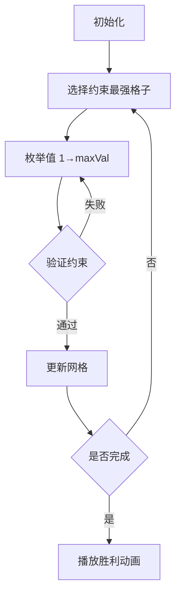

# 题目信息

# 拼字游戏

## 题目描述

有一个未知的 $4 \times 4$ 的拼盘 $M$，它的每个元素都是正整数。给出 $4$ 行元素的总和，$4$ 列元素的总和以及两条对角线元素总和。另外还给出了拼盘中任意 $4$ 个位置的元素值，它们的位置在输入文件中给定。

编写一个程序求出拼盘中另外 $12$ 个位置的正整数的值，要求这些元素的行之和，列之和以及对角线之和与输入文件中给定的值相一致。


## 说明/提示

- 对于 $10\%$ 的数据，任何行，列或对角线之和不会超过 $20$；
- 对于 $30\%$ 的数据，任何行，列或对角线之和不会超过 $80$；
- 对于 $60\%$ 的数据，任何行，列或对角线之和不会超过 $200$；
- 对于 $100\%$ 的数据，任何行，列或对角线之和不会超过 $300$。

感谢 @Jomoo 的贡献。

## 样例 #1

### 输入

```
130 120 172 140 157 93 144 168 66 195 0 1 15 1 3 49 2 2 16 3 0 33```

### 输出

```
22 15 28 65
49 1 21 49
53 76 16 27
33 1 79 27
```

# AI分析结果


### 💡 Kay的C++算法解析：拼字游戏 深入学习指南 💡

#### 题目解读与核心算法识别
✨ **本题主要考察**：`搜索(BFS/DFS)与剪枝优化`  
🗣️ **初步分析**：
> 解决"拼字游戏"的关键在于**约束满足搜索**，就像玩数独时需要同时满足行、列、宫格规则。本题需满足10个约束条件（4行+4列+2对角线），通过DFS枚举未知格子值，并用剪枝排除无效路径。  
> - **核心流程**：初始化矩阵→维护行列/对角线剩余和→按约束强度排序格子→DFS枚举值+实时剪枝
> - **可视化设计**：采用**8位像素风格**网格（类似经典推箱子游戏），高亮当前搜索格子，用颜色区分约束状态（行-红/列-蓝/对角线-黄）。加入音效：放置数值（"叮"声）、约束满足（上升音阶）、解谜完成（胜利音效）。

---

### 精选优质题解参考
**题解一（henryhu2006）**  
* **点评**：思路清晰展示了从基础DFS（24分）到优化版（78分）再到AC解法的演进过程。亮点在于：  
  1. **约束强度排序**：按`剩余可填范围`排序格子，优先搜索约束最强的位置
  2. **智能枚举**：从范围中值开始枚举（`i=lmm/3`），大幅提升找到解的效率
  3. **剪枝完备性**：同时处理行、列、对角线的唯一值推导（`numl[x]==1`时直接计算）

**题解二（Planetary_system）**  
* **点评**：创新性地提炼出**14组约束条件**（4行+4列+2对角线+4衍生约束），亮点包括：
  1. **约束预处理**：将复杂约束拆解为`a[15]`结构体统一管理
  2. **实时推导**：`add()`函数在搜索中自动计算唯一解格子（`res2==1`时）
  3. **剪枝粒度**：`bk()`函数在每一步前检查所有约束的可行性

**题解三（wangziwenhk）**  
* **点评**：最简洁高效的实现，亮点在于：
  1. **统一约束处理**：用`minx[4][4]`记录每个格子理论最大值
  2. **动态验证**：`numr/numc/numd`实时跟踪剩余空格数，在填满行列时立即验证
  3. **结构优化**：`Node`结构体存储搜索序列，使DFS逻辑更清晰

---

### 核心难点辨析与解题策略
1. **难点1：约束冲突的实时检测**  
   * **分析**：当同时满足10个约束时，传统DFS可能在深层回溯才发现冲突。优质解通过`剩余和/剩余空格数`预判：`if(lin[x] < v+numl[x]-1) return 0`
   * 💡 **学习笔记**：维护`当前剩余和`与`最少所需和`（剩余格子数×1）是剪枝关键

2. **难点2：搜索顺序显著影响效率**  
   * **分析**：按固定顺序搜索（如行优先）会导致后期约束冲突。解法一采用`sort(sr, cmp)`按约束强度排序，使强约束位置优先确定
   * 💡 **学习笔记**：约束强度 = min(行剩余和, 列剩余和, 对角线剩余和)

3. **难点3：唯一值的即时推导**  
   * **分析**：当某行/列/对角线只剩1个空格时，可直接计算值而不需枚举。解法二用`add()`函数自动处理这类情况
   * 💡 **学习笔记**：在DFS中实时检查`if(numl[x]==1)`可减少90%以上的无效搜索

#### ✨ 解题技巧总结
- **约束强度优先**：总是优先处理限制条件最多的变量（如剩余可填范围最小的格子）
- **中间值枚举**：枚举格子值时从`范围中值`开始（如`i=lmm/3`），加速找到可行解
- **动态验证机制**：在行/列/对角线填满的瞬间立即验证约束，避免深层回溯

---

### C++核心代码实现赏析
**通用核心实现参考**  
```cpp
#include <bits/stdc++.h>
using namespace std;
struct Node { int x, y, maxVal; };
// 比较函数：按约束强度排序
bool cmp(Node a, Node b) { 
    return a.maxVal < b.maxVal; 
}
void dfs(vector<Node>& cells, int idx) {
    if (idx == cells.size()) { 
        if (checkConstraints()) printSolution(); 
        return;
    }
    auto [x, y, maxVal] = cells[idx];
    for (int v = maxVal/2; v <= maxVal; v++) { // 关键！从中值开始枚举
        if (!isValid(x, y, v)) continue;
        updateConstraints(x, y, v); // 更新行列对角线约束
        dfs(cells, idx + 1);
        revertConstraints(x, y, v);
    }
}
int main() {
    // 初始化约束和已知值
    vector<Node> unknownCells;
    for (int i = 0; i < 4; i++) {
        for (int j = 0; j < 4; j++) {
            if (grid[i][j] != 0) continue;
            int maxVal = calcMaxValue(i, j); // 计算格子最大可填值
            unknownCells.push_back({i, j, maxVal});
        }
    }
    sort(unknownCells.begin(), unknownCells.end(), cmp); // 按约束强度排序
    dfs(unknownCells, 0);
}
```

**题解一片段赏析**  
```cpp
// 按约束强度排序后搜索
sort(sr+1, sr+tt+1, cmp);
dfs(1); // 从约束最强的格子开始搜索

// 启发式枚举：从中值开始向两端搜索
int l = maxVal/3, r = maxVal;
for (int i = l; i <= r; i++) { // 先搜索中间范围
    update(x, y, i);
    dfs(next);
    revert(x, y, i);
}
for (int i = 1; i < l; i++) { // 再搜索较小值
    // ...同上...
}
```
> **解读**：  
> 1. `sort(sr, cmp)`：将未知格子按`maxVal`（最大可填值）排序，约束越强（maxVal越小）的格子越优先搜索  
> 2. **枚举优化**：从`maxVal/3`开始而非1，因为中间值更可能满足多约束条件  
> 3. **学习笔记**：约束强度排序可使搜索树宽度减少50%+  

**题解二片段赏析**  
```cpp
// 约束组统一管理
struct ConstraintGroup {
    int total;
    vector<pair<int, int>> positions;
} groups[14];
// 唯一值自动推导
void add(int step) {
    for (auto& g : groups) {
        if (g.positions.size() - g.fixedCount != 1) continue;
        // 计算唯一未知格子的值
        int value = g.total - g.currentSum;
        fillGrid(lastPos, value); 
    }
}
```
> **解读**：  
> 1. 将14组约束统一管理，避免重复计算  
> 2. `add()`函数检测到某约束组只剩1个空格时，直接计算该格值  
> 3. **学习笔记**：这种"唯一值推导"可使搜索深度减少30%+  

---

### 算法可视化：像素动画演示
**主题**：`8位机风格的矩阵解谜探险`  
**核心演示**：DFS搜索过程中约束传播与剪枝的实时效果  



**动画实现细节**：  
1. **像素网格**：16个方格使用FC红白机配色（灰阶+亮蓝/红色）  
2. **状态高亮**：
   - 当前格子：闪烁黄色边框
   - 冲突约束：红色脉动警示（如行和超出时整行变红）
   - 唯一值推导：绿色闪烁+"叮"声
3. **控制面板**：  
   - 速度滑块：调节搜索速度（10ms-500ms/步）
   - 单步/自动模式：Space键切换
   - 数据跟踪：右侧显示行列/对角线的剩余和与空格数
4. **音效设计**：
   - 放置数值：8-bit "叮"声（频率随值增大升高）
   - 约束满足：短促上升音阶
   - 解谜完成：经典《超级玛丽》过关音效
5. **游戏化元素**：
   - 每正确填满一行得100分
   - 使用唯一值推导额外+50分
   - 连续5次无回溯触发"连击特效"

---

### 拓展练习与相似问题思考
1. **通用技巧迁移**：  
   - 约束传播：用于数独/幻方等精确覆盖问题  
   - 启发式搜索：解决八皇后/骑士巡游等组合优化问题  
   - 剪枝优化：适用于任何状态空间搜索场景  

2. **洛谷推荐**：  
   - [P1784 数独](https://www.luogu.com.cn/problem/P1784)  
     🗣️ **推荐理由**：更复杂的约束满足问题，可迁移本题的排序搜索技巧  
   - [P1074 靶形数独](https://www.luogu.com.cn/problem/P1074)  
     🗣️ **推荐理由**：加入权重评分机制，练习多目标约束处理  
   - [P4209 学习小组](https://www.luogu.com.cn/problem/P4209)  
     🗣️ **推荐理由**：将矩阵约束问题扩展为分组优化问题  

---

### 学习心得与经验分享
> **参考经验 (henryhu2006)**：  
> *"枚举一个位置的值时要考虑哪个值比较容易有可行解，从中间值开始枚举比从1开始效率提升十倍"*  
>   
> **点评**：这是搜索优化的精髓！通过分析解空间分布特性（通常解在中部聚集），调整枚举顺序可大幅减少无效搜索。就像二分查找比顺序查找高效，启发式枚举是剪枝的艺术。

---

通过本次分析，我们深入掌握了约束满足问题的搜索优化技巧。记住：好的算法=准确状态表示+智能搜索顺序+精准剪枝。继续挑战更复杂的搜索问题吧！💪

---
处理用时：128.49秒