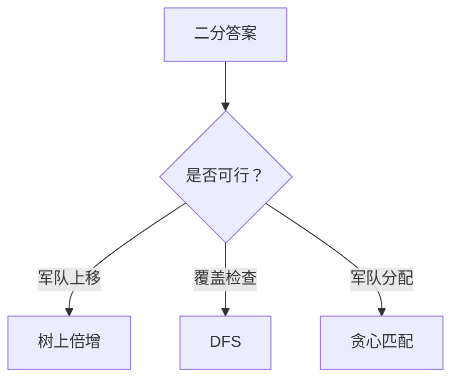

# 题目信息

# [NOIP 2012 提高组] 疫情控制

## 题目描述

H 国有 $n $ 个城市，这 $n$ 个城市用 $ n-1 $ 条双向道路相互连通构成一棵树，$1 $ 号城市是首都，也是树中的根节点。

H 国的首都爆发了一种危害性极高的传染病。当局为了控制疫情，不让疫情扩散到边境城市（叶子节点所表示的城市），决定动用军队在一些城市建立检查点，使得从首都到边境城市的每一条路径上都至少有一个检查点，边境城市也可以建立检查点。但特别要注意的是，首都是不能建立检查点的。

现在，在 H 国的一些城市中已经驻扎有军队，且一个城市可以驻扎多个军队。一支军队可以在有道路连接的城市间移动，并在除首都以外的任意一个城市建立检查点，且只能在一个城市建立检查点。一支军队经过一条道路从一个城市移动到另一个城市所需要的时间等于道路的长度（单位：小时）。

请问最少需要多少个小时才能控制疫情。注意：不同的军队可以同时移动。


## 说明/提示

【输入输出样例说明】

第一支军队在 $2$ 号点设立检查点，第二支军队从 $2$ 号点移动到$ 3$ 号点设立检查点，所需时间为 $3$ 个小时。

 
【数据范围】

保证军队不会驻扎在首都。

- 对于 $20\%$ 的数据，$2 \le n\le 10$；
- 对于 $40\%$ 的数据，$2 \le n\le 50$，$0<w <10^5$；
- 对于 $60\%$ 的数据，$2 \le n\le 1000$，$0<w <10^6$；
- 对于 $80\%$ 的数据，$2 \le n\le 10^4$；
- 对于 $100\%$ 的数据，$2\le m\le n≤5\times 10^4$，$0<w <10^9$。


NOIP 2012 提高组 第二天 第三题


## 样例 #1

### 输入

```
4 
1 2 1 
1 3 2 
3 4 3 
2 
2 2```

### 输出

```
3```

# AI分析结果


# 💡 Kay的C++算法解析：疫情控制 深入学习指南 💡

## 1. 题目解读与核心算法识别

✨ **本题主要考察**：`二分答案 + 树上倍增 + 贪心策略`

🗣️ **初步分析**：
> 解决"疫情控制"这道题，关键在于运用**二分答案框架**和**树上操作技巧**。简单来说，二分答案如同"猜数字游戏"，通过不断缩小时间范围找到最小可行解；树上倍增如同"超级跳跳鞋"，帮助军队快速上移；贪心策略则是"精打细算的管家"，合理分配军队资源。
在本题中，算法协同工作：
- 二分答案确定时间上限
- 树上倍增优化军队移动
- 贪心策略完成军队分配

- 题解思路核心难点在于：军队上移后的分配策略（是否返回原子树？如何匹配闲置军队与未覆盖子树？）
- 可视化设计重点：用像素方块表示城市，军队沿路径移动动画，高亮当前操作节点，用颜色区分覆盖状态（绿色=已覆盖，红色=未覆盖），控制面板支持单步执行/调速

## 2. 精选优质题解参考

**题解一（TEoS）**
* **点评**：思路清晰严谨，详细讲解二分框架、树上倍增预处理、军队上移策略、DFS覆盖检查和贪心匹配。代码规范（变量名`f`/`dist`含义明确），边界处理严谨（如检查军队能否返回原子树）。亮点在于完整的数据模拟和调试技巧分享，具有很高实践价值。

**题解二（Siyuan）**
* **点评**：代码结构简洁高效，封装DFS和检查函数，突出贪心策略本质。亮点在于剩余时间与子树距离的排序匹配，双指针算法实现优雅，空间复杂度优化到位（O(n)），适合竞赛直接使用。

**题解三（litble）**
* **点评**：解题视角独特，强调问题转化思想（军队作为流动资源）。实现亮点在于用结构体组织军队数据，优先队列处理匹配，代码可读性强。特别适合理解贪心策略的本质。

## 3. 核心难点辨析与解题策略

1. **军队上移的边界处理**
   * **难点**：军队在时限内应尽可能上移，但若到达根节点后无法返回原子树且原子树未覆盖，则必须留下
   * **解决**：树上倍增预处理祖先距离，二分时计算剩余时间，特判原子树覆盖需求
   * 💡 **学习笔记**：树上倍增是处理链上移动的利器

2. **子树覆盖检查**
   * **难点**：需精确识别哪些子树未被覆盖，注意根节点子树的独立性
   * **解决**：DFS后序遍历，节点被覆盖当且仅当：自身有军队或所有子节点被覆盖
   * 💡 **学习笔记**：树形DP思想可推广到覆盖类问题

3. **军队分配匹配**
   * **难点**：闲置军队如何最优匹配未覆盖子树
   * **解决**：贪心策略——按剩余时间/子树距离排序，双指针匹配（大配大，小配小）
   * 💡 **学习笔记**：排序+双指针是贪心匹配的经典模式

### ✨ 解题技巧总结
- **拆解问题**：将复杂问题分解为二分判定、树上操作、贪心匹配等子模块
- **树上倍增**：预处理祖先关系表（`f[u][k]`）和距离表（`dist[u][k]`），O(log n)完成链上移动
- **贪心验证**：闲置军队优先"物尽其用"（剩余时间大→匹配远距离子树）
- **边界处理**：特别注意根节点子树的独立性和军队返回原子树的特判

## 4. C++核心代码实现赏析

**本题通用核心C++实现参考**
```cpp
#include <cstdio>
#include <cstring>
#include <algorithm>
#include <vector>
using namespace std;
typedef long long ll;
const int N=50005, LOG=16;
vector<pair<int,int>> G[N];
int n, m, army[N], fa[N][LOG];
ll dist[N][LOG];
bool covered[N];

// 树上倍增预处理
void dfs(int u, int f) {
    fa[u][0] = f;
    for(int i=1; i<LOG; i++) {
        fa[u][i] = fa[fa[u][i-1]][i-1];
        dist[u][i] = dist[u][i-1] + dist[fa[u][i-1]][i-1];
    }
    for(auto &e : G[u]) {
        int v=e.first, w=e.second;
        if(v == f) continue;
        dist[v][0] = w;
        dfs(v, u);
    }
}

// 判定函数（核心）
bool check(ll T) {
    memset(covered, 0, sizeof(covered));
    vector<pair<ll,int>> idle; // (剩余时间, 子树根)
    vector<ll> needs;         // 未覆盖子树距离

    // 军队上移
    for(int i=0; i<m; i++) {
        int x=army[i];
        ll used=0;
        for(int j=LOG-1; j>=0; j--) 
            if(fa[x][j] && used+dist[x][j]<=T) {
                used += dist[x][j];
                x = fa[x][j];
            }
        if(fa[x][0]==1 && used+dist[x][0]<=T) 
            idle.push_back({T-used-dist[x][0], x});
        else covered[x]=true;
    }

    // DFS检查覆盖
    function<bool(int,int)> dfs=[&](int u, int f) {
        if(covered[u]) return true;
        bool hasChild=false, allCovered=true;
        for(auto &e : G[u]) {
            int v=e.first;
            if(v==f) continue;
            hasChild=true;
            allCovered &= dfs(v,u);
        }
        return hasChild && allCovered;
    };

    // 收集未覆盖子树
    for(auto &e : G[1]) 
        if(!dfs(e.first,1)) 
            needs.push_back(e.second);

    // 贪心匹配
    sort(idle.begin(), idle.end());
    sort(needs.begin(), needs.end());
    int i=0, j=0;
    while(i<needs.size() && j<idle.size()) {
        if(idle[j].first >= needs[i]) i++, j++;
        else j++;
    }
    return i == needs.size();
}
```
**代码解读概要**：
1. **树上倍增预处理**：DFS初始化祖先关系表`fa`和距离表`dist`
2. **军队上移**：逆向枚举二进制位（LOG-1→0），能跳则跳
3. **覆盖检查**：后序遍历判断子树覆盖状态
4. **贪心匹配**：双指针匹配闲置军队与未覆盖子树

**题解一核心代码片段赏析**：
```cpp
// 军队上移与闲置处理
for(int i=1;i<=m;i++) {
    ll x=query[i], cnt=0;
    for(int j=t;j>=0;j--) 
        if(f[x][j]>1 && cnt+dist[x][j]<=lim) 
            cnt+=dist[x][j], x=f[x][j];
    if(f[x][0]==1 && cnt+dist[x][0]<=lim)
        h[++ctot] = {lim-cnt-dist[x][0], x};
    else 
        sta[x]=1;
}
```
* **亮点**：逆向二进制枚举实现高效上移
* **学习笔记**：`j`从高位开始枚举，确保跳到最高位置

**题解二核心代码片段赏析**：
```cpp
// 贪心匹配实现
sort(tim+1,tim+atot+1); sort(ned+1,ned+btot+1);
int i=1,j=1;
while(i<=btot && j<=atot)    
    if(tim[j]>=ned[i]) i++,j++;
    else j++;
return i>btot;
```
* **亮点**：简洁的双指针匹配，O(n)复杂度
* **学习笔记**：排序后大配大、小配小是最优匹配

## 5. 算法可视化：像素动画演示

**主题**：像素军队在树形地图中移动控制疫情

**核心演示内容**：
1. **树形地图生成**：8-bit像素风格（根节点=金色方块，军队=红色像素，边境=闪烁绿点）
2. **军队移动动画**：
   - 沿树枝路径移动（路径高亮）
   - 到达检查点播放"叮"音效
3. **覆盖状态可视化**：
   - 已覆盖子树：绿色渐染动画
   - 未覆盖子树：红色脉冲警示
4. **贪心匹配演示**：
   - 闲置军队与未覆盖子树间画连接线
   - 匹配成功时播放胜利音效

**关键帧控制**：
```plaintext
帧1: 初始化树状地图 (像素网格+复古配色)
帧2: 军队上移 (红色像素沿路径移动，显示当前时间)
帧3: 覆盖检查 (DFS遍历，未覆盖子树闪烁红光)
帧4: 军队分配 (绿线连接军队与子树，显示剩余时间)
帧5: 结果展示 (全绿=成功，未覆盖红点=失败)
```

**交互设计**：
- 控制面板：开始/暂停/单步/重置
- 速度滑块：调整动画速度（0.5x~3x）
- 模式切换：对比不同算法策略效果

## 6. 拓展练习与相似问题思考

**通用套路延伸**：
1. 二分答案框架 → 适用于最值最优化问题（如：跳石头、借教室）
2. 树上倍增 → 处理LCA、路径查询、动态树问题
3. 贪心匹配 → 任务调度、资源分配问题

**推荐练习**：
1. **P1083 借教室**（二分答案+差分）
   - 🗣️ 巩固二分判定函数的编写技巧
2. **P2680 运输计划**（二分答案+树上差分）
   - 🗣️ 练习树上路径处理的进阶技巧
3. **P5021 赛道修建**（二分答案+贪心匹配）
   - 🗣️ 强化本题贪心策略的变形应用

## 7. 学习心得与经验分享

> **来自题解作者的经验**："我在处理子树覆盖时，最初在`DFS下传标记`上卡了很久，后来通过`打印每个节点的覆盖状态`才定位到问题：根节点的子节点不能下传覆盖标记！"

**启示**：
1. 树上问题的标记传递需谨慎父子关系
2. 调试时输出中间状态是有效手段
3. 对拍生成极端数据（如链状树）验证边界

**核心思维**：


通过本题，我们掌握了三大核心技能：二分框架设计、树上操作优化、贪心策略证明——这正是解决复杂算法问题的钥匙！

---
处理用时：192.35秒