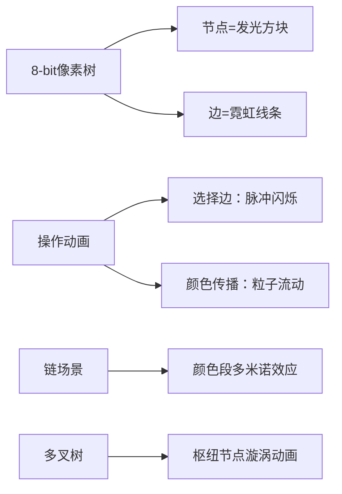

# 题目信息

# [PA 2021] Drzewo czerwono-czarne

## 题目描述

你熟悉红黑树这种数据结构吗？在本题我们将考虑一种节点颜色为红色或黑色的树，但请放心，如果你听说过刚才提到的数据结构的话，最好迅速忘掉它。

给定一棵树（即，一个无环的无向连通图），每个节点被涂成红或黑两种颜色之一。你可以选择被一条边相连的两个节点 $v$ 和 $u$，并把 $v$ 重新涂成和 $u$ 一样的颜色。

你的任务是确定经过一系列操作（**有可能不进行任何操作**）之后，一种最初的涂色情况能否变为最终给定的涂色情况。

## 说明/提示

对于 $100\%$ 的数据，$1 \leq T, n \leq 10^5$，$1 \leq \sum n \leq 10^6$，$1 \leq a_i, b_i \leq n$。

## 样例 #1

### 输入

```
3
4
1011
1100
1 2
2 3
2 4
2
10
10
1 2
2
10
01
1 2```

### 输出

```
TAK
TAK
NIE```

# AI分析结果


### 💡 Kay的C++算法解析：Drzewo czerwono-czarne 深入学习指南 💡

#### 1. 题目解读与核心算法识别
✨ **本题主要考察**：树的性质分析与状态转移（图论）

🗣️ **初步分析**：
> 这道题要求我们判断一棵树上的节点初始染色能否通过操作变为目标染色。操作的本质是"颜色传播"——选择相邻节点覆盖颜色。想象树是一个通信网络，节点是基站，操作就是基站之间传递信号覆盖原有信号。

> 核心解法分三步走：
> 1. **排除平凡情况**：初始=目标（直接成功）；目标单色但初始不同（必然失败）；目标状态无边相邻同色（最后一步必然产生同色相邻点）
> 2. **链式结构处理**：当树退化成链时，颜色只能沿链传播形成连续段。解的存在性取决于初始段数是否≥目标段数（需考虑首尾对齐）
> 3. **多叉树枢纽**：存在度数≥3节点时，它可作为"颜色中转站"，存储并分配颜色到不同分支，此时必然有解

> 可视化设计：
> - 像素树节点用不同颜色方块表示，边用发光线条连接
> - 操作动画：选择边时高亮闪烁，颜色像水流沿边传播，伴随8-bit音效
> - 链场景：展示颜色段像多米诺骨牌一样合并/分裂
> - 多叉树：度数≥3节点变为发光枢纽，颜色粒子向子树辐射

---

#### 2. 精选优质题解参考
**题解一（作者：iiiiiyang）**
* **点评**：思路严谨完整，分情况覆盖所有边界。亮点在于：
  - 用flag1~flag4系统化处理平凡情况
  - 对度数≥3节点的构造性证明（三叉树操作序列）
  - DFS精确统计链的段数差异
  - 代码规范：deg[]统计度数，num1/num2记录段数变化

**题解二（作者：KellyFrog）**
* **点评**：突出树的结构本质，亮点在于：
  - "颜色脉冲"比喻：根节点向子树辐射颜色
  - 提出"存储颜色"关键思想（在子树保留异色节点）
  - 用二分图性质判断特殊无解情况
  - 代码简洁：直接通过max度识别多叉树

---

#### 3. 核心难点辨析与解题策略
1. **识别操作的本质约束**
   * **分析**：操作不改变颜色连通性，最后一步必产生同色相邻点。因此目标状态若无相邻同色则立即排除
   * 💡 **学习笔记**：逆向思维——从结果反推必要条件

2. **链式结构的段数守恒**
   * **分析**：链上颜色段只能伸缩不能新增。通过DFS遍历：
     - 父子节点颜色变化时段数+1
     - 首尾颜色对齐需特殊处理（`if(s1[s]!=s2[s]) --num1`)
   * 💡 **学习笔记**：链问题本质是线性序列的区间覆盖

3. **多叉树的枢纽作用**
   * **分析**：度数≥3节点可暂存颜色（如白色节点存储黑色子节点）。实现"颜色重分配"的关键在于：
     - 子树内存在同色相邻点（可下移腾出空间）
     - 通过枢纽转换颜色（如A→枢纽→B）
   * 💡 **学习笔记**：高度数节点=操作自由度

✨ **解题技巧总结**
- **边界先行**：先处理单色/相同状态等平凡情况
- **结构分类**：链(度≤2) → 统计段数；多叉树(度≥3) → 直接有解
- **逆向验证**：目标状态必须存在同色相邻边
- **增量思维**：DFS遍历时动态比较父子节点颜色变化

---

#### 4. C++核心代码实现赏析
**通用核心实现**（综合题解精华）
```cpp
#include<bits/stdc++.h>
using namespace std;
const int N=1e5+5;

int main(){
    int T; cin>>T;
    while(T--){
        int n; cin>>n;
        char init[N], target[N];
        vector<int> G[N];
        
        // 输入处理
        scanf("%s%s",init+1,target+1);
        for(int i=1,u,v;i<n;i++){
            cin>>u>>v;
            G[u].push_back(v);
            G[v].push_back(u);
        }

        // 平凡情况检查
        bool same=1, target_single=1, no_adj_same=1;
        for(int i=1;i<=n;i++){
            if(init[i]!=target[i]) same=0;
            if(target[i]!=target[1]) target_single=0;
        }
        for(int u=1;u<=n;u++) for(int v:G[u])
            if(target[u]==target[v]) no_adj_same=0;
        
        if(same) { cout<<"TAK\n"; continue; }
        if(target_single) { cout<<"NIE\n"; continue; }
        if(no_adj_same) { cout<<"NIE\n"; continue; }

        // 多叉树检测
        bool deg_ge3=false;
        for(int i=1;i<=n;i++) 
            if(G[i].size()>=3) deg_ge3=true;
        if(deg_ge3) { cout<<"TAK\n"; continue; }

        // 链处理：找端点+遍历统计
        int start=1, cnt_init=1, cnt_target=1;
        for(int i=1;i<=n;i++) 
            if(G[i].size()==1) start=i;
        
        int cur=start, prev=-1;
        for(int i=1;i<=n;i++){
            if(prev!=-1){
                if(init[cur]!=init[prev]) cnt_init++;
                if(target[cur]!=target[prev]) cnt_target++;
            }
            int nxt=-1;
            for(int v:G[cur]) if(v!=prev) nxt=v;
            prev=cur; cur=nxt;
        }
        if(init[start]!=target[start]) cnt_init--;
        cout<<(cnt_init>=cnt_target?"TAK\n":"NIE\n");
    }
}
```

**题解一亮点代码**
```cpp
void dfs(int now,int father){
    if(s1[now]!=s1[father]) ++num1; // 初始段数统计
    if(s2[now]!=s2[father]) ++num2; // 目标段数统计
    for(int to:e[now]) 
        if(to!=father) dfs(to,now);
}
// 调用前: if(s1[start]!=s2[start]) num1--;
```
**学习笔记**：DFS中父子节点颜色比较是统计段数的核心技巧

**题解二亮点代码**
```cpp
// 多叉树直接判定
int mx=0;
for(int i=1;i<=n;i++) 
    mx=max(mx,(int)adj[i].size());
if(mx>=3) return true; 

// 二分图特殊无解检查
dfs(1,0); // 染色
bool uniform=true;
for(int i=2;i<=n;i++)
    if((target[i]^d[i])!=(target[i-1]^d[i-1])) 
        uniform=false;
if(uniform) return false; // 无解
```
**学习笔记**：度数≥3是"操作自由度"的量化体现

---

#### 5. 算法可视化：像素动画演示
**主题**：像素树颜色传播模拟（复古RPG风）

**核心演示**：


**关键交互**：
1. **初始化**：树渲染为FC红白机画风，背景芯片音乐
2. **操作演示**：
   - 点击边触发操作：高亮边+“滴答”音效
   - 颜色流动：源节点向目标发射像素粒子流
3. **自动演示模式**：
   - 链：颜色段像贪吃蛇伸缩移动
   - 多叉树：枢纽节点旋转分配颜色粒子
4. **状态反馈**：
   - 成功：全树闪烁+胜利音阶
   - 失败：节点变灰+低沉音效

---

#### 6. 拓展练习与相似问题
1. **洛谷P2661 信息传递**  
   → 理由：同样需要分析图的操作传播性质
2. **洛谷P1352 没有上司的舞会**  
   → 理由：树形DP+状态传递的经典训练
3. **洛谷P3379 最近公共祖先**  
   → 理由：强化树结构分析能力

---

#### 7. 学习心得分享
> **iiiiiyang的调试经验**：  
> "在链段数统计时，如果起点颜色初始与目标不同，需要额外调整段数计数，这个边界让我调试了很久"  
> → **Kay点评**：这提醒我们特别注意端点行为的处理，在树/链问题中，首尾节点往往需要特殊边界检查

---

### 结语
通过本题我们深入理解了树的操作传播本质：链受限于段数守恒，多叉树则因枢纽节点获得操作自由度。记住这个核心口诀：  
**"链看段，树看度，无解先查同色邻"**  
下次遇到类似问题，不妨先画出像素树模拟操作过程哦！(≧∇≦)ﾉ

---
处理用时：165.91秒