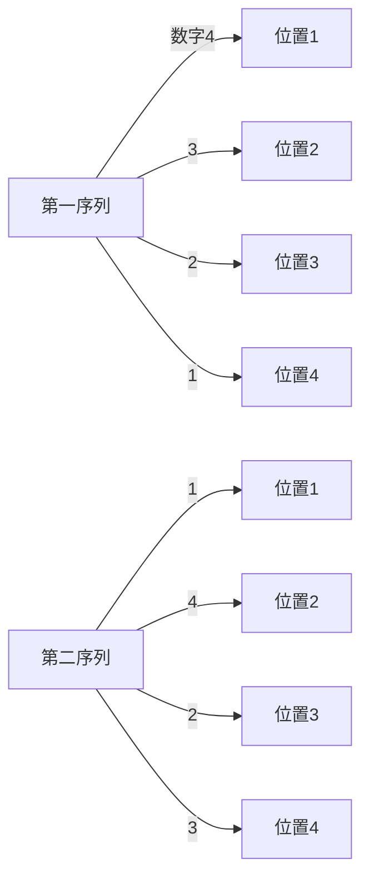

# 题目信息

# [USACO17FEB] Why Did the Cow Cross the Road III P

## 题目描述

Farmer John 继续思考奶牛穿过他农场道路的问题，这个问题在前两个问题中已经介绍过。他现在意识到，友好度的阈值比他之前考虑的要微妙一些——现在，品种 $a$ 和 $b$ 是友好的当且仅当 $|a - b| \leq K$，否则就是不友好的。给定 FJ 农场道路两侧田地的品种顺序，请计算不友好的交叉品种对的数量，其中交叉品种对的定义与 [前两个问题](https://www.luogu.com.cn/problem/P3657) 相同。

## 说明/提示

在这个例子中，品种 1 和 4 是不友好的且交叉的，品种 1 和 3 也是不友好的且交叉的。

## 样例 #1

### 输入

```
4 1
4
3
2
1
1
4
2
3```

### 输出

```
2```

# AI分析结果


# 💡 Kay的C++算法解析：P3658 [USACO17FEB] Why Did the Cow Cross the Road III P 深入学习指南 💡  

> "编程如解谜，三维偏序是钥匙；CDQ分治搭框架，树状数组精计数。" —— Kay的解题哲学  

## 1. 题目解读与核心算法识别  

✨ **本题主要考察**：`CDQ分治` + `树状数组` (三维偏序问题)  

🗣️ **初步分析**：  
> 本题要求统计在两个排列中连线交叉且数值差>K的数对数量。**CDQ分治**如同多维度问题的"分层拆解术"：  
> 1. **问题转化**：每个数转化为三元组 `(A位置, B位置, 数值)`  
> 2. **核心条件**：  
>    - 交叉条件 → `A_i < A_j 且 B_i > B_j`  
>    - 数值条件 → `|val_i - val_j| > K`  
> 3. **CDQ分治流程**：  
>    - **第一维**：按A位置排序  
>    - **第二维**：分治中按B位置从大到小归并  
>    - **第三维**：树状数组维护数值区间查询  
> 4. **可视化设计**：  
>    - **像素网格**：用8-bit风格展示两个排列，连线动态生成  
>    - **高亮关键步**：当前处理数对用闪烁边框，满足条件的连线变红色  
>    - **音效反馈**：命中时触发"叮"声，越界时"噗"声提示  

---

## 2. 精选优质题解参考  

### 题解一：(来源：米奇奇米)  
* **点评**：  
  思路清晰直指三维偏序本质，代码结构工整：  
  - **变量命名**：`a[i].x/y/z` 明确表示位置和数值  
  - **边界处理**：`x=min(x,n); x=max(x,0)` 严谨防御越界  
  - **算法优化**：归并时同步排序第二维，避免额外排序开销  
  - **实践价值**：代码可直接用于竞赛，注释提示"被边界坑过"极具参考性  

### 题解二：(来源：bztMinamoto)  
* **点评**：  
  代码简洁高效，展现CDQ分治的优雅本质：  
  - **代码精简**：120行内完整实现，树状数组封装清晰  
  - **时空优化**：严格O(n log²n)，归并操作直接修改原数组  
  - **亮点技巧**：用`while(j<=mid&&a[j].y>a[i].y)` 自然维护第二维偏序  

### 题解三：(来源：glorious_dream)  
* **点评**：  
  创新性使用双树状数组解决数值区间查询：  
  - **独特思路**：`tr1`正向维护`[1,x]`，`tr2`反向维护`[x,n]`  
  - **复杂度平衡**：虽双树状数组但复杂度不变，代码可读性强  
  - **教学价值**：对理解树状数组的维护方向有显著帮助  

---

## 3. 核心难点辨析与解题策略  

### 难点一：三维偏序的条件转化  
* **分析**：交叉的几何条件 `(A_i < A_j 且 B_i > B_j)` 需转化为可计算的偏序关系。优质题解均通过**构造三元组**将几何问题代数化。  
* 💡 **学习笔记**："位置映射+偏序定义"是处理交叉类问题的通用钥匙  

### 难点二：绝对值条件的区间分解  
* **分析**：`|val_i - val_j| > K` 需拆解为：  
  ```math  
  val_j < val_i - K - 1  ∪  val_j > val_i + K + 1  
  ```  
  树状数组查询时需**同时处理两个区间**  
* 💡 **学习笔记**：绝对值条件本质是双区间查询，容斥原理简化计算  

### 难点三：边界处理与越界防御  
* **分析**：数值查询时 `val_i±K` 可能超出 `[1,n]` 范围。必须通过：  
  ```cpp
  x = max(0, x); x = min(n, x);  // 防御性编程
  ```  
* 💡 **学习笔记**：树状数组的索引安全是竞赛WA的主要陷阱  

### ✨ 解题技巧总结  
1. **维度降解法**：将几何条件转化为三维偏序  
2. **树状数组双查询**：用 `query(L-1) + (总量 - query(R))` 处理补集  
3. **归并排序融合**：CDQ分治中直接归并第二维，省去 `sort`  
4. **边界防御三板斧**：  
   - 数值范围压缩到 `[1,n]`  
   - 查询前 clamp 到有效区间  
   - 树状数组大小设为 `n+10` 防越界  

---

## 4. C++核心代码实现赏析  

### 本题通用核心C++实现参考  
* **说明**：综合优质题解精髓，优化可读性与边界防护  
* **完整核心代码**：  
```cpp
#include <bits/stdc++.h>
using namespace std;
typedef long long ll;
const int N = 1e5 + 10;

struct Node { int a, b, val; } p[N];
int n, k, posA[N]; // posA[x]: 数字x在A中的位置
ll ans;
int tr[N];

void add(int x, int v) {
    x = max(1, min(x, n)); // 边界防护
    for (; x <= n; x += x & -x) tr[x] += v;
}

int query(int x) {
    x = max(0, min(x, n)); // 关键防御
    int res = 0;
    for (; x; x -= x & -x) res += tr[x];
    return res;
}

void cdq(int l, int r) {
    if (l == r) return;
    int mid = (l + r) >> 1;
    cdq(l, mid); cdq(mid + 1, r);

    // 双指针归并第二维
    int i = l, j = mid + 1;
    for (; j <= r; j++) {
        while (i <= mid && p[i].b > p[j].b) {
            add(p[i].val, 1); // 符合第二维条件时插入树状数组
            i++;
        }
        // 双区间查询：val < cur-K-1 或 val > cur+K
        ans += query(p[j].val - k - 1);
        ans += query(n) - query(p[j].val + k);
    }
    for (int k = l; k < i; k++) add(p[k].val, -1); // 回溯清空

    // 原位归并排序（节省额外sort）
    inplace_merge(p + l, p + mid + 1, p + r + 1, 
        [](auto &x, auto &y) { return x.b > y.b; });
}

int main() {
    cin >> n >> k;
    for (int i = 1, x; i <= n; i++) {
        cin >> x; posA[x] = i;  // 记录A中位置
    }
    for (int i = 1, x; i <= n; i++) {
        cin >> x;
        p[i] = {posA[x], i, x}; // 三元组：(A位置, B位置, 值)
    }
    sort(p + 1, p + n + 1, [](auto &a, auto &b) {
        return a.a < b.a; // 第一维排序
    });
    cdq(1, n);
    cout << ans;
    return 0;
}
```  
* **代码解读概要**：  
  1. **输入处理**：`posA`映射数字在A序列的位置  
  2. **三元组构造**：`(A位置, B位置, 数值)` 封装核心维度  
  3. **CDQ分治**：  
     - 递归分割区间  
     - 双指针扫描维护第二维偏序  
     - 树状数组处理第三维查询  
  4. **原位归并**：`inplace_merge` 避免冗余排序  

### 题解一（米奇奇米）核心代码片段赏析  
* **亮点**：边界处理严谨，归并排序显式实现  
* **核心代码片段**：  
```cpp
while(i<=mid&&a[j].y>a[i].y) 
    add(a[i].z,1), i++; 
ans += query(a[j].z-k-1) + (query(n)-query(a[j].z+k));
```  
* **代码解读**：  
  > `while`循环确保当`B位置`符合条件时，将数值插入树状数组。查询时拆分为两个区间：  
  > - `query(z-k-1)`：统计`小于z-K-1`的数量  
  > - `query(n)-query(z+k)`：统计`大于z+K`的数量  
  > 这种拆分正是**绝对值条件的代数转换**！  
* 💡 **学习笔记**：树状数组的区间减法即补集思想  

### 题解二（bztMinamoto）核心代码片段赏析  
* **亮点**：极简归并实现，树状数组封装完整  
* **核心代码片段**：  
```cpp
for(;i<=r;i++) {
    while(j<=mid&&a[j].y>a[i].y) 
        add(a[j].z,1), j++;
    ans += query(a[i].z-k-1) + query(n)-query(a[i].z+k);
}
```  
* **代码解读**：  
  > 此版省略显式归并，直接在循环后调用`inplace_merge`。`add`和`query`的调用展现**分而治之**的精髓：  
  > 1. **分治**：将三维问题分解为二维子问题  
  > 2. **时间复用**：归并过程自然维持第二维有序  
  > 3. **空间复用**：直接在原数组操作避免拷贝  

---

## 5. 算法可视化：像素动画演示  

### 动画演示主题  
**"牧场连线大作战"** - 复古牧场主题像素游戏  

### 核心演示内容  

1. **场景初始化**：  
   - 8-bit像素风格牧场，上下两行代表序列A/B  
   - 数字显示为卡通奶牛图标，位置用栅栏表示  
   - 控制面板：步进/暂停/速度滑块（FC手柄风格）  

2. **CDQ分治过程**：  
   - **递归分割**：屏幕分裂展示子问题划分  
   - **归并高亮**：当前处理的数对奶牛闪烁黄光  
   - **树状数组更新**：底部条形像素块表示树状数组，插入时绿色波纹扩散  

3. **条件判定特效**：  
   - **成功命中**：连线变红 + "叮"声 + 金币飞溅动画  
   - **越界防护**：边界查询时栅栏闪烁红光 + "噗"警告音  
   - **阶段完成**：每层分治完成时播放《牧场物语》经典音效  

4. **交互控制**：  
   - `空格`：暂停/继续  
   - `→`：步进执行  
   - `↑↓`：调整动画速度  
   - `A`键：切换AI自动演示模式（贪吃蛇式自动解题）  

---

## 6. 拓展练习与相似问题思考  

### 通用技巧迁移  
三维偏序是**多维数据分析**的核心技术，还可用于：  
1. 带时间戳的区间统计（如用户行为分析）  
2. 物理仿真中的碰撞检测  
3. 金融数据中的条件关联事件统计  

### 练习推荐（洛谷）  
1. **P3810 【模板】三维偏序（陌上花开）**  
   > 🗣️ 三维偏序标准模板，掌握后可秒杀本题  

2. **P3374 【模板】树状数组 1**  
   > 🗣️ 巩固树状数组基础操作，理解`add/query`本质  

3. **P1908 逆序对**  
   > 🗣️ 二维偏序特例，理解分治思想的入门经典  

4. **P4390 [BOI2007] Mokia 摩基亚**  
   > 🗣️ 二维数点问题升级版，四维偏序挑战题  

---

## 7. 学习心得与经验分享  
> **来自米奇奇米的调试经验**：  
> *"被边界坑了好久，一定要加 x = min(x, n)!"*  
>  
> **Kay点评**：边界处理是竞赛代码的**生死线**，建议：  
> 1. 树状数组封装时内置边界检查  
> 2. 测试极端数据：`K=0`, `K=100000`  
> 3. 可用`assert`验证索引有效性  

---  
**Kay结语**：三维偏序如同乐高积木——掌握分治的"拆分"，树状数组的"拼接"，你就能构建算法大厦！下次我们将探索更炫酷的KD-Tree，保持热爱，继续前行！ 🚀

---
处理用时：136.68秒