# 题目信息

# aaa被续

## 题目背景

HansBug持续无聊ing


## 题目描述

由于aaa没有完成HansBug的任务。所以HansBug开始计划着如何续aaa。

现在HansBug手里有 $ N $个aaa，每个aaa有一个码力值。一共存在 $ N - 1 $条连接两个aaa的边，故这 $ N $个aaa构成一棵**有根树**，根为1号aaa。

现在HansBug想要续了这 $ N $个aaa。HansBug所采用的策略是，对于第 $ i$个aaa，先让他和他的各级子aaa们~~乖乖♂站好~~成一队，然后依次续掉。

经过长期对于aaa码力值的研究，HansBug发现，**对于每一队aaa**，设有 $n$个，码力值依次为$ v_i $，则续了队伍里的第 $ i $个aaa所能获得的码力值为 $ v_1 + v_2 + \cdots + v_i $。


然而，aaa之间的关系树相当的复杂，HansBug的智商早已不够用，于是这个任务就交给了你。不过HansBug知道，任何一个aaa都不会有超过5个的直接子aaa

HansBug想要知道在每次排♂队方法最优的情况下，续了这些aaa最多可以获得的码力值~~，事成之后分给你100000 % 10点码力值~~。


## 说明/提示

**样例解释：**

  

故续了5个aaa所得的最大总码力值为：118 + 9 + 10 + 4 + 48 = 189

**对1000000007取模后得到答案189**


**数据范围：**

对于30%的数据：$ 1 \leq N \leq 3 \cdot {10}^3 $

对于50%的数据：$ 1 \leq N \leq 2 \cdot {10}^4 $

对于70%的数据：$ 1 \leq N \leq {10}^5 $

对于100%的数据：$ 1 \leq N \leq 5 \cdot {10}^5 $

对于每一个aaa的码力值 $ a_i $，保证 $ 0 \leq a_i \leq {10}^8 $


## 样例 #1

### 输入

```
5
5 3
1 2
1 5
4 5
3 9 10 4 7 
```

### 输出

```
189
```

# AI分析结果


### 💡 Kay的C++算法解析：aaa被续 深入学习指南 💡

> 今天我们来分析一道融合贪心与树链剖分的综合题"aaa被续"。本指南将帮助你理解如何高效计算树上节点贡献的最大总和，掌握树剖核心技巧，并通过像素动画直观理解算法流程。

---

## 1. 题目解读与核心算法识别

✨ **本题主要考察**：`贪心策略` + `树链剖分应用`

🗣️ **初步分析**：
> 解决本题的关键在于**贪心排序**与**路径操作**的完美结合。想象你在玩一个收集金币的游戏：价值高的金币应该优先捡取，因为越早捡取能获得越高的倍数奖励（路径和）。具体到本题：
> - **贪心策略**：将节点按码力值从大到小排序，优先处理大值节点（类似优先捡取大金币）
> - **树链剖分**：高效实现"节点到根路径求和"和"路径值减1"操作（类似实时更新路径奖励倍数）
> 
> **可视化设计思路**：
> - 初始状态：每个节点显示其子树大小（siz值）
> - 高亮操作：被处理的节点闪烁黄光，到根路径显示为红色光带
> - 动态变化：路径节点数值减1时显示绿色"-1"动画
> - 复古元素：采用8-bit音效（金币收集声、数值减少的"滴"声）

---

## 2. 精选优质题解参考

**题解一（winxp_qwq - 树剖+树状数组）**
* **点评**：此解法思路清晰，巧妙运用树状数组优化常数。作者将树剖的路径操作转化为序列问题，通过差分思想实现高效区间修改。代码中`lowbit`和双数组设计（c1、c2）是亮点，变量名`qs`/`modify`语义明确，边界处理严谨，可直接用于竞赛。

**题解二（Hoks - 树剖+线段树）**
* **点评**：详细讲解重剖原理，虽使用线段树但结构清晰。特别值得学习的是作者对状态转移的推导——用`dp[i]`表示子问题解，强调"无后效性"。调试部分提到"边界条件易错点"极具实践价值。

**题解三（斜揽残箫 - 树剖+线段树）**
* **点评**：通过表格对比不同操作对答案的影响，直观展示贪心本质。代码模块化优秀（分离DFS、树剖、线段树），`push_down`函数实现标准，适合初学者学习树剖框架。

---

## 3. 核心难点辨析与解题策略

### 🔑 难点1：贪心策略的证明
* **分析**：为什么从大到小处理？大值节点处理时路径和最大，乘数效应最强。如金币收集：先捡500金币×10倍 > 后捡500金币×9倍
* 💡 学习笔记：排序是贪心前提，大值优先是本题最优子结构

### 🔑 难点2：路径操作实现
* **分析**：直接遍历路径O(n)超时。树剖通过重链将树压成链，结合线段树/树状数组将操作降至O(log²n)。关键变量`top`记录链头，`dfn`为节点编号
* 💡 学习笔记：树剖本质是"空间换时间"，重链是加速关键

### 🔑 难点3：贡献计算防溢出
* **分析**：500000节点×10^8码力值远超long long范围。优质题解在累加时立即取模：`ans = (ans + sum * val) % mod`
* 💡 学习笔记：大数据运算要预估范围，步步取模保平安

### ✨ 解题技巧总结
- **问题转化**：将子树排序问题转化为路径贡献问题
- **数据结构优化**：树状数组替代线段树减小常数
- **调试技巧**：用小样本模拟路径操作（如链状树）
- **边界处理**：树剖LCA处注意深度比较（`dep[u] > dep[v]`）

---

## 4. C++核心代码实现赏析

**通用核心实现（综合树状数组优化版）**  
```cpp
#include <bits/stdc++.h>
using namespace std;
typedef long long ll;
const int N = 5e5 + 10, mod = 1e9 + 7;

vector<int> g[N];
int n, fa[N], dep[N], siz[N], son[N], top[N], dfn[N], idx;
ll ans;
pair<int, int> val[N]; // <码力值, 节点编号>

// 树状数组（差分优化）
struct BIT {
    ll c1[N], c2[N];
    void add(int x, ll v) {
        for(int i = x; i <= n; i += i & -i) {
            c1[i] = (c1[i] + v) % mod;
            c2[i] = (c2[i] + x * v) % mod;
        }
    }
    ll query(int x) {
        ll res = 0;
        for(int i = x; i; i -= i & -i)
            res = (res + (x + 1) * c1[i] - c2[i]) % mod;
        return (res + mod) % mod;
    }
} T;

// 树剖初始化
void dfs1(int u, int f) {
    siz[u] = 1;
    for (int v : g[u]) if (v != f) {
        dfs1(v, u);
        siz[u] += siz[v];
        if (siz[v] > siz[son[u]]) son[u] = v;
    }
}

void dfs2(int u, int t) {
    top[u] = t;
    dfn[u] = ++idx;
    T.add(dfn[u], siz[u]); // 初始化为子树大小
    T.add(dfn[u] + 1, -siz[u]);
    if (!son[u]) return;
    dfs2(son[u], t);
    for (int v : g[u]) 
        if (v != fa[u] && v != son[u]) dfs2(v, v);
}

// 核心操作
void update_path(int u, int v, int k) {
    while (top[u] != top[v]) {
        if (dep[top[u]] < dep[top[v]]) swap(u, v);
        T.add(dfn[top[u]], k);
        T.add(dfn[u] + 1, -k);
        u = fa[top[u]];
    }
    if (dep[u] > dep[v]) swap(u, v);
    T.add(dfn[u], k);
    T.add(dfn[v] + 1, -k);
}

ll query_path(int u, int v) {
    ll res = 0;
    while (top[u] != top[v]) {
        if (dep[top[u]] < dep[top[v]]) swap(u, v);
        res = (res + T.query(dfn[u]) - T.query(dfn[top[u]] - 1)) % mod;
        u = fa[top[u]];
    }
    if (dep[u] > dep[v]) swap(u, v);
    res = (res + T.query(dfn[v]) - T.query(dfn[u] - 1)) % mod;
    return (res + mod) % mod;
}

int main() {
    // 建树...
    sort(val + 1, val + n + 1, greater<>()); // 从大到小排序
    for (int i = 1; i <= n; i++) {
        int u = val[i].second;
        ll sum = query_path(1, u);  // 获取路径和
        ans = (ans + sum * val[i].first) % mod;
        update_path(1, u, -1);     // 路径值减1
    }
    cout << (ans + mod) % mod;
}
```
> **代码解读概要**：  
> 1. 树状数组通过差分实现O(log n)区间修改/查询  
> 2. 树剖两次DFS预处理重链（dfs1找重儿子，dfs2编号）  
> 3. 主循环按码力值降序处理，累加路径和×码力值  
> 4. 路径修改模拟"节点移除"效果  

---

## 5. 算法可视化：像素动画演示

### 🎮 设计概念：树链探险者 (8-bit像素风)
  
*(示意图：像素化树结构，节点显示siz值)*

### 🔧 核心演示流程

```mermaid
graph LR
    A[初始化] --> B[选择最大码力节点]
    B --> C[高亮到根路径]
    C --> D[计算路径和×码力值]
    D --> E[路径节点值-1]
    E --> F[重复至所有节点]
```


### 🕹️ 交互控制面板
```javascript
// 伪代码实现核心交互
const controls = {
    play: () => animateAlgorithm(),  // 自动播放
    pause: () => stopAnimation(),
    step: () => nextStep(),         // 单步执行
    speed: [1x, 2x, 5x]             // 速度调节
};
```

### 🎞️ 动画关键帧
1. **节点选择阶段**  
   - 当前节点闪烁黄色光圈（伴随"叮"声效）
   - 路径显示为红色流动光带（类似水管工游戏管道）

2. **贡献计算阶段**  
   ```python
   # 伪代码：贡献值浮动显示
   show_float_text(f"+{sum}×{val} = {contribution}")
   ```

3. **路径更新阶段**  
   - 路径节点显示绿色"-1"动画（像素数字递减）
   - 树状数组内部变化同步显示（网格数值更新）

### 🎮 游戏化元素
- **成就系统**：完成5个节点自动解锁"树链勇士"称号
- **音效设计**：
  - 路径计算：8-bit电子音阶上行
  - 错误操作：短促"哔"声
  - 完成关卡：经典马里奥过关音乐

---

## 6. 拓展练习与相似问题思考

### 🔁 通用技巧迁移
树剖+贪心的组合适用于：
1. 树上路径统计问题（如P3384）
2. 节点贡献与处理顺序相关的问题（如P1090加强版）
3. 动态维护子树特性的问题（如P4211）

### 📚 推荐练习
1. **洛谷 P3384**  
   *树剖模板题，巩固基础操作*
   
2. **洛谷 P1090**  
   *贪心策略基础，理解处理顺序的重要性*

3. **洛谷 P4211**  
   *进阶练习，引入离线查询与树剖结合*

---

## 7. 学习心得与经验分享

> **来自winxp_qwq的调试经验**：  
> *"最初在重链切换处未及时更新`u=fa[top[u]]`，导致死循环。建议在纸上模拟链式跳转过程"*  
>   
> **Kay总结**：树剖实现需特别注意三点：  
> 1. DFS2中重链与非重链的不同处理  
> 2. 路径操作时深度比较（`dep[top[u]]`）  
> 3. 最后一段路径的端点处理  

---

> 本次解析就到这里！记住：树剖是处理树上路径的瑞士军刀，而贪心是优化决策的导航仪。多加练习，你也能成为树链探险大师！🚀

---
处理用时：163.38秒