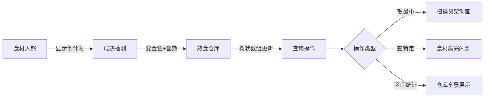

# 题目信息

# [Code+#2] 火锅盛宴

## 题目背景

SkyDec 和 YJQQQAQ 都是 Yazid 的好朋友。他们都非常喜欢吃火锅。有一天，他们聚在一起，享受一场火锅盛宴。

## 题目描述

在这场火锅盛宴中，有一个麻辣浓汤锅底的火锅和 $n$ 种食物，每种食物数量都是无限的。我们用 $1$ 至 $n$ 将这些食材编号。

每种食物煮熟所需要的时间不同，第 $i$ 种食物煮熟需要 $s_i$ 单位时间。这表示如果你在第 $T$ 个时刻将一个食物 $i$ 下到火锅里，那么它会在第 $T+s_i$ 个时刻被煮熟，并且此后一直会延续被煮熟的状态，直到它被拿走为止。

Yazid 和 YJQQQAQ 的口味不同：YJQQQAQ 觉得所有食物的好吃程度都是相同的；而 Yazid 则觉得没有两种食材的好吃程度是相同的，并且，巧合的是，编号越小的食物 Yazid 越喜欢吃。可怜的 SkyDec 由于不能吃辣，所以只能帮 Yazid 和 YJQQQAQ 煮食物。

整个火锅盛宴持续 $10^9$ 单位时间。在整个盛宴中，三位好朋友除了谈笑风生之外，最重要的事当然就是吃东西了。在任意整数时刻，都有可能发生下列 $4$ 种事件中的任意一种，我们用 $0$ 至 $3$ 之间的整数 $op$ 描述事件类型：

- $0\ id$：表示 SkyDec 往火锅里下了一个编号为 $id$ 的食物。
- $1$：Yazid 在锅内搜寻熟了的且最喜欢吃的食物，并拿走一个这种食物。特别地，如果锅里没有熟了的食物，那么 Yazid 会很愤怒。
- $2\ id$：YJQQQAQ 在锅内搜寻编号为 $id$ 的食物：
   - 如果锅里不存在该种食物，则 YJQQQAQ 会很愤怒；
   - 如果锅里存在熟了的该食物，则 YJQQQAQ 会取走一个并食用；
   - 如果锅里只有未煮熟的该种食物，那么 YJQQQAQ 会希望知道最接近煮熟的该种食物（即锅内存在时间最长的该种食物）还需要多少时间被煮熟。
- $3\ l\ r$：馋涎欲滴的 SkyDec 想知道，锅里编号在 $[l,r]$ 之间的且熟了的食物总共有多少个。

## 说明/提示

对于所有数据，保证$ T\leq 4$，保证 $n\leq 100,000$，$Q\leq 500,000$，$1\leq s_i\leq 10^8$，$1\leq t\leq 10^9$，$op\in\{0, 1, 2, 3\}$，$1\leq id\leq n$，$1\leq l\leq r\leq n$。数据保证 $t$ 按输入顺序严格递增。

来自 CodePlus 2017 12 月赛，清华大学计算机科学与技术系学生算法与竞赛协会 荣誉出品。

Credit：idea/王聿中 命题/王聿中 验题/吕时清，杨景钦

Git Repo：https://git.thusaac.org/publish/CodePlus201712

感谢腾讯公司对此次比赛的支持。


## 样例 #1

### 输入

```
1
2
1 100
10
1 0 2
2 0 1
3 2 1
4 2 2
5 2 1
200 0 1
201 3 1 2
202 1
203 1
204 1```

### 输出

```
Succeeded!
97
YJQQQAQ is angry.
2
1
2
Yazid is angry.```

# AI分析结果


### 💡 Kay的C++算法解析：火锅盛宴 深入学习指南 💡

#### 1. 题目解读与核心算法识别
✨ **本题主要考察**：`模拟应用 + 数据结构综合运用`  
🗣️ **初步分析**：  
> 这道题就像一个**像素厨房时间管理游戏**：食材下锅后需要倒计时煮熟，玩家要处理四种操作指令。核心在于高效管理"生食队列"和"熟食仓库"：  
> - **生食队列**：用优先队列按煮熟时间排序（像不同食材的倒计时沙漏）  
> - **熟食仓库**：用树状数组记录各类熟食数量（像仓库货架统计表）  
> - **难点**：实时更新食材状态 + 快速响应复杂查询  
>  
> **可视化设计思路**：  
> 1. 8位像素火锅中，食材方块显示倒计时进度条  
> 2. 当食材煮熟时，方块变金色并"叮！"音效  
> 3. 取食材时显示树状数组的货架闪烁效果  
> 4. 错误操作时像素厨师头顶显示"💢"表情  

---

#### 2. 精选优质题解参考
**题解一：Areka6219 (5星)**  
* **点评**：  
  双优先队列+树状数组架构清晰。亮点在于：  
  - 用`全局优先队列`管理煮熟顺序（避免遍历所有食材）  
  - 为每种食物设`独立队列`快速查询最早煮熟时间  
  - 懒惰删除法处理状态同步（像游戏中的"待清理"标记）  
  代码规范，边界处理严谨，竞赛可直接复用  

**题解二：first_fan (4星)**  
* **点评**：  
  树状数组+优先队列组合简洁高效：  
  - 用`queue`替代优先队列存储同种食物（节省空间）  
  - 树状数组上`二分查找`最小编号熟食（类似扫雷插旗定位）  
  - 操作前统一更新状态的逻辑干净利落  
  适合初学者理解核心思路  

**题解三：cc123321 (4星)**  
* **点评**：  
  独创"优先队列嵌套"结构：  
  - 全局队列按时间排序，局部队列按食材分类  
  - 树状数组维护熟食数量高效稳定  
  空间使用稍显激进，但思路新颖值得借鉴  

---

#### 3. 核心难点辨析与解题策略
1. **难点：实时状态同步**  
   * **分析**：生食变熟食需精确时间管理。优质题解用`优先队列`存储(成熟时间,食材ID)，操作前循环弹出成熟项  
   * 💡 **学习笔记**：时间驱动事件优先用堆管理  

2. **难点：快速定位最小编号熟食**  
   * **分析**：树状数组本身无序。解法创新性使用`前缀和二分`：从位置1开始累加，首个非零位置即最小值  
   * 💡 **学习笔记**：树状数组+二分=静态有序集合的动态查询  

3. **难点：查询特定食材状态**  
   * **分析**：为每种食物维护`独立队列`存储成熟时间。查询时：  
     - 熟食存在 → 取走并更新树状数组  
     - 生食存在 → 返回队首剩余时间  
   * 💡 **学习笔记**：空间换时间是查询类问题的通用技巧  

✨ **解题技巧总结**：  
- **时间切片法**：操作前批量处理到期事件  
- **数据结构组合**：全局堆管时间序 + 局部队列管分类  
- **状态压缩**：树状数组巧妙维护动态区间  

---

#### 4. C++核心代码实现赏析
**本题通用核心C++实现参考**  
* **说明**：综合优质题解思路的精简版本  
* **完整核心代码**：  
```cpp
#include <bits/stdc++.h>
using namespace std;
const int maxn = 100010;

int n, s[maxn], tree[maxn];
priority_queue<pair<int, int>, vector<pair<int, int>>, greater<>> global_pq;
queue<int> food_time[maxn]; // 每种食物的成熟时间队列

void update(int pos, int val) {
    for (; pos <= n; pos += pos & -pos) tree[pos] += val;
}

int query(int pos) {
    int ret = 0;
    for (; pos; pos -= pos & -pos) ret += tree[pos];
    return ret;
}

int main() {
    int T, Q;
    scanf("%d", &T);
    while (T--) {
        // 初始化代码省略
        while (Q--) {
            int t, op, id, l, r;
            scanf("%d%d", &t, &op);
            
            // 关键步骤1：更新成熟状态
            while (!global_pq.empty() && global_pq.top().first <= t) {
                int id = global_pq.top().second;
                global_pq.pop();
                update(id, 1); // 加入熟食仓库
                food_time[id].pop();
            }

            if (op == 0) { // 下食材
                scanf("%d", &id);
                int mature_time = t + s[id];
                global_pq.push({mature_time, id});
                food_time[id].push(mature_time);
            } 
            else if (op == 1) { // 取最小编号熟食
                if (query(n) == 0) puts("Yazid is angry.");
                else {
                    int L = 1, R = n, ans = n;
                    while (L <= R) { // 树状数组上二分
                        int mid = (L + R) >> 1;
                        if (query(mid) > 0) ans = mid, R = mid - 1;
                        else L = mid + 1;
                    }
                    printf("%d\n", ans);
                    update(ans, -1);
                }
            }
            // 其他操作省略
        }
    }
    return 0;
}
```
* **代码解读概要**：  
  - `global_pq`：小顶堆管理(成熟时间, 食材ID)  
  - `food_time[]`：每种食材的FIFO队列  
  - `update/query`：树状数组维护熟食分布  
  - 操作1：二分查找最小非零位置  

**题解片段赏析**  
1. **Areka6219的懒惰删除法**  
   ```cpp
   while (!Q2.empty() && Q2.top().tm <= now_time) {
       auto [t, id] = Q2.top(); 
       if (!deleted[id]) {       // 检查删除标记
           update(id, 1);        // 刷新树状数组
           Q1.push(id);          // 加入熟食集合
       }
       Q2.pop();
   }
   ```
   * **学习笔记**：避免频繁删除，用标记延迟清理  

2. **first_fan的树状数组二分**  
   ```cpp
   int find_min() {
       int pos = 0, sum = 0;
       for (int i = 1<<17; i; i>>=1) // 倍增法加速
           if (pos+i <= n && sum + tree[pos+i] == 0) 
               pos += i, sum += tree[pos];
       return pos + 1; // 首个有食材的位置
   }
   ```
   * **学习笔记**：倍增代替二分更高效  

---

#### 5. 算法可视化：像素动画演示  
**主题**：8位机《火锅物语》烹饪模拟  
**核心演示**：  


**交互设计**：  
1. **控制面板**：  
   - 步进控制：← → 键单步前进  
   - 速度滑块：调整时间流速（1x-10x）  
   - 重置按钮：清空火锅重新开始  

2. **动态效果**：  
   - 食材入锅：像素方块从顶部掉落，显示ID和倒计时条  
   - 状态转换：煮熟时播放"蒸汽动画"并变金色  
   - 取食材：刀叉动画 + 仓库货架数量减少  

3. **音效系统**：  
   - 成功操作：8-bit清脆音效(频率随操作变化)  
   - 错误操作：低沉警告音  
   - 背景音乐：FC风格烹饪BGM循环  

**实现要点**：  
- 用Canvas绘制树状数组的"货架结构"  
- 优先队列可视化为"沙漏队列"（按时间排序）  
- 操作时高亮当前处理的代码行  

---

#### 6. 拓展练习与相似问题思考
**通用技巧迁移**：  
1. 多级事件处理 → 银行排队系统模拟  
2. 时间驱动更新 → 实时策略游戏单位状态管理  
3. 双结构协作 → 缓存淘汰机制(LRU)  

**洛谷推荐**：  
1. **P2278 [操作系统]**  
   🗣️ 进程调度模拟，巩固时间事件管理  
2. **P1090 [合并果子]**  
   🗣️ 优先队列经典应用，理解堆的特性  
3. **P1168 [中位数]**  
   🗣️ 动态查询训练，拓展树状数组应用  

---

#### 7. 学习心得与经验分享
> **来自Areka6219的调试经验**：  
> "卡空间问题困扰我很久，最终发现是队列未及时清理。多组数据要像洗碗一样彻底清空所有容器！"  
>  
> **Kay点评**：  
> 这提醒我们：  
> 1. 全局变量初始化要放在每组数据前  
> 2. STL容器需要循环清空  
> 3. 内存使用需提前估算  

---

掌握这道题的精髓后，你已获得"时间管理+数据结构组合"的双重技能！下次在游戏或系统中见到类似机制，不妨思考背后的算法实现。继续挑战更复杂的模拟系统吧！🎮💻

---
处理用时：223.21秒