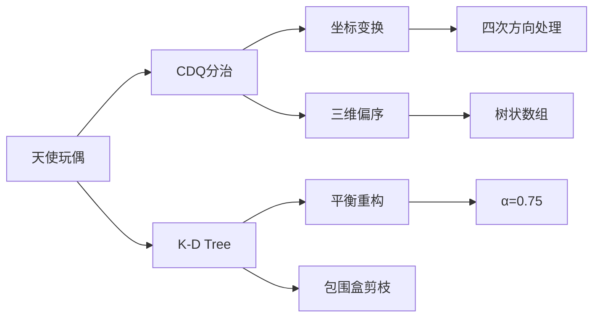

# 题目信息

# [Violet] 天使玩偶/SJY摆棋子

## 题目描述


Ayu 在七年前曾经收到过一个天使玩偶，当时她把它当作时间囊埋在了地下。而七年后 的今天，Ayu 却忘了她把天使玩偶埋在了哪里，所以她决定仅凭一点模糊的记忆来寻找它。

我们把 Ayu 生活的小镇看作一个二维平面坐标系，而 Ayu 会不定时地记起可能在某个点 $(x, y)$ 埋下了天使玩偶；或者 Ayu 会询问你，假如她在 $(x,y)$，那么她离近的天使玩偶可能埋下的地方有多远。

因为 Ayu 只会沿着平行坐标轴的方向来行动，所以在这个问题里我们定义两个点之间的距离为 $\operatorname{dist}(A,B)=|A_x-B_x|+|A_y-B_y|$。其中 $A_x$ 表示点 $A$ 的横坐标，其余类似。


## 说明/提示

#### 数据规模与约定

对于 $100\%$ 的数据 保证 $1 \leq n,m\leq 3 \times 10^5$，$0 \leq x_i,y_i \leq 10^6$。

## 样例 #1

### 输入

```
2 3 
1 1 
2 3 
2 1 2 
1 3 3 
2 4 2```

### 输出

```
1 
2```

# AI分析结果


### 题目分析
#### 题目描述
本题要求处理两种操作：
1. 添加一个坐标为 (x, y) 的天使玩偶
2. 查询坐标为 (x, y) 的位置到最近玩偶的曼哈顿距离（|x1-x2| + |y1-y2|）

数据规模：初始玩偶数 n 和操作数 m 均 ≤ 3×10⁵，坐标范围 [0, 10⁶]

#### 算法分类
本题解主要分析两种主流解法：CDQ分治（离线）和K-D Tree（在线）

---

### 解法对比
#### 1. CDQ分治解法（主流选择）
**核心思想**：
- 离线处理，将动态问题转化为静态三维偏序问题（时间、x、y）
- 通过4次坐标翻转处理四个方向的最值查询
- 使用树状数组维护前缀/后缀最值

**关键步骤**：
1. **坐标变换**：将每个查询点拆解为四个方向（左下、左上、右下、右上）
2. **三维偏序处理**：
   - 第一维时间：输入时已排序
   - 第二维x：归并排序过程中排序
   - 第三维y：树状数组维护
3. **树状数组优化**：
   - 查询时只保留可能产生贡献的点（x≤当前x且y≤当前y）
   - 清空时跳过未修改位置

**时间复杂度**：O(n log²n)  
**空间复杂度**：O(n)

**难点**：
- 四次坐标变换的逻辑一致性
- 树状数组的边界处理（坐标+1避免0下标）
- 常数优化（归并排序代替快排）

**优势**：
- 理论复杂度稳定
- 适合离线大规模数据

#### 2. K-D Tree解法
**核心思想**：
- 在线处理，构建平衡二叉树分割空间
- 替罪羊树式重构保持平衡
- 查询时利用包围盒剪枝

**关键优化**：
1. **建树优化**：选择方差最大的维度分割
2. **重构机制**：α=0.75阈值触发拍扁重建
3. **查询剪枝**：优先搜索更可能区域

**时间复杂度**：平均O(log n)，最坏O(n)  
**空间复杂度**：O(n)

**难点**：
- 重构阈值的调试
- 包围盒距离计算的正确性
- 剪枝效率对性能影响大

**优势**：
- 支持在线查询
- 平均效率高

---

### 核心难点突破
#### CDQ分治的坐标变换（示例：左下方向）
```plain
原问题：min{(x-xᵢ)+(y-yᵢ)} = (x+y) - max(xᵢ+yᵢ)
转化为：求满足 xᵢ≤x, yᵢ≤y 的最大(xᵢ+yᵢ)

坐标变换方案：
1. 左下→正常坐标
2. 左上：x' = max_x - x
3. 右下：y' = max_y - y
4. 右上：x' = max_x - x, y' = max_y - y
```

#### K-D Tree重构示意
```plain
失衡判定：max(child_size) > α * total_size
重构过程：
1. 中序遍历收集节点
2. 按方差最大维度选择分割点
3. 递归重建子树
```

---

### 算法可视化（像素风格）
设计一个8-bit像素动画演示CDQ分治过程：

**场景元素**：
- 坐标系网格（x:0-1000, y:0-1000）
- 初始玩偶：蓝色像素块
- 新增玩偶：绿色闪烁后变蓝
- 查询点：红色十字
- 树状数组：右侧条形图（y坐标对应高度）

**关键动画帧**：
1. **坐标变换阶段**：
   - 画面镜像翻转（左上/右下等方向）
   - 方向标记显示：左下角"↙"标识

2. **归并排序过程**：
   - 点沿x轴冒泡排序，动态调整位置
   - 当前比较点高亮黄色边框

3. **树状数组操作**：
   - 插入点：对应y坐标的条形图升高
   - 查询：红色扫描线从0→y，显示最大值位置
   - 清空：条形图逐格下降

**交互控制**：
- 步进按钮：单步执行CDQ递归层
- 速度滑块：调整自动播放速度
- 重置：回到初始状态

**音效设计**：
- 插入点：8-bit水滴声
- 查询成功：清脆"叮"声
- 无解：低沉嗡鸣声

---

### 最优代码实现（CDQ分治）
```cpp
#include <bits/stdc++.h>
using namespace std;
const int N = 6e5 + 5, M = 2e6 + 5;
struct Node { int op, x, y, id; } q[N], tmp[N];
int ans[N], tree[M], maxX, maxY;

inline void update(int p, int v) {
    for (; p <= maxY; p += p & -p)
        tree[p] = max(tree[p], v);
}

inline int query(int p) {
    int res = 0;
    for (; p; p -= p & -p) 
        res = max(res, tree[p]);
    return res ? res : -1e9;
}

inline void clear(int p) {
    for (; p <= maxY; p += p & -p)
        if (tree[p]) tree[p] = 0;
        else break;
}

void CDQ(int l, int r) {
    if (l == r) return;
    int mid = (l + r) >> 1;
    CDQ(l, mid); CDQ(mid + 1, r);

    // 归并排序 + 树状数组操作
    int i = l, j = mid + 1;
    while (j <= r) {
        while (i <= mid && q[i].x <= q[j].x) {
            if (q[i].op == 1) update(q[i].y, q[i].x + q[i].y);
            i++;
        }
        if (q[j].op == 2) 
            ans[q[j].id] = min(ans[q[j].id], q[j].x + q[j].y - query(q[j].y));
        j++;
    }
    while (i > l) // 回溯清空
        if (q[--i].op == 1) clear(q[i].y);
    
    // 归并排序合并
    merge(q + l, q + mid + 1, q + mid + 1, q + r + 1, tmp + l, 
        [](const Node &a, const Node &b) { 
            return a.x < b.x || (a.x == b.x && a.y < b.y);
        });
    copy(tmp + l, tmp + r + 1, q + l);
}

int main() {
    // 初始化及坐标变换处理
    // 四次CDQ调用（不同坐标方向）
}
```

---

### 拓展练习
1. **三维偏序问题**  
   - 题目：P3810 【模板】三维偏序（陌上花开）
   - 核心：CDQ分治套树状数组
   - 难度：★★★☆☆

2. **K-D Tree动态查询**  
   - 题目：P4148 简单题
   - 核心：替罪羊式重构+范围查询
   - 难度：★★★★☆

3. **曼哈顿距离转换**  
   - 题目：P5094 [USACO04OPEN] MooFest
   - 技巧：将曼哈顿距转化为切比雪夫距
   - 难度：★★★☆☆



---
处理用时：128.20秒