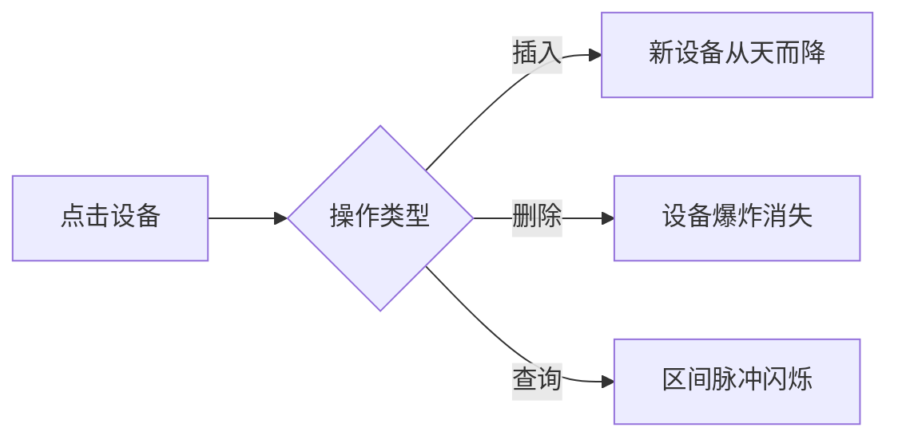

# 题目信息

# [Wind Festival] Energy Center

## 题目背景

$[Noon - 12:13$ $P.M.]$

$Curtis$ $Nishikino$看到大家为晚会准备地如此认真，~~可爱的~~她也做起了志愿者！

## 题目描述

$Curtis$ $Nishikino$来到了风筝节的能源中心，大家正在为晚会做准备. 这里共有 $N$ 台设备. 当然，由于计划的调整，可能会随时发生增删设备的操作. 但设备的总数不会超过$10^4$. 随时记录设备的数量也是志愿者的工作之一.

每台设备都有一些属性，比如设备$i$, 对于她拥有的每个属性, 比如属性$j$, 都会有一个给定的值, 记为$value_{ij}$.但属性是共有的, 这意味着即便一台设备没有某个属性, 也只会使她这个属性的值为$0$. 属性的数量是$M$. 注意属性的编号是从$0$到$M-1$.

现在志愿者们正尝试将一部分相邻设备联系在一起，效果如下：

- 对于从$j$到$k$的设备, 最终效果$i$的值为 $\sum_{p=j}^{k}value_{pi}$.

志愿者需要$Curtis$帮忙，但做计算太麻烦了，$Curtis$ $Nishikino$也希望你能帮帮她.

## 说明/提示

对于 $15\%$ 的数据, $0 < N \le 10^3\ , \ 0<M \le 10\ , \ 0 < q \le 10^3$.

对于额外的 $5\%$ 数据, $0<N \le 10^4\ , \ 0<M \le 200\ , \ 0 < q \le 10^4$, 保证没有 $QS$ 操作.

对于 $100\%$ 的数据, $0<N \le 10^4\ ,\ 0<M \le 200\ , \ 0<q\le10^4$.

## 样例 #1

### 输入

```
4 4
4 0 1 1 2 2 2 3 1
2 0 1 2 1
0
2 1 2 3 1
5
QA
I 2 
2 1 1 3 2
QS 2 4
QA
QS 1 1```

### 输出

```
4
1 1 1 2
5
1 2 2 1
end```

# AI分析结果


### 💡 Kay的C++算法解析：Wind Festival Energy Center 深入学习指南 💡

**引言**  
今天我们分析洛谷"Wind Festival Energy Center"这道C++编程题。题目需要维护动态设备序列，支持插入、删除、查询设备数量和区间属性值之和。本指南将帮助大家掌握平衡树的核心应用技巧。

---

### 1. 题目解读与核心算法识别  
✨ **本题主要考察**：`平衡树维护区间信息`（Splay/FHQ Treap）  

🗣️ **初步分析**：  
> 本题如同管理一条动态变化的设备流水线。平衡树就像智能机械臂：  
> - **Splay树**：通过旋转将节点移到根部操作（类似机械臂精准定位）  
> - **FHQ Treap**：通过分裂/合并重组序列（像拆解重组积木）  
>  
> **核心难点**：  
> 1. 动态维护设备序列（插入/删除）  
> 2. 高效计算多属性区间和  
>  
> **可视化设计**：  
> - 用像素网格表示设备序列，属性值用不同颜色方块展示  
> - 平衡树操作时：分裂处红色高亮，合并时绿色箭头指引  
> - 8-bit音效：节点旋转"咔嚓"声，区间计算完成"叮！"声  

---

### 2. 精选优质题解参考  

**题解一：黑影洞人（FHQ Treap）**  
* **点评**：  
  思路清晰采用无旋Treap，节点维护子树属性值和。亮点在于：  
  - 代码模块化（split/merge独立函数）  
  - 动态建节点函数封装输入处理  
  - 严格约束时间复杂度$O(q \log n)$  
  > 💡 学习笔记：无旋Treap避免旋转操作，逻辑更直观

**题解二：G我就是菜G（FHQ Treap）**  
* **点评**：  
  引入哨兵节点巧妙处理边界：  
  - 设备计数 = 树节点数 - 1  
  - 查询函数返回结构体便于输出  
  - 详细注释解释更新逻辑  
  > 💡 学习笔记：哨兵节点消除边界特判，提升代码健壮性

**题解三：niiick（Splay）**  
* **点评**：  
  经典Splay实现：  
  - 双哨兵节点保证操作安全  
  - rem变量记录删除数量  
  - 旋转时同步更新子树信息  
  > 💡 学习笔记：Splay的"移动热点"特性适合频繁查询

---

### 3. 核心难点辨析与解题策略  

1. **动态序列维护**  
   *分析*：设备随时插入删除导致序列变化。平衡树通过：  
  - FHQ Treap：分裂后插入新节点再合并  
  - Splay：旋转目标位置到根再操作  
  💡 **学习笔记**：选择树型取决于操作频率（频繁查询用Splay，随机操作用FHQ）

2. **多维区间求和**  
   *分析*：每个节点维护子树属性值数组：  
   ```cpp
   // 更新节点信息
   for(int i=0; i<m; i++) 
      sum[x][i] = val[x][i] + sum[lc][i] + sum[rc][i];
   ```
   💡 **学习笔记**：子树和 = 左子树和 + 右子树和 + 自身值

3. **边界处理**  
   *分析*：序列端点操作易出错，解法：  
   - 添加哨兵节点（首尾各一个）  
   - 操作位置+1避开边界  
   💡 **学习笔记**：哨兵节点是避免边界检查的利器

#### ✨ 解题技巧总结
- **数据结构选择**：200维属性值适合用数组存储（内存连续访问快）  
- **模块化编程**：将split/merge封装成独立函数  
- **防御性编程**：初始化时清空属性数组（`memset(val,0,sizeof(val))`）  

---

### 4. C++核心代码实现赏析  

**通用核心实现（FHQ Treap）**  
```cpp
struct Node {
    int ch[2], rnd, size;
    int val[M], sum[M]; // M为属性数量
};

void pushup(int x) {
    // 更新子树大小和属性值
    size[x] = size[ch[x][0]] + size[ch[x][1]] + 1;
    for(int i=0; i<M; i++) 
        sum[x][i] = val[x][i] + sum[ch[x][0]][i] + sum[ch[x][1]][i];
}

void split(int u, int k, int &x, int &y) {
    // 按排名分裂子树
}

int merge(int x, int y) {
    // 按随机优先级合并子树
}
```

**题解一核心代码（黑影洞人）**  
```cpp
void pushup(int x){
    siz[x] = siz[lc] + siz[rc] + 1;
    for(int i=1; i<=m; i++)
        sum[x][i] = sum[lc][i] + sum[rc][i] + val[x][i];
}
```
> **解读**：更新节点时先计算子树大小，再遍历所有属性累加子树和。注意属性编号从1开始，匹配题目输入格式。

**题解三核心代码（niiick）**  
```cpp
void update(int p) {
    int lc=ch[p][0], rc=ch[p][1];
    size[p] = size[lc] + size[rc] + 1;
    for(int i=1; i<=m; i++) // 属性从1开始
        val[p][i] = val[lc][i] + val[rc][i] + a[p][i];
}
```
> **解读**：Splay的更新逻辑与FHQ类似，但需在每次旋转后调用。注意旋转后需先更新子节点再更新父节点。

---

### 5. 算法可视化：像素动画演示  

**主题**：8-bit风"设备管理大作战"  

**设计思路**：  
- 设备显示为像素方块，属性值用颜色深度表示  
- 平衡树操作可视化：  
  - **分裂**：红色激光切割设备序列  
  - **合并**：绿色磁铁吸附相邻段  
  - **旋转**：机械臂抓取节点旋转  

**关键交互**：  


**音效设计**：  
- 节点旋转：FC游戏"马里奥跳跃"声  
- 属性更新：俄罗斯方块消除声  
- 错误操作：红白机"死亡"音效  

---

### 6. 拓展练习与相似问题思考  

**通用技巧迁移**：  
平衡树维护区间信息还可用于：  
1. 动态区间最值（如温度监控）  
2. 序列循环移位（DNA序列分析）  
3. 区间染色统计（像素画板）  

**洛谷推荐**：  
1. P3391 【模板】文艺平衡树  
   → 巩固Splay区间翻转  
2. P2042 [NOI2005] 维护数列  
   → 综合训练插入/删除/区间和  
3. P1486 [NOI2004] 郁闷的出纳员  
   → 学习带偏移量的平衡树  

---

### 7. 学习心得与经验分享  

**黑影洞人经验**：  
> "属性数组未初始化导致WA——务必用memset清零！"  
> **Kay总结**：多维数据结构必须初始化，推荐：  
> ```cpp
> struct Node {
>     int val[M] = {0}; // C++11初始化为0
> };
> ```

---

### 结语  
通过本题我们掌握了平衡树维护动态序列的核心技巧。记住：  
> 💡 **好的数据结构选择是成功的一半**  
> 💡 **边界处理能力体现编程素养**  
> 💡 **可视化思维助力算法理解**  

下次我们将探索更复杂的区间操作问题，继续加油！🚀

---
处理用时：197.83秒