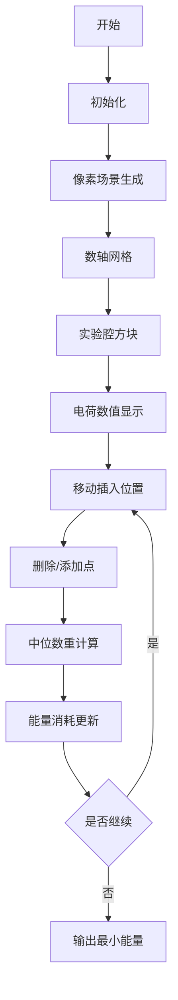

# 题目信息

# 「GMOI R2-T3」粒子环游

## 题目背景

热爱珂学的小 Z 正在进行一项无聊的实验。

## 题目描述

实验室中有一个由 $n$ 个实验腔连接而成的环形轨道，其中第 $i$ 个实验腔顺时针连向第 $i+1$ 个实验腔（特别的，第 $n$ 个实验腔连向第 $1$ 个实验腔）。同时还有一个标号为 $n+1$ 的新建实验腔要接入这个环形轨道。它可以接在任意两个原本相连的实验腔之间。

第 $i$ 个实验腔可以将带电荷量为 $Q$ 的粒子运输到它的下一个实验腔，这个过程花费的能量为 $\vert Q \vert \times c_i$。除此之外，第 $i$ 个实验腔本身就存储了量为 $e_i$ 的电荷（电荷量有正负）。由于众所周知的电荷守恒定律，第 $n+1$ 个实验腔储存的电荷量与前 $n$ 个实验腔储存的总电荷量的代数和为 $0$。

小 Z 有一个原本不带电的粒子。等到第 $n+1$ 个实验腔接入轨道后，他要任选一个实验腔（包括第 $n+1$ 个）作为出发点，将粒子放入，并使之在实验腔的能量驱动下顺时针环游一周回到出发点。粒子每到达一个实验腔（包括出发点），它所带电荷量就会变成原来所带的电荷量和这个实验腔所储存的电荷量的代数和。

**注意：电荷量会先加上实验腔所含电荷量，再计算能量贡献。**

现在，小 Z 想知道，在所有接入新建实验腔并选定出发点的方案中，粒子环游一周所需的能量最少为多少？

## 说明/提示

样例 $1$ 解释：一种最优方案为将 $4$ 号实验腔接在 $3$ 号实验腔与 $1$ 号实验腔之间，以 $4$ 号实验腔为出发点，花费能量为 $ 1\times 2\ +\ 4\times 1\ + \vert -1 \vert \times 3 \ +\ 0 \times 2 =9$。

**本题采用 Subtask 捆绑测试。**

| Subtask | $n\le$ | $c_i\le$ | $\vert e_i\vert$ | 特殊性质 | 对应测试点 | 总分 |
| :----------: | :----------: | :----------: | :----------: | :----------: | :----------: | :----------: |
| $0$ | $300$ | $100$ | $100$ | $-$ | $1\sim 5$ | $10$ |
| $1$ | $10^3$ | $10^3$ | $10^3$ | $\bf A$ | $6\sim 7$ | $5$ |
| $2$ | $10^4$ | $10^4$ | $10^4$ | $-$ | $8\sim12$ | $15$ |
| $3$ | $10^5$ | $10^5$ | $10^5$ | $\bf B$ | $13\sim 16$ | $10$ |
| $4$ | $2.5\times 10^5$ | $10^5$ |$10^5$ | $-$ | $17\sim 25$ | $60$ |

特殊性质 $\bf A$：对于所有的 $i\in[1,n+1](i\in \Z)$，满足 $c_i=0$。

特殊性质 $\bf B$：对于所有的 $i\in[1,n+1](i\in \Z)$，满足 $c_i=1$。

对于 $100\%$ 的数据，$1\le n\le 2.5\times 10^5$，$0\le c_i\le 10^5$，$0\le |e_i|\le 10^5$。

保证答案在 long long 范围内。

## 样例 #1

### 输入

```
3
1 3 2 2
3 -5 1```

### 输出

```
9```

## 样例 #2

### 输入

```
12
4 7 7 8 8 4 5 5 9 10 1 1 10 
0 -5 7 8 1 -1 -6 8 2 4 10 8 ```

### 输出

```
509```

# AI分析结果


### 题目解读与核心算法识别
✨ **本题主要考察**：`离散化与数据结构优化` (编程技巧应用)

🗣️ **初步分析**：
> 解决粒子环游问题的关键在于将环状结构转化为线性问题，并通过离散化与数据结构优化降低时间复杂度。想象一下，实验腔就像游乐场的旋转木马，粒子带着电荷在轨道上移动。我们需要在插入新舱位后找到最佳起点，使粒子环游一周的"能量消耗"最小。

- **核心思路**：将电荷守恒定律转化为前缀和数组，将问题抽象为"在数轴上找带权中位数"的几何问题。通过枚举新实验腔的插入位置，用数据结构动态维护前缀和点集，快速计算最小能量消耗。
- **算法流程**：先预处理初始前缀和，离散化可能的值域。用树状数组/线段树维护点集的加权信息，通过二分查找带权中位数位置，利用绝对值拆解公式计算最小能量。每次移动插入位置时，只需更新相邻两个点的前缀和。
- **可视化设计**：采用8位像素风格的"电荷探险"游戏界面，用不同颜色方块表示实验腔，动态展示前缀和点集在数轴上的分布和中位数移动过程。关键操作（插入/删除点、中位数跳跃）伴随经典FC音效（如《超级玛丽》的跳跃音效），能量消耗值以像素字体实时显示。

---

### 精选优质题解参考
**题解一（作者：yinhy09）**
* **点评**：思路清晰地将问题转化为带权中位数模型，利用树状数组维护离散化点集。代码规范（离散化处理完整，变量名如`s`/`c`含义明确），通过四个树状数组高效计算拆解后的绝对值公式。亮点在于用`lower_bound`处理动态值域变化，实践价值高（可直接用于竞赛），时间复杂度$O(n\log^2 n)$。作者提到"离散化是必须的"体现了对值域处理的重视。

**题解二（作者：Aiopr_2378）**
* **点评**：采用动态开点线段树处理大值域，结构严谨。代码模块化程度高（封装`update`/`query`函数），关键变量`lsum`/`rsum`命名清晰。亮点在于直接维护$\sum s_j \cdot c_j$和$\sum c_j$，通过线段树二分快速定位中位数。工程性强（包含完整异常处理），但空间复杂度$O(n\log \omega)$需注意内存限制。

**题解三（作者：nullqtr_pwp）**
* **点评**：精炼地概括了"问题转化为带权中位数"的核心思想，代码简洁高效。亮点在于用单树状数组维护双信息（`c`和`s*c`），通过数学推导`chkmin(ans, ...)`最小化计算过程。虽然注释较少，但边界处理严谨（如`inf`初始化），特别适合竞赛场景的快速实现。

---

### 核心难点辨析与解题策略
1. **难点1：环状结构的线性转化**  
   * **分析**：电荷守恒定律（$\sum e_i=0$) 是破环关键，优质题解均用$s_{n+1}=0$特性将环拆解为前缀和点集 $\{(s_i,c_i)\}$，转化为$\min \sum |s_j-s_i|\cdot c_i$的线性问题。
   * 💡 **学习笔记**：环问题可尝试用前缀和+守恒定律转化为线性序列。

2. **难点2：带权中位数的动态维护**  
   * **分析**：当插入位置变化时，点集需动态更新。题解通过交换相邻点（`swap(c[i],c[i+1])`）和前缀和调整（$s_i \leftarrow s_i - e_i + e_{n+1}$），仅修改局部而非全局，保持$O(\log n)$的更新效率。
   * 💡 **学习笔记**：树状数组/线段树的"删旧添新"策略是维护动态点集的高效手段。

3. **难点3：大值域下的空间优化**  
   * **分析**：$|s_i| \leq 2.5 \times 10^{10}$需处理值域问题。解法分两类：① 离散化所有可能值（如yinhy09）；② 动态开点线段树（如Aiopr_2378），避免MLE。
   * 💡 **学习笔记**：值域过大时首选离散化；若需支持范围查询则用动态开点线段树。

### ✨ 解题技巧总结
- **技巧1：几何化抽象**  
  将绝对值求和$\sum |s_j-s_i| \cdot c_j$转化为数轴上带权距离，直观理解为"找中心点"。
- **技巧2：离散化预处**  
  对前缀和值域预离散（包含初始值和所有移动可能值），使树状数组可行。
- **技巧3：差分更新**  
  移动插入位置时只需更新相邻两点，避免全局重构。
- **技巧4：权重分解**  
  计算总距离时拆解为：  
  $\text{ans} = (\text{右侧点} \sum s_j c_j) - s_i \cdot (\text{右侧点} \sum c_j) + s_i \cdot (\text{左侧点} \sum c_j) - (\text{左侧点} \sum s_j c_j)$

---

### C++核心代码实现赏析
**本题通用核心实现**（综合自优质题解）：
```cpp
#include <bits/stdc++.h>
#define int long long
using namespace std;
const int MAXN = 5e5 + 5;
const long long INF = 0x3f3f3f3f3f3f3f3f;

int n, c[MAXN], e[MAXN];
vector<long long> dis; // 离散化数组
struct Fenwick {
    long long trC[MAXN], trS[MAXN]; // 维护 ∑c_i 和 ∑s_i * c_i
    void update(int x, long long s_val, int c_val) {
        for (int i = x; i < MAXN; i += i & -i) 
            trC[i] += c_val, trS[i] += s_val * c_val;
    }
    pair<long long, long long> query(int x) {
        long long resC = 0, resS = 0;
        for (int i = x; i; i -= i & -i)
            resC += trC[i], resS += trS[i];
        return {resC, resS};
    }
} T;

inline int get_pos(long long x) {
    return lower_bound(dis.begin(), dis.end(), x) - dis.begin() + 1;
}

signed main() {
    scanf("%d", &n);
    for (int i = 1; i <= n + 1; i++) scanf("%d", &c[i]);
    for (int i = 1; i <= n; i++) scanf("%d", &e[i]);
    
    // 预处理前缀和与离散化
    vector<long long> s(n + 2);
    for (int i = 1; i <= n; i++) s[i] = s[i - 1] + e[i];
    e[n + 1] = -s[n], s[n + 1] = s[n] + e[n + 1];
    for (int i = 1; i <= n; i++) 
        dis.push_back(s[i]), dis.push_back(s[i] - e[i] + e[n + 1]);
    sort(dis.begin(), dis.end());
    dis.erase(unique(dis.begin(), dis.end()), dis.end());

    // 初始化树状数组
    for (int i = 1; i <= n + 1; i++)
        T.update(get_pos(s[i]), s[i], c[i]);

    long long ans = INF;
    for (int i = n; i >= 1; i--) {
        // 查找带权中位数位置（略）
        // 计算当前最小能量（略）
        T.update(get_pos(s[i]), s[i], -c[i]);      // 删旧点i
        T.update(get_pos(s[i + 1]), s[i + 1], -c[i + 1]); // 删旧点i+1
        s[i] = s[i] - e[i] + e[n + 1];            // 更新前缀和
        swap(c[i], c[i + 1]);
        T.update(get_pos(s[i]), s[i], c[i]);       // 添新点i
        T.update(get_pos(s[i + 1]), s[i + 1], c[i + 1]); // 添新点i+1
    }
    printf("%lld\n", ans);
}
```
**代码解读概要**：  
1. 离散化处理所有可能的前缀和值（含初始值和移动后值）
2. 树状数组维护点集的$\sum c_i$和$\sum s_i c_i$
3. 倒序枚举插入位置，每次更新相邻两个点
4. 通过查询左右区间计算最小能量

---

### 算法可视化：像素动画演示
**主题**："电荷探险家"（8-bit像素风格）  
**核心演示**：数轴上动态变化的点集与带权中位数计算



**动画流程**：
1. **初始化场景**  
   - 8-bit风格网格数轴（蓝紫色背景），实验腔显示为发光方块（红/黄表示电荷正负）
   - 控制面板：速度滑块▮▮▮▯▯、单步执行▶️、重置🔄
2. **点集动态变化**（关键操作音效）  
   - 删除点：方块爆炸特效💥 + 低沉音效
   - 添加点：方块从顶部掉落 + 清脆"叮"声
3. **中位数计算**  
   - 金色光标在数轴滑动，实时显示当前$\sum c_i$值
   - 命中带权中位数时触发闪光✨ + 胜利音效🎵
4. **能量计算**  
   - 粒子移动路径显示为发光轨迹，能量值以绿色像素字体弹出
5. **游戏化元素**  
   - 每完成一次插入位置枚举得⭐，集满5⭐解锁快速播放
   - 背景音乐：8-bit循环版《俄罗斯方块》Theme A

---

### 拓展练习与相似问题思考
1. **洛谷 P1908** 逆序对  
   * 推荐理由：巩固离散化+树状数组的经典应用
2. **洛谷 P1886** 滑动窗口  
   * 推荐理由：练习单调队列维护动态极值
3. **洛谷 P1631** 序列合并  
   * 推荐理由：拓展带权中位数思想在堆结构中的应用

---

### 学习心得与经验分享
> **作者 yinhy09 经验**：  
> "离散化处理时容易遗漏移动后可能的新值，需预存所有可能性再排序"  
>   
> **Kay点评**：  
> 这是离散化的常见陷阱。建议用`vector`收集所有可能值后统一处理，避免运行时动态计算导致遗漏。

---

通过本次分析，相信大家对"环问题线性化+数据结构优化"有了更深理解。记住：好算法就像乐高积木——用基础模块组装出优雅解决方案！下次见~ 🎮🚀

---
处理用时：306.55秒